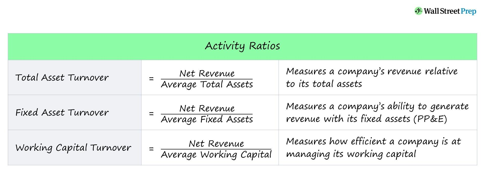

## Table of Contents

## What are activity ratios and why are they important in financial analysis?

Activity ratios, also known as efficiency ratios, are financial metrics that measure how well a company uses its assets to generate sales and manage its operations. These ratios help to understand how efficiently a company is performing by looking at things like how quickly it collects money from customers, how fast it sells its inventory, and how effectively it uses its assets to produce revenue. Common activity ratios include inventory turnover, accounts receivable turnover, and total asset turnover.

These ratios are important in financial analysis because they provide insights into the operational efficiency of a company. By analyzing activity ratios, investors and managers can identify areas where the company might be underperforming and take steps to improve. For example, a low inventory turnover ratio might suggest that a company is holding too much stock, which can tie up cash and increase storage costs. On the other hand, a high accounts receivable turnover ratio indicates that the company is efficient in collecting payments from its customers, which is good for cash flow. Overall, activity ratios help in making informed decisions to enhance a company's performance and profitability.

## Can you list the most common types of activity ratios?

Activity ratios help us see how well a company uses its stuff to make money. Some common ones are inventory turnover, accounts receivable turnover, and total asset turnover. Inventory turnover shows how fast a company sells its products. Accounts receivable turnover tells us how quickly the company gets paid by customers. Total asset turnover shows how well the company uses all its assets to make sales.

These ratios are important because they help us understand if a company is doing a good job with its resources. For example, a high inventory turnover means the company is selling products quickly, which is good. A high accounts receivable turnover means the company is getting money from customers fast, which helps with cash flow. And a high total asset turnover means the company is using its assets well to make money. By looking at these ratios, we can see where a company might need to improve.

## How do you calculate the inventory turnover ratio?

The inventory turnover ratio tells us how many times a company sells and replaces its inventory in a year. To calculate it, you divide the cost of goods sold (COGS) by the average inventory. The cost of goods sold is the total cost of all the products a company sold during the year. The average inventory is usually calculated by adding the inventory at the start of the year to the inventory at the end of the year and then dividing by two.

This ratio helps us understand how fast a company is selling its products. A higher inventory turnover ratio means the company is selling its inventory quickly, which is good because it means less money is tied up in unsold products. A lower ratio might mean the company is holding onto too much stock, which can be costly. By looking at this ratio, a company can figure out if it needs to change how it manages its inventory.

## What does the accounts receivable turnover ratio indicate about a company?

The accounts receivable turnover ratio shows how quickly a company collects money from its customers. It tells us how many times a company gets paid in a year. To find this ratio, you divide the total sales (or net credit sales) by the average accounts receivable. A higher ratio means the company is good at collecting payments fast, which is important for keeping enough cash to run the business.

If the accounts receivable turnover ratio is low, it might mean that the company is having trouble getting customers to pay on time. This can be a problem because it can lead to less cash on hand, making it harder to pay bills or invest in new things. By looking at this ratio, a company can see if it needs to change how it handles credit and collections to improve its cash flow.

## How is the total assets turnover ratio used to assess company performance?

The total assets turnover ratio tells us how well a company uses all its stuff to make money. It shows how many dollars of sales a company gets for every dollar of assets it has. To figure it out, you divide the total sales by the average total assets. A higher ratio means the company is good at using its assets to make sales, which is a good sign. A lower ratio might mean the company isn't using its assets as well as it could.

This ratio helps us see if a company is doing a good job with what it has. For example, if a company has a lot of machines and buildings but isn't making much money from them, the total assets turnover ratio will be low. This can tell the company that maybe it needs to sell some of its stuff or find a better way to use what it has. By looking at this ratio, a company can make changes to improve how it uses its assets and make more money.

## What is the formula for calculating the fixed asset turnover ratio?

The fixed asset turnover ratio tells us how well a company uses its big stuff, like machines and buildings, to make money. To find this ratio, you divide the total sales by the average fixed assets. The average fixed assets are usually calculated by adding the fixed assets at the start of the year to the fixed assets at the end of the year and then dividing by two.

A higher fixed asset turnover ratio means the company is good at using its big stuff to make sales. This is a good sign because it shows the company is getting a lot of money from its investments in things like factories and equipment. If the ratio is low, it might mean the company isn't using its big stuff as well as it could. By looking at this ratio, a company can see if it needs to sell some of its big stuff or find better ways to use what it has to make more money.

## How can activity ratios help in comparing companies within the same industry?

Activity ratios are really helpful when you want to compare how well companies in the same industry are doing. By looking at things like inventory turnover, accounts receivable turnover, and total asset turnover, you can see which companies are using their stuff better to make money. For example, if one company has a higher inventory turnover ratio than another, it means they're selling their products faster. This can show that the first company is better at managing its stock and might be more efficient overall.

These ratios also help spot where a company might be doing better or worse than others in the industry. If a company has a lower accounts receivable turnover ratio compared to its competitors, it might mean they're not as good at collecting money from customers. This can be a warning sign that they need to improve their credit and collection processes. By comparing these ratios, investors and managers can make smarter choices about where to put their money or how to make their own company better.

## What are the limitations of using activity ratios for financial analysis?

Activity ratios are great for looking at how well a company uses its stuff to make money, but they do have some limits. One big limit is that these ratios don't tell the whole story about a company's health. For example, a high inventory turnover ratio might look good, but it could also mean the company is selling products at low prices just to get rid of them. This can hurt profits even if it makes the ratio look good. Also, activity ratios don't show things like how much debt a company has or if it's making a profit.

Another problem with activity ratios is that they can be hard to compare across different industries. What's a good ratio in one industry might not be good in another. For example, a grocery store will have a much higher inventory turnover ratio than a car dealership because groceries sell faster than cars. So, if you're comparing companies from different industries, these ratios might not be very helpful. It's best to compare companies within the same industry to get a fair idea of how they're doing.

## How do changes in activity ratios over time reflect a company's operational efficiency?

Changes in activity ratios over time can show us if a company is getting better or worse at using its stuff to make money. If the inventory turnover ratio goes up, it means the company is selling its products faster than before. This can be a good sign because it shows the company is managing its stock better. On the other hand, if the accounts receivable turnover ratio goes down, it might mean the company is taking longer to get paid by its customers. This can be a problem because it can make it harder for the company to have enough cash to run its business.

Looking at these changes helps us see if the company is making smart choices to improve its operations. For example, if the total asset turnover ratio keeps going up, it means the company is using its assets better to make sales. This is important because it shows the company is getting more money from what it already has. But if these ratios start going down, it might mean the company needs to change how it does things to get back on track. By keeping an eye on these ratios over time, a company can figure out where it needs to improve and make plans to do better.

## Can activity ratios be manipulated, and if so, how can analysts detect such manipulations?

Yes, activity ratios can be manipulated by companies to make their performance look better than it really is. For example, a company might try to boost its inventory turnover ratio by selling off a lot of old stock at very low prices just to get rid of it. This makes the ratio look good, but it's not really a sign of good management because the company is losing money on those sales. Another way to manipulate ratios is by changing how they calculate average inventory or accounts receivable. If a company only counts the inventory at the end of the year instead of using an average, it can make the inventory turnover ratio look better if they've sold a lot of stock right before the end of the year.

Analysts can detect these manipulations by looking at other financial information and comparing the ratios to past performance and industry standards. For instance, if the inventory turnover ratio suddenly jumps a lot but the company's profit margins are going down, it might mean they're selling stuff cheap just to boost the ratio. Analysts can also check if the company is using different methods to calculate the ratios compared to before. By looking at the whole picture, including other financial statements and industry benchmarks, analysts can spot when a company might be trying to make its activity ratios look better than they really are.

## What advanced techniques can be used to normalize activity ratios for more accurate inter-firm comparisons?

To make activity ratios more useful for comparing different companies, analysts can use something called normalization. This means adjusting the ratios so that they're easier to compare, even if the companies are different sizes or in different parts of the year. One way to do this is by using industry averages. If a company's inventory turnover ratio is higher than the industry average, it might mean they're doing a good job compared to others. Another way is to look at the ratios over several years to see if there are any big changes. This helps to see if a company is getting better or worse at using its stuff to make money.

Another technique is to adjust for seasonal changes. Some businesses, like retail stores, might sell more stuff during certain times of the year, like holidays. By looking at the ratios during the same time each year, you can get a better idea of how the company is doing compared to others. Also, analysts can use something called common-size analysis. This means turning the numbers into percentages of total sales or total assets. This makes it easier to compare companies of different sizes because the ratios are based on percentages, not just raw numbers. By using these techniques, analysts can get a clearer picture of how well a company is doing compared to others in the same industry.

## How do macroeconomic factors influence the interpretation of activity ratios?

Macroeconomic factors can really change how we look at activity ratios. Things like inflation, interest rates, and how the economy is doing overall can affect a company's numbers. For example, if there's a lot of inflation, the cost of goods sold might go up, which can make the inventory turnover ratio look different. If interest rates are high, it might be harder for companies to borrow money, and this can show up in their accounts receivable turnover ratio because they might be slower to collect payments from customers.

Also, the state of the economy can change how we see these ratios. In a booming economy, companies might sell more stuff and have higher inventory turnover ratios. But in a recession, sales might go down, and the ratios could look worse even if the company is doing okay compared to others. By thinking about these big economic factors, we can get a better idea of what the activity ratios really mean and make smarter decisions about the company's performance.

## What are Activity Ratios and how can we understand them?

Activity ratios, commonly known as efficiency ratios, are critical tools for assessing how effectively a company employs its assets in generating revenue. These ratios aid in providing a quantitative measure of an enterprise’s operational efficiency and financial health. By analyzing activity ratios, stakeholders can determine the ability of a company to convert various balance sheet accounts into cash or sales.

One of the most prominent activity ratios is the **inventory turnover ratio**, which indicates how many times a company’s inventory is sold and replaced over a period. It is calculated as:

$$
\text{Inventory Turnover} = \frac{\text{Cost of Goods Sold (COGS)}}{\text{Average Inventory}}
$$

A higher inventory turnover ratio signifies efficient inventory management, implying that the company is adept at converting inventory into sales.

Another critical metric is the **accounts receivable turnover ratio**. This ratio measures how efficiently a company is collecting revenue from its credit sales. The formula is expressed as:

$$
\text{Accounts Receivable Turnover} = \frac{\text{Net Credit Sales}}{\text{Average Accounts Receivable}}
$$

A higher accounts receivable turnover suggests that a company is effective at collecting its debts, leading to better [liquidity](/wiki/liquidity-risk-premium).

Lastly, the **total asset turnover ratio** provides insight into a company's ability to generate sales from its assets. This ratio is an indicator of how well a company utilizes its assets to produce revenue:

$$
\text{Total Asset Turnover} = \frac{\text{Net Sales}}{\text{Average Total Assets}}
$$

This ratio is particularly useful for evaluating asset utilization across different companies within the same industry. 

Activity ratios are not only pivotal for internal assessments; they are also invaluable in drawing comparisons between companies operating under similar conditions and tracking a company's performance over time. Such analyses enable investors, analysts, and management to make informed judgments about operational efficiency and strategic direction.

## What are Activity Ratios and how do they relate to Financial Analysis?

In financial analysis, activity ratios are utilized in conjunction with profitability ratios to thoroughly assess a company's capabilities. These ratios are instrumental in providing insights into how efficiently a company can leverage its assets to generate revenue. Analysts and investors consider activity ratios as essential tools for making informed decisions regarding a business's viability and efficiency. 

Activity ratios measure various aspects of a company's operations. A common metric is the asset turnover ratio, which reflects the efficiency with which a company uses its assets to produce sales. It is calculated as:

$$
\text{Asset Turnover Ratio} = \frac{\text{Net Sales}}{\text{Average Total Assets}}
$$

A higher asset turnover ratio indicates a more efficient use of assets in generating revenue, signaling operational proficiency. Conversely, a lower ratio might suggest inefficiencies or underutilization of assets, urging a deeper investigation into the specific areas of the business.

Another critical metric is return on equity (ROE), which connects the net income to shareholders' equity. ROE provides insights into how effectively a company is using its equity base to generate profits. The formula for ROE is:

$$
\text{Return on Equity (ROE)} = \frac{\text{Net Income}}{\text{Shareholders' Equity}}
$$

A high ROE indicates an efficient management team adept at generating profits from each unit of shareholders' equity, which is crucial for investors seeking lucrative returns. 

In summary, activity ratios such as the asset turnover ratio and return on equity are indispensable in evaluating a company's operational soundness and profitability potential. By assessing these ratios, stakeholders can better understand a company's financial health, enabling more strategic investment and management decisions.

## What is the relationship between Algorithmic Trading and Activity Ratios?

Algorithmic trading utilizes computational algorithms to execute trades based on predefined strategies in financial markets. These algorithms can process large volumes of market data swiftly, enabling traders to capitalize on even minor price movements. By integrating activity ratios into [algorithmic trading](/wiki/algorithmic-trading) strategies, traders can enhance their decision-making processes and improve trading outcomes.

Activity ratios are vital for constructing more refined and data-driven trading strategies. For instance, the inventory turnover ratio, which measures how often inventory is sold and replaced over a period, can indicate trends in asset liquidity. When applied in algorithmic trading, understanding these trends allows strategies to be adjusted for optimal asset utilization based on current market conditions.

Several key metrics, such as the Sharpe Ratio, Maximum Drawdown, and Profit Factor, are essential for assessing and optimizing algorithmic trading strategies. The Sharpe Ratio sums up the trade-off between risk and return, calculated as:

$$
\text{Sharpe Ratio} = \frac{E[R_p - R_f]}{\sigma_p}
$$

where $E[R_p]$ is the expected return of the portfolio, $R_f$ is the risk-free rate, and $\sigma_p$ is the standard deviation of the portfolio's excess return.

The Maximum Drawdown measures the largest single drop from peak to trough in the portfolio's value, indicative of potential risk exposure. The Profit Factor, defined as the ratio of gross profit to gross loss, helps assess a trading system's reliability and efficiency.

Beyond these metrics, incorporating activity ratios into trading algorithms enables traders to better comprehend market conditions, manage risks more effectively, and enhance trade profitability. For example, a low accounts receivable turnover ratio might signal upcoming cash flow challenges, prompting a more conservative trading approach until liquidity trends stabilize.

In summary, embedding activity ratios into algorithmic trading frameworks provides a comprehensive view of market dynamics and asset performance. These insights facilitate improved risk management and trading efficiency, bolstering the profitability of algorithmic strategies.

## References & Further Reading

[1]: ["Financial Ratios for Executives: How to Assess Company Strength, Fix Problems, and Make Better Decisions"](https://link.springer.com/book/10.1007/978-1-4842-0731-4) by Michael Rist

[2]: Bodie, Z., Kane, A., & Marcus, A. J. (2014). ["Essentials of Investments."](https://books.google.com/books/about/EBOOK_Investments_Global_edition.html?id=BMsvEAAAQBAJ) McGraw-Hill Education.

[3]: ["Algorithmic Trading: Winning Strategies and Their Rationale"](https://www.amazon.com/Algorithmic-Trading-Winning-Strategies-Rationale-ebook/dp/B00CY5HC0U) by Ernie Chan

[4]: ["Trading and Exchanges: Market Microstructure for Practitioners"](https://www.amazon.com/Trading-Exchanges-Market-Microstructure-Practitioners/dp/0195144708) by Larry Harris

[5]: ["The Econometrics of Financial Markets"](https://press.princeton.edu/books/hardcover/9780691043012/the-econometrics-of-financial-markets) by John Y. Campbell, Andrew W. Lo, and A. Craig MacKinlay