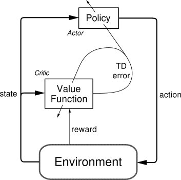

## Table of Contents

## What is an Actor-Critic algorithm in machine learning?

An Actor-Critic algorithm is a type of reinforcement learning method used to train agents to make decisions. It combines two main components: the "Actor," which decides what actions to take, and the "Critic," which evaluates how good those actions are. The Actor is like a player in a game who tries different moves, while the Critic is like a coach who gives feedback on how well the player is doing. The Actor learns to improve its actions based on the Critic's feedback, aiming to maximize the total reward over time.

The way it works is that the Actor picks an action based on the current state of the environment. After taking that action, the Critic assesses the value of the new state and calculates the difference between the expected and actual reward, known as the Temporal Difference (TD) error. The formula for the TD error is $$TD = r + \gamma V(s') - V(s)$$, where $$r$$ is the reward, $$\gamma$$ is the discount factor, $$V(s')$$ is the value of the new state, and $$V(s)$$ is the value of the current state. This error helps the Actor adjust its policy to make better choices in the future, and the Critic updates its value estimates to become more accurate. Together, they work to improve the agent's performance in the environment.

## How does the Actor-Critic method differ from other reinforcement learning algorithms?

The Actor-Critic method is different from other reinforcement learning algorithms because it uses two separate components: the Actor and the Critic. In simpler methods like Q-learning, there is just one component that both decides on actions and learns from them. The Actor in the Actor-Critic method focuses on choosing the best actions, while the Critic focuses on evaluating those actions. This split allows for more focused learning and can lead to better performance in complex tasks. Other methods, like policy gradient methods, might only have an Actor and learn by directly adjusting the policy based on the total reward, without the intermediate step of evaluating each state's value.

Another key difference is how the Actor-Critic method updates its learning. In Q-learning, the algorithm updates based on the difference between the predicted and actual rewards, known as the Temporal Difference (TD) error, but it does this for every state-action pair. The Actor-Critic method also uses the TD error, calculated as $$TD = r + \gamma V(s') - V(s)$$, but it uses this error to update both the Actor's policy and the Critic's value estimates. This dual update can make learning more stable and efficient compared to methods that might only update one aspect, like value-based methods that only update the value function or policy-based methods that only update the policy. By combining both approaches, the Actor-Critic method can balance the strengths of value-based and policy-based learning.

## What are the main components of an Actor-Critic algorithm?

The main components of an Actor-Critic algorithm are the Actor and the Critic. The Actor is responsible for choosing the actions that the agent will take in the environment. It does this by following a policy, which is a strategy that tells it what action to take based on the current state. The Actor's goal is to learn a policy that will lead to high rewards over time. On the other hand, the Critic evaluates the actions taken by the Actor. It does this by estimating the value of each state, which is how good it is to be in that state. The Critic helps the Actor by providing feedback on how well it is doing.

The way the Actor and Critic work together is through the Temporal Difference (TD) error. The TD error is calculated as $$TD = r + \gamma V(s') - V(s)$$, where $$r$$ is the reward received, $$\gamma$$ is the discount [factor](/wiki/factor-investing), $$V(s')$$ is the value of the new state, and $$V(s)$$ is the value of the current state. This error tells the Actor how far off its action was from being optimal. The Actor uses this information to adjust its policy, trying to make better choices in the future. Meanwhile, the Critic updates its value estimates to be more accurate, helping the Actor make even better decisions. Together, these components help the agent learn to perform well in its environment.

## Can you explain the roles of the 'Actor' and 'Critic' in the Actor-Critic model?

The Actor in the Actor-Critic model is like a player in a game. Its job is to decide what actions to take based on the current situation, or state, of the environment. The Actor follows a policy, which is like a set of rules that tells it what to do. Over time, the Actor learns to improve its policy so that it can get more rewards. It does this by listening to feedback from the Critic.

The Critic is like a coach who watches the Actor and gives advice. Its job is to judge how good or bad the actions of the Actor are. The Critic does this by estimating the value of each state, which means how good it is to be in that state. When the Actor takes an action and moves to a new state, the Critic calculates the difference between the expected and actual reward, known as the Temporal Difference (TD) error. The formula for the TD error is $$TD = r + \gamma V(s') - V(s)$$, where $$r$$ is the reward, $$\gamma$$ is the discount factor, $$V(s')$$ is the value of the new state, and $$V(s)$$ is the value of the current state. The Critic shares this TD error with the Actor, helping it to make better choices next time.

## What is the advantage of using an Actor-Critic algorithm over traditional policy gradient methods?

The main advantage of using an Actor-Critic algorithm over traditional policy gradient methods is that it combines the strengths of both value-based and policy-based learning. In traditional policy gradient methods, the algorithm learns directly from the total reward it gets, which can make learning slow and unstable because it might take a long time to see the results of its actions. The Actor-Critic method, on the other hand, uses a Critic to estimate the value of each state. This means the Actor can get immediate feedback on how good its actions are, making learning faster and more stable.

Another benefit is that the Actor-Critic method can handle complex tasks better. In traditional policy gradient methods, the policy is updated based on the total reward, which can be noisy and hard to work with. The Actor-Critic method uses the Temporal Difference (TD) error, calculated as $$TD = r + \gamma V(s') - V(s)$$, to update both the Actor's policy and the Critic's value estimates. This helps the algorithm learn more efficiently by focusing on the difference between expected and actual rewards, leading to better performance in environments where immediate feedback is important.

## How does the Actor-Critic algorithm handle the trade-off between exploration and exploitation?

The Actor-Critic algorithm handles the trade-off between exploration and exploitation by balancing the need to try new actions (exploration) and using what it knows works well (exploitation). The Actor in this algorithm decides which actions to take based on its current policy. To explore, the Actor might add some randomness to its choices, so it doesn't always pick the same action. This helps it discover new, possibly better ways to get rewards. On the other hand, when the Actor exploits, it sticks to actions that it knows have worked well in the past, aiming to maximize the rewards it already knows about.

The Critic plays a key role in helping the Actor find the right balance. It evaluates the outcomes of the Actor's actions and gives feedback through the Temporal Difference (TD) error, calculated as $$TD = r + \gamma V(s') - V(s)$$. If the Actor's exploration leads to better outcomes than expected, the Critic's positive feedback encourages more exploration. But if the Actor's actions don't lead to good results, the Critic's feedback helps it shift towards exploitation, using the knowledge it has gained to stick to better-known actions. This ongoing feedback loop helps the Actor-Critic algorithm adapt its strategy over time, finding a good balance between exploring new possibilities and exploiting known successes.

## What is the concept of temporal difference (TD) error in the context of Actor-Critic algorithms?

Temporal Difference (TD) error is a key concept in Actor-Critic algorithms. It's the difference between the reward the Actor expects to get and the reward it actually gets. The Critic calculates this error to help the Actor learn better. The formula for the TD error is $$TD = r + \gamma V(s') - V(s)$$. Here, $$r$$ is the reward the Actor gets after taking an action, $$\gamma$$ is a discount factor that makes future rewards less important, $$V(s')$$ is the value of the new state, and $$V(s)$$ is the value of the current state. By using this error, the Actor can adjust its actions to get more rewards in the future.

The TD error helps the Actor-Critic algorithm learn in real-time. Instead of waiting until the end of a task to see if it did well, the algorithm can learn from each step. If the TD error is high, it means the Actor's action was not as good as expected, so it needs to try something different next time. If the error is low, the Actor's action was about as good as expected, so it might keep doing similar things. This way, the Actor-Critic algorithm can quickly adapt to new situations and improve its performance over time.

## How can the Actor-Critic algorithm be implemented to solve a specific problem, such as a game environment?

To implement an Actor-Critic algorithm in a game environment, you first need to set up the environment and define the states, actions, and rewards. In the game, the states could be things like the positions of characters or objects on the screen. The actions are the moves the player can make, like moving left or right. The rewards are points or scores the player gets for doing well in the game. The Actor part of the algorithm will choose which action to take based on the current state. It does this by following a policy, which is like a set of rules that tell it what to do. The Critic part will watch the game and estimate how good each state is. When the Actor takes an action and gets a reward, the Critic calculates the Temporal Difference (TD) error using the formula $$TD = r + \gamma V(s') - V(s)$$, where $$r$$ is the reward, $$\gamma$$ is a discount factor, $$V(s')$$ is the value of the new state, and $$V(s)$$ is the value of the current state. This error helps the Actor learn to make better choices.

Once you have set up the environment and defined the Actor and Critic, you can start training the algorithm. The Actor will try different actions in the game, and the Critic will give feedback on how well those actions worked. If the Actor's action leads to a high reward, the Critic's positive feedback will encourage the Actor to keep doing similar things. If the action doesn't work well, the Critic's feedback will help the Actor try something different next time. Over many rounds of the game, the Actor will learn to play better and better. You can use code to make this happen, setting up loops where the Actor takes actions, the game responds with rewards, and the Critic updates its estimates. This way, the Actor-Critic algorithm can learn to solve the game and get high scores.

## What are some common challenges faced when implementing Actor-Critic algorithms, and how can they be overcome?

One common challenge when implementing Actor-Critic algorithms is the problem of high variance in the learning process. This happens because the Actor's policy updates can be based on noisy reward signals, which can make learning unstable. To overcome this, you can use techniques like experience replay, where the algorithm stores past experiences and learns from them multiple times. Another approach is to use a baseline, which is a value that the Critic subtracts from the reward to reduce the variance. The formula for this is $$TD = r + \gamma V(s') - V(s) - b$$, where $$b$$ is the baseline. By using these methods, the learning process can become more stable and the algorithm can learn more effectively.

Another challenge is balancing exploration and exploitation. The Actor needs to try new actions to find better ways to get rewards, but it also needs to use what it knows works well. If the Actor explores too much, it might miss out on using good actions it already knows. If it exploits too much, it might not find even better actions. To solve this, you can use methods like adding noise to the Actor's actions or using an epsilon-greedy strategy, where the Actor sometimes chooses a random action instead of the best one. This helps the Actor find a good balance between trying new things and sticking to what works, leading to better performance in the long run.

## How do advanced Actor-Critic methods like A3C (Asynchronous Advantage Actor-Critic) improve upon the basic model?

Advanced Actor-Critic methods like A3C (Asynchronous Advantage Actor-Critic) improve upon the basic model by using multiple [agents](/wiki/agents) that learn at the same time. In the basic Actor-Critic model, one agent learns by itself, which can be slow because it has to wait for each action to play out before getting feedback. A3C, on the other hand, uses many agents that explore the environment at the same time. Each agent learns a bit differently, and they all share what they learn with each other. This makes the learning process much faster because the main policy gets updated more often with new information from all the agents.

Another way A3C improves on the basic model is by using the advantage function instead of just the value function. The advantage function tells the Actor how much better or worse an action is compared to the average action in that state. It is calculated as $$A(s, a) = Q(s, a) - V(s)$$, where $$Q(s, a)$$ is the value of taking action $$a$$ in state $$s$$, and $$V(s)$$ is the value of state $$s$$. Using the advantage function helps the Actor learn more accurately which actions are really good or bad, leading to better decisions and faster learning overall.

## What metrics should be used to evaluate the performance of an Actor-Critic algorithm?

To evaluate the performance of an Actor-Critic algorithm, you should look at the total reward it gets over time. This means adding up all the points or scores the algorithm earns as it learns and plays. If the total reward keeps going up, it shows that the algorithm is getting better at the task. You can also watch how quickly the total reward improves. If it starts to go up faster, it means the algorithm is learning more efficiently. Another important metric is the average reward per episode, which tells you how well the algorithm is doing on average each time it plays through the task.

Besides looking at rewards, you can also measure how stable the learning process is. This can be done by checking the variance in the rewards. If the rewards are jumping around a lot, it might mean the algorithm is not learning smoothly. You can use the standard deviation of the rewards to see this. Another useful metric is the Temporal Difference (TD) error, calculated as $$TD = r + \gamma V(s') - V(s)$$, where $$r$$ is the reward, $$\gamma$$ is the discount factor, $$V(s')$$ is the value of the new state, and $$V(s)$$ is the value of the current state. If the TD error gets smaller over time, it means the Critic is getting better at predicting the value of states, which helps the Actor make better decisions.

## How can Actor-Critic algorithms be combined with deep learning to handle complex, high-dimensional state spaces?

When you combine Actor-Critic algorithms with [deep learning](/wiki/deep-learning), you can handle complex, high-dimensional state spaces much better. In a game or a robot environment, there can be lots of different things happening at once, like where all the characters are or what the robot sees. Deep learning uses neural networks to understand these complicated situations. The Actor part of the algorithm uses a [neural network](/wiki/neural-network) to decide which action to take based on the current state. The Critic also uses a neural network to guess how good each state is. This way, the Actor-Critic algorithm can learn from very detailed information and make smart choices even when the environment is really complex.

One popular method of combining these is called Deep Deterministic Policy Gradient (DDPG). In DDPG, both the Actor and the Critic use neural networks to learn from the environment. The Actor's neural network takes the current state as input and outputs an action. The Critic's neural network takes both the current state and the action as input and outputs the expected reward. The Temporal Difference (TD) error, calculated as $$TD = r + \gamma V(s') - V(s)$$, helps both networks learn. The Actor updates its policy to get higher rewards, and the Critic updates its value estimates to be more accurate. By using deep learning, the Actor-Critic algorithm can handle high-dimensional state spaces and learn to perform well in complex tasks.