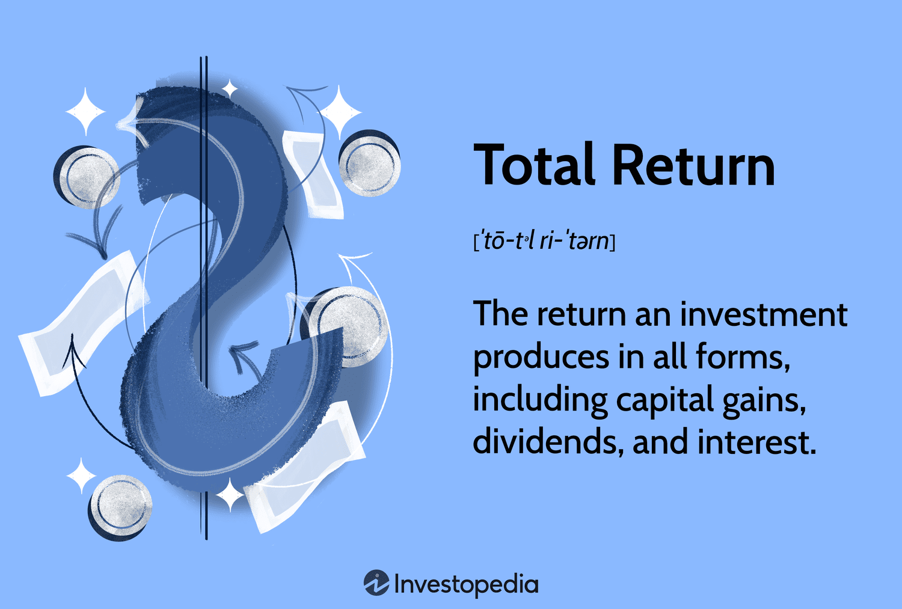

## Table of Contents

## What is the definition of actual return?

Actual return is the amount of money you really make or lose from an investment over a certain time. It's different from expected return, which is what you think you might make before you invest. Actual return includes all the money you earn, like interest, dividends, and any increase in the value of your investment, minus any costs or fees.

For example, if you buy a stock for $100 and sell it later for $120, your actual return is $20, plus any dividends you received along the way. But if you had to pay a $5 fee to buy the stock and another $5 fee to sell it, your actual return would be $10 ($20 - $5 - $5). This shows how actual return gives you a clear picture of what you really gained or lost.

## How is actual return different from expected return?

Actual return is what you really get from an investment, while expected return is what you think you might get before you invest. Actual return is the real money you make or lose, including all the gains like interest and dividends, minus any costs or fees. Expected return is just a guess or prediction based on what has happened before or what might happen in the future.

For example, if you invest in a stock, your expected return might be based on how the stock has done in the past or what financial experts predict. But the actual return could be different because the stock market can be unpredictable. If the stock goes up more than expected, your actual return will be higher than your expected return. If it goes down, your actual return could be lower or even negative.

Understanding the difference between actual and expected return helps you see how well your investments are doing compared to what you thought they would do. It's important to remember that expected return is just a plan, but actual return is the reality of your investment performance.

## Can you provide a simple example of calculating actual return?

Let's say you bought a stock for $100. After a year, you sold it for $110. During that year, the company also paid you $2 in dividends. To find your actual return, you need to add up all the money you got from the investment and then subtract the cost of buying the stock.

So, you start with the $110 you got from selling the stock, add the $2 in dividends, which gives you $112. Then, you subtract the $100 you paid to buy the stock. Your actual return is $112 - $100 = $12. This means you made $12 from your investment over the year.

## What are the key components needed to calculate actual return?

To calculate actual return, you need to know a few important things. First, you need to know how much money you got when you sold your investment. This could be the price you sold a stock for, or the value of a bond when it matured. Second, you need to add any extra money you got along the way, like dividends from stocks or interest from bonds. These are the gains that come from holding the investment.

Next, you need to subtract the cost of buying the investment. This is usually the price you paid to buy the stock or bond in the first place. You might also need to subtract any fees or costs you paid to buy or sell the investment. Once you have added up all the money you got and subtracted all the money you spent, the difference is your actual return. This tells you how much money you really made or lost from your investment.

## How does actual return impact investment decisions?

Actual return is really important when you're deciding where to put your money. It tells you how much you really made or lost from an investment. If you see that your actual return is a lot less than what you expected, you might think about changing your investment plan. Maybe you'll decide to put your money in something that seems safer or that has been giving better actual returns in the past.

Looking at actual returns can also help you see if the risks you're taking are worth it. If you're getting good actual returns from a risky investment, you might feel okay about keeping your money there. But if the actual returns are not so good, you might want to move your money to something less risky. By comparing actual returns from different investments, you can make smarter choices about where to invest your money next.

## What are some common misconceptions about actual return?

One common misconception about actual return is that it's the same as expected return. People often think that if they expect to make a certain amount of money from an investment, that's what they'll actually get. But actual return is what you really make or lose, and it can be very different from what you expected. It includes all the money you earn from the investment, like dividends and interest, minus any fees or costs.

Another misconception is that actual return is always positive. Some people think that if they invest their money, they'll always make more money. But actual return can be negative if the value of the investment goes down or if the costs and fees are more than the gains. It's important to understand that investing always comes with some risk, and actual return can show you if that risk paid off or not.

## How do taxes and inflation affect the actual return on investments?

Taxes can take a big bite out of your actual return. When you make money from an investment, you usually have to pay taxes on that money. This means that the actual return you get to keep in your pocket is less than what you see on paper. For example, if you made $100 from an investment but have to pay $20 in taxes, your actual return after taxes is only $80. So, it's important to think about taxes when you're figuring out how much money you really made from your investment.

Inflation also affects your actual return. Inflation is when the prices of things go up over time, which means your money can buy less. If your investment grows at the same rate as inflation, your actual return might look good on paper, but it won't feel as good because your money isn't worth as much. For example, if you made a 3% return on your investment but inflation was also 3%, your actual return in terms of what you can buy with that money hasn't really grown at all. So, you need to think about inflation when you're looking at how much your investment is really worth.

## Can you explain how actual return is used in portfolio performance analysis?

When you want to see how well your whole collection of investments, or your portfolio, is doing, actual return is a big help. It shows you the real money you made or lost from all your investments put together. By looking at the actual return of your portfolio, you can see if you're making more money than you thought you would, or if you're not doing as well as you hoped. This can help you decide if you should keep your money where it is, or if you should move it around to different investments that might do better.

Actual return is also useful because it lets you compare different parts of your portfolio. Maybe you have some money in stocks, some in bonds, and some in a savings account. By looking at the actual return of each part, you can see which ones are doing the best and which ones aren't doing so well. This can help you figure out where to put more of your money, or where to take some money out. Understanding the actual return of your whole portfolio helps you make smart choices about how to grow your money over time.

## What are the advanced methods for measuring actual return?

One advanced way to measure actual return is by using something called the Time-Weighted Return (TWR). This method looks at how your investment did over different periods of time, without caring about when you added or took out money. It's like taking a bunch of snapshots of your investment at different times and then figuring out the average return. TWR is really helpful if you want to see how well your investment choices are doing, no matter when you made those choices. It's a good way to compare how different investments are doing over time, even if you didn't put the same amount of money into each one at the same time.

Another advanced method is the Money-Weighted Return (MWR), also known as the Internal Rate of Return (IRR). This method does care about when you added or took out money from your investment. It looks at the timing of your cash flows to figure out your actual return. MWR is useful if you want to see how your own decisions about when to put money in or take it out affected your returns. It's like looking at the whole story of your investment, including all the times you added or withdrew money, to see how well you did overall. Both TWR and MWR give you a deeper look at your actual return, helping you understand your investment performance in different ways.

## How does actual return vary across different types of investments?

Actual return can be different depending on what kind of investment you choose. If you put your money in stocks, your actual return might go up and down a lot because stock prices can change quickly. You might get dividends too, which add to your actual return. On the other hand, if you invest in bonds, your actual return might be more steady because bonds usually pay you interest at set times. But if interest rates go up, the value of your bond might go down, which can affect your actual return. Real estate can also give you actual returns from rent and when you sell the property, but it can take a lot of work and money to manage.

Another type of investment is a savings account, where your actual return comes from the interest the bank pays you. This return is usually pretty small compared to stocks or real estate, but it's safer because your money is less likely to lose value. Mutual funds and exchange-traded funds (ETFs) mix different investments together, so your actual return can come from a bunch of different places. These funds can help spread out the risk, but the actual return still depends on what's in the fund and how those investments do. Each type of investment has its own way of giving you actual returns, and understanding these differences can help you pick the right investments for you.

## What role does actual return play in risk assessment and management?

Actual return is really important when you're trying to figure out how much risk you're taking with your investments. It shows you the real money you made or lost, which helps you see if the risks you took were worth it. If you see that your actual return is a lot less than you hoped for, it might mean the investment was too risky for you. On the other hand, if your actual return is good, it might mean the risk was okay. By looking at actual returns, you can decide if you want to keep taking the same risks or if you should try something safer.

You can also use actual return to manage risk better. If you have a bunch of different investments, you can look at the actual return of each one to see which ones are doing well and which ones are not. This can help you move your money around to investments that seem less risky or that have been giving better actual returns. By keeping an eye on actual returns, you can make smarter choices about where to put your money and how to handle the risks that come with investing.

## How can historical actual return data be used to predict future performance?

Historical actual return data can help you guess how an investment might do in the future. By looking at how much money an investment made or lost in the past, you can get a sense of what might happen next. For example, if a stock usually gives a good actual return over many years, you might think it will keep doing well. But remember, past performance doesn't promise future results. Things like the economy, new laws, or big world events can change how an investment does.

Using historical actual return data also helps you see patterns. If you notice that a certain type of investment, like bonds, usually gives a steady actual return, you might feel more sure about putting your money there. But it's important to look at a long time period, not just a few years, to get a good idea. And always think about other things that could affect the investment, like inflation or changes in the market. Historical data is a helpful tool, but it's just one part of figuring out where to invest your money.

## What is Understanding Actual Returns?

Actual return is a financial metric that represents the net gain or loss an investor experiences on an investment over a specific period. Unlike the expected return, which is based on projections and forecasts, the actual return provides a tangible measure of an investment's performance by considering real-world outcomes. This distinction is crucial as it allows investors to evaluate the effectiveness of their investment strategies and make data-driven decisions.

The formula for calculating the actual return can be represented as:

$$
\text{Actual Return} = \frac{\text{End Value of Investment} - \text{Initial Value of Investment} + \text{Income or Dividends}}{\text{Initial Value of Investment}} \times 100\%
$$

Understanding the components that influence actual returns is essential for accurate financial analysis. Several factors can significantly affect actual returns, thereby influencing the investor's profitability:

1. **Trading Fees**: Costs associated with buying and selling assets reduce the net gain from investments. These fees can vary depending on the platform or brokerage service used for trading.

2. **Taxes**: Taxation on capital gains and dividends can heavily impact the actual returns. Different jurisdictions have varying tax policies, which can influence the net returns on investments.

3. **Inflation**: Over time, inflation erodes the purchasing power of money, affecting the real value of returns. Investors must account for inflation to assess the real profitability of their investments.

By studying actual returns, investors gain a comprehensive understanding of their investment performance. For instance, an investment might show a positive nominal return (the return without adjusting for inflation) but could still result in a loss of real value when adjusted for inflationary impacts. Furthermore, factors such as fees and taxes can turn an ostensibly profitable investment into a less advantageous one when accounted for.

An accurate assessment of actual returns provides a grounded perspective of financial performance. This analysis aids investors in comparing different investment opportunities, understanding historical performance relative to expected targets, and adjusting their strategies to align with broader financial goals. Through meticulous evaluation of actual returns, individuals and institutions can enhance their investment strategies, ensuring they are well-positioned to maximize profitability in an ever-evolving financial landscape.

## What are the Basics of Investment Returns?

Investment returns represent the earnings generated from capital deployed over specific periods, forming the foundation of investment analysis. Understanding these returns is essential for evaluating and comparing different investment vehicles, ensuring that investment strategies align effectively with broader financial goals.

**Metrics for Measuring Investment Returns**

Several key metrics are used to measure investment returns, each providing unique insights into the performance of investments:

1. **Return on Investment (ROI)**: ROI is a straightforward metric that quantifies the profitability of an investment. It is expressed as a percentage and calculated using the formula:
$$
   \text{ROI} = \left( \frac{\text{Net Profit}}{\text{Cost of Investment}} \right) \times 100

$$

   This metric helps investors understand the efficiency of an investment, comparing the net profit relative to the initial cost.

2. **Annual Return**: Annual return refers to the percentage gain or loss on an investment over a year. It is vital for assessing performance across different time frames and comparing the annual growth rates of various assets.

3. **Compound Annual Growth Rate (CAGR)**: CAGR provides a smoothed annual growth rate for investments over a specified period, assuming profits are reinvested. This metric is especially useful for long-term investment comparisons. The formula for CAGR is:
$$
   \text{CAGR} = \left( \frac{\text{Ending Value}}{\text{Beginning Value}} \right)^{\frac{1}{\text{Number of Years}}} - 1

$$

   CAGR offers a more nuanced view of investment performance by considering the compounding effect over time.

**Importance of Understanding Returns**

Interpreting these metrics accurately is crucial for assessing the effectiveness of various investment strategies. A thorough understanding enables investors to:

- **Evaluate Performance**: By comparing ROI, annual return, and CAGR, investors can determine the relative success of their investments.
- **Align with Financial Goals**: Understanding returns allows investors to set realistic financial objectives and align their investment choices with overarching financial strategies.
- **Optimize Investment Strategies**: Informed interpretation of returns facilitates better decision-making, assisting investors in refining their strategies to optimize growth and manage risk.

In summary, mastering the basics of investment returns equips investors with the knowledge to evaluate their financial performance critically, ensuring that their investments align well with broader strategic objectives.

## References & Further Reading

[1]: Bergstra, J., Bardenet, R., Bengio, Y., & Kégl, B. (2011). ["Algorithms for Hyper-Parameter Optimization."](https://papers.nips.cc/paper/4443-algorithms-for-hyper-parameter-optimization) Advances in Neural Information Processing Systems 24.

[2]: ["Advances in Financial Machine Learning"](https://www.amazon.com/Advances-Financial-Machine-Learning-Marcos/dp/1119482089) by Marcos Lopez de Prado

[3]: ["Evidence-Based Technical Analysis: Applying the Scientific Method and Statistical Inference to Trading Signals"](https://www.amazon.com/Evidence-Based-Technical-Analysis-Scientific-Statistical/dp/0470008741) by David Aronson

[4]: ["Machine Learning for Algorithmic Trading"](https://github.com/stefan-jansen/machine-learning-for-trading) by Stefan Jansen

[5]: ["Quantitative Trading: How to Build Your Own Algorithmic Trading Business"](https://www.amazon.com/Quantitative-Trading-Build-Algorithmic-Business/dp/1119800064) by Ernest P. Chan