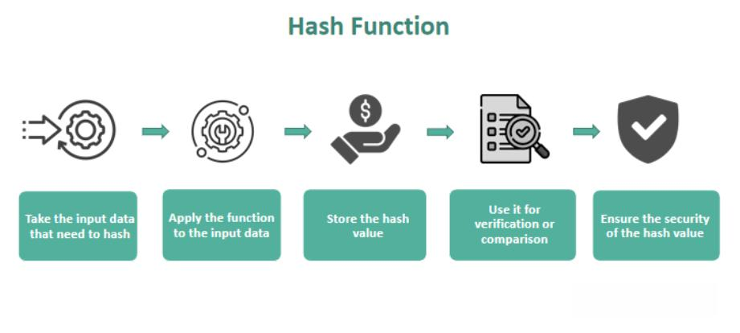

Understanding and effectively using financial metrics is a cornerstone in the competitive landscape of financial markets, particularly with the increasing relevance of algorithmic trading. This article explores the essential financial metrics, their applications, their importance in market analysis, and how they are used in algorithmic trading strategies. Each element plays a significant role, and their combination can lead to the creation of powerful trading algorithms that have the potential to outperform the market.

Financial metrics serve as quantitative tools that enable traders to gauge investment performance and profitability. They provide insights into the real-world figures of financial performance, often referred to as actuals, which are crucial for assessing the effectiveness of any trading strategy. Some of the most vital metrics include profit and loss, the Sharpe ratio, and maximum drawdown, among others. These metrics offer a comprehensive picture of a trading strategy’s viability and sustainability under actual market conditions.



Market analysis is another critical component of successful trading strategies. It involves evaluating market conditions to effectively strategize asset trading, incorporating both fundamental and technical analysis. Fundamental analysis assesses the intrinsic value of an asset, while technical analysis examines historical price patterns. When combined, these analyses allow traders to anticipate market movements and refine their trading strategies to be more responsive and effective.

Algorithmic trading, an integral part of modern financial markets, automates the trading process using computer algorithms that execute trades based on predefined criteria. This automation enables the integration of financial metrics and market analysis to enhance algorithm performance and efficiency. Algorithmic trading offers numerous benefits, such as increased speed and accuracy, and also introduces challenges related to risk management and the need for strategy adaptation in a rapidly changing market environment.

This introduction sets the stage for a deeper exploration of how financial metrics, market analysis, and algorithmic trading strategies converge to build a robust framework for success in trading. By understanding these components and their interactions, traders can gain a competitive advantage and make more informed decisions, ultimately leading to potentially higher returns.

## Table of Contents

## Understanding Financial Metrics and Their Actuals

Financial metrics serve as quantitative indicators that provide insight into the performance, profitability, and overall health of investments. These metrics are essential tools for traders, offering a framework for making informed decisions and assessing the effectiveness of trading strategies. In algorithmic trading, where rapid and strategic decision-making is crucial, financial metrics help traders evaluate their strategies in real-time against actual market conditions.

### Actuals in Financial Metrics
Actuals refer to the real-world figures that reflect financial performance. They are critical for determining whether a trading strategy or financial decision meets its intended objectives. Unlike projections or forecasts, which are based on estimates and assumptions, actuals study historical or current data, providing a concrete basis for evaluating the success of investment strategies.

### Key Financial Metrics
Among the numerous financial metrics used in evaluating trading strategies, some of the most pivotal include profit and loss, the Sharpe ratio, and maximum drawdown. Each of these metrics contributes a unique perspective on strategy evaluation:

1. **Profit and Loss (P&L):**
   Profit and loss calculations are fundamental to assessing the success of a trading strategy. This metric provides a direct measure of the financial gains or losses generated by trading activities over a specific period. 
$$
   \text{P\&L} = \text{Total Returns} - \text{Total Costs}

$$

   Evaluating P&L helps in understanding whether a trading strategy is financially viable and contributes to achieving overall investment goals.

2. **Sharpe Ratio:**
   The Sharpe ratio is a measure of risk-adjusted return. It evaluates how much excess return is received for the extra [volatility](/wiki/volatility-trading-strategies) endured by holding a riskier asset.
$$
   \text{Sharpe Ratio} = \frac{\overline{R} - R_f}{\sigma_R}

$$

   where $\overline{R}$ represents the average return of the investment, $R_f$ is the risk-free rate, and $\sigma_R$ denotes the standard deviation of the investment's excess return. A higher Sharpe ratio indicates more return for each unit of risk, signifying a more favorable risk-adjusted performance.

3. **Maximum Drawdown:**
   Maximum drawdown quantifies the largest peak-to-trough decline in an investment portfolio before a new peak is attained. It is a critical risk metric that helps investors understand the downside potential of a trading strategy.
$$
   \text{Max Drawdown} = \frac{\text{Peak Value} - \text{Trough Value}}{\text{Peak Value}}

$$

   This metric is vital for evaluating the robustness of a trading strategy in adverse market conditions, informing adjustments to reduce potential losses.

### Comprehensive Overview
By employing these metrics, traders gain a comprehensive understanding of a strategy's viability and sustainability. Each metric provides a different angle—from basic profitability to complex risk adjustment and potential losses—necessary to evaluate a trading strategy's effectiveness under real market conditions. These quantitative assessments aid in refining strategies, optimizing performance, and ultimately achieving better investment outcomes. As [algorithmic trading](/wiki/algorithmic-trading) continues to grow, the precise application of financial metrics remains indispensable for maintaining a competitive edge and enhancing decision-making in financial markets.

## Market Analysis: Concepts and Importance

Market analysis is a crucial aspect of algorithmic trading, offering a comprehensive evaluation of market conditions to inform asset trading strategies. It encompasses two primary forms: [fundamental analysis](/wiki/fundamental-analysis) and technical analysis, each providing distinct insights that collectively enhance trading decisions and strategy development.

Fundamental analysis focuses on assessing the intrinsic value of an asset. It involves a detailed examination of economic indicators, financial statements, industry trends, and macroeconomic factors that can influence asset prices. For instance, when evaluating a stock, fundamental analysis might consider the company's revenue, profit margins, management team, and industry competition. This form of analysis helps traders determine whether an asset is overvalued or undervalued, providing a basis for long-term investment decisions.

On the other hand, technical analysis examines historical price patterns and market data to anticipate future price movements. It operates on the premise that historical trading activity and price changes can be indicators of future performance. Technical analysis employs a variety of tools, such as moving averages, [momentum](/wiki/momentum) indicators, and chart patterns, to identify trends and potential reversal points. For example, the moving average (MA) is a popular technical indicator used to smooth out price data, creating a constantly updated average price. A simple moving average can be calculated using Python as follows:

```python
def simple_moving_average(prices, window):
    return [sum(prices[i:i+window])/window for i in range(len(prices) - window + 1)]
```

Combining fundamental and technical analyses allows traders to gain a well-rounded view of the market, enabling them to anticipate market movements more accurately. While fundamental analysis provides the "why" behind price movements, technical analysis offers the "how and when." This combination is especially powerful in algorithmic trading, where timing and market sentiments play critical roles.

Financial metrics serve as a bridge linking market analysis to trading decisions. Metrics such as the Sharpe ratio, which measures risk-adjusted returns, can be enhanced with insights from both fundamental and technical analyses to guide the development of trading strategies. By examining these metrics in conjunction with market analysis, traders can refine their strategies to enhance profitability and manage risk effectively.

Overall, market analysis is pivotal in the strategic formulation and execution of trades. By leveraging both fundamental and technical analysis, traders can better understand market dynamics, thus making informed trading decisions driven by data-driven insights. This comprehensive approach to market analysis empowers traders to optimize their algorithmic trading strategies and ultimately achieve sustainable success in competitive financial markets.

## Algorithmic Trading: Automation in Modern Markets

Algorithmic trading involves the use of computers and sophisticated algorithms to execute trades at speeds and frequencies that are beyond human capability. By automating the trading process, these systems can make decisions in milliseconds, which is crucial in the fast-paced environment of modern financial markets. At its core, algorithmic trading relies on predefined criteria to determine the timing, price, and quantity of trades, making it an essential tool for traders looking to capitalize on market inefficiencies and execute large orders with minimal market impact.

Key strategies in algorithmic trading include [trend following](/wiki/trend-following), statistical [arbitrage](/wiki/arbitrage), and high-frequency trading, each of which uses market analysis in distinct ways. 

- **Trend following** involves the identification of price trends in the market and the execution of trades that follow these trends. This strategy relies heavily on technical analysis and can be enhanced by integrating financial metrics such as moving averages or trend strength indicators.

- **Statistical arbitrage** seeks to exploit short-term price discrepancies between correlated assets. By employing statistical models and historical price data, algorithms can predict the likelihood of asset price convergence and execute trades accordingly. This strategy often includes metrics such as correlation coefficients and cointegration tests to fine-tune trade decisions.

- **High-frequency trading (HFT)** involves executing a large number of trades at extremely high speeds. HFT takes advantage of small price movements and typically requires a sophisticated infrastructure and advanced risk management techniques. Algorithms in HFT use real-time market data and microsecond latency levels to make trading decisions.

The integration of financial metrics and market analysis within algorithmic systems is critical to optimizing performance and operational efficiency. Algorithms analyze market data in real time, applying various financial metrics to assess market conditions and make informed trading decisions. For example, the Sharpe ratio can be used to measure risk-adjusted return, whereas the maximum drawdown might inform stop-loss levels.

The benefits of algorithmic trading are numerous, including increased execution speed, reduced transaction costs, and the ability to capture market opportunities 24/7. However, deploying algorithms in trading also presents certain challenges. One significant challenge is risk management, as the high speed and [volume](/wiki/volume-trading-strategy) of trades can amplify losses if algorithms malfunction or market conditions change unexpectedly. Additionally, developing algorithms that are both adaptive and robust in dynamic market environments can be complex, requiring ongoing strategy adaptation to maintain competitiveness.

To illustrate these concepts, one might use a Python script to backtest a simple trend-following strategy:

```python
import pandas as pd
import numpy as np

# Load historical market data
data = pd.read_csv('market_data.csv', parse_dates=True, index_col='Date')

# Calculate moving averages
data['Short_MA'] = data['Close'].rolling(window=20).mean()
data['Long_MA'] = data['Close'].rolling(window=50).mean()

# Generate trading signals
data['Signal'] = np.where(data['Short_MA'] > data['Long_MA'], 1, 0)

# Calculate returns
data['Return'] = data['Close'].pct_change()
data['Strategy_Return'] = data['Return'] * data['Signal'].shift(1)

# Evaluate strategy performance
sharpe_ratio = (data['Strategy_Return'].mean() / data['Strategy_Return'].std()) * np.sqrt(252)
print(f'Sharpe Ratio: {sharpe_ratio}')
```

This simple implementation highlights how moving averages can help identify trends, while the Sharpe ratio is used to gauge the risk-adjusted performance of the trading strategy. By continuously refining these strategies and models, traders can address the challenges associated with algorithmic trading and leverage its powerful capabilities to achieve their financial objectives.

## Evaluating Algorithmic Trading Strategies Using Financial Metrics

Proper evaluation of algorithmic trading strategies hinges on the analysis of several key financial metrics, each contributing unique insights into the strategy's performance. This section discusses critical metrics such as the Sharpe ratio, win rate, profit [factor](/wiki/factor-investing), and maximum drawdown, explaining their calculations and significance in enhancing the robustness of trading strategies.

### Sharpe Ratio

The Sharpe ratio is a measure of risk-adjusted return, reflecting the excess return per unit of risk. It's calculated using the formula:

$$
\text{Sharpe Ratio} = \frac{E[R_p] - R_f}{\sigma_p}
$$

where $E[R_p]$ is the expected portfolio return, $R_f$ is the risk-free rate, and $\sigma_p$ is the standard deviation of the portfolio's excess return. A higher Sharpe ratio indicates a more attractive risk-adjusted return, guiding traders to refine strategies accordingly for improved performance.

### Win Rate

Win rate refers to the proportion of trades that result in a profit. It is calculated as follows:

$$
\text{Win Rate} = \frac{\text{Number of Winning Trades}}{\text{Total Number of Trades}} \times 100
$$

A high win rate indicates a larger percentage of profitable trades, yet it needs to be considered alongside other metrics such as the average profit and loss per trade to truly assess a strategy's effectiveness.

### Profit Factor

Profit factor is the ratio of gross profits to gross losses, providing insight into the profitability of a trading strategy:

$$
\text{Profit Factor} = \frac{\text{Total Gross Profit}}{\text{Total Gross Loss}}
$$

A profit factor greater than one indicates a profitable strategy. This metric helps traders understand the long-term viability of their strategy by examining how gains outweigh losses.

### Maximum Drawdown

Maximum drawdown (MDD) measures the largest peak-to-trough decline in a trading strategy, indicating the maximum potential loss. It is expressed as a percentage of the peak value and is critical for risk assessment:

$$
\text{Maximum Drawdown} = \frac{\text{Peak Value} - \text{Trough Value}}{\text{Peak Value}} \times 100
$$

A smaller MDD suggests better risk management, which is essential for maintaining a strategy's longevity, particularly during volatile market conditions.

### Tools and Techniques

Effective strategy evaluation requires continuous monitoring using specialized tools and platforms that facilitate performance analysis. These may include [backtesting](/wiki/backtesting) software and performance analytics dashboards, which allow for real-time tracking and historical performance assessment. Incorporating these tools helps traders systematically refine strategies, ensuring alignment with financial objectives.

In conclusion, understanding and applying these financial metrics—whether through manual calculations or algorithm-driven analyses—helps traders to uncover strengths and weaknesses in their strategies. By consistently monitoring these key performance indicators, traders can refine their approach, better aligning with their financial goals and optimizing the potential for higher returns.

## Challenges and Considerations in Algo Trading

Algorithmic trading has transformed the trading landscape by introducing automated strategies capable of executing trades at a pace and precision unattainable by humans. Despite its advantages, the practice poses several challenges that traders must diligently address to maintain profitability and competitiveness. 

One significant challenge is market volatility, which can lead to rapid, unpredictable price changes that may affect the performance of algorithmic strategies. Algorithms designed to execute trades based on set parameters may perform poorly under volatile conditions, leading to unexpected losses. To mitigate the effects of volatility, traders can implement volatility filters that adjust the trading strategy when market conditions become unfavorable. For instance, increasing the spread threshold or reducing trade size during high volatility can help manage risks effectively.

Overfitting is another pitfall that can severely impact the performance of trading algorithms. Overfitting occurs when a model is excessively tailored to historical data, capturing noise rather than true market patterns. This results in a strategy that performs well in backtests but poorly in live trading. To address overfitting, traders should employ robust model validation techniques such as cross-validation. This involves partitioning data into training and testing sets to ensure that the algorithm generalizes well to unseen data. Additionally, keeping the model complexity in check by selecting a manageable number of parameters can prevent overfitting.

Transaction costs, including fees, spreads, and slippage, can also erode the profitability of trading strategies. These costs are particularly pertinent in high-frequency trading where the volume of trades amplifies their impact. Traders must incorporate transaction costs into their algorithms to ensure an accurate assessment of strategy performance. An effective method is to simulate trades factoring in realistic costs during backtesting. This approach helps in selecting strategies that remain profitable after accounting for such expenses.

To ensure trading algorithms remain adaptive and efficient, continual strategy evaluation is crucial. This involves monitoring real-time performance metrics and adjusting strategies dynamically to accommodate shifts in market conditions. Machine learning techniques, such as [reinforcement learning](/wiki/reinforcement-learning), can be instrumental in developing adaptive algorithms that learn and evolve based on market feedback. For instance, reinforcement learning models can be trained to optimize trade execution by rewarding actions that enhance profitability and penalizing those that result in losses.

In thriving within the dynamic landscape of algorithmic trading, traders must also be aware of common pitfalls such as latency and data quality issues. Latency, the delay in trade execution, can cause discrepancies between expected and actual trade prices, particularly in fast-moving markets. Employing co-location services — where trading systems are placed in close proximity to exchange servers — can help minimize latency. To tackle data quality issues, traders must ensure they use accurate, clean, and timely data feeds, as errors or lags can lead to erroneous trading signals.

In summary, while algorithmic trading offers numerous advantages, it requires traders to be vigilant about the inherent challenges to sustain a competitive edge. By addressing the issues of market volatility, overfitting, transaction costs, latency, and data quality, traders can enhance the resilience and adaptability of their strategies in an ever-evolving market environment.

## Conclusion

In the competitive landscape of financial markets, the integration of financial metrics, market analysis, and algorithmic trading forms a solid foundation for success. Financial metrics provide the quantitative backbone necessary for evaluating the performance and sustainability of trading strategies, offering traders insights into profitability, risk, and efficiency. Market analysis complements this by offering a narrative context, facilitating better anticipation of market dynamics through fundamental and technical means.

As technology continues to advance, with improvements in computational power and data analytics, new strategies and tools arise, presenting both opportunities and challenges. This technological progress enables more sophisticated algorithmic trading systems capable of processing vast amounts of data swiftly and executing trades with precision. The evolving landscape necessitates a continuous adaptation of strategies to maintain effectiveness amidst shifting market conditions.

Understanding and harnessing these elements—financial metrics, market analysis, and algorithmic trading—empower traders to refine their strategies. By employing rigorous analysis and incorporating advanced trading algorithms, traders can make more informed decisions, potentially leading to enhanced returns. The discussed metrics and tools not only contribute to strategy enhancement but also enable traders to manage risks effectively, ensuring that their approach remains aligned with financial goals.

Ultimately, this synergy allows traders to not only survive but thrive in the ever-competitive financial markets, where informed decision-making is a pivotal factor in achieving success.

## References & Further Reading

[1]: Bergstra, J., Bardenet, R., Bengio, Y., & Kégl, B. (2011). ["Algorithms for Hyper-Parameter Optimization."](https://dl.acm.org/doi/10.5555/2986459.2986743) Advances in Neural Information Processing Systems 24.

[2]: ["Advances in Financial Machine Learning"](https://github.com/FIONA-Youkyung/Financial_Engineering/blob/master/Advances_in_Financial_Machine_Learning_Marcos_Lopez_de_Prado.pdf) by Marcos Lopez de Prado

[3]: ["Evidence-Based Technical Analysis: Applying the Scientific Method and Statistical Inference to Trading Signals"](https://books.google.com/books/about/Evidence_Based_Technical_Analysis.html?id=MeoJAQAAMAAJ) by David Aronson

[4]: ["Machine Learning for Algorithmic Trading"](https://github.com/stefan-jansen/machine-learning-for-trading) by Stefan Jansen

[5]: ["Quantitative Trading: How to Build Your Own Algorithmic Trading Business"](https://github.com/LucindaYa/quant-resources/blob/master/Quantitative%20Trading%20How%20to%20Build%20Your%20Own%20Algorithmic%20Trading%20Business.pdf) by Ernest P. Chan