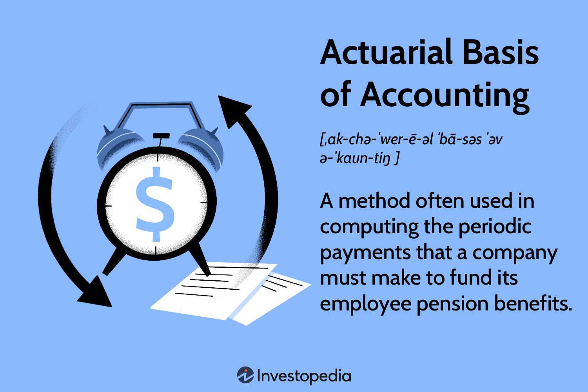

## Table of Contents

## What is the actuarial basis in accounting?

The actuarial basis in accounting is a method used to estimate future financial outcomes, especially for things like pensions and insurance. Actuaries use math and statistics to predict how much money will be needed to cover future costs. This helps companies and organizations plan their finances better. For example, a company might use actuarial methods to figure out how much to save for employee pensions, so they can make sure they have enough money when employees retire.

In simple terms, the actuarial basis involves making educated guesses about future events, like how long people will live or how likely they are to get sick. These guesses help companies set aside the right amount of money today to cover costs that might happen years from now. It's important because it helps keep companies financially stable and ensures they can meet their future obligations. Without actuarial accounting, it would be much harder for companies to plan for the long term.

## How does actuarial science relate to accounting?

Actuarial science and accounting are closely related because they both deal with numbers and money, but in different ways. Actuarial science uses math and statistics to predict future events, like how long people will live or how likely they are to need insurance. This helps companies figure out how much money they need to set aside today to cover future costs, like pensions or insurance claims. On the other hand, accounting is about keeping track of a company's money, recording what comes in and what goes out, and making sure everything adds up correctly.

The connection between the two comes when actuaries give their predictions to accountants. Accountants then use these predictions to make financial statements and plans. For example, if an actuary says a company needs to save a certain amount of money each year for employee pensions, the accountant will record this in the company's financial records. This helps the company plan its budget and make sure it has enough money for the future. So, while actuaries focus on predicting the future, accountants use those predictions to manage the company's money today.

## What are the key components of actuarial calculations used in accounting?

Actuarial calculations used in accounting involve several key components that help predict future financial needs. One important part is the mortality rate, which is a guess about how long people will live. This is crucial for things like pensions and life insurance because it helps figure out how long the company will need to pay out benefits. Another key component is the morbidity rate, which is a guess about how likely people are to get sick or injured. This is important for health and disability insurance because it helps predict how much money the company might need to pay for medical costs.

Another component is the [interest rate](/wiki/interest-rate-trading-strategies), which is used to figure out how much money will grow over time. If a company saves money now for future pensions, it needs to know how much that money will be worth in the future. The discount rate is also important because it helps convert future costs into today's dollars, making it easier to plan. Finally, actuaries use statistical models to put all these pieces together and make the best guess about future costs. These calculations help accountants make sure the company has enough money set aside to cover future expenses, keeping the company financially stable.

## Can you explain the role of actuaries in financial reporting?

Actuaries play a big role in financial reporting by helping companies predict future costs. They use math and [statistics](/wiki/bayesian-statistics) to make educated guesses about things like how long people will live or how likely they are to get sick. This information is really important for companies that offer pensions or insurance because it helps them figure out how much money they need to save today to cover future expenses. For example, if a company knows how long its employees might live, it can plan how much to put into their pension funds.

Once actuaries make these predictions, they share them with accountants. The accountants then use this information to create financial reports. These reports show how much money the company needs to set aside for future costs, like pensions or insurance claims. This helps the company make sure it has enough money to meet its future obligations. Without actuaries, it would be much harder for companies to plan their finances and make sure they can pay for things in the future.

## How are actuarial assumptions applied in the valuation of pension obligations?

Actuarial assumptions are very important when figuring out how much money a company needs to set aside for pensions. These assumptions help predict how long employees will live and when they will retire. Actuaries use this information to guess how much money the company will need to pay out in the future. They look at things like life expectancy, how likely people are to leave their jobs, and how much salaries might increase. By making these guesses, actuaries can help the company figure out a good amount of money to save now so they can pay pensions later.

Once the actuaries make these predictions, they give the information to accountants. The accountants then use these predictions to calculate the pension obligation, which is the total amount of money the company needs to pay out for pensions. This calculation helps the company know how much to report in its financial statements. If the actuaries guess that people will live longer or retire earlier, the company might need to save more money. This way, the company can make sure it has enough money to pay for all the pensions when the time comes, keeping everyone happy and financially secure.

## What is the difference between actuarial present value and nominal value in accounting?

Actuarial present value and nominal value are two different ways to look at money in accounting. Actuarial present value is used to figure out how much money is needed today to cover future costs, like pensions or insurance claims. It takes into account things like how long people might live, how much money will grow over time, and how much costs might go up. This helps companies plan for the future by converting future costs into today's dollars, making it easier to set aside the right amount of money now.

Nominal value, on the other hand, is the face value of money or an asset without considering things like inflation or interest rates. It's the amount of money you see on a bill or in a contract, without adjusting for what that money will be worth in the future. For example, if a company owes $100 in pensions in 10 years, the nominal value is just $100. But the actuarial present value would be less than $100 because it takes into account that the money saved today will grow over time due to interest. So, while nominal value gives you a straightforward number, actuarial present value gives a more accurate picture of what that money is really worth today.

## How do actuarial methods affect the recognition of expenses and liabilities in financial statements?

Actuarial methods help companies figure out how much money they need to save for future costs like pensions or insurance. This affects how expenses and liabilities are shown in financial statements. For example, if actuaries predict that employees will live longer, the company might need to set aside more money for pensions. This means the company will recognize a higher expense and a bigger liability in its financial statements. The expense is the cost of the pensions, and the liability is the money the company owes to employees in the future. By using actuarial methods, companies can make sure they report these numbers correctly, helping everyone understand the company's financial health.

When actuaries make these predictions, they use things like life expectancy, interest rates, and salary increases. These predictions help accountants figure out the present value of future costs. This means they convert what the company will need to pay in the future into today's dollars. If the predictions change, like if interest rates go up or down, it can change how much money the company needs to save. This can lead to adjustments in the financial statements, showing either higher or lower expenses and liabilities. By using actuarial methods, companies can plan better and make sure they have enough money to meet their future obligations.

## What are the common actuarial models used for insurance accounting?

Actuaries use different models to help insurance companies figure out how much money they need to save for future claims. One common model is the loss development model. This model helps predict how much money insurance companies will need to pay out for claims over time. It looks at past data to guess how much claims will grow and when they will be paid. This is important for things like car insurance or home insurance because it helps the company know how much money to set aside today for accidents or damages that might happen in the future.

Another model that actuaries use is the experience rating model. This model looks at how often a customer makes claims and how much those claims cost. It helps the insurance company decide how much to charge each customer for their insurance. If a customer has a lot of claims, they might have to pay more for insurance. This model helps the company make sure they are charging the right amount to cover the costs of claims. Both of these models help insurance companies plan better and make sure they have enough money to pay for future claims, keeping the company financially stable.

## How does the actuarial basis impact the auditing process?

The actuarial basis plays a big role in the auditing process because it helps auditors check if a company's financial statements are correct. Auditors look at the numbers that actuaries come up with to see if the company is saving enough money for future costs like pensions or insurance claims. If the actuaries guess that people will live longer or that more claims will come in, the company needs to set aside more money. Auditors make sure these guesses are reasonable and that the company is following the right rules when they report these numbers in their financial statements.

When auditors review the actuarial basis, they also check if the company is using the right methods and assumptions. They might look at things like life expectancy, interest rates, and how much costs might go up in the future. If the auditors find that the company's guesses are not good enough or if they see mistakes, they will tell the company to fix them. This helps make sure the financial statements are accurate and that the company is ready for future costs, keeping everyone happy and financially secure.

## What are the challenges faced by accountants when dealing with actuarial estimates?

Dealing with actuarial estimates can be tough for accountants because these estimates are all about guessing what will happen in the future. Actuaries use math and statistics to predict things like how long people will live or how many insurance claims there will be. But these are just guesses, and if they're wrong, it can mess up the company's financial plans. For example, if actuaries think people will live longer than they actually do, the company might save too much money for pensions. On the other hand, if they guess wrong and people live shorter lives, the company might not save enough. This makes it hard for accountants to make sure the financial statements are correct and that the company is ready for the future.

Another challenge is that actuarial estimates can change a lot over time. Things like interest rates, life expectancy, and how much costs might go up can all change. When these things change, the actuaries need to update their guesses, and accountants have to adjust the financial statements to match. This means a lot of extra work for accountants because they have to keep checking and updating the numbers. It's important to get it right because if the estimates are off, it can make the company look like it's in better or worse financial shape than it really is. So, accountants have to be really careful and keep up with all the changes to make sure the company's financial reports are accurate.

## How do changes in actuarial assumptions affect a company's financial health?

Changes in actuarial assumptions can really shake up a company's financial health. If actuaries change their guesses about things like how long people will live or how much money will grow over time, it can mean the company needs to save more or less money for the future. For example, if they think people will live longer, the company might need to put more money into pension funds. This can make the company's expenses go up and show a bigger liability on their financial statements. If the company doesn't have enough money saved, it might have to find more money from somewhere else, which can be tough.

On the other hand, if actuaries think people won't live as long or if interest rates go up, the company might need to save less money. This can make the company's financial statements look better because their expenses and liabilities will be smaller. But it's a tricky balance because if the actuaries are wrong, the company could end up not having enough money when it's time to pay out pensions or insurance claims. So, changes in actuarial assumptions can make a big difference in how healthy a company looks on paper and how ready it is for the future.

## What advanced actuarial techniques are used to enhance the accuracy of financial projections in accounting?

Actuaries use some fancy math and computer tricks to make their guesses about the future more accurate. One cool technique they use is called stochastic modeling. This is a fancy way of saying they run a bunch of different scenarios on a computer to see what might happen. By looking at many different possibilities, actuaries can get a better idea of what might happen and how much money a company might need to save. This helps make their predictions more reliable, which is super important for things like pensions and insurance where a lot of money is at stake.

Another advanced technique is called dynamic financial analysis (DFA). This method looks at how different parts of a company's finances work together and how they might change over time. It's like playing a big game of "what if" with the company's money. Actuaries use this to see how things like changes in interest rates or how long people live might affect the company's financial health. By using DFA, actuaries can give accountants better information to help them plan and make sure the company is ready for whatever the future brings.

## What is Understanding Actuarial Financial Reporting?

Actuarial financial reporting plays a crucial role in assessing and managing financial risks and obligations, particularly in the domains of pensions and insurance. This process employs statistical and mathematical methods to provide insights into the financial health and future obligations of entities dealing with uncertain financial exposure. The actuarial basis of accounting involves methodologies that integrate assumptions and projections to accurately compute the present value of future liabilities.

In pension accounting, actuarial assumptions are fundamental for calculating an entity's pension obligations. These assumptions generally include the expected rate of return on plan assets, salary growth, mortality rates, and employee turnover rates. The valuation of pension obligations typically follows these steps:

1. **Projection of Future Benefits**: This involves estimating the future benefits that will be payable to participants based on factors like salary progression, years of service, and benefit formulas. The projected benefit obligation (PBO) is a critical measure in this context.
$$
   \text{PBO} = \sum_{t=0}^{T} \frac{B_t}{(1 + r)^t}

$$

   Here, $B_t$ represents the expected benefit payment at time $t$, $r$ is the discount rate, and $T$ is the time until the last benefit payment.

2. **Discounting Future Liabilities**: The anticipated benefit payments are discounted back to their present value using a rate that reflects the time value of money and the risk associated with the obligation.

3. **Adjusting for Demographic and Economic Assumptions**: Actuarial accountants must regularly update assumptions to reflect changes in demographic and economic conditions, such as updates in mortality tables or changes in market yields.

Actuarial accountants use software tools and spreadsheets to apply formulas in compliance with Generally Accepted Accounting Principles (GAAP). GAAP requires these entities to ensure financial reports are consistent, reliable, and reflect economic realities. The accounting standards necessitate periodic reassessment of actuarial assumptions to capture the most current financial landscape accurately.

Moreover, actuarial financial reporting mandates rigorous adherence to regulatory frameworks that dictate the minimum funding requirements and disclosure obligations for pension and insurance entities. By aligning actuarial valuations with these regulations, companies maintain financial stability and transparency.

Compliance with GAAP and International Financial Reporting Standards (IFRS) is vital for actuarial financial reporting. Both frameworks provide the guidelines for recognizing, measuring, and presenting financial positions and performance, ensuring that actuarial valuations are consistently and accurately reported.

In summary, actuarial financial reporting is essential for assessing long-term financial obligations, guiding informed decision-making in financial management, and ensuring compliance with accounting standards. This practice supports the stability and reliability of financial statements, which is critical for stakeholders, including investors, regulators, and policymakers.

## References & Further Reading

1. **Books:**
   - "Actuarial Mathematics" by Bowers, Newton L. et al. provides comprehensive coverage of the mathematical theories applied in actuarial practice, which is fundamental for understanding actuarial financial reporting and risk assessment.
   - "Financial Reporting and Analysis" by Charles H. Gibson investigates into the principles of financial reporting, including accrual accounting practices and the interpretation of financial statements.
   - "Algorithmic Trading: Winning Strategies and Their Rationale" by Ernie Chan offers insights into the mechanics of algorithmic trading, including strategies that leverage financial reporting data for performance optimization.

2. **Articles:**
   - "The Impact of Actuarial Accounting on Financial Reports" published in the Journal of Financial Economics explores the assumptions and methodologies used in actuarial accounting for pension and insurance obligations.
   - "Comparative Analysis of Accrual and Cash Accounting" in the Accounting Review provides a detailed examination of accrual accounting methods, comparing them with cash accounting, highlighting advantages in financial transparency.
   - "Algorithmic Trading: Challenges and Regulatory Implications" available in the Financial Analysts Journal discusses the essential role of precise financial data in algorithmic trading and the necessity of compliance with accounting standards.

3. **Websites:**
   - The **International Financial Reporting Standards Foundation** website (www.ifrs.org) is a primary resource for understanding global accounting standards that influence financial reporting practices across industries.
   - The **Society of Actuaries** website (www.soa.org) offers resources and insights on actuarial methodologies and practices that underlie sound financial reporting in insurance and pensions.
   - Investopedia offers valuable articles that break down complex topics such as accrual accounting and algorithmic trading into easily digestible content for both beginners and advanced practitioners (www.investopedia.com).

These resources provide a foundational base for readers who wish to expand their knowledge of how actuarial science, accrual accounting, and [algorithmic trading](/wiki/algorithmic-trading) interact to shape decision-making in financial markets.

