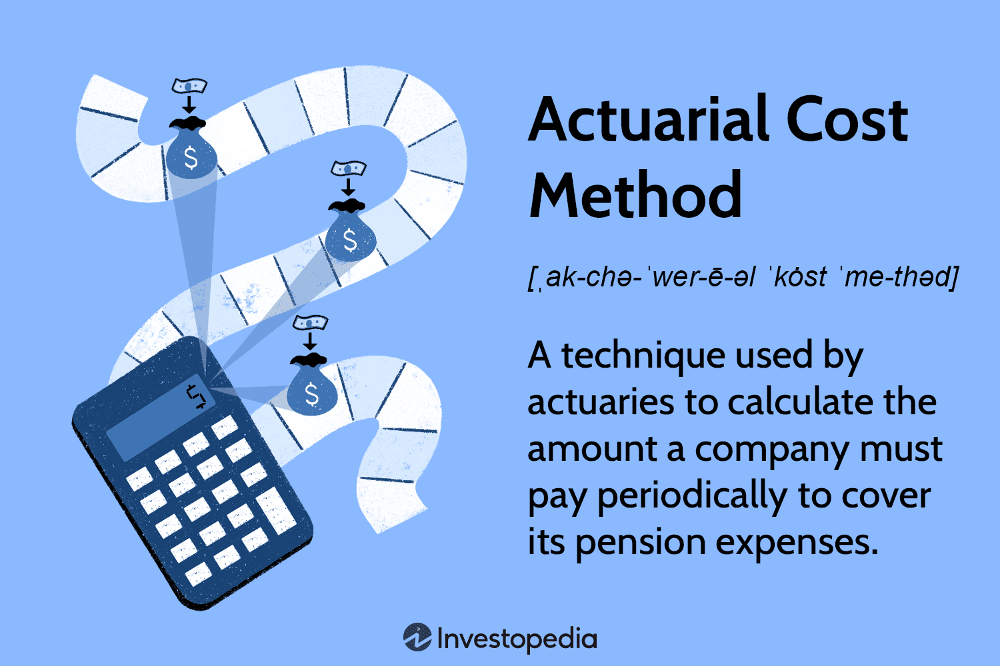

In the complex world of finance, actuarial methodologies play a pivotal role in maintaining the sustainability and efficiency of pension plans. These methods are essential for companies to effectively manage their pension funding, while also being interconnected with contemporary financial strategies such as algorithmic trading. Actuarial cost methods, in particular, provide a systematic approach for calculating the necessary periodic contributions that ensure pension obligations are adequately funded. This involves a detailed assessment of numerous factors, including employee salaries, projected salary increases, retirement age, and life expectancy, all of which are crucial for determining the present value of future pension liabilities. 

Algorithmic trading, meanwhile, represents a convergence of technology and finance, where algorithms execute trades at speeds and volumes far beyond human capabilities. This innovation has fundamentally transformed modern financial markets, offering pension funds the opportunity to achieve better returns via advanced trading strategies.



This article explores the connections between actuarial cost methods, pension funding, and the methodologies underpinning algorithmic trading. By understanding these relationships, companies can make more informed decisions regarding their financial strategies, optimizing both the management of their pension plans and investment activities. The integration of actuarial insights with algorithmic trading strategies can potentially enhance returns on pension assets, align investments with future liabilities, and improve overall risk management.

## Table of Contents

## Understanding Actuarial Cost Methods

Actuarial cost methods are fundamental tools used by actuaries to calculate the necessary contributions that a company must make to ensure the adequate funding of its pension obligations. These methods serve as a framework for determining how pension costs are assigned over the future working lifetime of the workforce. Two main approaches are utilized in actuarial funding methods: the cost approach and the benefit approach.

### Cost Approach
The cost approach primarily focuses on the employer's annual contribution to the pension plan. This approach involves forecasting the total future costs of the pension plan and spreading these costs over the employees’ expected future working years. It ensures that sufficient assets are accumulated to meet the pension plan's future benefit obligations as they become due. Common methods within this approach include the Projected Unit Credit (PUC) method and the Entry Age Normal (EAN) method.

1. **Projected Unit Credit (PUC) Method**: This method calculates annual contributions based on the benefits earned each year, projected into the future. It accounts for salary increases and uses a discount rate to determine the present value of future benefits. The formula for calculating the present value $PV$ of a projected benefit $B$ at retirement age $t$ is:
$$
   PV = \frac{B}{(1 + r)^t}

$$
   where $r$ is the discount rate.

2. **Entry Age Normal (EAN) Method**: With this method, the normal cost is calculated as a constant percentage of the employee's salary throughout the employment period. It assumes that each year’s contribution is the same proportion of salary, leading to stable and predictable funding costs.

### Benefit Approach
The benefit approach emphasizes the benefits accrued in each period, calculating contributions based on the valuation of benefits already earned by employees. This method is oriented towards valuing the accrued liabilities and maintaining these at a certain funded level. 

### Key Factors in Actuarial Cost Methods
Several critical factors influence the calculations within both the cost and benefit approaches. These include:

- **Employee Salary and Projected Salary Increases**: Salaries are pivotal as they are directly linked to pension benefits, particularly in defined benefit plans. Future salary increases need to be projected to adequately estimate future pension liabilities.

- **Retirement Age**: Estimates of the expected retirement age influence the time horizon over which benefits are calculated, impacting the present value of future obligations.

- **Life Expectancy**: Accurate life expectancy projections ensure that the pension plan can sustain payments over the course of retirees’ lifetimes.

- **Cost-of-Living Adjustments (COLAs)**: These adjustments reflect changes in the inflation rate, ensuring that pension benefits maintain purchasing power over time. COLAs can significantly affect the valuation of future benefits.

- **Present Value Discounting**: Present value discounting is crucial in actuarial calculations. It involves adjusting future benefits and contributions into present-day terms using a specified discount rate. This rate reflects the time value of money and expected investment return on plan assets.

The complexity and variation in actuarial cost methods require precise assumptions and continuous adjustments based on observed data. Ensuring accurate and robust calculations helps in managing the financial sustainability of pension plans over the long term.

## Pension Funding and Financial Statement Analysis

Pension plan funding is a vital aspect of corporate finance, influencing how companies manage their available resources and present their financial conditions. The funding process involves determining the company's required contributions to cover future pension obligations. The calculations must [factor](/wiki/factor-investing) in various assumptions about the future, which can significantly affect reported expenses and liabilities on financial statements.

A key component in pension funding is the determination of the present value of future pension liabilities. This is often achieved using a discount rate reflecting current market yields on high-quality corporate bonds. The choice of discount rate is crucial as it impacts the present value and, consequently, the amount a company must contribute to maintain adequacy in funding. A higher discount rate reduces the present value of pension liabilities, potentially decreasing required contributions in the short term, but it may not accurately reflect future obligations.

Pension asset returns are another significant factor. Companies must estimate the expected rate of return on pension assets, which influences how much they need to contribute currently to meet future liabilities. An optimistic return assumption can lead to underfunding, while a conservative approach may strain current resources due to higher contribution requirements.

Retirement projections, including estimates of employee longevity and retirement age, add complexity to these calculations. Longer life expectancies imply more extended payment periods, increasing the present value of liabilities and thus affecting funding needs.

The interaction of these assumptions — discount rates, asset returns, and retirement projections — is reflected in financial statements. Companies disclose the effects of these assumptions in notes accompanying the statements, allowing investors to assess pension plan sustainability. For example, the balance sheet will include both the fair value of plan assets and the projected benefit obligation (PBO), highlighting any funding surplus or deficit. Additionally, the income statement reflects pension expenses, amalgamating service costs, interest costs, and expected returns on plan assets.

Accrued liabilities for pensions appear under long-term liabilities on the balance sheet, impacting the company's leverage ratios and overall financial health. Transparency and adherence to established accounting standards like the International Financial Reporting Standards (IFRS) or Generally Accepted Accounting Principles (GAAP) are essential to maintaining investor trust.

Thus, the methodical approach to reporting pension plans and respective financial impacts allows stakeholders to evaluate a company's commitments and financial soundness, ensuring that pension promises are both managed effectively and disclosed clearly.

## Algorithmic Trading: A Financial Innovation

Algorithmic trading is at the forefront of financial market innovation, leveraging advanced algorithms to execute trades with remarkable speed and frequency. Unlike traditional trading, where human operators make decisions based on market data, [algorithmic trading](/wiki/algorithmic-trading) utilizes pre-programmed instructions to analyze multiple market variables and execute trades autonomously. These algorithms consider factors such as timing, price, and [volume](/wiki/volume-trading-strategy) to optimize trading outcomes.

The benefits of algorithmic trading are significant. Firstly, it enhances market efficiency by providing [liquidity](/wiki/liquidity-risk-premium) and narrowing bid-ask spreads. Traders can capitalize on short-lived market opportunities that are often invisible to human traders due to the speed at which algorithms process and act upon information. This speed enables high-frequency trading ([HFT](/wiki/high-frequency-trading-strategies)), a subset of algorithmic trading where numerous trades are executed in fractions of a second.

Moreover, algorithmic trading allows for the reduction of transaction costs. By optimizing the timing and size of trades, algorithms can minimize market impact and slippage, which are critical factors for large institutional investors such as pension funds. These efficiencies contribute to better pricing and return strategies that are aligned with the financial goals of investors.

Despite these advantages, algorithmic trading carries inherent risks. The reliance on technology and complex algorithms introduces the potential for technical failures and errors. Market events such as the Flash Crash of 2010 illustrate the risks of algorithms reacting to volatile market conditions without human intervention, leading to rapid price declines. To counteract such risks, robust risk management strategies and fail-safes are essential components of algorithmic trading systems.

Apart from technical risks, there's also the risk of overfitting algorithms to historical data, which can result in poor performance in live trading environments. Developers must ensure that algorithms remain adaptive and robust against unexpected market conditions by continuously updating and testing their models.

Algorithmic trading has revolutionized financial markets by offering powerful tools for trade execution and strategy development. For pension funds and other institutional investors seeking enhanced returns, algorithmic trading strategies can optimize portfolio performance by executing trades that align with their investment strategies. As the technology and sophistication of these algorithms continue to evolve, they will play an integral role in shaping modern financial markets and investment techniques.

## Synergy Between Actuarial Methods and Algorithmic Trading

Actuarial methods and algorithmic trading, while traditionally distinct areas of finance, can collectively establish a comprehensive strategy for managing and optimizing pension fund investments. By harnessing the precision of actuarial techniques with the speed and efficiency of algorithmic trading, pension funds can effectively align their investment strategies with their financial obligations.

Actuarial methods provide a structured approach to understanding pension liabilities, utilizing statistical and mathematical techniques to project future obligations based on various assumptions, such as employee demographics, salary growth, and longevity. These methodologies are crucial for estimating the present value of future payments, enabling organizations to determine the necessary contribution levels to maintain solvent pension plans.

Algorithmic trading, on the other hand, employs complex algorithms to execute trades at speeds and volumes unattainable by human traders. This technological advancement allows for the implementation of sophisticated strategies that capitalize on market inefficiencies, offering opportunities to enhance returns on investment portfolios. By executing trades automatically based on pre-defined criteria, algorithmic trading can efficiently manage large volumes of transactions, thereby reducing transaction costs and minimizing human error.

Integrating these two disciplines can lead to significant improvements in pension fund management. For instance, actuarial insights can inform the parameters and risk profiles of algorithmic trading strategies. If a pension fund needs to achieve a specific rate of return to meet its future liabilities, algorithms can be tailored to pursue investment opportunities aligned with that target, ensuring that the investment strategy supports the overarching actuarial goals.

Moreover, the integration of actuarial and algorithmic approaches aids in risk management. By understanding the liabilities through actuarial projections and using algorithmic models to dynamically adjust investments, pension funds can better match the duration of their assets to their liabilities, thereby minimizing [interest rate](/wiki/interest-rate-trading-strategies) and market risk. Python can be employed to illustrate this integration. For example, a simplified script can be used to create an algorithm that adjusts the asset allocation based on projected liability changes:

```python
import numpy as np

# Example parameters for liabilities and investments
liability_growth_rate = 0.03  # 3% annual liability growth
expected_return = 0.05  # 5% expected return on investment
investment_allocation = {"stocks": 0.6, "bonds": 0.4}  # initial allocation

def adjust_allocation(current_allocation, liability_growth_rate, expected_return):
    if expected_return < liability_growth_rate:
        current_allocation["stocks"] += 0.1
        current_allocation["bonds"] -= 0.1
    else:
        current_allocation["stocks"] -= 0.1
        current_allocation["bonds"] += 0.1
    return current_allocation

# Adjusting allocation based on expected return and liability growth
new_allocation = adjust_allocation(investment_allocation, liability_growth_rate, expected_return)
```

Ultimately, the convergence of actuarial and algorithmic strategies enables a more resilient pension funding and investment approach, helping to ensure that pension plans can meet their obligations while optimizing returns. This synergy supports a holistic approach to financial management, enhancing both performance and security of pension assets.

## Case Studies and Real-world Applications

In examining the practical applications of integrating actuarial methodologies with algorithmic trading for managing pension funds, we can look at several prominent case studies that underline the efficacy of this approach. These instances not only highlight successful strategies but also provide a wealth of insights into best practices for enhancing financial health through strategic pension fund management.

### Case Study 1: British Petroleum (BP) Pension Fund

One notable example involves the British Petroleum (BP) Pension Fund, which successfully integrated actuarial assessments with algorithmic trading strategies to enhance its investment portfolio performance. The fund employed actuarial techniques to evaluate its long-term liabilities, taking into account factors such as projected salary increases, retirement ages, and mortality rates. By aligning these insights with algorithmic trading models, BP was able to dynamically adjust its asset allocation, improving returns and managing risk exposure effectively.

The strategic approach involved using algorithmic trading to optimize the allocation of assets in real time, responding to market conditions with precision that manual trading could not achieve. This blend of actuarial evaluation and high-frequency trading allowed BP's management team to maintain a well-hedged portfolio, resulting in improved funding ratios consistently over time.

### Case Study 2: California Public Employees' Retirement System (CalPERS)

CalPERS represents another significant illustration of integrating actuarial science with algorithmic trading. This pension fund, one of the largest in the United States, faced the challenge of balancing its substantial pension obligations with the need for robust returns on investment. By leveraging actuarial projections regarding future liabilities, CalPERS tailored its portfolio management strategies to meet projected cash flow requirements precisely.

An essential component of their strategy was deploying algorithmic trading techniques to capitalize on short-term market inefficiencies. This included developing trading algorithms driven by [machine learning](/wiki/machine-learning) that could make real-time trading decisions to leverage these opportunities. The outcome was a more diversified investment strategy that aligned with actuarial predictions, ensuring sufficient liquidity to meet pension obligations while optimizing returns.

### Key Lessons and Best Practices

1. **Data-Driven Decision-Making:**
   These case studies underscore the importance of using data analytics to drive investment decisions. Actuarial data provides a robust foundation for understanding liabilities, while algorithmic trading utilizes market data to make informed trading choices rapidly.

2. **Risk Management:**
   Combining actuarial methodologies with real-time trading models enhances an organization's ability to manage risks. Understanding the projected liabilities through actuarial assessments allows for better alignment of trading strategies that can absorb or hedge against potential market volatilities.

3. **Adaptive Strategies:**
   The flexibility afforded by algorithmic trading allows pension funds to adapt swiftly to changing market conditions. This adaptability is crucial in environments where traditional, long-term investment strategies may fall short in addressing immediate market risks or opportunities.

4. **Integration and Collaboration:**
   Successfully executing these strategies requires collaboration between actuaries, data scientists, and financial analysts. An integrated approach ensures that diverse expertise is harnessed effectively to guide comprehensive investment strategies.

5. **Sustainable Practices:**
   Long-term sustainability of pension funds can be better ensured by integrating sophisticated actuarial insights with advanced trading techniques. This integration allows for potentially higher returns while mitigating risks associated with market [volatility](/wiki/volatility-trading-strategies) and pension liabilities.

By observing these cases and extracting pertinent lessons, other organizations can improve their financial strategies by adopting similar practices, ultimately ensuring the sustainability and security of their pension provisions.

## Conclusion

The intricate interplay of actuarial cost methods and algorithmic trading strategies presents a substantial opportunity for companies to strengthen their financial positions while managing pension liabilities effectively. By meticulously applying these methodologies, organizations can address the complex challenges posed by the need to sustain pension funds over the long term. Actuarial cost methods enable companies to precisely calculate necessary contributions, reflecting a nuanced understanding of variables such as salary projections, retirement age, and cost-of-living adjustments. These calculations are essential for ensuring that pension plans remain adequately funded and capable of meeting future obligations.

Simultaneously, algorithmic trading introduces a level of sophistication in managing pension fund investments. The ability of algorithms to process and respond to market data at unprecedented speeds allows pension funds to capitalize on market opportunities and optimize asset returns. This dynamic approach to investment management can align closely with actuarial insights, offering a strategic advantage in balancing pension fund assets against liabilities. For instance, pension funds can employ algorithmic strategies to hedge against market volatility or to dynamically adjust asset allocation in response to actuarial projections.

Financial professionals tasked with optimizing organizational and funding strategies must increasingly incorporate these methodologies into their toolkit. As the financial landscape evolves, the integration of actuarial models with algorithmic trading systems will become crucial. This integrated approach not only enhances the potential for higher returns but also contributes to more robust risk management frameworks. By leveraging sophisticated methodologies, companies can not only secure their current financial commitments but also position themselves for sustainable growth and stability in the future.

Ultimately, the synergy between actuarial and algorithmic strategies will enable organizations to navigate the complexities of modern finance with greater precision and foresight, ensuring that they remain resilient in the face of evolving challenges and opportunities. As the fields of actuarial science and financial technology continue to advance, the potential for innovation and improved financial performance in pension fund management will only expand.

## References & Further Reading

[1]: Bergstra, J., Bardenet, R., Bengio, Y., & Kégl, B. (2011). ["Algorithms for Hyper-Parameter Optimization."](https://dl.acm.org/doi/10.5555/2986459.2986743) Advances in Neural Information Processing Systems 24.

[2]: ["Advances in Financial Machine Learning"](https://www.amazon.com/Advances-Financial-Machine-Learning-Marcos/dp/1119482089) by Marcos Lopez de Prado

[3]: ["Evidence-Based Technical Analysis: Applying the Scientific Method and Statistical Inference to Trading Signals"](https://www.amazon.com/Evidence-Based-Technical-Analysis-Scientific-Statistical/dp/0470008741) by David Aronson

[4]: ["Machine Learning for Algorithmic Trading"](https://github.com/stefan-jansen/machine-learning-for-trading) by Stefan Jansen

[5]: ["Quantitative Trading: How to Build Your Own Algorithmic Trading Business"](https://www.amazon.com/Quantitative-Trading-Build-Algorithmic-Business/dp/1119800064) by Ernest P. Chan