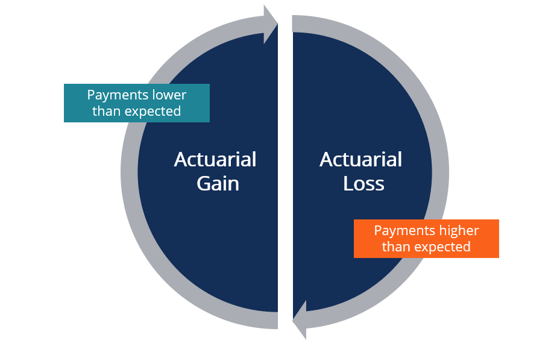

This article provides a comprehensive overview of actuarial gains and losses, financial reporting, and their relevance to algorithmic trading. Actuarial gains and losses arise from differences between anticipated and actual outcomes, largely affecting entities managing pension plans and long-term fiscal commitments. As organizations grapple with these discrepancies, understanding actuarial concepts becomes crucial for businesses. Such insights facilitate accurate valuation and alignment with financial objectives and obligations.

Algorithmic trading has transformed financial markets, introducing a new layer of complexity to financial reporting. Its impact is evident in the volatility and efficiencies it creates, drawing a unique connection to actuarial assumptions. By examining these interactions, the article aims to offer a broadened perspective that encompasses traditional actuarial practices and contemporary financial innovations.



Actuarial gains and losses have significant implications for corporate finance, as they can lead to fluctuations in reported liabilities, net income, and equity. The challenge lies not only in accurate calculations but also in strategic management of these financial metrics to ensure compliance and optimize performance. Financial professionals are tasked with devising strategies to accommodate such volatility while maintaining transparency and stability.

This article equips finance professionals with essential knowledge for optimizing financial performance and ensuring compliance. By addressing the intersection of actuarial science with algorithmic trading, the discussion highlights new opportunities and challenges presented in modern finance. As the financial landscape continues to evolve, understanding the dynamics between these two fields will be pivotal for professionals seeking to enhance financial decision-making and stakeholder confidence.

## Table of Contents

## Understanding Actuarial Gain and Loss

Actuarial gain or loss stems from differences between expected and actual outcomes, primarily concerning demographic and financial assumptions. These variations significantly impact a company's projected benefit obligations (PBO), a critical component of financial statements. The PBO represents the present value of future pension liabilities, and accurate predictions of these obligations are essential for financial stability and reporting.

Key assumptions in calculating PBO include:

1. **Discount Rates:** The discount rate is crucial as it determines the present value of future pension payments. A higher discount rate reduces the present value of liabilities, while a lower rate increases it. Fluctuations in this rate can lead to actuarial gains or losses, affecting the financial position and performance.

2. **Mortality Rates:** These rates influence the estimated duration and total payout of pension benefits. Changes in life expectancy projections can cause significant adjustments in PBO. If actual mortality rates deviate from predictions, it results in actuarial gain or loss.

3. **Salary Growth:** Assumptions regarding future salary increases impact the projected benefits. Higher-than-expected salary inflation increases the PBO, potentially leading to actuarial loss, while lower-than-expected growth can result in actuarial gain.

4. **Employee Turnover:** Employee turnover rates affect the number of future beneficiaries of a pension plan. Variances between expected and actual turnover rates can lead to adjustments in liability projections, contributing to actuarial gains or losses.

Actuarial gains or losses can result in fluctuations in a company’s reported liabilities and equity, thus influencing overall financial health. These gains and losses are often recorded in other comprehensive income under equity until they are amortized and recognized in the income statement. The accounting treatment is subject to regulatory standards, which aim to provide an accurate representation of a company's financial obligations.

Actuaries play a critical role in estimating these outcomes, employing sophisticated statistical and mathematical models to simulate various scenarios and provide precise valuations for pension plans. Their expertise ensures that companies adjust their assumptions regularly, reflecting current economic conditions and demographic trends. This proactive approach helps maintain the integrity of financial reporting and supports strategic decision-making processes in managing long-term obligations.

## The Impact on Financial Reporting

Actuarial gains and losses are pivotal in shaping a company's financial statements, primarily impacting the balance sheet and income statement. These elements can substantially affect both net income and equity. The handling of actuarial gains and losses, whether through immediate recognition or deferral, plays a significant role in determining the nature of financial reporting—either contributing to [volatility](/wiki/volatility-trading-strategies) or providing smoothing in financial results.

Immediate recognition of actuarial gains or losses reflects these changes directly in the financial statements as they occur. This approach ensures transparency, allowing stakeholders to view the organization's financial health accurately. However, this can lead to considerable volatility, reflecting sudden financial fluctuations due to changes in assumptions about discount rates, mortality, or other relevant factors. Conversely, the deferral method, aligning with practices like the corridor approach under IAS 19, allows these gains or losses to be recognized over a more extended period, smoothing the impact on financial results. 

Investors and stakeholders scrutinize these impacts to evaluate an organization's financial health and risk exposure. The consistency and accuracy of financial reporting influenced by actuarial elements impact strategic decisions, investment considerations, and market perceptions. Transparency in how these figures are handled becomes vital for maintaining stakeholder trust and financial clarity.

Proper management of actuarial gains and losses is indispensable for compliance with accounting standards such as IAS 19 or ASC 715. Regulatory frameworks demand that organizations disclose their methods of managing these variances to ensure an accurate representation of their financial standing. Maintaining stability in financial reporting necessitates an adept handling of these actuarial elements, ensuring that unpredictable variations do not detrimentally affect the business's perceived or actual financial health.

Technological advancements provide tools for efficient management of actuarial gains and losses. Actuarial valuation software enables precise computation and reporting, reducing human error and processing time. These tools facilitate scenario testing and forecasting, aiding actuaries in modeling potential outcomes and selecting appropriate strategies to mitigate risk. Utilizing statistical software, companies can quickly adjust their financial models in response to changing variables, maintaining robust financial health.

In summary, the integration and management of actuarial gains and losses in financial reporting requires meticulous attention and adept handling to maintain both compliance and stability within an organization's financial statements. These practices, coupled with modern technology, enable organizations to present a more accurate view of their financial conditions, benefiting both internal decision-making and external perceptions by stakeholders.

## Algorithmic Trading and Financial Reporting

Algorithmic trading has fundamentally transformed financial markets by automating trading processes and facilitating rapid, data-driven decisions. Its increasing prevalence is attributable to advancements in computational technology and the availability of vast datasets. Algorithmic trading systems execute pre-programmed trading instructions that account for variables such as timing, price, and [volume](/wiki/volume-trading-strategy), enabling traders to capitalize on market conditions more efficiently than traditional manual methods.

One significant effect of [algorithmic trading](/wiki/algorithmic-trading) is its impact on market volatility. Algorithms react to market data in real-time, making split-second decisions to buy or sell assets. While this can enhance market [liquidity](/wiki/liquidity-risk-premium), it also has the potential to exacerbate volatility, especially during periods of market stress. Such volatility can, in turn, influence actuarial assumptions used in financial reporting, particularly those related to interest rates and asset return forecasts. For instance, greater market fluctuations might necessitate the adjustment of discount rates employed in the valuation of long-term liabilities, such as pension plans.

Understanding algorithms' role in asset management and trading strategies is crucial for finance professionals. Effective management of algorithmic trading systems requires continuous monitoring and adjustment to optimize trading outcomes while minimizing risks. These systems must cope with rapid changes in market conditions and enforce risk management strategies to ensure stability. For instance, stop-loss mechanisms and diversified portfolio strategies can be implemented within algorithmic systems to mitigate potential losses due to market volatility.

The convergence of actuarial calculations with trading strategies presents an opportunity to optimize financial outcomes. By aligning actuarial assumptions with algorithmic trading insights, organizations can enhance their predictive models. This congruence allows for more precise forecasting of financial obligations and investment returns. An illustrative example involves using historical data to calibrate actuarial models, incorporating real-time market insights from algorithmic trading algorithms to adjust assumptions dynamically.

In practical terms, aligning actuarial calculations with trading strategies may involve incorporating real-time market data into actuarial models. For instance, Python, a prevalent language in financial technology, can be employed for this integration:

```python
import numpy as np

# Example of adjusting actuarial assumptions based on market volatility
historical_volatility = np.std(np.random.normal(size=100))  # Sample market data

# Adjust discount rate based on market volatility
base_discount_rate = 0.05
adjusted_discount_rate = base_discount_rate + historical_volatility * 0.01

print(f"Adjusted Discount Rate: {adjusted_discount_rate:.2f}")
```

This approach aligns actuarial predictions with the fast-paced environment of modern trading, ultimately enhancing risk management and financial forecasting. As financial markets continue to evolve, the interplay between actuarial science and algorithmic trading will become increasingly relevant, driving innovation and efficiency in financial reporting and decision-making processes.

## Calculating Actuarial Gains and Losses

Actuarial gains and losses are calculated through the use of sophisticated mathematical models and assumptions. These calculations primarily focus on predicting future events that impact pension plans and long-term financial benefits. The process begins by establishing various assumptions, which include interest rates, expected salary growth, and demographic trends such as mortality and turnover rates. These assumptions form the basis for determining the projected benefit obligations (PBO) that a company must manage.

Interest rates are critical in these calculations because they affect the discount rate used to determine the present value of future cash flows. A higher discount rate reduces the present value of future obligations, while a lower rate increases it. This is typically expressed as:

$$

PBO = \sum \frac{CF_t}{(1 + r)^t} 
$$

where $CF_t$ is the cash flow at time $t$ and $r$ is the discount rate.

Salary growth assumptions impact the future benefit payments anticipated by the pension plans. Changes in expected salary increments can significantly alter the predicted obligations, leading to actuarial gains or losses. Demographic trends, such as changes in mortality or employment rates, also play a substantial role in forecasting accurate liabilities. An unexpected increase in life expectancy, for example, could lead to larger-than-expected payouts, thus affecting the actuarial valuation.

To enhance the accuracy and efficiency of these complex calculations, actuaries use advanced tools and software capable of simulating multiple scenarios. These tools offer a way to model potential outcomes based on varying assumptions and to forecast their impact on the financial health of a corporation.

Real-world examples illustrate the pivotal role that changes in assumptions play in financial management. For instance, during economic downturns, assumed rates of return on plan assets might not be realized, resulting in unexpected losses that need accounting adjustments. Conversely, favorable trends in demographic assumptions, such as lower-than-expected turnover rates, might lead to actuarial gains.

Accurate forecasting of these variables is vital for businesses looking to align their financial obligations with strategic objectives. This entails not only revisiting and adjusting actuarial assumptions regularly but also applying forward-thinking strategies in financial planning. By doing so, companies can optimize their financial statements, maintain compliance with regulatory standards, and achieve long-term business objectives.

## Strategies and Best Practices

Regular review and adjustment of actuarial assumptions are critical to managing financial risks and ensuring compliance with evolving regulations. These assumptions, which form the foundation of actuarial calculations, involve elements such as interest rates, mortality rates, and salary growth projections. Given the dynamic nature of financial markets and demographic trends, businesses must periodically reassess these assumptions to ensure they are realistic and aligned with current conditions. Failure to do so may result in significant discrepancies between expected and actual financial outcomes, potentially jeopardizing an organization's financial stability.

Transparency in financial disclosures is also vital for maintaining stakeholder confidence and ensuring clarity. By providing clear, detailed information about actuarial processes and assumptions, organizations can foster trust with investors, regulators, and employees. Transparent disclosures can mitigate concerns over potential financial surprises and provide a clearer picture of an organization's financial health.

Organizations should also implement robust risk management practices to predict and mitigate potential financial losses. This includes developing comprehensive risk management frameworks that incorporate stress testing and scenario analysis. These tools help organizations anticipate and prepare for adverse outcomes, thereby reducing the impact of potential financial shocks.

Leveraging technology and actuarial software can significantly enhance the precision and efficiency of financial reporting. Advanced software solutions enable the processing of large data sets and the execution of complex simulations, offering more accurate and timely insights. Programs that integrate [machine learning](/wiki/machine-learning) can also adapt models based on new data, improving predictive accuracy over time. For instance, Python programming can be employed to model various scenarios:

```python
import numpy as np

# Simulating salary growth scenario using geometric Brownian motion
def simulate_salary_growth(initial_salary, expected_return, volatility, years):
    np.random.seed(0)
    dt = 1
    salary_trajectory = [initial_salary]
    for _ in range(years):
        growth_factor = np.exp((expected_return - 0.5 * volatility**2) * dt + 
                               volatility * np.random.normal() * np.sqrt(dt))
        salary_trajectory.append(salary_trajectory[-1] * growth_factor)
    return salary_trajectory

initial_salary = 50000
expected_return = 0.03  # 3% salary increment rate
volatility = 0.1  # 10% annual volatility
years = 10

trajectory = simulate_salary_growth(initial_salary, expected_return, volatility, years)
print(trajectory)
```

Continuous professional development is essential to maintaining competitiveness in the finance and actuarial sectors. As financial technologies evolve, staying informed and up-to-date with the latest developments is crucial. This includes participating in relevant training, obtaining certifications, and being active in professional networks. By doing so, professionals can ensure they possess the necessary skills and knowledge to navigate the increasingly complex financial landscape.

Collectively, these strategies and best practices enable organizations to optimize their financial performance, maintain compliance, and enhance stakeholder confidence. In an ever-changing market, adaptability and informed decision-making are indispensable.

## Conclusion

Actuarial gains and losses play a critical role in the realm of financial reporting and corporate finance, serving as key indicators of a company's financial health. Their impact becomes particularly pertinent when considered in conjunction with algorithmic trading, which introduces a new dimension to financial decision-making in increasingly dynamic markets. The interplay between these two areas enhances the robustness and precision of strategic decisions, allowing organizations to react swiftly and effectively to market changes.

Grasping the nuances of actuarial gains and losses allows organizations to not only improve their financial outcomes but also to build trust with stakeholders by delivering clearer and more accurate financial information. This understanding brings about more informed business strategies, aligning financial statements with stakeholders' expectations and regulatory requirements, thus bolstering confidence in the company's financial stewardship.

Effective management of actuarial elements is fundamental for achieving compliance with financial standards while ensuring strategic alignment with business objectives. This necessitates a proactive approach to regularly review and adjust actuarial assumptions, a practice that promotes stability and transparency in financial reporting. Moreover, as financial markets continue to evolve, professionals equipped with knowledge in both actuarial science and algorithmic trading are better positioned to navigate the complexities of modern finance, ensuring their organizations remain competitive and resilient.

Continuous professional development in these domains will be crucial for financial professionals, empowering them to adapt to advancements and shifts in the financial landscape. By staying informed and agile, organizations can harness the benefits of these two powerful disciplines, driving enhanced performance and maintaining a strong position in ever-evolving markets.

## References & Further Reading

[1]: Bergstra, J., Bardenet, R., Bengio, Y., & Kégl, B. (2011). ["Algorithms for Hyper-Parameter Optimization."](https://dl.acm.org/doi/10.5555/2986459.2986743) Advances in Neural Information Processing Systems 24.

[2]: ["Advances in Financial Machine Learning"](https://www.amazon.com/Advances-Financial-Machine-Learning-Marcos/dp/1119482089) by Marcos Lopez de Prado

[3]: ["Evidence-Based Technical Analysis: Applying the Scientific Method and Statistical Inference to Trading Signals"](https://www.amazon.com/Evidence-Based-Technical-Analysis-Scientific-Statistical/dp/0470008741) by David Aronson

[4]: ["Machine Learning for Algorithmic Trading"](https://github.com/stefan-jansen/machine-learning-for-trading) by Stefan Jansen

[5]: ["Quantitative Trading: How to Build Your Own Algorithmic Trading Business"](https://www.amazon.com/Quantitative-Trading-Build-Algorithmic-Business/dp/1119800064) by Ernest P. Chan

[6]: International Accounting Standards Board. (2011). ["International Accounting Standard 19 Employee Benefits."](https://www.ifrs.org/projects/completed-projects/2011/employee-benefits-2011-revision-of-ias-19/)

[7]: United States Financial Accounting Standards Board. (2015). ["ASC 715 Compensation—Retirement Benefits."](https://viewpoint.pwc.com/dt/us/en/fasb_financial_accou/asus_fulltext/2015/asu_201504compensati/asu_201504compensati_US/asu_201504compensati_US.html)

[8]: Verbeek, J. (2008). ["Modern Actuarial Risk Theory Using R,"](https://link.springer.com/book/10.1007/978-3-540-70998-5) Springer Series in Statistics.