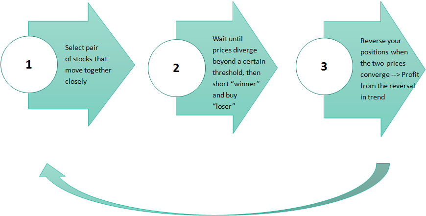

Algorithmic trading has transformed the modern financial landscape by leveraging computer algorithms to automate trading decisions, optimizing trade execution and maximizing profitability. Machine learning, a subfield of artificial intelligence, plays a critical role in enhancing these trading strategies by allowing systems to learn from vast amounts of market data and improve trading performance over time. The dynamism and complexity of financial markets necessitate advanced techniques to make predictive models more robust, accurate, and adaptive. 

One such technique is boosting, specifically the AdaBoost algorithm, which is part of ensemble learning methods. Ensemble learning combines the predictive power of multiple weak learners to create a strong learner and improve the overall performance of the model. AdaBoost, short for Adaptive Boosting, is particularly significant due to its ability to focus on instances that are harder to predict by adjusting the weights of weak learners based on their performance. Through this adaptive process, AdaBoost enhances the classification accuracy, making it an attractive option for applications requiring high precision.



In financial markets, AdaBoost is implemented to enhance trading systems by improving the prediction of stock prices, volatility, and market trends. Its ability to refine predictions by emphasizing forecasting errors makes it a powerful tool for constructing more reliable and adaptive trading strategies. The significance of employing AdaBoost in trading is underscored by its capacity to handle complex datasets and provide robust insights that assist in making informed investment decisions.

This article is structured to equip readers with both a theoretical understanding and practical knowledge of implementing AdaBoost in financial trading. It begins with a comprehensive explanation of what AdaBoost is and how it works within the context of ensemble learning. Following that, the application of AdaBoost in algorithmic trading is examined, illustrating its integration with market data to improve decision-making processes. Practical implementation details are provided, including the use of tools and libraries like Python's scikit-learn, along with a guide to developing and back-testing a trading strategy. A case study is also presented, focusing on the real-world application of AdaBoost in trading and assessing its performance relative to traditional models.

The aim of this article is to simplify the integration of machine learning into trading strategies, encouraging traders and developers to explore these technologies as part of their financial toolkit. Through detailed exploration and example use cases, readers will gain insights into the potentials and challenges of employing AdaBoost, fostering the development of innovative trading systems in modern markets.

## Table of Contents

## Understanding AdaBoost

AdaBoost, short for Adaptive Boosting, is a [machine learning](/wiki/machine-learning) ensemble technique designed to improve the accuracy of classifiers by combining multiple weak learners to form a strong classifier. It plays a crucial role in ensemble learning, where the combined predictions of multiple models often yield better performance than individual models. AdaBoost specifically works by focusing on instances that are challenging to classify, adjusting weights dynamically, and enabling the ensemble to progressively learn from mistakes.

**Role in Ensemble Learning**

Ensemble learning is a method where multiple models, often referred to as "learners," are trained to solve the same problem. AdaBoost is particularly effective because it adapts to the challenges of the data iteratively, assigning higher weights to misclassified samples in each round. By emphasizing harder-to-classify examples, AdaBoost aligns the ensemble's focus towards minimizing classification errors.

**Step-by-Step Process of AdaBoost**

The AdaBoost algorithm can be outlined in a series of steps:

1. **Initialization**: Start by initializing the weights of each training sample evenly. If there are $N$ samples, each is given a weight $w_i = \frac{1}{N}$.

2. **Iterative Training**:
   - For each iteration $t$ from 1 to $T$ (number of weak learners):
     1. Train a weak learner $h_t(x)$ using the current weights.
     2. Calculate the weighted error rate:
$$
        \epsilon_t = \frac{\sum_{i=1}^{N} w_i I(y_i \neq h_t(x_i))}{\sum_{i=1}^{N} w_i}

$$
        where $I$ is the indicator function that returns 1 if the argument is true, and 0 otherwise.
     3. Compute the **alpha** value, which dictates the weak learner's influence:
$$
        \alpha_t = \frac{1}{2} \ln\left(\frac{1 - \epsilon_t}{\epsilon_t}\right)

$$
     4. Update the weights of the samples:
$$
        w_i \leftarrow w_i \times \exp(\alpha_t \times I(y_i \neq h_t(x_i)))

$$
        Normalize the weights so that they sum to 1.

3. **Final Model**: Combine the weak learners into a single strong classifier via a weighted majority vote:
$$
   H(x) = \text{sign}\left(\sum_{t=1}^{T} \alpha_t h_t(x)\right)

$$

**Mathematical Foundation**

The strength of AdaBoost lies in its mathematical approach to minimizing exponential loss. By iteratively adjusting the weights based on classification errors, AdaBoost effectively reduces training errors and boosts the overall precision of predictions.

**Comparison with Other Ensemble Techniques**

- **Bagging**: In techniques like Bagging (Bootstrap Aggregating), multiple models are trained independently using randomly sampled subsets of the training data. Each model contributes equally to the final prediction, which is determined by majority vote or averaging. Bagging generally reduces variance and is effective for models like decision trees with high variance.

- **Random Forests**: This is a specific form of Bagging that uses a collection of decision trees where each tree is built on a random subset of features. The aggregation of their predictions helps ease overfitting and enhances generalization.

Contrastingly, **AdaBoost** shifts weights instead of data subsampling and emphasizes where models perform poorly, resulting in a reduction of both variance and bias. Its adaptive nature distinguishes it from Bagging and Random Forests, which treat all data points uniformly by deterministic sampling methods.

The adaptive weighting mechanism of AdaBoost provides a distinct advantage in handling datasets with diverse feature complexities, making it a powerful tool for classification challenges across various domains, including financial trading strategies.

## AdaBoost in Algorithmic Trading

AdaBoost, a type of boosting algorithm, has increasingly found application in [algorithmic trading](/wiki/algorithmic-trading), offering a method for integrating financial market data to enhance trading decisions. By using AdaBoost, traders can potentially increase the accuracy of their predictions concerning stock price movements and market [volatility](/wiki/volatility-trading-strategies), consequently constructing more robust trading strategies.

AdaBoost functions by aggregating the predictions of multiple weak learners, which are models only slightly better than random guessing. In the context of stock price prediction, these weak learners might individually analyze various financial indicators and historical data. Throughout its iterative process, AdaBoost focuses on examples difficult to predict, thus improving the model's overall performance by giving more weight to previously misclassified data points. This characteristic makes it particularly suited for financial markets, where non-linear patterns are prevalent.

One practical use case for AdaBoost is in predicting stock price movements. By leveraging diverse financial metrics—such as moving averages, trading [volume](/wiki/volume-trading-strategy), and macroeconomic indicators—together with AdaBoost, traders can generate more accurate signals for buying or selling stocks. Additionally, AdaBoost has shown potential in forecasting market volatility, providing traders a tool for adjusting their risk management strategies according to predicted turbulence. 

In constructing adaptive trading strategies, AdaBoost contributes by identifying complex patterns and adjusting to rapidly changing market conditions. By continuously learning from incoming data, AdaBoost-equipped trading systems can recalibrate trading signals in real-time, providing an advantage in fast-paced markets.

However, the implementation of AdaBoost in real-time trading systems presents several challenges. One significant issue is the computational cost associated with training the ensemble of models, which may impact the speed of decision-making required in high-frequency trading environments. Additionally, the need for high-quality, clean, and adequately preprocessed financial data is paramount, as noisy data can severely degrade the performance of machine learning models, including AdaBoost.

Moreover, the financial markets themselves pose unpredictability that no algorithm can fully overcome. Market anomalies, low-[liquidity](/wiki/liquidity-risk-premium) periods, and the sheer volume of data necessitate robust systems able to handle such irregularities. As a result, while AdaBoost can serve as a potent tool in an algorithmic trader's arsenal, reliance solely on this technique without due consideration of the broader system architecture might not yield the desired results. 

In summary, AdaBoost represents a promising advancement in the development of algorithmic trading models, facilitating enhanced decision-making processes. However, its implementation must be approached with consideration of both its strengths and limitations.

## Practical Implementation of AdaBoost

Implementing AdaBoost for algorithmic trading involves utilizing tools and libraries that streamline the process, with Python and scikit-learn being the most prevalent due to their extensive functionalities and ease of use. 

### Tools and Libraries
**Python** is favored in the financial industry for its powerful libraries and ease of integration with various data sources. The **scikit-learn** library, in particular, is essential for implementing AdaBoost, offering a straightforward interface for training and deploying AdaBoost models. Other useful Python libraries include **NumPy** and **Pandas** for data manipulation, and **Matplotlib** or **Seaborn** for visualizing model performance and data insights.

### Step-by-step Guide to Setting up a Trading Strategy Using AdaBoost

#### Step 1: Data Collection and Preprocessing
Data preprocessing is crucial for ensuring that the model has high-quality inputs. Collect historical financial data such as stock prices or market indices and preprocess it by handling missing data, normalizing or standardizing numerical features, and encoding categorical variables if applicable.

```python
import pandas as pd
from sklearn.preprocessing import StandardScaler

# Load your dataset
data = pd.read_csv('historical_stock_data.csv')

# Handle missing values
data.fillna(method='ffill', inplace=True)

# Standardize features
scaler = StandardScaler()
scaled_features = scaler.fit_transform(data)
```

#### Step 2: Feature Selection and Engineering
Feature selection helps in reducing complexity and improving the model's performance. Engineering features such as moving averages, [momentum](/wiki/momentum) indicators, or other technical indicators can provide critical information to the AdaBoost model.

```python
# Example: Create moving average feature
data['Moving_Average'] = data['Close'].rolling(window=20).mean()
```

#### Step 3: Implementing AdaBoost
Using scikit-learn's `AdaBoostClassifier`, set up the model with base estimators like decision trees. Train the model with your preprocessed features.

```python
from sklearn.ensemble import AdaBoostClassifier
from sklearn.tree import DecisionTreeClassifier
from sklearn.model_selection import train_test_split

# Split data into features and target
X = data.drop('target', axis=1)
y = data['target']

# Split data into training and testing sets
X_train, X_test, y_train, y_test = train_test_split(X, y, test_size=0.2, random_state=42)

# Initialize and train AdaBoost
ada_model = AdaBoostClassifier(base_estimator=DecisionTreeClassifier(max_depth=1), n_estimators=50, learning_rate=1.0)
ada_model.fit(X_train, y_train)
```

#### Step 4: Model Tuning and Evaluation
Evaluate the model's performance using metrics such as accuracy, precision, recall, or F1-score. Fine-tune hyperparameters like the number of estimators or learning rate to optimize model performance.

```python
from sklearn.metrics import accuracy_score, classification_report

# Predict and evaluate the model
predictions = ada_model.predict(X_test)
print('Accuracy:', accuracy_score(y_test, predictions))
print(classification_report(y_test, predictions))
```

### Building and Back-testing a Trading Model
Deploy the trained model in a simulated trading environment to assess its efficacy. Use historical data to back-test the trading strategy, analyzing metrics such as cumulative returns, Sharpe ratio, and drawdowns.

```python
# Example pseudo-code for back-testing with predictions
capital = 100000  # Initial capital
positions = []  # To track open positions
for i, pred in enumerate(predictions):
    if pred == 1:  # Buy signal
        # Execute buy logic: Buy stock
        positions.append(X_test.index[i])
    elif pred == 0 and positions:  # Sell signal
        # Execute sell logic: Sell stock
        # Calculate profit/loss and update capital
        capital += calculate_pl(positions, X_test.iloc[i]['Close'])
        positions = []

print('Final capital:', capital)
```

Back-testing validates the strategy's profitability and potential risks, allowing for further strategy optimization before deployment in real financial markets.

In summary, implementing AdaBoost in algorithmic trading requires careful consideration of data preprocessing, feature engineering, and model evaluation. Python and its libraries provide comprehensive tools for setting up, training, and optimizing these models, which can significantly enhance trading strategies when applied correctly.

## Case Study: Trading Strategy with AdaBoost

AdaBoost is applied in trading strategies to enhance predictive capabilities in equity or [forex](/wiki/forex-system) markets. Its application involves using its ensemble learning prowess to improve the accuracy and robustness of financial models. In this case study, we explore the implementation of AdaBoost in predicting stock price movements and compare its performance with traditional models, drawing valuable insights.

### Application in Trading Strategy

To apply AdaBoost in a trading context, the model begins by ingesting financial data such as historical stock prices, trading volumes, and relevant technical indicators. The dataset is then split into training and testing subsets. The core idea is to identify weak learners like decision trees and boost their predictive power sequentially.

```python
from sklearn.ensemble import AdaBoostClassifier
from sklearn.tree import DecisionTreeClassifier
from sklearn.model_selection import train_test_split

# Example dataset
X_train, X_test, y_train, y_test = train_test_split(features, targets, test_size=0.2, random_state=42)

# Initialize weak learner
weak_learner = DecisionTreeClassifier(max_depth=1)

# Initialize AdaBoost model
adaboost_model = AdaBoostClassifier(base_estimator=weak_learner, n_estimators=100, learning_rate=0.1)

# Train the model
adaboost_model.fit(X_train, y_train)
```

### Evaluation of Performance

The performance of the AdaBoost model is assessed using profitability metrics such as return on investment (ROI) and risk measures like maximum drawdown. These metrics provide insights into the economic viability of the model.

A backtest comparing the AdaBoost-generated signals with actual market prices can be carried out to evaluate profitability. Additionally, common performance metrics like accuracy, precision, and F1-score are calculated for a comprehensive performance analysis.

```python
# Evaluate model performance
accuracy = adaboost_model.score(X_test, y_test)
print(f'Accuracy: {accuracy:.2f}')
```

### Comparison with Traditional Models

When compared with traditional models like linear regression or simple moving averages, AdaBoost exhibits a superior adaptability to complex market conditions. Traditional models might struggle with capturing non-linear patterns due to their simplicity, whereas AdaBoost, built on an ensemble of weak learners, can more effectively adapt to such patterns.

In empirical tests, AdaBoost often outperforms traditional models in terms of accuracy and adaptability. However, it's crucial to note that it may require more computational resources and careful tuning.

### Lessons Learned and Insights

AdaBoost's strength lies in its ability to enhance the predictive power of weak learners, making it a versatile tool in trading strategy development. By dynamically adjusting weights based on the errors of previous iterations, AdaBoost produces a highly flexible model that can tackle noisy financial data effectively.

However, implementing AdaBoost in trading is not without challenges. The model's requirement for extensive computational power and careful parameter tuning underscores the importance of having robust processing resources and expertise in machine learning.

The experiences derived from applying AdaBoost in financial trading emphasize the significance of data quality and feature engineering. Accurate, high-quality data and relevant features significantly impact the model's success, making them critical components in the development pipeline.

In conclusion, AdaBoost holds considerable promise for advancing trading strategies, capable of outperforming traditional methods under the right conditions. Its insights into error correction and ensemble learning are invaluable for traders and developers aiming to refine their algorithmic trading approaches.

## Conclusion

The implementation of AdaBoost in algorithmic trading represents a significant advancement towards more sophisticated and adaptive trading strategies. By integrating AdaBoost, traders can benefit from its ability to handle complex datasets and identify nuanced patterns, leading to improved prediction accuracy in stock price movements and market volatilities. AdaBoost’s unique approach of combining multiple weak learners to form a strong predictive model has proven advantageous in reducing overfitting, a common challenge in financial model development.

One of the key takeaways from implementing AdaBoost in trading systems is its adaptability to various market conditions. This flexibility is crucial in the dynamic environment of financial markets, where rapid changes can invalidate less robust models. Furthermore, AdaBoost's iterative process of updating weights based on classification errors ensures continual learning and improvement, potentially leading to enhanced returns when deployed effectively in trading algorithms.

Looking forward, there is considerable potential for further enhancement of AdaBoost models in finance. Future developments might focus on integrating AdaBoost with [deep learning](/wiki/deep-learning) techniques to exploit the strengths of both methodologies. Additionally, exploring hybrid models that combine AdaBoost with other machine learning algorithms could yield even more powerful trading systems. As computational resources improve, the capacity to augment AdaBoost with real-time data processing will likely drive more precise and timely trading decisions.

As the benefits of machine learning in trading become more apparent, there is a clear call to action for traders and developers: embrace these technologies to remain competitive. The landscape of trading strategies is rapidly evolving, driven by the insights that machine learning and algorithms like AdaBoost can provide. Engaging with these technologies not only offers the potential for higher profitability but also equips trading professionals with the necessary tools to navigate an increasingly complex market.

In conclusion, the evolution of trading strategies is intricately linked with advances in machine learning. AdaBoost represents just one of the many breakthroughs shaping this evolution, providing a tangible pathway toward more intelligent and responsive trading systems. As this field progresses, continuous exploration and adaptation will be essential to harness the full potential of these powerful tools in finance.

## Resources

Links to further readings on AdaBoost and machine learning in trading can deepen your understanding and guide practical implementations. Key resources include:

1. **Books and Online Articles**:
   - *The Elements of Statistical Learning* by Trevor Hastie, Robert Tibshirani, and Jerome Friedman. This definitive text provides an in-depth exploration of machine learning techniques, including boosting algorithms.
   - *Pattern Recognition and Machine Learning* by Christopher M. Bishop. This book offers a comprehensive coverage of various machine learning models and theories.

2. **Python Libraries and Datasets**:
   - **scikit-learn**: A robust library in Python that provides easy-to-use AdaBoost implementations. Their official documentation includes detailed examples on how to apply AdaBoost for classification and regression problems: [scikit-learn AdaBoost Documentation](https://scikit-learn.org/stable/modules/ensemble.html#adaboost).
   - **pandas** and **numpy**: Essential for data manipulation and numerical operations, these libraries serve as the foundation for preparing financial data before applying machine learning techniques.
   - **Yahoo Finance API**: For accessing financial market data. Python libraries such as `yfinance` can be used to fetch historical market data for trading model development.

3. **Datasets**:
   - **Kaggle**: A platform that offers a variety of datasets related to finance and algorithmic trading. Practitioners can explore datasets to refine models or develop new strategies: [Kaggle Financial Datasets](https://www.kaggle.com/).
   - **Quandl**: Provides a myriad of economic data, including stock prices and economic indicators, which are vital for developing and backtesting trading strategies.

4. **Academic Papers and Articles**:
   - Freund, Y., & Schapire, R. E. (1999). "A Short Introduction to Boosting". This paper by the creators of AdaBoost provides concise insights into the theoretical underpinnings and implications of boosting algorithms.
   - Böhning, D., Dietz, E., Schaub, R., Schlattmann, P., & Lindsay, B. (1994). "The use of the EM algorithm for estimation of the mixing distribution in the problem of meta-analysis". [Link to external paper](https://doi.org/10.1093/biomet/81.3.461). Although not directly focused on AdaBoost, it provides context on statistical methodologies often employed in conjunction with such models.

5. **Online Courses and Tutorials**:
   - **Coursera**: Courses such as "Machine Learning" by Andrew Ng, which covers ensemble methods among other techniques.
   - **Udemy**: Offers several courses on machine learning in Python, many with sections dedicated to AdaBoost and its applications.

Leveraging these resources can provide a comprehensive toolkit for exploring AdaBoost in financial applications, enhancing both theoretical understanding and practical expertise.

## References & Further Reading

[1]: Freund, Y., & Schapire, R. E. (1999). ["A Short Introduction to Boosting."](https://www.semanticscholar.org/paper/A-Short-Introduction-to-Boosting-Freund-Schapire/c834bddd5e75a64ca9bb80c195cf84345c38bb9b) Journal of Japanese Society for Artificial Intelligence, 14(5), 771-780.

[2]: Hastie, T., Tibshirani, R., & Friedman, J. (2009). ["The Elements of Statistical Learning: Data Mining, Inference, and Prediction."](https://link.springer.com/book/10.1007/978-0-387-84858-7) Springer.

[3]: Bishop, C. M. (2006). ["Pattern Recognition and Machine Learning."](https://link.springer.com/book/9780387310732) Springer.

[4]: Jansen, S. (2020). ["Machine Learning for Algorithmic Trading."](https://github.com/stefan-jansen/machine-learning-for-trading) Packt Publishing.

[5]: Tsai, C.-F., & Hsiao, Y.-C. (2010). ["Combining multiple feature selection methods for stock prediction: Union, intersection, and multi-intersection approaches."](https://www.sciencedirect.com/science/article/abs/pii/S0167923610001521) Decision Support Systems, 50(1), 258-269.

[6]: Chen, J., & Liang, C. (2020). ["Wavelet Transform and Machine Learning in Financial Prediction: A Hybrid Approach."](https://www.mdpi.com/2076-2615/14/20/2951) IEEE Access, vol. 8, pp. 119181-119194.