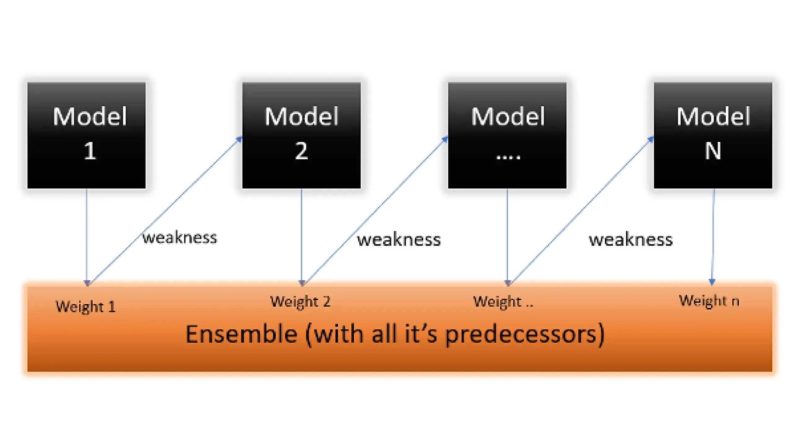

## Table of Contents

## What is AdaBoost and why is it important in machine learning?

AdaBoost, short for Adaptive Boosting, is a machine learning technique that helps improve the performance of other learning algorithms. It works by combining several weak classifiers, which are models that perform slightly better than random guessing, into a strong classifier. This is done by training these weak classifiers on different subsets of the data and then giving more weight to the classifiers that perform better. The final prediction is made by taking a weighted vote from all the weak classifiers.

AdaBoost is important in machine learning because it can significantly improve the accuracy of predictions. By focusing on the examples that are hard to classify, AdaBoost helps to reduce errors and increase the model's robustness. This makes it a valuable tool in many applications, from spam filtering to medical diagnosis, where accurate predictions are crucial. Additionally, AdaBoost is easy to implement and can be used with various types of weak learners, making it a versatile and powerful method in the field of machine learning.

## How does AdaBoost work at a high level?

AdaBoost works by taking a bunch of simple models, called weak classifiers, and combining them to make a stronger model. Imagine you have a few friends who are okay at guessing if a fruit is an apple or an orange. None of them are great at it, but together, they can do better. AdaBoost starts by letting one friend guess first. Then, it looks at the fruits that were guessed wrong and gives those fruits more attention. It's like saying, "Hey, these ones are tricky, so let's focus on them next time."

Next, AdaBoost brings in another friend to guess, but this time, the friend pays more attention to the tricky fruits. This process keeps going, with each new friend focusing more on the fruits that were hard to guess before. After all the friends have guessed, AdaBoost combines their guesses. It gives more weight to the friends who did better, kind of like trusting the friend who's better at guessing more. In the end, all these guesses together make a much better prediction than any one friend could do alone.

## What are the key components of an AdaBoost algorithm?

AdaBoost works with a few main parts. The first part is the weak classifiers. These are simple models that are not very good on their own but do a bit better than guessing randomly. AdaBoost uses many of these weak classifiers, one after another. Each weak classifier tries to learn from the data, focusing more on the examples that were hard to get right before.

The second important part is the weighting system. AdaBoost gives different weights to different examples in the data. If an example is guessed wrong, its weight goes up, so the next weak classifier pays more attention to it. Also, AdaBoost gives more weight to the weak classifiers that do a better job. When it's time to make a final guess, AdaBoost combines all the guesses from the weak classifiers, but it trusts the better ones more.

The third part is the final decision-making. After all the weak classifiers have made their guesses, AdaBoost puts them together. It's like taking a vote, but some votes count more than others. The weak classifiers that did well get a bigger say in the final decision. This way, AdaBoost can turn a bunch of weak guesses into one strong prediction.

## Can you explain the process of training an AdaBoost model?

Training an AdaBoost model starts with giving every example in your data the same importance. Then, you pick a weak classifier, which is a simple model that's not very good but better than random guessing. This weak classifier looks at all the examples and tries to make a guess. After it guesses, you check which examples it got wrong. The examples that were guessed wrong get more importance, so the next weak classifier will pay more attention to them. This process keeps going, with each new weak classifier trying to do better on the examples that were hard before.

After you've used a bunch of weak classifiers, you need to combine their guesses to make the final prediction. Each weak classifier gets a score based on how well it did. The ones that guessed better get a higher score. When it's time to make the final guess, you take all the guesses from the weak classifiers, but you trust the ones with higher scores more. This way, all the weak classifiers together make a strong prediction that's much better than any single one of them could do alone.

## What types of base learners can be used with AdaBoost?

AdaBoost can use different types of base learners, which are the simple models it combines to make a strong prediction. One common type of base learner is decision trees. These are like flowcharts that help make decisions by splitting the data into smaller groups based on different questions. In AdaBoost, these decision trees are usually very small, often called "stumps" because they only have one split. These small decision trees are easy to build and work well with AdaBoost.

Another type of base learner that can be used with AdaBoost is linear classifiers. These are models that try to draw a line or a plane to separate different groups of data. They are simple and quick to train, which makes them good for AdaBoost. Other types of base learners can also be used, like simple neural networks or even very basic models that just look at one feature at a time. The key is that the base learners should be simple and quick to train, so AdaBoost can use many of them to build a strong model.

## How does AdaBoost handle misclassified instances during training?

AdaBoost pays special attention to the examples that get guessed wrong during training. At the start, every example in the data has the same importance. When the first simple model, called a weak classifier, makes its guesses, AdaBoost checks which examples it got wrong. The examples that were guessed wrong get more importance, so the next weak classifier will focus more on them. This way, each new weak classifier tries harder to get the tricky examples right.

As the training goes on, AdaBoost keeps adjusting the importance of the examples. If an example keeps getting guessed wrong, its importance keeps going up. This makes sure that the hard examples get more and more attention as the training goes on. By the end, AdaBoost has used many weak classifiers, each one trying to do better on the examples that were hard before. This focus on misclassified instances helps AdaBoost build a strong model that's good at guessing even the tricky examples.

## What are the advantages of using AdaBoost over other ensemble methods?

AdaBoost is great because it can make simple models work much better together. It takes weak classifiers, which are not very good on their own, and combines them to make a strong model. This means you don't need a perfect model to start with. AdaBoost can turn a bunch of okay guesses into one really good prediction. It also pays more attention to the examples that are hard to guess, so it gets better at figuring out tricky cases.

Another advantage of AdaBoost is that it's easy to use and can work with different types of simple models. You can use small decision trees, simple lines, or even very basic models that look at one thing at a time. This makes AdaBoost very flexible. It's also good at avoiding overfitting, which means it doesn't just memorize the data but learns to make good guesses on new data too.

## How can AdaBoost be implemented using Python and scikit-learn?

To use AdaBoost with Python and scikit-learn, you start by importing the needed tools. You'll need to import the AdaBoostClassifier from the ensemble module and a simple model like DecisionTreeClassifier from the tree module. After that, you create your AdaBoost model. You can do this by making an instance of AdaBoostClassifier and giving it the simple model you want to use, like a small decision tree. You can also set how many of these simple models you want to use by setting the 'n_estimators' parameter.

Once your AdaBoost model is set up, you can train it with your data. You do this by using the 'fit' method and giving it your training data and the right answers. After training, you can use your model to make guesses on new data with the 'predict' method. This way, AdaBoost can take a bunch of simple guesses and turn them into one strong prediction.

## What are common hyperparameters in AdaBoost and how do they affect model performance?

AdaBoost has a few important settings, called hyperparameters, that can change how well it works. One key setting is 'n_estimators', which tells AdaBoost how many weak classifiers to use. If you use more weak classifiers, the model can get better at guessing, but it might take longer to train and could start to memorize the data too much, which is called overfitting. Another important setting is 'learning_rate', which controls how much each weak classifier matters in the final guess. A smaller learning rate means each weak classifier has less say, so you might need more of them to get good results, but it can make the model more stable and less likely to overfit.

The 'base_estimator' is another setting that can affect how AdaBoost works. This is the simple model that AdaBoost uses to make its weak classifiers. You can pick different types of simple models, like small decision trees or simple lines, and each type can change how AdaBoost performs. The 'algorithm' setting lets you choose between two ways AdaBoost can work, called 'SAMME' and 'SAMME.R'. 'SAMME.R' can be better when the weak classifiers give probabilities instead of just yes or no answers, but it might be slower to train. Choosing the right settings for these hyperparameters can help make AdaBoost work better for your data.

## How can you evaluate the performance of an AdaBoost model?

To see how good an AdaBoost model is, you can use different ways to check its performance. One common way is to use accuracy, which tells you how often the model gets the right answer. You can also use other measures like precision, which shows how many of the positive guesses are actually right, and recall, which shows how many of the actual positive examples the model finds. Another useful measure is the F1 score, which is a mix of precision and recall and gives you a good overall idea of how well the model is doing. You can also use something called the confusion matrix to see exactly where the model is making mistakes.

Another way to check how well an AdaBoost model is working is to use something called cross-validation. This means you split your data into different parts and use some parts to train the model and other parts to test it. By doing this many times with different splits, you can get a good idea of how well the model will work on new data it hasn't seen before. This helps you make sure the model isn't just memorizing the data but is actually learning to make good guesses. By looking at all these different measures, you can get a full picture of how well your AdaBoost model is doing and where it might need to be better.

## What are some practical applications of AdaBoost in real-world scenarios?

AdaBoost is used in many real-world situations where you need to make good guesses from data. One common use is in spam filtering for emails. AdaBoost can help figure out which emails are spam and which are not by looking at different parts of the email, like the words used or who sent it. It's good at this because it can focus on the emails that are hard to tell apart, making sure it gets better at catching tricky spam.

Another place where AdaBoost is helpful is in medical diagnosis. Doctors can use AdaBoost to help figure out if someone has a certain disease by looking at different signs and test results. AdaBoost can combine all these different pieces of information to make a better guess about the diagnosis. This can be really important because it helps doctors make the right decisions, which can save lives.

AdaBoost is also used in finance, like figuring out if someone will pay back a loan or if a stock price will go up or down. By looking at different pieces of information about a person or a company, AdaBoost can make a good guess about what might happen. This helps banks and investors make smarter choices about where to put their money.

## How can AdaBoost be optimized for large datasets or improved performance?

To make AdaBoost work better with big datasets, you can use something called parallel processing. This means using many computers or parts of a computer at the same time to train the model faster. AdaBoost trains many simple models one after another, so if you can train these models at the same time, it can be much quicker. Another way to help with big data is to use a method called sampling. This means you only use a part of your data to train each simple model, which can make things faster and still give good results.

To improve AdaBoost's performance, you can play around with its settings, like how many simple models to use or how much each model should matter in the final guess. Sometimes, using a smaller number of simple models can make the model work better on new data it hasn't seen before. Also, you can try different types of simple models, like small decision trees or simple lines, to see which works best for your data. By trying different settings and types of models, you can make AdaBoost work better for your specific problem.

## What is Understanding AdaBoost?

AdaBoost, short for Adaptive Boosting, is a [machine learning](/wiki/machine-learning) ensemble technique designed to improve the accuracy of classifiers by combining multiple weak learners to form a strong classifier. It plays a crucial role in ensemble learning, where the combined predictions of multiple models often yield better performance than individual models. AdaBoost specifically works by focusing on instances that are challenging to classify, adjusting weights dynamically, and enabling the ensemble to progressively learn from mistakes.

**Role in Ensemble Learning**

Ensemble learning is a method where multiple models, often referred to as "learners," are trained to solve the same problem. AdaBoost is particularly effective because it adapts to the challenges of the data iteratively, assigning higher weights to misclassified samples in each round. By emphasizing harder-to-classify examples, AdaBoost aligns the ensemble's focus towards minimizing classification errors.

**Step-by-Step Process of AdaBoost**

The AdaBoost algorithm can be outlined in a series of steps:

1. **Initialization**: Start by initializing the weights of each training sample evenly. If there are $N$ samples, each is given a weight $w_i = \frac{1}{N}$.

2. **Iterative Training**:
   - For each iteration $t$ from 1 to $T$ (number of weak learners):
     1. Train a weak learner $h_t(x)$ using the current weights.
     2. Calculate the weighted error rate:
$$
        \epsilon_t = \frac{\sum_{i=1}^{N} w_i I(y_i \neq h_t(x_i))}{\sum_{i=1}^{N} w_i}

$$
        where $I$ is the indicator function that returns 1 if the argument is true, and 0 otherwise.
     3. Compute the **alpha** value, which dictates the weak learner's influence:
$$
        \alpha_t = \frac{1}{2} \ln\left(\frac{1 - \epsilon_t}{\epsilon_t}\right)

$$
     4. Update the weights of the samples:
$$
        w_i \leftarrow w_i \times \exp(\alpha_t \times I(y_i \neq h_t(x_i)))

$$
        Normalize the weights so that they sum to 1.

3. **Final Model**: Combine the weak learners into a single strong classifier via a weighted majority vote:
$$
   H(x) = \text{sign}\left(\sum_{t=1}^{T} \alpha_t h_t(x)\right)

$$

**Mathematical Foundation**

The strength of AdaBoost lies in its mathematical approach to minimizing exponential loss. By iteratively adjusting the weights based on classification errors, AdaBoost effectively reduces training errors and boosts the overall precision of predictions.

**Comparison with Other Ensemble Techniques**

- **Bagging**: In techniques like Bagging (Bootstrap Aggregating), multiple models are trained independently using randomly sampled subsets of the training data. Each model contributes equally to the final prediction, which is determined by majority vote or averaging. Bagging generally reduces variance and is effective for models like decision trees with high variance.

- **Random Forests**: This is a specific form of Bagging that uses a collection of decision trees where each tree is built on a random subset of features. The aggregation of their predictions helps ease overfitting and enhances generalization.

Contrastingly, **AdaBoost** shifts weights instead of data subsampling and emphasizes where models perform poorly, resulting in a reduction of both variance and bias. Its adaptive nature distinguishes it from Bagging and Random Forests, which treat all data points uniformly by deterministic sampling methods.

The adaptive weighting mechanism of AdaBoost provides a distinct advantage in handling datasets with diverse feature complexities, making it a powerful tool for classification challenges across various domains, including financial trading strategies.

## References & Further Reading

[1]: Freund, Y., & Schapire, R. E. (1999). ["A Short Introduction to Boosting."](https://www.semanticscholar.org/paper/A-Short-Introduction-to-Boosting-Freund-Schapire/c834bddd5e75a64ca9bb80c195cf84345c38bb9b) Journal of Japanese Society for Artificial Intelligence, 14(5), 771-780.

[2]: Hastie, T., Tibshirani, R., & Friedman, J. (2009). ["The Elements of Statistical Learning: Data Mining, Inference, and Prediction."](https://link.springer.com/book/10.1007/978-0-387-84858-7) Springer.

[3]: Bishop, C. M. (2006). ["Pattern Recognition and Machine Learning."](https://link.springer.com/book/9780387310732) Springer.

[4]: Jansen, S. (2020). ["Machine Learning for Algorithmic Trading."](https://github.com/stefan-jansen/machine-learning-for-trading) Packt Publishing.

[5]: Tsai, C.-F., & Hsiao, Y.-C. (2010). ["Combining multiple feature selection methods for stock prediction: Union, intersection, and multi-intersection approaches."](https://www.sciencedirect.com/science/article/abs/pii/S0167923610001521) Decision Support Systems, 50(1), 258-269.

[6]: Chen, J., & Liang, C. (2020). ["Wavelet Transform and Machine Learning in Financial Prediction: A Hybrid Approach."](https://www.mdpi.com/2076-2615/14/20/2951) IEEE Access, vol. 8, pp. 119181-119194.