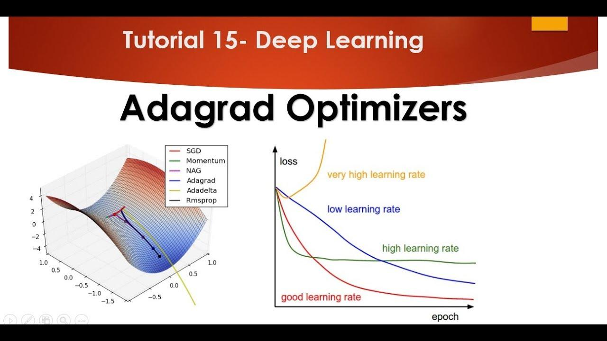

## Table of Contents

## What is Adagrad and why is it used in machine learning?

Adagrad, short for Adaptive Gradient Algorithm, is an optimization technique used in machine learning to train models more effectively. It adapts the learning rate for each parameter in the model, which means it can handle different types of data and features better than simpler methods. Adagrad does this by keeping track of how much each parameter has changed over time and adjusting the learning rate accordingly. This makes it especially useful when dealing with sparse data, where some features might be more important than others.

The main advantage of Adagrad is that it automatically adjusts the learning rate, so you don't have to manually tweak it. This can save a lot of time and effort because finding the right learning rate can be tricky. Adagrad is particularly helpful in natural language processing tasks, where words or phrases might appear very rarely but still carry important meaning. By giving more attention to these rare features, Adagrad can help the model learn more effectively and achieve better results.

## How does Adagrad differ from other optimization algorithms like SGD?

Adagrad and Stochastic Gradient Descent (SGD) are both optimization algorithms used in machine learning, but they work differently. SGD updates the parameters of a model using a fixed learning rate for all parameters. This means that every time SGD adjusts the model, it does so by the same amount for each parameter. This can be a problem if some parameters need to change more than others, especially in cases where the data is sparse or some features are more important.

On the other hand, Adagrad adapts the learning rate for each parameter individually. It does this by keeping a record of how much each parameter has changed in the past and using that information to adjust the learning rate. This means that parameters that have changed a lot in the past will have a smaller learning rate, while parameters that haven't changed much will have a larger learning rate. This adaptive approach makes Adagrad particularly useful for handling sparse data, where some features might be more important than others.

In simple terms, SGD uses the same step size for all parameters, while Adagrad changes the step size for each parameter based on its history. This makes Adagrad more flexible and better at dealing with different types of data. For example, in natural language processing, where some words might appear very rarely but still [carry](/wiki/carry-trading) important meaning, Adagrad can help the model learn more effectively by giving more attention to these rare features.

## What are the key features of Adagrad that make it suitable for sparse data?

Adagrad works well with sparse data because it changes the learning rate for each parameter based on how much it has changed in the past. If a parameter has not changed much, Adagrad will give it a bigger learning rate so it can learn faster. This is helpful for sparse data where some features might be rare but still important. For example, in text data, some words might appear very rarely but carry a lot of meaning. Adagrad helps the model pay more attention to these rare words by adjusting their learning rates.

The way Adagrad adjusts the learning rate is by keeping track of the sum of the squares of the gradients for each parameter. This sum grows over time, and Adagrad uses it to scale down the learning rate for parameters that have changed a lot. This means that parameters that are updated more frequently will have smaller updates in the future, while parameters that are updated less often will have larger updates. This adaptive approach helps the model learn from sparse data more effectively, making Adagrad a good choice for tasks like natural language processing where sparse features are common.

## Can you explain the mathematical formula behind Adagrad?

Adagrad works by changing the learning rate for each parameter in a model based on how much it has changed in the past. It does this by keeping track of the sum of the squares of the gradients for each parameter. The learning rate for each parameter is then adjusted using this sum. If a parameter has been updated a lot, its learning rate will be smaller, and if it hasn't been updated much, its learning rate will be bigger. This helps the model learn better from sparse data where some features might be rare but important.

The formula for updating a parameter using Adagrad can be written as $$g_{t,i}$$ is the gradient of the loss with respect to parameter $$i$$ at time step $$t$$. The sum of the squares of the gradients for parameter $$i$$ up to time step $$t$$ is calculated as $$G_{t,i} = G_{t-1,i} + g_{t,i}^2$$. The update rule for parameter $$i$$ at time step $$t$$ is then given by $$\theta_{t,i} = \theta_{t-1,i} - \frac{\eta}{\sqrt{G_{t,i} + \epsilon}} g_{t,i}$$, where $$\eta$$ is the global learning rate, and $$\epsilon$$ is a small constant to prevent division by zero. This formula shows how Adagrad adjusts the learning rate for each parameter based on its history of updates.

## How does Adagrad adapt the learning rate for each parameter?

Adagrad changes the learning rate for each parameter in a model by looking at how much that parameter has changed in the past. It keeps track of the sum of the squares of the gradients for each parameter. If a parameter has been updated a lot, Adagrad will make its learning rate smaller. But if a parameter hasn't been updated much, Adagrad will give it a bigger learning rate. This helps the model learn better from data where some features might be rare but important.

The way Adagrad does this is by using a formula to update each parameter. The sum of the squares of the gradients for parameter $$i$$ up to time step $$t$$ is calculated as $$G_{t,i} = G_{t-1,i} + g_{t,i}^2$$. The update rule for parameter $$i$$ at time step $$t$$ is then given by $$\theta_{t,i} = \theta_{t-1,i} - \frac{\eta}{\sqrt{G_{t,i} + \epsilon}} g_{t,i}$$, where $$\eta$$ is the global learning rate, and $$\epsilon$$ is a small number to stop any problems with dividing by zero. This formula shows how Adagrad adjusts the learning rate for each parameter based on its history of updates.

## What are the advantages of using Adagrad in training neural networks?

Adagrad is really helpful when training neural networks because it changes the learning rate for each parameter based on how much it has changed in the past. This means that if a parameter has been updated a lot, Adagrad will make its learning rate smaller. But if a parameter hasn't been updated much, Adagrad will give it a bigger learning rate. This is especially useful for sparse data, where some features might be rare but still important. For example, in text data, some words might appear very rarely but carry a lot of meaning. Adagrad helps the model pay more attention to these rare words by adjusting their learning rates.

The way Adagrad does this is by keeping track of the sum of the squares of the gradients for each parameter. The sum of the squares of the gradients for parameter $$i$$ up to time step $$t$$ is calculated as $$G_{t,i} = G_{t-1,i} + g_{t,i}^2$$. The update rule for parameter $$i$$ at time step $$t$$ is then given by $$\theta_{t,i} = \theta_{t-1,i} - \frac{\eta}{\sqrt{G_{t,i} + \epsilon}} g_{t,i}$$, where $$\eta$$ is the global learning rate, and $$\epsilon$$ is a small number to stop any problems with dividing by zero. This formula shows how Adagrad adjusts the learning rate for each parameter based on its history of updates. By doing this, Adagrad can help the model learn more effectively and achieve better results, especially in tasks like natural language processing where sparse features are common.

## What are the potential drawbacks or limitations of Adagrad?

One of the main drawbacks of Adagrad is that it can make the learning rate too small over time. This happens because Adagrad keeps adding up the squares of the gradients for each parameter. As this sum gets bigger, the learning rate gets smaller and smaller. This can make it hard for the model to keep learning because the updates become too tiny. For example, the update rule for parameter $$i$$ at time step $$t$$ is $$\theta_{t,i} = \theta_{t-1,i} - \frac{\eta}{\sqrt{G_{t,i} + \epsilon}} g_{t,i}$$. As $$G_{t,i}$$ grows, the learning rate $$\frac{\eta}{\sqrt{G_{t,i} + \epsilon}}$$ becomes smaller, which can slow down learning.

Another limitation of Adagrad is that it might not work well for all types of data. While it's great for sparse data where some features are rare but important, it can struggle with data that's not sparse. This is because Adagrad's way of adjusting the learning rate is based on how much each parameter has changed in the past. If the data is not sparse, this approach might not be as helpful, and other optimization methods might work better. So, while Adagrad can be a powerful tool in the right situations, it's not always the best choice for every type of data or problem.

## How does Adagrad handle the vanishing learning rate problem?

Adagrad can run into a problem where the learning rate gets smaller and smaller over time. This happens because Adagrad keeps adding up the squares of the gradients for each parameter. As this sum gets bigger, the learning rate gets smaller. The update rule for parameter $$i$$ at time step $$t$$ is $$\theta_{t,i} = \theta_{t-1,i} - \frac{\eta}{\sqrt{G_{t,i} + \epsilon}} g_{t,i}$$. As $$G_{t,i}$$ grows, the learning rate $$\frac{\eta}{\sqrt{G_{t,i} + \epsilon}}$$ becomes smaller, which can make it hard for the model to keep learning because the updates become too tiny.

To deal with this problem, some other optimization methods like Adadelta and RMSprop have been developed. These methods try to fix the vanishing learning rate problem by using different ways to adjust the learning rate. For example, Adadelta uses a moving window of gradient updates instead of summing all past gradients. This helps keep the learning rate from getting too small. While Adagrad itself doesn't have a built-in solution to the vanishing learning rate problem, understanding this issue has led to the development of these other methods that can be used instead.

## Can you provide a practical example of implementing Adagrad in a machine learning model?

Let's say we want to train a simple [neural network](/wiki/neural-network) to predict house prices using Adagrad as our optimization algorithm. We'll use Python with the PyTorch library to implement this. First, we'll define our model, loss function, and then use Adagrad to update the model's parameters. The key part is how Adagrad adjusts the learning rate for each parameter based on its past updates, which can help the model learn more effectively, especially if some features like the number of bedrooms are more important than others.

Here's how we can implement Adagrad in our model:

```python
import torch
import torch.nn as nn
import torch.optim as optim

# Define a simple neural network
class HousePriceModel(nn.Module):
    def __init__(self):
        super(HousePriceModel, self).__init__()
        self.fc1 = nn.Linear(5, 10)  # 5 input features, 10 hidden units
        self.fc2 = nn.Linear(10, 1)  # 10 hidden units, 1 output

    def forward(self, x):
        x = torch.relu(self.fc1(x))
        x = self.fc2(x)
        return x

# Initialize the model, loss function, and optimizer
model = HousePriceModel()
criterion = nn.MSELoss()
optimizer = optim.Adagrad(model.parameters(), lr=0.01)

# Training loop
for epoch in range(100):
    # Forward pass
    outputs = model(inputs)
    loss = criterion(outputs, targets)

    # Backward pass and optimize
    optimizer.zero_grad()
    loss.backward()
    optimizer.step()

    if (epoch + 1) % 10 == 0:
        print(f'Epoch [{epoch+1}/100], Loss: {loss.item():.4f}')
```

In this example, we create a neural network to predict house prices with five input features. We use Mean Squared Error (MSE) as our loss function and Adagrad as our optimizer. The Adagrad optimizer is initialized with a learning rate of 0.01. During training, Adagrad will automatically adjust the learning rate for each parameter based on the formula $$\theta_{t,i} = \theta_{t-1,i} - \frac{\eta}{\sqrt{G_{t,i} + \epsilon}} g_{t,i}$$. This helps the model focus on important features like the number of bedrooms, which might be sparse in the data but crucial for accurate predictions. By using Adagrad, we can potentially achieve better results compared to using a fixed learning rate.

## How does Adagrad compare to other adaptive learning rate methods like RMSprop and Adam?

Adagrad, RMSprop, and Adam are all adaptive learning rate methods used in [machine learning](/wiki/machine-learning) to train models more effectively. Adagrad adjusts the learning rate for each parameter based on how much it has changed in the past. It does this by keeping track of the sum of the squares of the gradients for each parameter. The update rule for parameter $$i$$ at time step $$t$$ is $$\theta_{t,i} = \theta_{t-1,i} - \frac{\eta}{\sqrt{G_{t,i} + \epsilon}} g_{t,i}$$. This can be helpful for sparse data, but Adagrad can make the learning rate too small over time, which can slow down learning. RMSprop tries to fix this problem by using a moving average of the squared gradients instead of summing them all up. This helps keep the learning rate from getting too small and can lead to better results for some types of data.

Adam combines the ideas of both Adagrad and RMSprop. It uses a moving average of the gradients and the squared gradients to adjust the learning rate. This helps Adam learn quickly and handle different types of data well. The update rule for Adam is more complex, but it generally works better than Adagrad and RMSprop for many tasks. Adam is often the first choice for many machine learning practitioners because it's good at adapting to different problems and can handle sparse data well without the learning rate becoming too small. While Adagrad is good for sparse data, Adam's ability to adapt to a wider range of data makes it a more versatile choice.

## What modifications or enhancements have been proposed to improve Adagrad's performance?

Adagrad can run into a problem where the learning rate gets smaller and smaller over time. This happens because Adagrad keeps adding up the squares of the gradients for each parameter. As this sum gets bigger, the learning rate gets smaller. The update rule for parameter $$i$$ at time step $$t$$ is $$\theta_{t,i} = \theta_{t-1,i} - \frac{\eta}{\sqrt{G_{t,i} + \epsilon}} g_{t,i}$$. As $$G_{t,i}$$ grows, the learning rate $$\frac{\eta}{\sqrt{G_{t,i} + \epsilon}}$$ becomes smaller, which can make it hard for the model to keep learning because the updates become too tiny. To fix this problem, some people have suggested using a smaller learning rate at the start or adding a way to reset the sum of the squares of the gradients.

One way to improve Adagrad is to use a technique called Adadelta. Adadelta uses a moving window of gradient updates instead of summing all past gradients. This helps keep the learning rate from getting too small. Another improvement is RMSprop, which also uses a moving average of the squared gradients instead of summing them all up. This can help the model learn better for some types of data. Both of these methods try to fix the problem of the learning rate getting too small over time, which can help the model learn more effectively.

## In what specific scenarios or types of problems does Adagrad perform best?

Adagrad works really well when you're dealing with data where some features show up less often but are still important. For example, in text data, some words might not appear a lot but carry a lot of meaning. Adagrad helps the model pay more attention to these rare words by changing the learning rate for each parameter based on how much it has changed in the past. The way it does this is by keeping track of the sum of the squares of the gradients for each parameter. The update rule for parameter $$i$$ at time step $$t$$ is $$\theta_{t,i} = \theta_{t-1,i} - \frac{\eta}{\sqrt{G_{t,i} + \epsilon}} g_{t,i}$$. This means that if a parameter hasn't changed much, Adagrad will give it a bigger learning rate so it can learn faster.

Adagrad is especially useful in natural language processing tasks where words or phrases might appear very rarely but still carry important meaning. By giving more attention to these rare features, Adagrad can help the model learn more effectively and achieve better results. However, Adagrad can run into a problem where the learning rate gets smaller and smaller over time. This happens because Adagrad keeps adding up the squares of the gradients for each parameter. As this sum gets bigger, the learning rate gets smaller, which can slow down learning. So, while Adagrad is great for sparse data, it might not be the best choice for every type of problem.