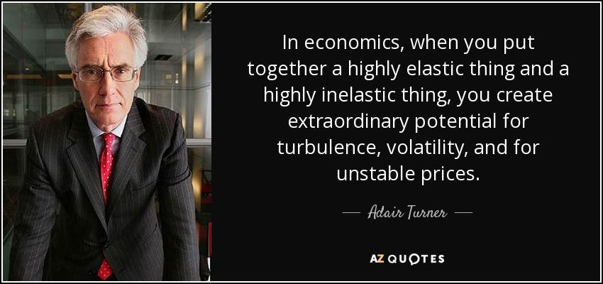

## Table of Contents

## Who is Adair Turner, Baron Turner of Ecchinswell?

Adair Turner, Baron Turner of Ecchinswell, is a British businessman and politician. He was born on October 5, 1955. He has worked in many important jobs. He was the chairman of the Financial Services Authority, which is a big organization that looks after banks and other financial companies in the UK. He also led a group that studied climate change and how to stop it.

Lord Turner has written books and given speeches about money and the economy. He thinks a lot about how to make the world a better place. He believes that we need to change how we use money and resources to help the planet. He is a member of the House of Lords, which is part of the UK's government. There, he talks about important issues and helps make decisions.

## What is Adair Turner's background and education?

Adair Turner grew up in a family that liked learning. He went to a school called Eton College, which is a famous school in England. After that, he studied at Gonville and Caius College in Cambridge University. There, he learned about history and economics. He did very well in his studies and got high marks.

After finishing his studies, Adair Turner started working in different jobs. He worked at companies like McKinsey & Company, which helps other businesses solve problems. He also worked at companies that make things like cars and food. These jobs helped him learn a lot about how businesses work and how the economy works. Later, he used this knowledge in his important jobs in the government and in writing [books](/wiki/algo-trading-books).

## What are some of the key positions Adair Turner has held in his career?

Adair Turner has had many important jobs. He was the chairman of the Financial Services Authority (FSA) from 2008 to 2013. The FSA looks after banks and other money companies in the UK. During his time there, he helped make rules to keep the financial system safe, especially after the big money problems in 2008. He also worked at the Confederation of British Industry (CBI), which is a group that helps businesses in the UK. He was the director-general there from 1995 to 2000.

Another big job he had was leading the Committee on Climate Change from 2008 to 2012. This group looks at how to stop the Earth from getting too hot. They give advice to the government on what to do. Turner also worked at the Institute for New Economic Thinking, where he thought about new ways to understand money and the economy. He wrote books and gave speeches about these ideas.

In addition to these roles, Adair Turner has been a member of the House of Lords since 2005. As a Lord, he talks about important issues and helps make decisions for the UK. He also chaired the Better Banking initiative, which tried to make banks work better for people. All these jobs show how Turner has worked in many different areas to help improve the world.

## What significant contributions did Adair Turner make as Chairman of the Financial Services Authority?

When Adair Turner was the Chairman of the Financial Services Authority (FSA) from 2008 to 2013, he made important changes to help keep the financial system safe. This was a big job because he started right after a big money crisis in 2008. Turner thought that the rules for banks and other money companies needed to be stronger. He helped make new rules that made banks keep more money in case things went wrong. He also worked on making sure that people selling money products told the truth and did not trick people.

One of the big things Turner did was to write a report called the "Turner Review." This report looked at what went wrong in the money crisis and what needed to be fixed. It helped people understand how to make the financial system safer. Turner also talked about how banks should not be too big to fail, and he worked on ideas to stop this from happening. His work at the FSA helped make the UK's money system stronger and more trustworthy.

## How did Adair Turner influence the debate on climate change?

Adair Turner had a big impact on the talk about climate change when he led the Committee on Climate Change from 2008 to 2012. He helped people understand that we need to do more to stop the Earth from getting too hot. Turner's group looked at how much the UK should cut down on things that make the air dirty. They said the UK should aim to make less pollution by a lot. This helped the government make plans to use less dirty energy and more clean energy like wind and solar power.

Turner also talked about how stopping climate change is not just about the environment but also about the economy. He said that we need to change how we use money and resources to help the planet. He wrote books and gave speeches to share these ideas. His work helped more people understand that we need to act quickly to stop climate change and that it can also be good for the economy if we do it right.

## What is Adair Turner's perspective on global economic issues?

Adair Turner thinks a lot about how the world's economy works and how it can be better. He believes that the way we use money and resources now is not good for everyone. He says that too much money goes to a few people and not enough to help everyone. Turner also thinks that the way we make things and use energy is hurting the planet. He wants to change this so that the economy can help more people and be kinder to the Earth.

Turner has written books and given speeches to share his ideas. He talks about how we need to think about new ways to understand money and the economy. He believes that we should use money to help fix big problems like climate change. Turner thinks that if we change how we use money and resources, we can make the world a better place for everyone.

## What role did Adair Turner play in the pension reform discussions in the UK?

Adair Turner was very important in talking about how to change pensions in the UK. He led a group called the Pensions Commission from 2002 to 2006. This group looked at how people save for when they stop working. They found out that many people were not saving enough money for their old age. Turner and his group suggested ways to fix this problem, like making it easier for people to save money for their pensions automatically.

Turner's ideas helped the government make new rules. One big change was something called auto-enrolment. This means that people start saving for their pension without having to do anything. It makes it easier for everyone to save money for when they are old. Thanks to Turner's work, more people in the UK are saving for their future and will have more money when they stop working.

## How has Adair Turner's work impacted financial regulation globally?

Adair Turner's work has had a big impact on how banks and other money companies are watched around the world. When he was the chairman of the Financial Services Authority (FSA) in the UK, he helped make new rules to keep the financial system safe. He wrote the "Turner Review," which looked at what went wrong in the 2008 money crisis and what needed to be fixed. This report helped other countries think about how to make their own money systems safer. Many places used Turner's ideas to make new rules for their banks, making sure they had enough money to handle problems.

Turner's work also changed how people think about financial rules. He talked a lot about how banks should not be too big to fail, and he helped start conversations about how to stop this from happening. His ideas were shared in books and speeches, which reached people all over the world. This helped shape how countries work together to make sure their money systems are strong and trustworthy. Turner's influence made a big difference in how financial rules are made and followed globally.

## What are Adair Turner's views on productivity and technological advancement?

Adair Turner believes that productivity and technology are important for making the economy better. He thinks that new technology can help people do their jobs faster and better. This means that companies can make more things with less work. But Turner also says that we need to be careful. Sometimes, new technology can make some jobs go away. So, he thinks we need to find ways to help people who lose their jobs because of new machines or computers.

Turner also talks about how technology can change the way we live and work. He says that we should use technology to solve big problems like climate change. For example, we can use new technology to make clean energy and help the planet. But he also warns that we need to make sure that everyone benefits from new technology, not just a few people. Turner believes that if we use technology the right way, it can make the world a better place for everyone.

## What books has Adair Turner authored, and what are their main themes?

Adair Turner has written several important books. One of his books is called "Between Debt and the Devil: Money, Credit, and Fixing Global Finance." In this book, Turner talks about how money and credit work and what went wrong during the big money crisis in 2008. He explains why we need to change the way banks and other money companies work to make the world's money system safer and fairer. He also shares his ideas on how to fix these problems.

Another book by Turner is "Economics After the Crisis: Objectives and Means." This book looks at how we can make the economy better after the money crisis. Turner discusses what goals we should have for the economy and how to reach them. He talks about the importance of making sure that everyone benefits from economic growth, not just a few people. He also explains how we can use money and resources in a way that helps the planet, not just the economy.

## How has Adair Turner's involvement in think tanks and advisory roles shaped policy?

Adair Turner has helped shape policy a lot through his work with think tanks and advisory roles. He worked at the Institute for New Economic Thinking, where he thought about new ways to understand money and the economy. His ideas from this work have influenced how people think about big economic problems. For example, his thoughts on how to fix the money system after the 2008 crisis have been used by governments around the world to make new rules for banks. Turner's work has shown that we need to think differently about money and how it can help everyone, not just a few people.

Turner also led the Committee on Climate Change, where he helped make plans to stop the Earth from getting too hot. His work there made the UK government think more about using clean energy and cutting down on things that make the air dirty. Turner's ideas have pushed for changes in how we use energy and resources to help the planet. By working in these groups, Turner has helped make policies that aim to make the world a better place for everyone.

## What are some of the criticisms and controversies surrounding Adair Turner's policies and decisions?

Adair Turner has faced some criticism for his ideas and decisions. Some people did not like his suggestions for fixing the money system after the 2008 crisis. They thought his ideas might make it harder for banks to do business. Some also said that his rules might slow down the economy. Critics argued that his "Turner Review" did not go far enough in changing how banks work. They wanted stronger rules to make sure banks could not cause another big money problem.

Another area where Turner faced criticism was on climate change. Some people thought his ideas for cutting down on dirty energy were too hard on businesses. They said it might make it more expensive for companies to work, which could hurt the economy. Others felt that Turner's plans did not do enough to stop the Earth from getting too hot. They wanted faster and bigger changes to help the planet. Despite these criticisms, Turner's work has led to important discussions and changes in both the money system and efforts to fight climate change.

## References & Further Reading

[1]: Turner, Adair. (2009). ["The Turner Review: A Regulatory Response to the Global Banking Crisis."](https://actuaries.org/CTTEES_TFRISKCRISIS/Documents/turner_review.pdf) Financial Services Authority.

[2]: Mallaby, Sebastian. (2016). ["The Man Who Knew: The Life and Times of Alan Greenspan."](https://www.amazon.com/Man-Who-Knew-Times-Greenspan/dp/1594204845) Penguin Press. Chapter discussing Adair Turner's regulatory proposals.

[3]: Aldridge, Irene. (2013). ["High-Frequency Trading: A Practical Guide to Algorithmic Strategies and Trading Systems,"](https://www.wiley.com/en-us/High+Frequency+Trading%3A+A+Practical+Guide+to+Algorithmic+Strategies+and+Trading+Systems%2C+2nd+Edition-p-9781118343500) 2nd Edition. Wiley. 

[4]: Patterson, Scott. (2012). ["Dark Pools: High-Speed Traders, A.I. Bandits, and the Threat to the Global Financial System."](https://books.google.com/books/about/Dark_Pools.html?id=LIoNSKUEn24C) Crown Business.

[5]: Harris, Larry. (2003). ["Trading and Exchanges: Market Microstructure for Practitioners."](https://academic.oup.com/book/52292) Oxford University Press. Discusses the impact of different trading systems on market efficiency.