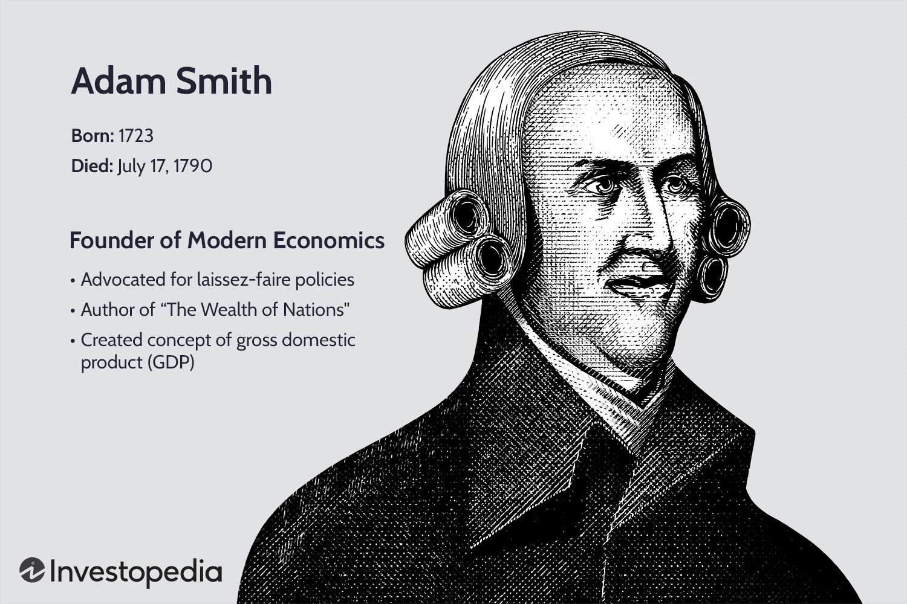

## Table of Contents

## Who was Adam Smith?

Adam Smith was a Scottish economist and philosopher born in 1723. He is best known for writing a book called "The Wealth of Nations," which is considered one of the most important books about economics ever written. In this book, Smith explained how countries can become wealthy by having people trade goods and services freely. He believed that if people were allowed to pursue their own interests, it would lead to overall prosperity for everyone.

Smith also talked about something called the "invisible hand." This idea means that when people try to make their own lives better, they end up helping the whole economy without even realizing it. For example, when a person starts a business to make money, they also create jobs and provide goods that people want. Smith's ideas have had a big impact on how governments and businesses think about the economy, and his work is still studied and discussed today.

## When and where was Adam Smith born?

Adam Smith was born on June 5, 1723. He was born in a small town called Kirkcaldy, which is in Scotland. This was a long time ago, almost 300 years ago.

Kirkcaldy is on the east coast of Scotland, near the sea. When Adam Smith was a baby, his father, who was also named Adam Smith, passed away. His mother, Margaret Douglas, took care of him and helped him grow up.

## What are Adam Smith's most famous works?

Adam Smith's most famous work is called "The Wealth of Nations." He wrote this book in 1776. It's a big book about how countries can become rich. Smith explained that when people trade freely, it helps everyone. He thought that if people could do what they wanted to make money, it would make the whole country better off. This book is very important because it helped start the study of economics.

Another famous work by Adam Smith is "The Theory of Moral Sentiments." He wrote this book earlier, in 1759. In this book, Smith talked about how people feel and act towards each other. He explained that people care about what others think of them and that this helps them be good to each other. This book is about how people's feelings and morals work together, which is different from the economics in "The Wealth of Nations," but it's still very important.

Both of these books are still read and studied today. They help us understand how economies work and how people behave. Adam Smith's ideas have influenced many people and continue to be important in the world of economics and philosophy.

## What is the main theme of 'The Wealth of Nations'?

The main theme of "The Wealth of Nations" is how countries can become rich by letting people trade freely. Adam Smith believed that if people are allowed to do what they want to make money, it will help the whole country. He explained that when people trade goods and services, it makes everyone better off. This idea is called the "invisible hand," which means that people trying to help themselves end up helping the economy without even knowing it.

Smith also talked about how the government should not control the economy too much. He thought that if the government stays out of the way, people will naturally do things that make the country richer. He believed in something called the "division of labor," where people specialize in different jobs. This makes them better at what they do and helps the economy grow. Overall, "The Wealth of Nations" is about how free trade and less government control can lead to a richer and more prosperous country.

## How did Adam Smith contribute to the field of economics?

Adam Smith made a big contribution to economics with his book "The Wealth of Nations." In this book, he explained how countries can become rich by letting people trade freely. He believed that if people are allowed to do what they want to make money, it will help the whole country. This idea is called the "invisible hand," which means that people trying to help themselves end up helping the economy without even knowing it. Smith also talked about how the government should not control the economy too much. He thought that if the government stays out of the way, people will naturally do things that make the country richer.

Another important idea from Adam Smith is the "division of labor." He explained that if people specialize in different jobs, they become better at what they do, and this helps the economy grow. For example, if one person makes shoes and another person makes bread, they can trade with each other and both be better off. Smith's ideas about free trade and the division of labor are still used today to understand how economies work. His work helped start the study of economics and is still very important.

Smith also wrote another book called "The Theory of Moral Sentiments," which is about how people feel and act towards each other. While this book is more about philosophy than economics, it shows how Smith thought about people's behavior. Understanding how people feel and act is important for economics too, because it helps explain why people make the choices they do. Together, Smith's ideas about economics and human behavior have had a big impact on how we think about the economy today.

## What is the concept of the 'invisible hand' according to Adam Smith?

The 'invisible hand' is a famous idea from Adam Smith. He used it to explain how people trying to help themselves can end up helping the whole economy without even knowing it. Imagine you want to start a business to make money. You might not realize it, but by starting your business, you're also creating jobs for other people and providing goods or services that others need. This is what Smith meant by the 'invisible hand' - it's like an unseen force that guides the economy to work better when people are free to do what they want.

Smith believed that if people are allowed to pursue their own interests, it leads to good things for everyone. For example, if you decide to sell apples because you think you can make money, you're also helping people who want to buy apples. This makes the economy grow because everyone is doing what they're good at and trading with each other. The 'invisible hand' shows how individual actions can lead to overall prosperity, even if people aren't trying to help the economy on purpose.

## How did Adam Smith's ideas influence modern economic theory?

Adam Smith's ideas have had a big impact on modern economic theory. His most famous book, "The Wealth of Nations," helped start the study of economics. Smith believed that if people are free to trade and do what they want to make money, it will make the whole country richer. This idea is called the "invisible hand," which means that people trying to help themselves end up helping the economy without knowing it. Modern economists still use this idea to understand how economies work. They believe that free markets, where people can buy and sell without too much government control, can lead to growth and prosperity.

Another important idea from Smith is the "division of labor." He explained that if people specialize in different jobs, they get better at what they do, and this helps the economy grow. For example, if one person makes shoes and another makes bread, they can trade with each other and both be better off. This idea is still used today in factories and businesses, where people focus on specific tasks to make things more efficiently. Smith's ideas about free trade and specialization are key parts of modern economic theory, helping economists understand how to make economies work better.

Smith's other book, "The Theory of Moral Sentiments," also influences modern economics. In this book, he talked about how people feel and act towards each other. Understanding how people behave is important for economics because it helps explain why people make the choices they do. Modern economists use ideas from this book to study things like how people make decisions and how they react to different economic situations. Together, Smith's ideas about economics and human behavior have shaped how we think about and study the economy today.

## What was Adam Smith's view on the role of government in the economy?

Adam Smith believed that the government should not control the economy too much. He thought that if people were free to trade and do what they wanted to make money, it would make the whole country richer. Smith called this the "invisible hand," which means that when people try to help themselves, they end up helping the economy without even knowing it. He believed that the government should stay out of the way and let people do what they do best. This idea is a big part of what we call free markets today.

However, Smith did think the government had some important jobs to do. He believed that the government should protect people and their property, make sure there are good roads and bridges, and help with things like education. These are called public goods, which are things that everyone can use and that businesses might not want to provide on their own. So, while Smith wanted the government to stay out of the economy as much as possible, he also thought it should do some things to help everyone.

## Can you explain Adam Smith's theory of moral sentiments?

Adam Smith's theory of moral sentiments is about how people feel and act towards each other. In his book "The Theory of Moral Sentiments," Smith explained that people care about what others think of them. He believed that we all want to be liked and respected by others, and this helps us be good to each other. Smith said that when we see someone else feeling happy or sad, we can feel the same way. This is called sympathy, and it's a big part of how we understand and connect with other people.

Smith also talked about how our feelings and morals work together. He thought that our sense of right and wrong comes from thinking about how others see us. If we do something good, we feel proud because others will think well of us. If we do something bad, we feel guilty because we know others will not like it. Smith believed that by caring about what others think, we learn to be kind and fair. This idea is important because it shows how our emotions and the way we treat others are connected.

## How did Adam Smith's background influence his economic theories?

Adam Smith grew up in Scotland in a time when the country was changing a lot. He was born in a small town called Kirkcaldy, and his father died when he was a baby. His mother took care of him, and he went to good schools. Smith studied at the University of Glasgow and then at Oxford. He learned a lot about philosophy and history, which helped him think about how people and societies work. When he was young, Scotland was starting to trade more with other countries, and this made him think about how trade could make a country richer.

All these experiences helped shape Smith's ideas about economics. He saw how important it was for people to be free to trade and do what they wanted to make money. This is why he wrote about the "invisible hand" in his book "The Wealth of Nations." He believed that if people could do what they wanted, it would help the whole country. His time at university also made him think about how people feel and act towards each other, which he wrote about in "The Theory of Moral Sentiments." So, his background in Scotland, his education, and the changes he saw around him all helped him come up with his famous ideas about economics and how people behave.

## What criticisms have been leveled against Adam Smith's economic theories?

Some people say that Adam Smith's ideas about free markets and the "invisible hand" don't always work. They think that if the government doesn't control the economy at all, big companies might take over and do whatever they want. This could make it hard for smaller businesses and hurt workers. Critics also say that Smith's ideas don't help everyone equally. They think that free markets can make rich people richer and poor people poorer, which can lead to big differences between people.

Another criticism is that Smith's idea of the "invisible hand" doesn't always make things better for everyone. Some say that when people only think about themselves, they might not care about the environment or other important things. This could cause problems like pollution and harm to nature. Critics also think that Smith didn't talk enough about how the government could help fix these problems. They believe that the government needs to do more to make sure everyone is treated fairly and to protect things that are important for everyone.

## How has Adam Smith's legacy impacted global economic policies?

Adam Smith's ideas have had a big impact on how countries around the world make their economic policies. His book "The Wealth of Nations" helped start the idea of free markets. Many countries now believe that if people can trade freely and do what they want to make money, it will help their whole country get richer. This is why a lot of governments try to have less control over the economy and let businesses and people do more on their own. They think that this way, the "invisible hand" Adam Smith talked about will help everyone.

But not all countries follow Adam Smith's ideas the same way. Some governments still control parts of their economy a lot because they think it's important to help everyone equally and protect things like the environment. Even though they might not agree with everything Smith said, his ideas about free trade and the division of labor are still important. They help shape how countries think about making their economies grow and how they can work together to trade with each other. So, Adam Smith's legacy is still a big part of how we think about the world's economy today.

## What is the relationship between the Invisible Hand and Economic Theory?

The 'invisible hand' is a metaphor introduced by Adam Smith to explain how individual self-interest can lead to positive societal outcomes. This concept posits that when individuals pursue their own economic interests, they often contribute to the economic prosperity of society as a whole, although this outcome was not their original intent. Smith suggested that this self-regulating nature of markets is one of the fundamental mechanisms by which resources are allocated efficiently within an economy. 

A key aspect of the invisible hand is its reliance on the supply and demand dynamics within a free market. When consumers demand more of a certain product, the price of that product tends to rise. This price increase signals producers to supply more of the product, thus meeting consumer demand. Conversely, if a product is not in demand, its price will typically fall, encouraging producers to reduce supply. This self-regulatory mechanism ensures that resources are used efficiently, aligning with Smith's principle that less government intervention can lead to more efficient markets.

The invisible hand concept has significantly influenced both classical and modern economic theories. It laid the groundwork for classical economics, which emphasizes the importance of free markets and limited government intervention. Modern variants, including neoclassical economics, build on Smith's ideas to further elucidate market behaviors using advanced mathematical techniques. These theories often employ equations of supply and demand, optimization problems, and equilibrium concepts to analyze market outcomes.

In mathematical terms, the equilibrium in a simple market model can be determined using the equation where quantity demanded (QD) equals quantity supplied (QS). For instance:

$$
QD = a - bP
$$
$$
QS = c + dP
$$

where $P$ represents the price level, and $a, b, c,$ and $d$ are parameters. The equilibrium price ($P^*$) is found by setting $QD = QS$.

Python code could also be used to simulate this equilibrium:

```python
import sympy as sp

P = sp.symbols('P')
QD = lambda a, b: a - b * P
QS = lambda c, d: c + d * P

equilibrium_price = sp.solve(QD(100, 2) - QS(50, 3), P)
equilibrium_price
```

This short script finds the equilibrium price for given demand and supply relationships, illustrating how such models can capture Smith's ideas on market dynamics.

Overall, while the invisible hand remains a powerful metaphor, it continues to be a foundational element in understanding the functioning and dynamics of both classical and modern economic theories.

## How does Algorithmic Trading relate to Smith's Legacy?

Algorithmic trading represents a transformative approach to financial markets, leveraging advanced algorithms to execute trades at high velocity. This method finds its philosophical underpinnings in Adam Smith's free-market principles, which advocate for minimal intervention and emphasize the utilization of self-regulating mechanisms to maintain market equilibrium. Smith's notion of the "invisible hand" suggests that individuals, acting out of self-interest, inadvertently contribute to economic prosperity and efficiency. 

In modern financial systems, [algorithmic trading](/wiki/algorithmic-trading) operates on the same premise. The complexity of these algorithms allows them to assess vast amounts of market data to make split-second decisions, mirroring the self-regulatory function that Smith envisioned markets to naturally possess. These algorithms aim to capitalize on market inefficiencies through strategies such as statistical [arbitrage](/wiki/arbitrage), pairs trading, and [momentum](/wiki/momentum) trading. For instance, an algorithm might be designed to identify and exploit temporary pricing discrepancies between related financial instruments, achieving profits before the market naturally corrects the anomaly.

Consider the mathematical formulation involved in an algorithm designed to engage in mean-reversion trading, a strategy based on the principle that asset prices will revert to their historical mean. The algorithm could be programmed using a simple statistical model: 

$$
z_t = \frac{x_t - \mu}{\sigma}
$$

where $z_t$ represents the z-score at time $t$, $x_t$ is the current price, $\mu$ is the mean price, and $\sigma$ is the standard deviation. The algorithm triggers a buy signal if $z_t$ falls below a certain threshold, indicating that the price is lower than the mean, and a sell signal if $z_t$ surpasses a different threshold, indicating a higher relative price.

In essence, these algorithms perpetuate the competitive market environment that Smith advocated for, where information is swiftly processed, and decision-making becomes almost instantaneous, driving the market towards an optimal state with minimal human oversight. By automating trades, algorithms aim to exploit the very market efficiencies that Smith theorized, epitomizing a practical application of his free-market ideas in the fast-paced world of modern finance.

## References & Further Reading

[1]: Smith, A. (1776). ["An Inquiry into the Nature and Causes of the Wealth of Nations."](https://www.ibiblio.org/ml/libri/s/SmithA_WealthNations_p.pdf) Available on Project Gutenberg.

[2]: Smith, A. (1759). ["The Theory of Moral Sentiments."](https://www.ibiblio.org/ml/libri/s/SmithA_MoralSentiments_p.pdf) Available on Project Gutenberg.

[3]: Blaug, M. (1997). ["Economic Theory in Retrospect."](https://www.cambridge.org/core/books/economic-theory-in-retrospect/0D3D1C6934A23E9CE4A56A95DD879B18) Cambridge University Press.

[4]: Foley, D. K., & Smith, V. (2003). ["Adam’s Fallacy: A Guide to Economic Theology."](https://www.jstor.org/stable/j.ctvh9w031) Harvard University Press.

[5]: McCraw, T. K. (2003). ["Prophet of Innovation: Joseph Schumpeter and Creative Destruction."](https://www.amazon.com/Prophet-Innovation-Schumpeter-Creative-Destruction/dp/0674034813) Belknap Press.

[6]: Rothschild, E. (2001). ["Economic Sentiments: Adam Smith, Condorcet, and the Enlightenment."](https://hbswk.hbs.edu/archive/economic-sentiments-adam-smith-condorcet-and-the-enlightenment) Harvard University Press.

[7]: Skidelsky, R. (2018). ["Money and Government: The Past and Future of Economics."](https://www.jstor.org/stable/j.ctv6gqq16) Yale University Press.

[8]: Trevithick, J. A. (1992). ["Involuntary Unemployment: Macroeconomics from a Keynesian Perspective."](https://www.semanticscholar.org/paper/Involuntary-Unemployment%3A-Macroeconomics-from-a-Trevithick/db63ad56ec53589a26690236cfbf7d28d21a1fe1) Palgrave Macmillan.