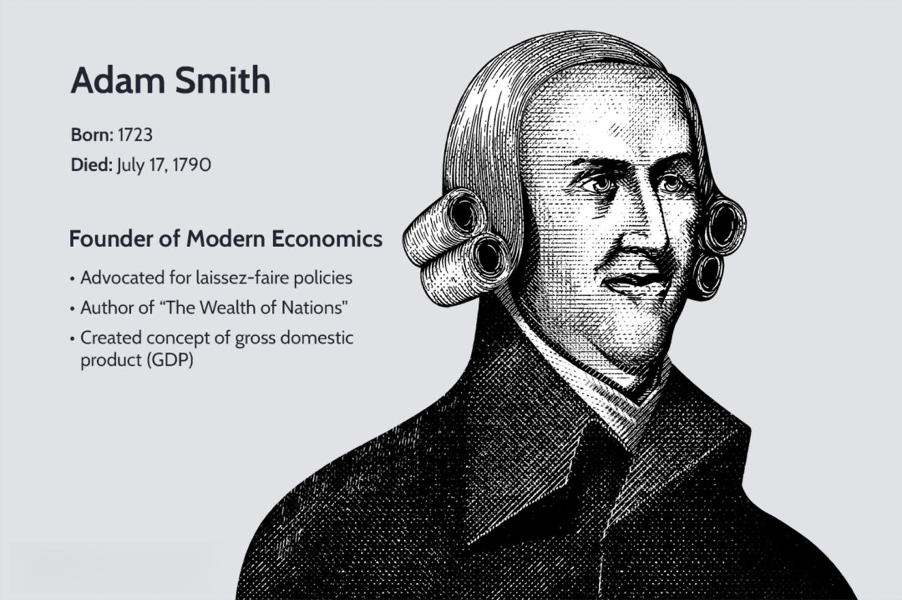

Adam Smith, a towering figure in economic theory, is widely celebrated for his transformative work, "The Wealth of Nations," published in 1776. Smith's exploration of economic processes laid the foundation for classical economics, introducing concepts that have significantly shaped the understanding of markets. One of his seminal ideas, the "invisible hand," posits that individuals pursuing their self-interest inadvertently contribute to the economic well-being of society, advocating for minimal government intervention in free markets. Smith's insights on productivity, driven by the division of labor, highlight how specialized workforces enhance efficiency, contributing to economic growth.

Smith's theories have transcended generations, providing a framework for contemporary economic practices. His ideas resonate in today's rapidly evolving financial markets, where technology-driven innovations like algorithmic trading illustrate the ongoing relevance of his vision. Algorithmic trading employs complex computer algorithms to execute trades based on predefined criteria, optimally balancing speed and precision. This approach to trading has become increasingly prevalent in global financial markets, marking a shift towards automation and efficiency.



Algorithmic trading embodies the spirit of Smith's advocacy for efficiency and competition within markets. This advanced trading methodology leverages technological capabilities to create self-regulating mechanisms that align with Smith's ideals. However, it also raises questions regarding market transparency and ethical considerations, prompting a reexamination of Smith's principles in the context of modern trading environments.

As financial systems become more intertwined with technology, understanding the intersection between Adam Smith's economic theories and the rise of algorithmic trading becomes essential. This examination not only highlights the enduring impact of classical economic principles but also underscores the necessity to adapt these ideas in light of emergent technological frontiers.

## Table of Contents

## Understanding Adam Smith’s Economic Theory

Adam Smith, often considered the father of modern economics, laid down foundational principles in his seminal work, "The Wealth of Nations," published in 1776. His theories continue to influence economic thought and practice, with the core tenets revolving around the concepts of the 'invisible hand,' division of labor, and advocacy for free markets with limited government intervention.

The 'invisible hand' is one of Smith's most renowned ideas, suggesting that individuals pursuing their self-interest inadvertently contribute to the overall good of society. This concept underlies the notion of market self-regulation, where the decentralized decisions of individuals lead to outcomes beneficial for all, without any need for centralized control. The self-regulating nature of the market ensures efficient allocation of resources as prices adjust based on supply and demand, facilitating optimal decision-making within economic systems.

Smith's examination of the division of labor highlights its significant impact on productivity. By breaking down complex tasks into simpler, more specialized ones, efficiency and output increase. This principle is exemplified by his famous pin factory example, illustrating that workers focusing on particular tasks drastically enhance production efficiency compared to if each worker made entire pins independently. This specialization not only boosts productivity but also fosters innovation, as workers become experts in their specific tasks and contribute to incremental improvements.

Smith was a staunch advocate for free markets, positing that minimal government intervention leads to more efficient and prosperous economic systems. He believed in the power of competition to drive innovation and improve consumer choices, which, in turn, spurs economic growth. While recognizing the necessity for some government roles, such as providing public goods and ensuring national defense, Smith cautioned against excessive regulation that could stifle economic freedom and efficiency.

Adam Smith's economic theories present a framework where markets operate efficiently through self-regulating mechanisms, driven by individual ambition and enhanced by specialization. These principles advocate for a limited role of government, trusting the power of free markets to maximize societal welfare.

## The Wealth of Nations: Core Insights

Adam Smith's "The Wealth of Nations" is a foundational text in classical economics, notable for its comprehensive examination of economic systems and profound influence on future economic thought. One of the core insights of the book is the significance of competition and consumer choice in driving economic growth. Smith posited that free competition leads to more efficient resource allocation, innovation, and productivity improvements, culminating in enhanced economic prosperity. This competition acts as an invisible hand, guiding individuals' self-interested actions toward societal benefits.

Furthermore, Smith emphasized moral philosophy's critical role in economic behavior. He believed that ethical considerations inherently affect market dynamics, proposing that individuals, motivated by self-interest, do not operate in a vacuum but rather within a framework of social norms and moral considerations. This intersection of ethics and economics suggests that a self-regulating market should not only focus on profit but also consider ethical implications.

"The Wealth of Nations" was written during the late 18th century, a period marked by the Industrial Revolution's onset. This historical context is crucial for understanding Smith's arguments as it was a time of significant economic transformation. Smith's insights helped set the stage for classical economics by addressing the emerging complexities of industrial capitalism, advocating for free trade and minimal government intervention. His ideas laid the groundwork for future economic policies and theories, promoting the benefits of a liberalized economy. 

In summary, Smith's work highlighted the essential roles of competition and morality in economic systems, while its historical context contributed to the shaping of classical economic thought and policy.

 to Algorithmic Trading

Algorithmic trading, commonly referred to as algo trading, is a method of executing trades that uses automated and pre-programmed trading instructions to account for variables such as price, timing, and [volume](/wiki/volume-trading-strategy). These algorithms enable high-speed, high-frequency trading, offering traders the ability to take advantage of market efficiencies faster than a human trader can comprehend. In modern financial markets, [algorithmic trading](/wiki/algorithmic-trading) plays a crucial role, facilitating a significant portion of trading activities across various asset classes, including equities, derivatives, and foreign exchange.

The fundamental mechanism behind algorithmic trading involves leveraging advanced computer algorithms to automatically execute trades based on predetermined criteria. These criteria can include a range of variables, such as specific price points, technical indicators, or statistical models designed to predict market movements. By doing so, algorithmic trading aims to maximize trading efficiencies, capitalizing on optimal trading opportunities while minimizing human error and emotional bias. An example of a simple algorithm could be as follows in Python syntax:

```python
# Simple moving average crossover algorithm
def moving_average(prices, window_size):
    return [sum(prices[i:i+window_size])/window_size for i in range(len(prices)-window_size+1)]

def trade_signal(prices, short_window, long_window):
    short_ma = moving_average(prices, short_window)
    long_ma = moving_average(prices, long_window)

    latest_short = short_ma[-1]
    latest_long = long_ma[-1]

    if latest_short > latest_long:
        return "Buy"
    elif latest_short < latest_long:
        return "Sell"
    return "Hold"
```
This simple example showcases a moving average crossover strategy, a common algorithmic trading approach used to signal buy or sell actions based on moving averages.

The proliferation of algorithmic trading platforms has been driven by significant developments in technology and financial market structures. These platforms have gained substantial market share over the past few decades, particularly in well-established financial centers. The rise of electronic exchanges and the reduction in transaction costs have fundamentally altered the trading landscape, encouraging broader adoption of algorithmic trading strategies among institutional and retail investors alike. In 2020, algorithmic trading accounted for approximately 60-73% of all US equity trading, illustrating its dominant presence in financial markets.

Key benefits of algorithmic trading include increased transaction speed and accuracy, enhanced [liquidity](/wiki/liquidity-risk-premium), and reduced market impact costs. The ability to execute trades swiftly means traders can exploit even minimal price discrepancies while ensuring best execution practices. Moreover, algorithmic trading can contribute to smoother and more liquid markets by providing constant trading activity and tighter bid-ask spreads.

However, algorithmic trading is not without challenges. One of the primary concerns is the potential for increased market [volatility](/wiki/volatility-trading-strategies), as rapid execution of orders can exacerbate price swings during times of market distress. Additionally, the complex nature of algorithms increases the risk of technical failures and erroneous trades, which can lead to significant financial losses. Moreover, there are ethical considerations, such as the potential for market manipulation through strategies like spoofing or layering, which remain contentious topics in financial regulation.

In conclusion, while algorithmic trading brings substantial efficiency and speed to financial markets, it is crucial to manage its inherent risks through robust risk management practices and regulatory oversight.

## The Connection between Smith's Theory and Algo Trading

Adam Smith's advocacy for efficiency and competition finds a modern expression in the practices of algorithmic trading. Algorithmic trading automates market transactions using complex algorithms to execute orders at speeds and efficiencies that surpass human capability. This introduces a level of market efficiency aligning with Smith's vision of self-regulating markets, where rapid transactional ability and competitive pricing offer optimal resource allocation.

Algorithmic trading platforms harness technology to facilitate market efficiency. By leveraging data analysis and predictive algorithms, these platforms minimize human error and exploit market conditions swiftly. This mirrors Smith’s concept of the "invisible hand," where markets, when left to their own devices, ostensibly regulate themselves through inherent dynamics. Technology acts as a facilitator of this self-regulation, enhancing liquidity and ensuring pricing accuracy in financial markets.

Smith's principles of division of labor are evident in algorithmic trading. Traditionally, labor division increases productivity by assigning specific tasks to specialized workers. In financial markets, algorithmic trading decomposes complex trading strategies into individual components handled by specialized algorithms. Each algorithm can analyze data, forecast trends, or execute trades independently, reflecting Smith’s insights into labor specialization.

However, the implications of algorithmic trading on market transparency and consumer benefits are multifaceted. On one hand, algorithmic trading promotes transparency by providing continuous pricing updates and reducing transaction costs, thus benefiting consumers through greater market access and enhanced competitive conditions. On the other hand, the opacity of some trading algorithms raises concerns about fairness and market manipulation. These sophisticated algorithms can sometimes exploit market imperfections before regulators or traditional investors can react, leading to disparities that Smith might have cautioned against.

Overall, while Adam Smith could not have envisioned the technological transformation of markets, the fundamentals of his economic theory continue to resonate within contemporary trading practices. Algorithmic trading exemplifies the pursuit of efficiency and competition that Smith championed, albeit with nuances and complexities introduced by modern technology.

## Criticisms and Challenges

Algorithmic trading, while transformational, has attracted criticism due to its potential to exacerbate market volatility and ethical dilemmas. One primary concern is that algorithmic trading can increase market volatility through rapid execution of trades based on algorithmic signals, potentially leading to flash crashes. These events can disrupt markets, causing substantial financial losses and undermining investor confidence. This volatility challenge highlights a fundamental tension with Adam Smith’s theory of the 'invisible hand', which posits that self-interested market participants can lead to unintended social benefits and market equilibrium. However, the speed and volume enabled by algorithmic trading can deviate from the slower, more deliberate market processes Smith observed, sometimes leading to market destabilization rather than self-correction.

Furthermore, the risks of market manipulation are intrinsic to algorithmic trading. Traders might exploit algorithms to create misleading price movements or disrupt market operations, actions that conflict with Smith's advocacy for fair competition and market transparency. High-frequency trading ([HFT](/wiki/high-frequency-trading-strategies)) strategies, such as spoofing and layering, can manipulate market perceptions and erode trust. Smith’s ideal of a transparent market is challenged by these activities, as they can obfuscate genuine supply and demand signals, impeding the market's natural self-regulation.

Applying Smith's 18th-century ideas to the context of modern high-frequency trading environments presents notable limitations. Smith’s economic theories were conceived in a time devoid of advanced technology and instantaneous communication, making it difficult to fully anticipate the implications of algorithmic trading. His principles, while foundational, may not entirely align with the realities of today's high-speed financial ecosystems, where millisecond discrepancies can yield significant market impacts. 

Regulatory responses to algorithmic trading seek to address these challenges and align market operations more closely with Smith's principles. Regulatory bodies have implemented measures, such as circuit breakers, to mitigate extreme volatility and unintended systemic consequences. Moreover, there is a growing call for reforms that enhance transparency, optimize market surveillance, and impose stricter penalties for manipulative practices. These efforts aim to enhance market stability and fairness, echoing Smith’s vision of an orderly market that serves broader economic and social interests.

In light of these criticisms and challenges, it is crucial to continuously assess and update regulatory frameworks to keep pace with technological advancements in financial markets. Balancing the efficiency gains of algorithmic trading with the need for market integrity and fairness remains a pivotal task for regulators and market participants alike.

## Conclusion

Adam Smith's economic theory, particularly his insights from "The Wealth of Nations," remains profoundly influential in today's financial markets. His vision of a self-regulating market facilitated by the "invisible hand" finds resonance in contemporary practices, such as algorithmic trading. Both concepts emphasize the benefits of competition, efficiency, and self-regulation, essential for fostering growth and innovation in financial systems.

Algorithmic trading, a modern manifestation of market systems, employs advanced technologies to execute trades with precision and speed. This advancement underscores the ongoing challenge of balancing technological growth with market fairness, a notion that aligns with Smith’s caution against excessive intervention. As markets evolve with increasing reliance on technology, ensuring equitable access and transparency becomes crucial to maintain trust and stability, reflecting the ethical concerns Smith addressed regarding market behavior.

The rapid transformation of trading platforms necessitates a continuous evaluation of economic theories like Smith's. While foundational principles endure, they must be reinterpreted to address the nuances of digital and high-frequency trading environments. Algorithmic trading, with its reliance on data-driven decision-making, showcases the adaptability of Smith’s ideas, particularly those related to the division of labor and specialization. These principles are exemplified as algorithms handle vast volumes of trades, each optimized to function efficiently within its defined parameters.

Reflecting on the symbiotic relationship between classic economic principles and modern trading methodologies presents a compelling narrative in the financial milieu. Smith's theoretical frameworks provide a lens through which we can assess and adapt to the complexities introduced by technological advancements. This synergy calls for an iterative approach that respects historical economic insights while rigorously integrating innovative strategies to navigate contemporary challenges. Such a balanced approach ensures that markets remain dynamic and inclusive, fostering an environment conducive to long-term economic prosperity.

## References & Further Reading

[1]: Smith, A. (1776). ["An Inquiry into the Nature and Causes of the Wealth of Nations."](https://archive.org/details/inquiryintonatur01smit_0/) 

[2]: Lopez de Prado, M. (2018). ["Advances in Financial Machine Learning."](https://www.amazon.com/Advances-Financial-Machine-Learning-Marcos/dp/1119482089) Wiley.

[3]: Jansen, S. (2020). ["Machine Learning for Algorithmic Trading."](https://github.com/stefan-jansen/machine-learning-for-trading) Packt Publishing.

[4]: Chan, E. P. (2008). ["Quantitative Trading: How to Build Your Own Algorithmic Trading Business."](https://github.com/ftvision/quant_trading_echan_book) John Wiley & Sons.

[5]: Aronson, D. (2006). ["Evidence-Based Technical Analysis: Applying the Scientific Method and Statistical Inference to Trading Signals."](https://www.wiley.com/en-us/Evidence+Based+Technical+Analysis%3A+Applying+the+Scientific+Method+and+Statistical+Inference+to+Trading+Signals-p-9780470008744) Wiley.