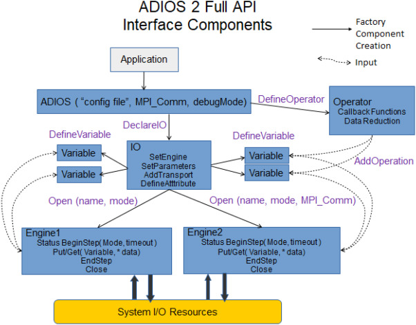

Algorithmic trading has transformed financial markets by employing automated trading strategies to facilitate rapid order execution with precision. These strategies rely on a crucial component: the Input/Output (I/O) system. Such systems are mandated to manage data inputs and outputs with the utmost efficiency, largely due to the dynamic and data-intensive nature of modern trading environments. 

A significant development in this context is the Adaptable IO System (ADIOS). ADIOS represents an advanced data management framework tailored to address the intricate demands of complex trading algorithms and the nuances of high-frequency trading. This framework provides robust solutions for managing vast datasets and optimizing data processes essential for successful algorithmic trading.

This article focuses on the pivotal role played by ADIOS in algorithmic trading. We will examine its distinctive features and demonstrate how ADIOS can enhance trading performance through the optimization of data processes. Additionally, the benefits of integrating such a system into trading scenarios will be explored, alongside illustrative use cases and examples evidencing its tangible impact on trade execution and analysis. By streamlining data management tasks, ADIOS enables traders to concentrate on strategy development and competitive positioning, ultimately driving innovation and efficacy in financial markets.

## Table of Contents

## Overview of Adaptable IO System (ADIOS)

ADIOS, or the Adaptable IO System, is a sophisticated data management framework designed to enhance the efficiency and flexibility of data handling across various application scenarios. By providing a publish/subscribe abstraction for data access and storage, ADIOS enables the dynamic interaction between different components of a system, thereby optimizing throughput and reducing latency in data processing.

One of the key strengths of ADIOS is its support for both lossy and lossless data compression techniques. This versatility allows the framework to manage data with a focus on either preserving maximum fidelity or optimizing storage space and transmission speed, depending on the specific needs of the application. Lossy compression can be employed to accelerate data transmission rates, particularly in scenarios where bandwidth is limited, while lossless compression ensures the integrity of critical data where precision is non-negotiable.

The framework is equipped with multiple data engines, each tailored for distinct tasks such as writing and reading data to and from various storage systems. This modularity allows ADIOS to couple independent simulations seamlessly, facilitating complex computational tasks that require the integration of diverse datasets. Moreover, ADIOS supports real-time data streaming, a crucial feature for applications that perform live data analysis and decision-making, such as in [algorithmic trading](/wiki/algorithmic-trading).

In the context of algorithmic trading, ADIOS's capability to efficiently handle wide-area network data streaming is particularly advantageous. Financial markets are characterized by rapid fluctuations and immense volumes of data that must be processed in real time to inform trading decisions. ADIOS addresses this need by ensuring that data streams are timely and reliable, thereby allowing traders to execute strategies with minimal delay and maximized accuracy.

The architecture of ADIOS is designed to promote scalability and adaptability. It allows for easy integration and customization according to the evolving requirements of different trading platforms, making it an invaluable asset for financial institutions seeking to maintain a competitive edge in high-frequency trading environments.

## Integration of ADIOS in Algorithmic Trading

Integrating the Adaptable IO System (ADIOS) into algorithmic trading platforms presents numerous advancements for data management and operational fluidity. ADIOS facilitates seamless data exchange between data producers and consumers, crucial for algorithmic systems where the timeliness and accuracy of data drive strategy decisions. This system's publish/subscribe abstraction enables real-time data updates without manual intervention, enhancing the speed and responsiveness of trading operations.

ADIOS leverages a flexible model where data components actively subscribe to specific data channels, receiving updates dynamically as new data becomes available. This reduces latency by ensuring that computational models are continually fed with the most recent data, allowing traders to make informed decisions faster. By efficiently managing data streams, trading algorithms can execute orders and adapt strategies with minimal delay, crucial in volatile financial markets.

Moreover, ADIOS supports both in situ and remote data processing, a feature that is particularly beneficial for complex analyses integral to trading strategy optimization. In situ processing allows data analysis and computational tasks to occur concurrently with data generation, minimizing data transfer overhead and ensuring immediate availability of analytical results. This capability supports high-frequency trading scenarios, where the speed of data interpretation can significantly affect trading outcomes.

Remote data processing capabilities allow for expanded analyses over distributed systems, facilitating the integration of geographically diverse data sources and computational resources. This is particularly advantageous for global trading firms that require insights derived from various markets and datasets. As a result, the integration of ADIOS not only optimizes current processes but also enhances the capability to incorporate broader data sets and more diverse analytical models without compromising speed or accuracy.

Overall, the introduction of ADIOS within algorithmic trading frameworks improves data handling efficiency, ensuring that trading operations are agile, responsive, and based on the most accurate datasets available. This positions traders to leverage insights swiftly and effectively, aligning technical capabilities with the demands of modern financial markets.

## Advantages of ADIOS in the Trading Sector

The Adaptable IO System (ADIOS) provides several advantages in the trading sector, particularly in its capacity to efficiently manage large datasets, a critical need in high-frequency trading environments. This efficiency stems from ADIOS's advanced modular architecture, which enables seamless scalability and adaptability to meet evolving trading strategy demands. 

ADIOS employs sophisticated data compression techniques, which reduce the storage footprint without compromising data integrity or quality. This reduction in storage needs translates to more efficient resource usage, resulting in enhanced performance and lower operational costs. The effective compression methods used within ADIOS ensure that both lossy and lossless data compressions are possible, further broadening its utility across various trading applications.

Real-time data streaming capabilities of ADIOS stand as a significant benefit, allowing trading algorithms to respond promptly to market fluctuations. This immediacy is essential in reducing latency in trade execution, thereby enhancing the overall reliability and profitability of trading operations. The ability to process and stream data in real-time ensures that trading strategies can continuously adjust to the volatile and fast-paced nature of financial markets, maintaining a competitive edge.

The system's architecture supports dynamic data updates through its flexible publish/subscribe model, which contrasts with more static data management systems. This dynamic nature ensures that trading decisions are made based on the most current data available, significantly improving the accuracy and effectiveness of trading strategies. By leveraging these capabilities, traders can optimize their strategy performance, resulting in quicker, more informed trading decisions that are crucial for success.

In conclusion, the advantages of ADIOS in the trading sector are primarily its ability to handle extensive datasets, its efficient data management through compression techniques, and its real-time data streaming capabilities. These features collectively enhance the scalability, efficiency, and adaptability of trading systems, offering a robust solution for modern algorithmic trading needs.

## Use Cases and Examples

Several trading firms have embraced the Adaptable IO System (ADIOS) to enhance their algorithmic trading capabilities, demonstrating its efficacy in improving data processing and trade execution. A profound impact of ADIOS is its ability to facilitate complex simulations and visualizations, which are critical for understanding market dynamics in conjunction with live trading. Through the use of ADIOS, firms can perform in-depth analyses and gain valuable insights into how market variables interact, ultimately leading to more informed trading decisions.

One notable application of ADIOS is in [backtesting](/wiki/backtesting) trading algorithms. By simulating historical trades while integrating real-time data updates, trading firms can optimize their strategies effectively. This process allows for rapid iteration and refinement of trading algorithms, ensuring they remain competitive and responsive to market changes. The framework supports a continuous flow of data, enabling the simultaneous execution of backtesting and real-time trading operations without data bottlenecks or latency issues.

In addition to enhancing algorithmic trading strategies, ADIOS has proven its utility in streamlining compliance reporting processes. Regulatory requirements necessitate the efficient management and storage of extensive transactional data, a task that ADIOS handles adeptly. By employing advanced data compression techniques and supporting scalable storage solutions, ADIOS ensures compliance data is managed effectively, reducing operational overhead and increasing transparency in reporting.

The integration of ADIOS within trading platforms demonstrates its versatility and robustness, enabling firms to achieve a competitive edge through enhanced data management and strategy optimization.

## Conclusion

The Adaptable IO System (ADIOS) addresses key data management challenges in algorithmic trading by improving the efficiency and speed of data processing. This system effectively manages complex datasets while providing real-time data access and simultaneously supporting multiple data streams. These capabilities are crucial for traders aiming to optimize their operations and maximize trading outcomes. As algorithmic trading continues to progress, tools like ADIOS will play a critical role in fostering innovation and maintaining competitive advantages in the fast-paced financial markets. By incorporating advanced I/O systems such as ADIOS, traders are equipped with the essential data handling and processing capacities needed to make informed and rapid trading decisions. Through this technological edge, market participants can better interpret market signals and respond with precision, enhancing both strategic development and execution.

## Further Reading and References

For those interested in exploring more about ADIOS and its extensive applications, several resources and scientific papers offer comprehensive analyses and technical details. One of the key references is the work by David Pugmire and his colleagues, which describes the broad capabilities and uses of ADIOS within computational science. This work provides valuable insight into how ADIOS can handle large-scale data efficiently, a critical requirement in numerous fields, including financial trading.

Another significant paper is "ADIOS: The Adaptable IO System," authored by Jinlek Huang et al., which outlines the architecture and advantages of using ADIOS for data management and storage in high-performance computing environments. Huang's paper highlights the versatility and adaptability of ADIOS, reinforcing its suitability in dynamic and data-intensive scenarios such as algorithmic trading.

Furthermore, the discussion in the paper "Integrating High Performance Data Management with Computational Workflows" emphasizes the importance of effective data management systems like ADIOS in facilitating complex data processing and analysis, underscoring their significance in improving both computational efficiency and workflow management.

For technical enthusiasts, the resource titled "Efficient Data Management for High Throughput Scientific Workflows" provides deeper technical insights into the mechanisms by which ADIOS optimizes data throughput and reduces latency. This is particularly relevant for those applying ADIOS in trading, where speed and context-awareness are paramount.

These resources collectively offer a detailed examination of the technological underpinnings of ADIOS, illuminating its application possibilities across various domains, including its potent applications in enhancing the precision and speed of algorithmic trading.

## References & Further Reading

[1]: Pugmire, D. et al. [ADIOS: The Adaptable IO System.](https://impact.ornl.gov/en/publications/the-adaptable-io-system-adios)

[2]: Jinlek Huang, W. et al. [ADIOS: The Adaptable IO System](https://csmd.ornl.gov/adios). Proceedings of the 23rd IEEE/ACM International Symposium on High Performance Distributed Computing.

[3]: Abbasi, B. et al. (2020). [Integrating High Performance Data Management with Computational Workflows](https://www.sciencedirect.com/science/article/pii/S0040162521005527). Future Generation Computer Systems.

[4]: ["Efficient Data Management for High Throughput Scientific Workflows"](https://www.sciencedirect.com/science/article/pii/S0927025620305772) in Springer Proceedings in Applied Mathematics & Mechanics.

[5]: Dean, J. et al. (2009). [Energy-Efficient Computing for Data Centers](https://www.sciencedirect.com/science/article/pii/S1364032115016664). Computing in Science & Engineering, IEEE.