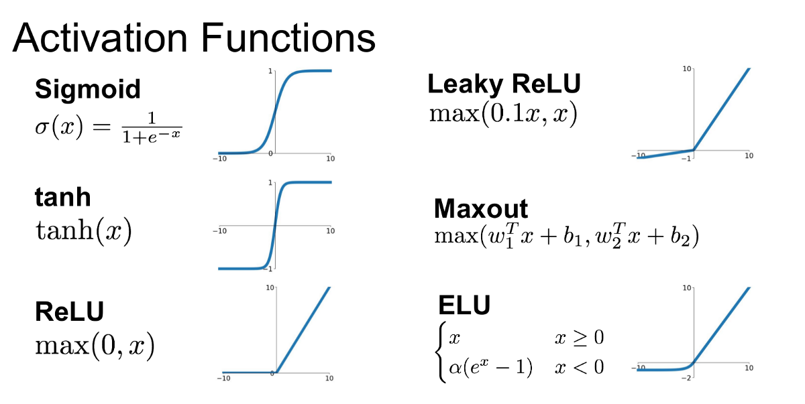

## Table of Contents

## What is an activation function in the context of neural networks?

An activation function in neural networks is like a gatekeeper that decides whether a neuron should be activated or not. Imagine a neuron receiving inputs, doing some math, and then using the activation function to see if it should "fire" and send its signal to the next layer. This helps the network learn complex patterns by introducing non-linearity, which means it can handle more than just straight-line relationships between inputs and outputs.

Common activation functions include the sigmoid, which squashes values between 0 and 1, and the ReLU (Rectified Linear Unit), which outputs the input directly if it's positive, otherwise outputs zero. For example, the ReLU function can be written as $$ f(x) = \max(0, x) $$. These functions help neural networks make decisions and learn from data by controlling the flow of information through the network. Without activation functions, a neural network would just be a series of linear operations, unable to capture the rich, varied patterns found in real-world data.

## Why are adaptive activation functions important in machine learning?

Adaptive activation functions are important in machine learning because they can change and adjust during training. This means they can better fit the data they are working with. Imagine you're trying to learn a new game, and the rules keep changing. If you can adapt your strategies as you go, you'll do better than if you stick to one set of rules. In the same way, adaptive activation functions can adjust to make the neural network more effective at learning and predicting.

These functions help the network handle different types of data better. For example, some data might need a gentle curve to understand it, while other data might need a sharp turn. Adaptive functions can switch between these, making the network more flexible. This is like having a Swiss Army knife instead of just a regular knife; you can use the right tool for the job at hand. By adapting, the network can learn more complex patterns and improve its performance over time.

## Can you explain the basic concept behind the Swish activation function?

The Swish activation function is a newer type of activation function that can help neural networks learn better. It's a bit like a mix between the ReLU and the sigmoid function. The cool thing about Swish is that it can adapt to the data it's working with, which means it can be more flexible than other functions. This adaptability can make the [neural network](/wiki/neural-network) perform better, especially with complex data.

The formula for the Swish function is pretty simple. It's written as $$ f(x) = x \cdot \sigma(x) $$, where $$ \sigma(x) $$ is the sigmoid function. This means that for any input $$ x $$, the Swish function multiplies $$ x $$ by the sigmoid of $$ x $$. The result is a smooth curve that's easy for the network to work with. Because of this, Swish can help the network learn and predict more accurately.

## How does the KAN activation function differ from traditional activation functions?

The KAN (Kolmogorov-Arnold Network) activation function is different from traditional activation functions because it uses a special way to break down and put together information. Traditional activation functions, like ReLU or sigmoid, usually take one input and give one output. But the KAN function works with many inputs and outputs at the same time. It's like a puzzle that can be taken apart and put back together in different ways to fit the data better. This makes KAN more flexible and able to handle complex patterns in data.

The way KAN works is based on an old math idea called the Kolmogorov-Arnold representation theorem. This theorem says that any continuous function can be made from simpler pieces. In KAN, these pieces are called splines, which are like smooth curves that can be adjusted to fit the data. The formula for a KAN layer can be written as $$ f(x) = \sum_{i=1}^n \phi_i \left( \sum_{j=1}^m \psi_{ij}(x_j) \right) $$, where $$ \phi $$ and $$ \psi $$ are spline functions. This means KAN can learn and adapt to the data in a very detailed way, making it a powerful tool for understanding complex relationships in data.

## What are the key features of the LEAF activation function?

The LEAF (Learnable Efficient Activation Function) is a special kind of activation function that can change and learn during training. Unlike traditional activation functions like ReLU or sigmoid, which stay the same, LEAF can adjust itself to fit the data better. This makes it more flexible and can help the neural network learn more complex patterns. The LEAF function is made up of simple parts that can be tweaked during training, which means it can adapt to different kinds of data.

The way LEAF works is by using a formula that can be changed. The basic idea is that LEAF combines a linear part and a non-linear part, which can be adjusted to fit the data. The formula for LEAF can be written as $$ f(x) = \alpha x + \beta \cdot g(x) $$, where $$ \alpha $$ and $$ \beta $$ are learnable parameters, and $$ g(x) $$ is a non-linear function. This means that during training, the neural network can change $$ \alpha $$, $$ \beta $$, and the shape of $$ g(x) $$ to make the function work better with the data. This adaptability makes LEAF a powerful tool for improving the performance of neural networks.

## How does the SPLASH activation function adapt to different inputs?

The SPLASH activation function is special because it can change itself to fit different kinds of data. It's like a chameleon that can adapt to its surroundings. SPLASH does this by using a formula that can be adjusted during training. The formula for SPLASH is $$ f(x) = \alpha \cdot \sigma(\beta \cdot x) $$, where $$ \alpha $$ and $$ \beta $$ are numbers that can be changed to make the function work better with the data. This means that as the neural network learns, it can tweak these numbers to make the function more suitable for the task at hand.

This adaptability makes SPLASH really good at handling different types of data. For example, if the data needs a gentle curve to understand it, SPLASH can adjust to provide that. If the data needs a sharp turn, SPLASH can change to give that too. By being able to adapt, SPLASH helps the neural network learn and predict more accurately, making it a powerful tool for [machine learning](/wiki/machine-learning) tasks.

## What makes modReLU unique among other adaptive activation functions?

The modReLU activation function is unique because it combines the best parts of ReLU and other adaptive functions. It's like a special tool that can change its shape to fit the data better. The formula for modReLU is $$ f(x) = \max(0, x) + \alpha \cdot \min(0, x) $$, where $$ \alpha $$ is a number that can be adjusted during training. This means modReLU can learn from both positive and negative inputs, making it more flexible than the regular ReLU, which only works with positive values.

This adaptability helps modReLU handle different kinds of data more effectively. For example, if the data has a lot of negative values, modReLU can adjust to make use of them, while still keeping the benefits of the ReLU function for positive values. By being able to learn from all parts of the data, modReLU can help the neural network perform better and learn more complex patterns.

## Can you describe the advantages of using the Rational Activation Function?

The Rational Activation Function is special because it can be really flexible and work well with different kinds of data. It's like a custom tool that can change its shape to fit the job at hand. The formula for the Rational Activation Function is $$ f(x) = \frac{P(x)}{Q(x)} $$, where $$ P(x) $$ and $$ Q(x) $$ are polynomials. This means it can make smooth curves that can be adjusted during training to fit the data better. Because of this, it can help the neural network learn and predict more accurately, even with complex patterns.

Using the Rational Activation Function can make the neural network more powerful. It can handle different types of data better than simpler functions like ReLU or sigmoid. For example, if the data needs a gentle curve to understand it, the Rational Activation Function can adjust to provide that. If the data needs a sharp turn, it can change to give that too. This adaptability makes it a great choice for tasks where the data is tricky or has a lot of different parts to it.

## How does the PELU activation function improve upon existing methods?

The PELU (Parametric Exponential Linear Unit) activation function is special because it can change itself to fit the data better. It's like a tool that can adjust its shape to work with different kinds of data. The formula for PELU is $$ f(x) = \alpha \cdot (\exp(x) - 1) $$ if $$ x < 0 $$, and $$ f(x) = x $$ if $$ x \geq 0 $$. This means PELU can learn from both positive and negative inputs, making it more flexible than the regular ReLU, which only works with positive values. By being able to adjust during training, PELU can help the neural network learn and predict more accurately, even with complex data.

PELU improves upon existing methods by being able to handle different types of data better. For example, if the data has a lot of negative values, PELU can adjust to make use of them, while still keeping the benefits of the ReLU function for positive values. This adaptability makes PELU a powerful tool for machine learning tasks where the data is tricky or has a lot of different parts to it. By learning from all parts of the data, PELU can help the neural network perform better and understand more complex patterns.

## What is the mechanism behind the PAU activation function's adaptability?

The PAU (Parametric Activation Unit) activation function is special because it can change itself to fit the data better. It's like a tool that can adjust its shape to work with different kinds of data. The formula for PAU is $$ f(x) = \alpha \cdot x + \beta \cdot \log(1 + \exp(x)) $$, where $$ \alpha $$ and $$ \beta $$ are numbers that can be changed during training. This means PAU can learn from both positive and negative inputs, making it more flexible than simpler functions like ReLU, which only works with positive values. By being able to adjust during training, PAU can help the neural network learn and predict more accurately, even with complex data.

PAU improves upon existing methods by being able to handle different types of data better. For example, if the data has a lot of negative values, PAU can adjust to make use of them, while still keeping the benefits of the ReLU function for positive values. This adaptability makes PAU a powerful tool for machine learning tasks where the data is tricky or has a lot of different parts to it. By learning from all parts of the data, PAU can help the neural network perform better and understand more complex patterns.

## How do AHAF and DELU activation functions enhance model performance?

The AHAF (Adaptive Hard Activation Function) and DELU (Dynamic Exponential Linear Unit) activation functions help make neural networks work better by being able to change themselves to fit the data. AHAF uses a formula $$ f(x) = \max(0, x) + \alpha \cdot \min(0, x) $$ where $$ \alpha $$ can be adjusted during training. This means AHAF can learn from both positive and negative parts of the data, making it more flexible than simpler functions like ReLU. By adjusting to the data, AHAF can help the neural network learn and predict more accurately, even when the data is complex.

DELU, on the other hand, uses a formula $$ f(x) = \alpha \cdot (\exp(x) - 1) $$ if $$ x < 0 $$, and $$ f(x) = x $$ if $$ x \geq 0 $$. Like AHAF, DELU can learn from both positive and negative inputs, making it more adaptable than ReLU. DELU can change its shape to fit different kinds of data better. This adaptability helps the neural network handle tricky data with many different parts, improving its performance and ability to understand complex patterns.

## What are the latest trends and future directions for research in adaptive activation functions?

The latest trends in adaptive activation functions focus on making neural networks more flexible and better at learning from different kinds of data. Researchers are working on functions that can change themselves during training to fit the data better. For example, functions like the Swish, $$ f(x) = x \cdot \sigma(x) $$, and the Rational Activation Function, $$ f(x) = \frac{P(x)}{Q(x)} $$, are becoming popular because they can adjust to the data's needs. These functions help neural networks handle complex patterns and improve their performance on tasks like image recognition and natural language processing.

Future directions for research in adaptive activation functions are all about making them even smarter and more efficient. One big area is figuring out how to make these functions work well with less data, which is important for applications where data is hard to get. Another exciting direction is using these functions in new types of neural networks, like those that can learn from changing environments. Researchers are also looking into ways to make these functions easier to understand and control, so that people can use them more effectively in real-world problems.

## References & Further Reading

[1]: Ramachandran, P., Zoph, B., & Le, Q. V. (2017). ["Searching for Activation Functions."](https://arxiv.org/abs/1710.05941) arXiv preprint arXiv:1710.05941.

[2]: Hendrycks, D., & Gimpel, K. (2016). ["Gaussian Error Linear Units (GELUs)."](https://arxiv.org/abs/1606.08415) arXiv preprint arXiv:1606.08415.

[3]: Elfwing, S., Uchibe, E., & Doya, K. (2018). ["Sigmoid-weighted Linear Units for Neural Network Function Approximation in Reinforcement Learning."](https://www.sciencedirect.com/science/article/pii/S0893608017302976) arXiv preprint arXiv:1702.03118.

[4]: Klambauer, G., Unterthiner, T., Mayr, A., & Hochreiter, S. (2017). ["Self-Normalizing Neural Networks."](https://arxiv.org/abs/1706.02515) arXiv preprint arXiv:1706.02515.

[5]: Agostinelli, F., Hoffman, M. D., Sadowski, P. J., & Baldi, P. (2014). ["Learning Activation Functions to Improve Deep Neural Networks."](https://arxiv.org/abs/1412.6830) arXiv preprint arXiv:1412.6830.