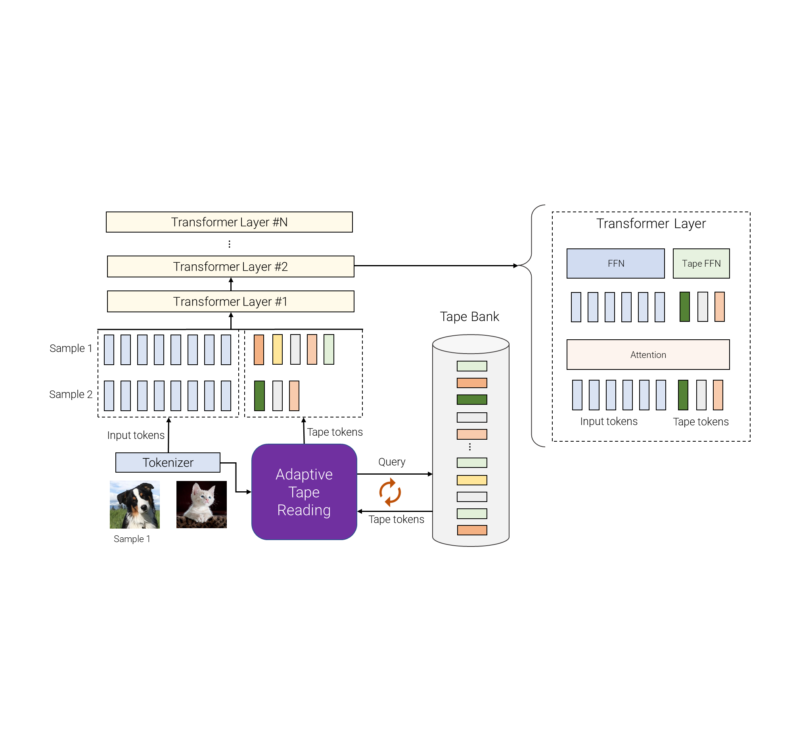

## Table of Contents

## What is adaptive computation in the context of machine learning?

Adaptive computation in machine learning refers to the ability of a model to adjust its processing based on the complexity of the input data. This means that the model can spend more time or use more resources on difficult examples and less on simpler ones. This approach can lead to more efficient use of computational resources and potentially better performance, as the model can focus its efforts where they are most needed.

A common way to implement adaptive computation is through mechanisms like dynamic neural networks or adaptive computation time (ACT). For example, in ACT, the model decides how many computational steps to take for each input. This decision is often made by a separate neural network that predicts the number of steps needed based on the input's complexity. By doing this, the model can tailor its processing to each individual example, which can be particularly useful in tasks where the difficulty of inputs varies widely.

## How does adaptive computation differ from traditional machine learning methods?

Adaptive computation in machine learning is different from traditional methods because it changes how much time or resources it uses based on how hard the problem is. Traditional machine learning models usually use the same amount of computation for every piece of data they see. For example, a regular neural network will always go through the same number of layers and steps, no matter if the data is easy or hard to process. But with adaptive computation, the model can decide to spend more time on tricky data and less on simple data, making it smarter about how it uses its resources.

This difference can make adaptive computation more efficient and sometimes more accurate. In traditional models, if you want to handle the hardest cases well, you might have to use a lot of computation for every piece of data, even the easy ones. This can waste time and energy. With adaptive computation, the model can save resources by quickly processing simple data and only using more time on the data that needs it. This can be especially helpful in real-world situations where the difficulty of data can vary a lot, like in language understanding or image recognition tasks.

## What are some common applications of adaptive computation in machine learning?

Adaptive computation is used a lot in natural language processing. For example, when a computer tries to understand what people are saying or writing, some sentences are easy to understand, while others are harder. With adaptive computation, the computer can spend more time figuring out the hard sentences and less time on the easy ones. This makes the computer better at understanding language because it can focus on the parts that need more attention. This is really helpful in things like chatbots or language translation apps, where understanding different levels of complexity is important.

Another common use of adaptive computation is in image recognition. When a computer looks at pictures, some images might be simple, like a clear photo of a cat, while others might be more complex, like a blurry picture of a dog in a crowd. Adaptive computation lets the computer use more processing power on the tricky images and less on the simple ones. This can make the computer better at recognizing what's in the pictures, which is useful in things like security cameras or medical imaging, where the quality and complexity of images can vary a lot.

In [reinforcement learning](/wiki/reinforcement-learning), adaptive computation can also be very useful. In this type of learning, a computer learns by trying different actions and seeing what works best. Some situations might need the computer to think longer to make the right decision, while others might be straightforward. By using adaptive computation, the computer can decide how much time to spend thinking about each situation. This can make the computer learn faster and make better decisions, which is important in games or robots that need to navigate complex environments.

## Can you explain the basic principles behind PonderNet?

PonderNet is a type of [neural network](/wiki/neural-network) that uses adaptive computation to decide how long it should think about a problem before giving an answer. It's like a student taking a test who can choose to spend more time on hard questions and less on easy ones. In PonderNet, there's a special part of the network called the "ponder module" that looks at the problem and decides how many steps the network should take to solve it. This means that for simple problems, PonderNet might only need a few steps, but for harder ones, it might take more steps to come up with a good answer.

The way PonderNet decides how many steps to take is by using something called a "halting probability." This is a number between 0 and 1 that the ponder module calculates at each step. If the halting probability is high, it means the network thinks it's time to stop and give an answer. If it's low, the network keeps thinking for another step. The formula for the halting probability at step $$k$$ is $$p_k = \sigma(W_k h_k + b_k)$$, where $$h_k$$ is the hidden state at step $$k$$, $$W_k$$ and $$b_k$$ are weights and biases, and $$\sigma$$ is the sigmoid function. By using this method, PonderNet can adjust its thinking time based on how hard the problem is, making it more efficient and sometimes more accurate than networks that always take the same number of steps.

## How does AdaptiveBins improve model performance in machine learning?

AdaptiveBins is a way to make [machine learning](/wiki/machine-learning) models work better by changing how they look at data. Imagine you're sorting toys into boxes. If you use the same size box for all toys, some might not fit well. But if you can change the size of the boxes depending on the toy, you can fit them better. That's what AdaptiveBins does with data. It splits the data into different groups, or "bins," and each bin can be different based on how hard the data is to understand. This helps the model pay more attention to the tricky parts of the data and less to the easy parts, making it smarter and more accurate.

In practice, AdaptiveBins can make a big difference in things like understanding pictures or predicting how people will behave. For example, when looking at pictures, some parts might be clear and easy to recognize, while others might be blurry and hard to figure out. With AdaptiveBins, the model can focus more on the blurry parts, spending more time to get them right. This can lead to better results in tasks like recognizing objects in photos or guessing what someone will do next based on their past actions. By being able to adapt to the data, the model can use its time and energy more wisely, leading to better performance overall.

## What is the significance of PoAPL in adaptive computation?

PoAPL stands for "Pondering over Adaptive Path Length," and it's a way to make machine learning models smarter about how long they think about a problem. Imagine you're doing a puzzle. Some pieces are easy to fit, so you don't need to think much about them. But other pieces might be tricky, and you need more time to figure out where they go. PoAPL helps the model do the same thing. It uses a special part called the "ponder module" to decide how many steps the model should take to solve a problem. This means the model can spend more time on hard problems and less time on easy ones, making it more efficient and accurate.

The way PoAPL works is by using a formula to decide when to stop thinking. At each step, the ponder module calculates a number called the "halting probability," which tells the model if it's time to stop and give an answer. The formula for the halting probability at step $$k$$ is $$p_k = \sigma(W_k h_k + b_k)$$, where $$h_k$$ is the hidden state at step $$k$$, $$W_k$$ and $$b_k$$ are weights and biases, and $$\sigma$$ is the sigmoid function. If the halting probability is high, the model stops and gives an answer. If it's low, the model keeps thinking for another step. By using this method, PoAPL helps the model adjust its thinking time based on how hard the problem is, making it more efficient and sometimes more accurate than models that always take the same number of steps.

## How do you implement PonderNet in a machine learning model?

Implementing PonderNet in a machine learning model involves setting up a neural network that can decide how many steps to take to process each piece of data. This is done by adding a special part called the ponder module to the network. The ponder module looks at the data and calculates a number called the halting probability at each step. If the halting probability is high, it means the network should stop and give an answer. If it's low, the network keeps thinking for another step. The formula for the halting probability at step $$k$$ is $$p_k = \sigma(W_k h_k + b_k)$$, where $$h_k$$ is the hidden state at step $$k$$, $$W_k$$ and $$b_k$$ are weights and biases, and $$\sigma$$ is the sigmoid function. By using this method, the network can spend more time on hard problems and less on easy ones, making it more efficient and accurate.

To actually build PonderNet, you would write code that includes the ponder module and uses the halting probability to decide when to stop. Here's a simple example of how you might start setting this up in Python using a library like PyTorch:

```python
import torch
import torch.nn as nn
import torch.nn.functional as F

class PonderNet(nn.Module):
    def __init__(self, input_size, hidden_size, output_size):
        super(PonderNet, self).__init__()
        self.rnn = nn.LSTM(input_size, hidden_size, batch_first=True)
        self.fc = nn.Linear(hidden_size, output_size)
        self.ponder_module = nn.Linear(hidden_size, 1)

    def forward(self, x):
        h0 = torch.zeros(1, x.size(0), self.hidden_size).to(x.device)
        c0 = torch.zeros(1, x.size(0), self.hidden_size).to(x.device)

        output, _ = self.rnn(x, (h0, c0))
        ponder_scores = self.ponder_module(output[:, -1, :])
        halting_prob = torch.sigmoid(ponder_scores)

        # Decide when to halt based on halting_prob
        # This is a simplified example; in practice, you'd need to implement
        # a more sophisticated halting mechanism

        final_output = self.fc(output[:, -1, :])
        return final_output, halting_prob

# Example usage
input_size = 10
hidden_size = 20
output_size = 5
model = PonderNet(input_size, hidden_size, output_size)

# Dummy input
x = torch.randn(1, 1, input_size)

# Get the output and halting probability
output, halting_prob = model(x)
print(output, halting_prob)
```

This code sets up a basic PonderNet with an LSTM layer for processing the input data, a fully connected layer for the final output, and a ponder module to calculate the halting probability. The network can then adjust its processing time based on the difficulty of the input, making it more adaptive and potentially more effective.

## What are the challenges faced when using AdaptiveBins in real-world scenarios?

Using AdaptiveBins in real-world scenarios can be tricky because it needs to figure out how to split the data into the right groups or "bins." If the bins are not set up correctly, the model might spend too much time on easy data or not enough time on hard data. This can make the model less accurate and less efficient. Also, figuring out the best way to split the data can take a lot of time and computer power, especially when the data is changing all the time.

Another challenge is that AdaptiveBins can be hard to understand and explain to others. When the model changes how it processes data based on the bins, it can be tough to see why it made certain decisions. This can be a problem in areas like healthcare or finance, where people need to trust and understand how the model works. If the model's decisions are hard to explain, it might not be used even if it works well.

## Can you discuss the theoretical foundations of PoAPL and its impact on model efficiency?

PoAPL, or Pondering over Adaptive Path Length, is a way to make machine learning models smarter about how long they think about a problem. The main idea behind PoAPL is that some problems are easy and don't need much thinking, while others are hard and need more time. PoAPL uses a special part of the model called the "ponder module" to decide how many steps the model should take. This is done by calculating a number called the "halting probability" at each step. If the halting probability is high, the model stops and gives an answer. If it's low, the model keeps thinking for another step. The formula for the halting probability at step $$k$$ is $$p_k = \sigma(W_k h_k + b_k)$$, where $$h_k$$ is the hidden state at step $$k$$, $$W_k$$ and $$b_k$$ are weights and biases, and $$\sigma$$ is the sigmoid function. By using this method, PoAPL helps the model spend more time on hard problems and less on easy ones, making it more efficient and sometimes more accurate.

The impact of PoAPL on model efficiency is big because it helps the model use its time and energy better. In traditional models, every piece of data gets the same amount of processing, even if some of it is easy and some of it is hard. This can waste a lot of time and energy on the easy stuff. With PoAPL, the model can quickly handle the easy data and spend more time on the hard data. This can make the model work faster and use less energy overall. It's like a student who can spend more time on hard test questions and less on easy ones, leading to better test scores and more efficient studying. By adapting to the difficulty of the data, PoAPL can make machine learning models more efficient and effective in real-world situations where the data can vary a lot.

## How can adaptive computation techniques like PonderNet, AdaptiveBins, and PoAPL be combined to enhance machine learning models?

Combining adaptive computation techniques like PonderNet, AdaptiveBins, and PoAPL can make machine learning models even better at handling different kinds of data. PonderNet helps the model decide how long to think about a problem by using a special part called the "ponder module." This module calculates a number called the halting probability at each step, $$p_k = \sigma(W_k h_k + b_k)$$, where $$h_k$$ is the hidden state at step $$k$$, $$W_k$$ and $$b_k$$ are weights and biases, and $$\sigma$$ is the sigmoid function. If the halting probability is high, the model stops and gives an answer. If it's low, it keeps thinking. By using PonderNet, the model can spend more time on hard problems and less on easy ones. AdaptiveBins can then help by splitting the data into different groups, or "bins," based on how hard it is. This way, the model can focus more on the tricky parts of the data and less on the easy parts, making it smarter and more accurate.

When you add PoAPL to the mix, the model gets even better at figuring out how long to think about each piece of data. PoAPL also uses a ponder module to calculate the halting probability at each step, helping the model adapt its processing time to the difficulty of the problem. By combining these three techniques, the model can use PonderNet to decide how many steps to take, AdaptiveBins to focus on the right parts of the data, and PoAPL to fine-tune the thinking time even more. This combination can lead to a model that is very good at using its time and energy wisely, making it more efficient and accurate in real-world situations where the data can vary a lot.

## What are the latest research developments in adaptive computation, focusing on PonderNet, AdaptiveBins, and PoAPL?

Recent research in adaptive computation has focused on enhancing the capabilities of techniques like PonderNet, AdaptiveBins, and PoAPL. For PonderNet, researchers have been exploring ways to improve the ponder module's accuracy in calculating the halting probability. This involves experimenting with different architectures and training methods to make the model better at deciding when to stop thinking about a problem. The formula for the halting probability at step $$k$$ is still $$p_k = \sigma(W_k h_k + b_k)$$, but new studies are looking into how to optimize the weights and biases to make the model more efficient. In addition, researchers are working on making PonderNet more interpretable, so it's easier to understand why the model makes certain decisions.

AdaptiveBins has seen advancements in how the data is split into different groups, or "bins," to improve model performance. Researchers are developing new algorithms to dynamically adjust the bins based on incoming data, which helps the model adapt to changing conditions in real-time. This dynamic binning approach aims to make the model more responsive and accurate, especially in applications where data complexity can vary widely. The focus is on creating more flexible and robust systems that can handle a broader range of data inputs without compromising on efficiency.

For PoAPL, the latest developments involve integrating it with other adaptive computation techniques to enhance overall model performance. Researchers are exploring how PoAPL can work alongside PonderNet and AdaptiveBins to create a more cohesive and powerful adaptive system. By fine-tuning the ponder module and the halting probability calculation, $$p_k = \sigma(W_k h_k + b_k)$$, PoAPL can help the model adjust its processing time more accurately. This integration is showing promising results in improving the model's ability to efficiently handle both simple and complex data, making it more applicable to real-world scenarios.

## How can one evaluate the effectiveness of adaptive computation methods in machine learning projects?

To evaluate the effectiveness of adaptive computation methods like PonderNet, AdaptiveBins, and PoAPL in machine learning projects, you need to look at how well they improve the model's performance and efficiency. One way to do this is by comparing the model's accuracy before and after using these methods. For example, if you're using PonderNet, you can measure how well the model does on different types of data by seeing if it spends more time on hard problems and less on easy ones. You can use metrics like accuracy, precision, recall, and F1 score to see if the model is better at understanding the data. Another important thing to check is how much time and energy the model uses. If the model can handle the data faster and use less energy, that's a sign that adaptive computation is working well.

Another way to evaluate these methods is by looking at how they affect the model's ability to adapt to new or changing data. This is important because real-world data can be very different from the data the model was trained on. For example, with AdaptiveBins, you can see if the model can still work well when the data changes by checking if it can still split the data into the right groups. If the model can do this and still give good results, that's a good sign. For PoAPL, you can look at how well the model decides when to stop thinking about a problem using the halting probability formula, $$p_k = \sigma(W_k h_k + b_k)$$. If the model can adjust its thinking time correctly and still be accurate, that means PoAPL is helping. By looking at these different aspects, you can get a good idea of how effective adaptive computation methods are in making your machine learning model better and more efficient.

## References & Further Reading

[1]: Graves, A. (2016). ["Adaptive Computation Time for Recurrent Neural Networks."](https://arxiv.org/abs/1603.08983) arXiv preprint arXiv:1603.08983.

[2]: Bengio, Y., Léonard, N., & Courville, A. (2013). ["Estimating or Propagating Gradients Through Stochastic Neurons for Conditional Computation."](https://arxiv.org/abs/1308.3432) arXiv preprint arXiv:1308.3432.

[3]: Neal, R. M., & Hinton, G. E. (1998). ["A View of the EM Algorithm that Justifies Incremental, Sparse, and other Variants."](https://link.springer.com/chapter/10.1007/978-94-011-5014-9_12) In M. I. Jordan (Ed.), Learning in Graphical Models (pp. 355-368).

[4]: Jaderberg, M., Vedaldi, A., & Zisserman, A. (2015). ["Speeding up Convolutional Neural Networks with Low Rank Expansions."](https://arxiv.org/abs/1405.3866) The British Machine Vision Conference (BMVC).

[5]: Larochelle, H., & Hinton, G. E. (2010). ["Learning to Combine Foveal Glimpses with a Third-order Boltzmann Machine."](https://proceedings.neurips.cc/paper_files/paper/2010/file/677e09724f0e2df9b6c000b75b5da10d-Paper.pdf) Advances in Neural Information Processing Systems (NeurIPS).

[6]: Chollet, F. (2017). ["Xception: Deep Learning with Depthwise Separable Convolutions."](https://ieeexplore.ieee.org/document/8099678) Proceedings of the IEEE Conference on Computer Vision and Pattern Recognition (CVPR).