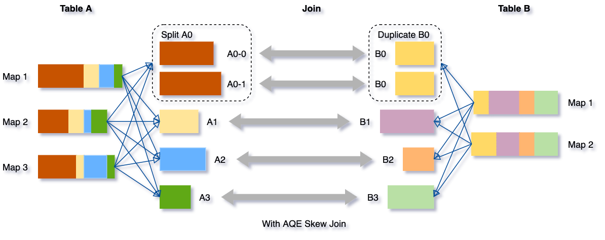

## Table of Contents

## What is adaptive execution in trading?

Adaptive execution in trading is a method where trading systems automatically adjust their actions based on the current market conditions. Instead of following a fixed set of rules, these systems use real-time data to make smarter decisions. This means they can buy or sell assets at the best possible times, taking into account factors like price changes, trading volume, and market trends.

For example, if the market is very volatile, an adaptive execution system might decide to trade more cautiously to avoid big losses. On the other hand, if the market is stable, it might be more aggressive to take advantage of opportunities. By constantly adapting, these systems aim to improve the overall performance of trading activities and help traders make more money.

## How does adaptive execution differ from traditional trading strategies?

Adaptive execution is different from traditional trading strategies because it changes its actions based on what's happening in the market right now. Traditional strategies often follow a set plan that doesn't change much. For example, a traditional strategy might always buy a stock at a certain price, no matter what else is going on. On the other hand, adaptive execution looks at things like how much the price is moving, how many people are trading, and what the overall market trend is, and then decides the best time to buy or sell.

This flexibility can make adaptive execution better at handling unexpected changes in the market. Traditional strategies might work well when things are predictable, but they can struggle if the market suddenly becomes very volatile or if something unexpected happens. Adaptive execution, by constantly adjusting, tries to take advantage of these changes and avoid big losses. This can lead to better results over time, especially in markets that are hard to predict.

## What are the key components of an adaptive execution system?

The main parts of an adaptive execution system are real-time data analysis and decision-making algorithms. Real-time data analysis means the system looks at what's happening in the market right now, like price changes and trading [volume](/wiki/volume-trading-strategy). It uses this information to understand the current market conditions. Decision-making algorithms are like smart math formulas that use the data to decide when to buy or sell. These algorithms can change their actions based on what the data tells them, so the system can adapt to new situations quickly.

Another important part is risk management. This means the system has ways to protect itself from big losses. It might set limits on how much money it can lose in a single trade or over a certain time. The system also uses historical data to learn from past trades and improve its decisions. By combining real-time data, smart algorithms, and careful risk management, an adaptive execution system can make better trading choices and perform well even when the market is unpredictable.

## Can you explain the basic algorithms used in adaptive execution?

The main algorithm used in adaptive execution is called a [machine learning](/wiki/machine-learning) algorithm. This is like a smart math formula that learns from data. It looks at past trades and market conditions to figure out what works best. For example, if it sees that buying a stock when its price goes up a little bit usually leads to a profit, it might decide to do that more often. As it gets more data, it keeps learning and changing its decisions to try to do better.

Another important algorithm is called an optimization algorithm. This one tries to find the best way to trade by testing different strategies. It might try out different times to buy or sell and see which ones make the most money. It keeps tweaking these strategies until it finds the one that works the best. This helps the system adapt to new market conditions and make smarter choices.

Lastly, there are algorithms for risk management. These help the system avoid big losses. They set rules like how much money the system can lose on a single trade or over a certain time. If the market starts to go against the system, these algorithms might tell it to stop trading or to trade less aggressively. This way, the system can protect itself while still trying to make money.

## What are the benefits of using adaptive execution in trading?

Using adaptive execution in trading can help traders make more money by making smarter decisions. Instead of sticking to a set plan, adaptive execution systems look at what's happening in the market right now. They use real-time data to decide when to buy or sell, which can lead to better results. For example, if the market is very up and down, the system might trade more carefully to avoid big losses. But if the market is stable, it might be more aggressive to take advantage of opportunities. This flexibility can help traders perform better, especially when the market is hard to predict.

Another benefit of adaptive execution is that it can learn from past trades. The system uses historical data to figure out what works best and then changes its strategies to do better in the future. This means it can keep improving over time. Plus, adaptive execution includes risk management, which helps protect traders from losing too much money. By setting limits on losses and adjusting to new market conditions, the system can trade more safely. Overall, adaptive execution can help traders make more money and manage risk better than traditional strategies.

## How do market conditions influence adaptive execution strategies?

Market conditions play a big role in how adaptive execution strategies work. When the market is calm and predictable, these strategies might decide to buy or sell more often to take advantage of small price changes. But if the market starts to move a lot and becomes unpredictable, the strategies will change. They might slow down trading or become more careful to avoid big losses. By looking at things like how much the price is moving and how many people are trading, adaptive execution can make smart choices that fit the current situation.

For example, if the market is going up steadily, an adaptive execution system might decide to buy more stocks to ride the upward trend. But if the market suddenly drops or becomes very volatile, the system might sell some stocks quickly to limit losses. It's all about reacting to what's happening right now. By constantly adjusting to the market conditions, adaptive execution strategies aim to make the best possible trades and help traders make more money while managing risk.

## What role does machine learning play in adaptive execution?

Machine learning is a big part of adaptive execution because it helps the system learn from past trades and get better over time. It's like a smart math formula that looks at old data to figure out what works best. For example, if the system sees that buying a stock when its price goes up a little bit usually leads to a profit, it might decide to do that more often. As it gets more data, the machine learning algorithm keeps learning and changing its decisions to try to do better. This means the system can adapt to new situations and make smarter choices.

Machine learning also helps with figuring out the best times to buy or sell. It does this by testing different strategies and seeing which ones make the most money. This is called optimization. The system might try out different times to buy or sell and see which ones work the best. It keeps tweaking these strategies until it finds the one that works the best. By using machine learning, adaptive execution can keep improving and make better decisions based on what's happening in the market right now.

## How can traders measure the performance of an adaptive execution strategy?

Traders can measure the performance of an adaptive execution strategy by looking at how much money it makes over time. They can compare the profits from the adaptive strategy to what they would have made with a regular trading plan. If the adaptive strategy makes more money, it's doing a good job. Traders also look at how much risk the strategy takes. If it makes a lot of money but also loses a lot sometimes, it might be too risky. So, they check things like the average profit per trade and how often the strategy loses money.

Another way to measure performance is by using special numbers called metrics. One important metric is called the Sharpe Ratio, which shows how much extra return the strategy gets for the risk it takes. A higher Sharpe Ratio means the strategy is doing well. Traders also use something called drawdown, which is the biggest loss the strategy has had from its highest point. If the drawdown is small, it means the strategy is good at avoiding big losses. By looking at these numbers and comparing them to other strategies, traders can see if their adaptive execution strategy is working well.

## What are the common challenges faced when implementing adaptive execution?

One big challenge with adaptive execution is getting enough good data. The system needs a lot of information about what's happening in the market right now to make smart choices. If the data is wrong or not up to date, the system might make bad trades. Also, the system has to be able to handle and understand a lot of data quickly. This can be hard and needs powerful computers and smart math formulas.

Another challenge is that markets can be unpredictable. Even with the best data and smart algorithms, things can change suddenly. This means the system has to keep learning and changing its plans, which can be tricky. Plus, there's always the risk that the system might start to rely too much on past data and not adapt well to new situations. Traders have to keep an eye on the system and make sure it's still working well, which takes time and effort.

## How does adaptive execution handle high-frequency trading scenarios?

Adaptive execution works well in high-frequency trading because it can quickly change its actions based on what's happening in the market. In high-frequency trading, trades happen very fast, sometimes in just a few seconds. The system uses real-time data to decide when to buy or sell, which is important because even small changes in the market can make a big difference. By looking at things like price changes and trading volume, the system can make smart choices that fit the fast-paced environment of high-frequency trading.

One challenge in high-frequency trading is that the market can be very unpredictable. Adaptive execution helps by constantly learning from new data and adjusting its strategies. This means it can react quickly to sudden changes and try to make the best possible trades. By using machine learning and smart algorithms, the system can keep improving and handle the speed and unpredictability of high-frequency trading better than traditional strategies.

## What advanced techniques can be used to optimize adaptive execution strategies?

One advanced technique to optimize adaptive execution strategies is using [deep learning](/wiki/deep-learning). Deep learning is a type of machine learning that can handle a lot of data and find patterns that are hard for regular algorithms to see. It can look at things like price changes, trading volume, and even news articles to make smarter decisions. By using deep learning, the system can better understand the market and make trades that are more likely to make money. This means the system can adapt to new situations even better and keep improving over time.

Another technique is called [reinforcement learning](/wiki/reinforcement-learning). This is where the system learns by trying different things and seeing what works best. It's like playing a game where the system gets points for making good trades and loses points for bad ones. Over time, it figures out the best ways to trade and gets better at making money. By using reinforcement learning, the system can keep adapting to the market and find the best strategies for different situations. This helps it perform well even when the market is unpredictable.

## Can you discuss case studies where adaptive execution significantly impacted trading outcomes?

In one case study, a [hedge fund](/wiki/hedge-fund-trading-strategies) used adaptive execution to trade stocks. They found that their system, which used machine learning to learn from past trades, did much better than their old way of trading. The system looked at real-time data like price changes and trading volume to decide when to buy or sell. Over a year, the fund made a lot more money with the adaptive system than they would have with their regular plan. They also lost less money during times when the market was unpredictable, showing that the system was good at handling risk.

Another example comes from a trading firm that used adaptive execution for high-frequency trading. They used deep learning to understand the market better and make quick decisions. The firm noticed that their trades were more successful, especially during times when the market was moving a lot. The system could adapt to these fast changes and make trades that took advantage of small price movements. This helped the firm make more money and manage their risk better than before, proving that adaptive execution can be very helpful in fast-paced trading environments.

## References & Further Reading

[1]: ["Algorithmic Trading and DMA: An Introduction to Direct Access Trading Strategies"](https://archive.org/details/algorithmictradi0000john) by Barry Johnson

[2]: ["Advances in Financial Machine Learning"](https://www.amazon.com/Advances-Financial-Machine-Learning-Marcos/dp/1119482089) by Marcos Lopez de Prado

[3]: Cartea, Á., Jaimungal, S., & Penalva, J. (2015). ["Algorithmic and High-Frequency Trading."](https://assets.cambridge.org/97811070/91146/frontmatter/9781107091146_frontmatter.pdf) Cambridge University Press.

[4]: Glasserman, P. (2004). ["Monte Carlo Methods in Financial Engineering."](https://link.springer.com/book/10.1007/978-0-387-21617-1) Springer.

[5]: Aldridge, I. (2013). ["High-Frequency Trading: A Practical Guide to Algorithmic Strategies and Trading Systems."](https://www.amazon.com/High-Frequency-Trading-Practical-Algorithmic-Strategies/dp/1118343506) Wiley.

[6]: Kissell, R. (2013). ["The Science of Algorithmic Trading and Portfolio Management."](https://www.sciencedirect.com/book/9780124016897/the-science-of-algorithmic-trading-and-portfolio-management) Academic Press.

[7]: Kearns, M., Nevmyvaka, Y., & Papandreou, A. (2023). ["Machine Learning, Financial Markets, and Fraud Detection."](https://www.cis.upenn.edu/~mkearns/papers/KearnsNevmyvakaHFTRiskBooks.pdf) Springer Nature.

[8]: ["Machine Learning for Algorithmic Trading"](https://github.com/stefan-jansen/machine-learning-for-trading) by Stefan Jansen