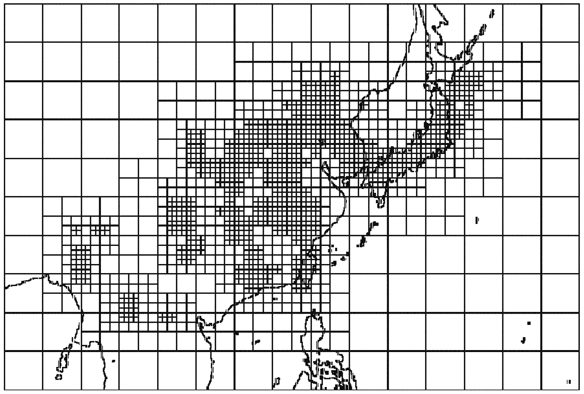

## Table of Contents

## What is an adaptive grid?

An adaptive grid is a type of grid that changes based on what it needs to do. Imagine you have a piece of graph paper where the lines can move around. If you need to draw something small, the lines can get closer together. If you need to draw something big, the lines can spread out. This makes it easier to work with different sizes and shapes.

In computers, adaptive grids are used in things like video games and simulations. They help the computer use its power better by focusing on important parts of the screen. For example, in a game, the grid might have more lines where there are a lot of details, like a busy city, and fewer lines where there's not much happening, like an empty field. This way, the game runs smoother and looks better.

## How does an adaptive grid differ from a fixed grid?

A fixed grid is like a piece of graph paper where the lines stay in the same place all the time. Once you draw the lines, they don't move. This can be good for things that don't change much, like drawing a simple picture or organizing data in a table. But if you need to work with different sizes or focus on different parts of your work, a fixed grid can be limiting.

An adaptive grid, on the other hand, is like graph paper where the lines can move around. If you need to draw something small, the lines can get closer together. If you need to draw something big, the lines can spread out. This makes it easier to work with different sizes and shapes. In computers, adaptive grids help by focusing on important parts, like making a game run smoother by having more lines where there are a lot of details and fewer lines where there's not much happening.

## What are the main components of an adaptive grid?

The main parts of an adaptive grid are the cells and the rules that change them. Cells are like the little squares on graph paper. They can get bigger or smaller depending on what you need. The rules are like instructions that tell the cells when and how to change. For example, if you're playing a game, the rules might say to make the cells smaller where there are a lot of details, like in a busy city.

Another important part is the algorithm that decides how the grid changes. This is like a smart helper that looks at what's happening and decides what to do next. It might look at where the player is in a game and make the grid more detailed around the player. This helps the game run smoothly and look good. So, the main parts are the cells, the rules, and the algorithm that makes it all work together.

## Why is an adaptive grid important in user interface design?

An adaptive grid is important in user interface design because it helps make things look good and work well on different devices. Imagine you're designing a website that people will look at on their phones, tablets, and computers. The screen sizes are all different, so you need a way to make sure your design fits well on each one. An adaptive grid can change its layout to fit any screen, making sure everything is easy to see and use no matter the device.

This flexibility also helps when you want to show different amounts of information. For example, if you're making an app, you might want to show more details on a bigger screen and less on a smaller one. An adaptive grid can adjust to show just the right amount of information, making the user experience better. By using an adaptive grid, designers can create interfaces that are easier to use and more enjoyable for everyone.

## How does an adaptive grid improve responsiveness on different devices?

An adaptive grid helps make websites and apps work well on different devices like phones, tablets, and computers. It does this by changing the way things are laid out on the screen. If you're looking at a website on your phone, the grid can make things smaller and move them around so they fit nicely on the smaller screen. On a bigger screen like a computer, the grid can spread things out so you can see more at once. This makes sure that no matter what device you're using, the website or app looks good and is easy to use.

This flexibility also means that the website or app can respond quickly to what you're doing. For example, if you turn your phone sideways, the grid can quickly adjust to fit the new screen shape. This makes the experience smoother because you don't have to wait for the page to reload or for things to move around slowly. By using an adaptive grid, designers can make sure that their websites and apps are responsive and work well on any device.

## What are the common challenges faced when implementing an adaptive grid?

One common challenge when implementing an adaptive grid is making sure it works well across different devices and screen sizes. It can be hard to test the grid on all possible devices because there are so many different types out there. Sometimes, what looks good on one device might not look good on another. Designers have to keep tweaking the grid to make sure it fits and looks right everywhere.

Another challenge is keeping the performance smooth. When the grid changes a lot, it can slow down the website or app. This is especially true if the grid has to handle a lot of information or if it's changing very often. Designers need to find a balance between making the grid flexible and keeping it fast. They might need to use smart algorithms to decide when and how the grid should change, so it doesn't use too much of the device's power.

## Can you explain the process of setting up an adaptive grid in a web design project?

Setting up an adaptive grid in a web design project starts with planning. You need to think about what your website or app will look like on different devices. You'll want to decide how the layout should change when someone looks at it on a phone, a tablet, or a computer. This means figuring out where things like buttons, pictures, and text should go on each screen size. Once you have a plan, you can start coding the grid. You'll use something called CSS (Cascading Style Sheets) to tell the grid how to change. CSS has special rules that let you set up different layouts for different screen sizes.

After you've coded the grid, you need to test it. This means looking at your website or app on as many different devices as you can. You'll want to see if everything fits well and looks good. If something doesn't look right, you'll need to go back and adjust your CSS rules. This can take a lot of time because there are so many different devices out there. But it's important to keep testing and tweaking until you're happy with how the grid works on all of them. Once you've got it right, your website or app will be easy to use and look good no matter what device someone is using.

## What are some popular tools or frameworks that support adaptive grid systems?

Some popular tools and frameworks that help with adaptive grid systems are Bootstrap and Foundation. Bootstrap is really easy to use and has a lot of ready-made parts that you can put into your website. It uses a 12-column grid that can change to fit different screen sizes. This means you can make your website look good on phones, tablets, and computers without a lot of extra work. Foundation is another tool that's good for making websites that work well on different devices. It also uses a grid system that can change, and it has a lot of options for customizing how your website looks.

Another tool that's popular is CSS Grid. This is a part of CSS that lets you make really flexible layouts. You can tell the grid how to change when the screen size changes, so your website can look good on any device. CSS Grid is built into modern web browsers, so you don't need to add any extra code to use it. It's a bit more complicated than Bootstrap or Foundation, but it gives you a lot of control over how your website looks.

## How do you test the effectiveness of an adaptive grid across various screen sizes?

Testing the effectiveness of an adaptive grid across different screen sizes starts with using a variety of devices. You should look at your website or app on phones, tablets, and computers to see how the grid changes. It's important to check if everything fits well and looks good on each device. You can also use tools like browser developer tools, which let you change the screen size on your computer to see how the grid would look on different devices. This helps you find any problems and fix them before your website or app goes live.

Another way to test the grid is to ask other people to try it out. They might notice things that you missed, like buttons that are too small on a phone or text that's hard to read on a tablet. You can also use online services that test your website on lots of different devices and give you a report on how it looks. This can save you a lot of time and help you make sure your adaptive grid works well everywhere. By testing thoroughly, you can make sure your website or app looks good and works well no matter what device someone is using.

## What advanced techniques can be used to enhance the functionality of an adaptive grid?

One advanced technique to enhance the functionality of an adaptive grid is to use media queries in CSS. Media queries let you set up different rules for different screen sizes. For example, you can tell the grid to have more columns on a big screen and fewer columns on a small screen. This makes your website or app look good on any device. You can also use media queries to change the size of text or pictures, so everything is easy to see and read no matter the screen size.

Another technique is to use JavaScript to make the grid even smarter. JavaScript can look at what the user is doing and change the grid in real time. For example, if someone is scrolling through a long page, JavaScript can make the grid show more important information at the top of the screen. This makes the website or app easier to use because the user doesn't have to scroll as much. By using JavaScript, you can make the grid react to what the user is doing, which makes the whole experience better.

## How does an adaptive grid integrate with other responsive design practices?

An adaptive grid works well with other responsive design practices to make websites and apps look good on any device. One way it does this is by working with flexible images. When you use an adaptive grid, you can set up your images to change size along with the grid. This means that pictures will shrink or grow to fit the screen, so they always look nice no matter if someone is using a phone or a computer. The grid and the images work together to make sure everything fits well and looks good.

Another way an adaptive grid integrates with responsive design is by using media queries. Media queries are like special rules in CSS that tell the website how to change when the screen size changes. The adaptive grid uses these rules to decide how many columns it should have and how big they should be. By working with media queries, the grid can make sure that the layout changes smoothly and everything stays easy to use. This makes the whole website or app more enjoyable for people using different devices.

## What are the future trends and potential developments in adaptive grid technology?

In the future, adaptive grid technology might get even smarter. Right now, grids can change based on screen size, but soon they might also change based on what you like or how you use the website. For example, if you often look at pictures, the grid might show more pictures on the screen. Or if you like big text, the grid could make the text bigger for you. This would make websites and apps feel more personal and easier to use for everyone.

Another big change could be how adaptive grids work with new technology like virtual reality (VR) and augmented reality (AR). As more people use VR and AR, websites and apps will need to work in these new spaces. An adaptive grid could change to fit the 3D world, making sure everything looks good and is easy to use no matter where you are looking. This would help make VR and AR experiences smoother and more enjoyable for everyone.

## What is Understanding Adaptive Grid Trading?

Adaptive grid trading is an algorithmic trading strategy that enables traders to set grid trading ranges either automatically or manually, thereby facilitating the execution of buy and sell orders at consistent intervals. This method is particularly adept for markets characterized by range-bound and oscillating behaviors where prices fluctuate within specific boundaries. Within such a framework, adaptive grid trading functions by allowing the automatic adjustment of the grid range when the prices approach the predefined upper or lower thresholds. This adaptability reduces the requirement for frequent manual interventions, streamlining the trading process.

The core advantage of this strategy lies in its simplicity and flexibility, making it accessible and easy to tailor to various trading conditions. Traders set predefined grid lines, which act as points for executing trades whenever prices hit these levels. In range-bound markets, prices oscillate within a set range, thus enabling the strategy to capitalize on these fluctuations by placing buy orders at lower grid levels and sell orders at higher ones.

To better understand adaptive grid trading, consider a basic setup where a trader defines an upper limit $U$ and a lower limit $L$ of a price range. The price interval $\Delta$ between each grid level can then be calculated as:

$$
\Delta = \frac{U - L}{n}
$$

where $n$ is the number of grid intervals desired within the range. As prices move within this defined grid, the adaptive component comes into play. Should prices consistently hit either the upper or lower limits, the strategy adjusts the grid limits dynamically, maintaining the efficiency of trades and mitigating potential losses from prolonged price trends.

An additional benefit of this systematic approach is in mitigating emotional trading decisions. The algorithm executes trades devoid of human emotional bias, which can be particularly detrimental in volatile conditions. Moreover, traders can adjust the grid density, or the gap between grid levels, to suit different market volatilities and trading objectives—making the system both resilient and robust under varying market conditions.

In summary, adaptive grid trading is characterized by its ability to optimize trading efficiency through automatic adjustments, making it ideal for managing trades in dynamic or range-bound markets without extensive manual oversight.

## What are the principles and parameters of strategy?

In adaptive grid trading, defining upper and lower limit prices is fundamental for establishing the parameters of the grid system. These limits can be determined through analysis of historical price data, capturing key resistance and support levels, or alternatively set manually based on the trader's strategic insights. Once these boundaries are established, they form the basis for arranging a grid of buy and sell orders.

The grid is constructed by dividing the price range, delineated by the upper and lower limits, into smaller segments or intervals. The calculation of these intervals is crucial. If $P_{upper}$ and $P_{lower}$ represent the upper and lower limit prices respectively, and $n$ is the number of desired grid levels, the price interval $\Delta P$ for each grid segment can be calculated as follows:

$$
\Delta P = \frac{P_{upper} - P_{lower}}{n}
$$

This interval indicates the systematic spacing at which buy and sell orders will be positioned, enabling the trader to capitalize on predictable price movements across the specified range. For instance, the strategy might place buy orders at each lower boundary of these intervals and sell orders at each upper boundary, facilitating a consistent trading approach.

Dynamic adjustment of these parameters is imperative to align the strategy with real-time market conditions. This flexibility ensures that the grid adapts to market [volatility](/wiki/volatility-trading-strategies) and [liquidity](/wiki/liquidity-risk-premium) changes. Traders can utilize algorithmic criteria or rules to dynamically modify $P_{upper}$, $P_{lower}$, or $n$ based on ongoing market analysis and trading objectives. For instance, should the market exhibit increased volatility, a trader might choose to decrease the interval $\Delta P$ to capitalize on more frequent oscillations.

A Python code snippet for setting up and dynamically adjusting grid parameters within an adaptive trading script might look like this:

```python
class AdaptiveGridTrading:
    def __init__(self, P_upper, P_lower, grid_levels):
        self.P_upper = P_upper
        self.P_lower = P_lower
        self.grid_levels = grid_levels
        self.delta_P = (P_upper - P_lower) / grid_levels

    def adjust_parameters(self, new_P_upper, new_P_lower, new_grid_levels):
        self.P_upper = new_P_upper
        self.P_lower = new_P_lower
        self.grid_levels = new_grid_levels
        self.delta_P = (self.P_upper - self.P_lower) / self.grid_levels

    def calculate_grid(self):
        grid_points = [self.P_lower + i * self.delta_P for i in range(self.grid_levels + 1)]
        return grid_points

# Example usage
grid_trader = AdaptiveGridTrading(100, 90, 10)
# Adjusting grid based on new market conditions
grid_trader.adjust_parameters(105, 95, 12)
grid_points = grid_trader.calculate_grid()
```

Here, the `AdaptiveGridTrading` class sets up the initial grid with designated upper and lower limits and calculates the interval for grid segments. The `adjust_parameters` method allows for real-time adaptation to market changes by recalibrating the grid based on updated inputs.

In summary, adaptive grid trading relies on the precise determination and adjustment of trading parameters. By implementing systematic buy and sell orders within calculated intervals and allowing flexibility in parameter adjustment, traders can better manage trades in various market conditions, thus optimizing their trading strategies.

## References & Further Reading

[1]: Leung, T., & Nguyen, H. (2015). ["Mean-reverting trading strategies."](https://books.google.com/books/about/Optimal_Mean_Reversion_Trading.html?id=P9bACwAAQBAJ) Studies in Computational Intelligence: Algorithmic and High-Frequency Trading, vol. 611, pp. 225-255.

[2]: Pardo, R. (2011). ["The Evaluation and Optimization of Trading Strategies"](https://onlinelibrary.wiley.com/doi/book/10.1002/9781119196969) (2nd ed.). Wiley Trading.

[3]: Chan, E.P. (2009). ["Quantitative Trading: How to Build Your Own Algorithmic Trading Business"](https://github.com/egorpe/EPChan-QuantitativeTrading/blob/master/example7_6.m). Wiley Trading.

[4]: Jansen, S. (2020). ["Machine Learning for Algorithmic Trading: Predictive models to extract signals from market and alternative data for systematic trading strategies with Python"](https://github.com/stefan-jansen/machine-learning-for-trading). Packt Publishing.

[5]: Lopez de Prado, M. (2018). ["Advances in Financial Machine Learning"](https://www.amazon.com/Advances-Financial-Machine-Learning-Marcos/dp/1119482089). Wiley Trading.