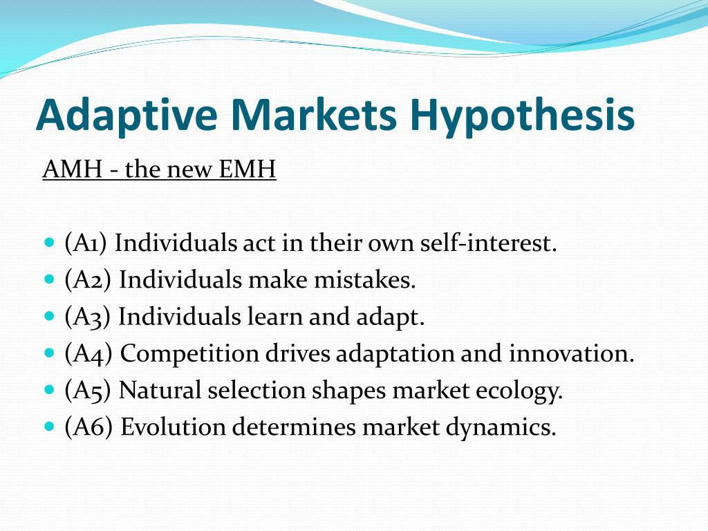

Adaptive market making is a sophisticated form of automated trading strategy employed in algorithmic trading that dynamically modifies quoting parameters and risk controls based on real-time market conditions. This adaptability is central to the strategy's effectiveness, as it allows for constant adjustments that maintain a balanced market. By optimizing spread management, quote sizes, and risk exposure, adaptive market making ensures the provision of liquidity and the efficiency of trade execution across diverse market situations.

One of the critical objectives of adaptive market making is to maintain a continuous two-sided market. This involves offering simultaneous buy and sell quotes that are adjusted according to prevailing market circumstances. Such adjustments are essential for minimizing bid-ask spreads and improving the overall trading experience for market participants. This continuous updating mechanism contributes to a more liquid market, facilitating better price discovery and reducing transaction costs for traders.



The capabilities of adaptive market making systems have been significantly enhanced by recent technological advancements, particularly in the field of machine learning. This technology enables the development of sophisticated models that can process vast quantities of market data in real-time. By extracting patterns and predicting future market movements, these models improve the decision-making process within market making systems. Machine learning algorithms contribute to more accurate estimations of fair value prices, improved risk assessments, and more efficient execution strategies. As a result, adaptive market making systems have become more robust and capable of thriving in modern high-frequency trading environments.

Ultimately, adaptive market making represents a complex interplay between finance and technology. As markets become increasingly volatile and interconnected, the reliance on these advanced systems will grow, underscoring the importance of continuous innovation in trading strategies. Machine learning and dynamic risk management will continue to shape the landscape of adaptive market making, making it a pivotal component in the evolution of algorithmic trading frameworks.

## Table of Contents

## Core Components of Adaptive Market Making

Adaptive market making systems are distinguished by their ability to continuously monitor and analyze a wide array of market indicators, ensuring optimal decision-making in fast-paced trading environments. A key aspect of these systems involves assessing market microstructure conditions, which include the intricacies of order placements, bids, asks, and the overall liquidity available in the market. Understanding these conditions allows market makers to discern patterns and execute trades that maintain market equilibrium.

Another critical component is the evaluation of order flow toxicity metrics. Order flow toxicity measures the likelihood of adverse selection, where a market maker might face potential losses due to informed trading by counterparts. High order flow toxicity signals that informed traders are active in the market, prompting adaptive systems to adjust quote prices and sizes to mitigate potential risks.

Inventory positions also play a significant role in the functioning of adaptive [market making](/wiki/market-making) systems. Constantly tracking and managing inventory helps in balancing supply and demand, thus avoiding large imbalances that could lead to increased risk exposure. Effective inventory management ensures that market makers can provide [liquidity](/wiki/liquidity-risk-premium) consistently without taking on outsized risks.

In their pursuit of profitability and risk balance, these systems tailor their strategies according to varying [volatility](/wiki/volatility-trading-strategies) regimes and execution costs. During periods of heightened volatility, market makers may widen spreads to compensate for increased risk, while in stable market conditions, they might narrow spreads to capture more trading [volume](/wiki/volume-trading-strategy). Execution costs, such as transaction fees and slippage, are also continuously monitored and factored into the decision-making process to ensure cost-efficient operations.

Competitor behavior is an additional metric that adaptive market making systems scrutinize meticulously. By observing the actions of other market participants, these systems can anticipate shifts in supply and demand dynamics, allowing for timely and informed adjustments in trading strategies. Being agile in responding to competitor actions helps maintain a competitive edge and optimize the execution of trades.

Overall, the core components of adaptive market making systems are designed to interact dynamically with the trading environment. By integrating real-time data analysis and leveraging advanced computational techniques, these systems strive to achieve the delicate balance between liquidity provision, risk management, and profitability.

## Dynamic Parameter Adjustment

Adaptive market making requires the continual adjustment of key parameters such as realized volatility, recent fill probability, and historical trade patterns. This ongoing recalibration plays a crucial role in maintaining competitive bid-ask spreads and effectively managing inventory positions. 

Realized volatility is a primary focus for market makers, serving as an indicator of the current market climate, which dictates the width of spreads. For example, when the market experiences increased volatility, spreads generally widen to price in the heightened risk. Conversely, in stable conditions, market makers can offer tighter spreads to capture more order flow.

Recent fill probability is another vital metric. It indicates the likelihood of a quoted order being executed within a given timeframe. By analyzing recent trades and market depth, market makers can optimize their quoting strategies to enhance their order fill rates. A higher probability of execution often necessitates adjusting the order size and prices to align with prevailing market conditions.

Historical trade patterns provide insights into recurring market behaviors that can inform trading decisions. By reviewing past market data, adaptive market making systems identify trends and anomalies that may indicate future price movements. This historical perspective aids in recalibrating quoting parameters to improve resilience and profitability.

These adjustments are powered by comprehensive data analysis processes. Market makers leverage sophisticated algorithms and substantial computational resources to process large datasets in real time. This analysis enables them to forecast potential market impacts and adjust strategies accordingly to minimize adverse effects.

For instance, Python libraries such as `pandas`, `numpy`, and `scikit-learn` facilitate the manipulation and modeling of large datasets. An example code snippet for calculating realized volatility in Python might look like this:

```python
import numpy as np
import pandas as pd

def calculate_realized_volatility(price_series, window=252):
    log_returns = np.log(price_series / price_series.shift(1))
    realized_volatility = log_returns.rolling(window=window).std() * np.sqrt(window)
    return realized_volatility

price_data = pd.Series([100, 102, 101, 103, 107, 110, 108])  # Example price series
volatility = calculate_realized_volatility(price_data)
print(volatility)
```

Through these dynamic adjustments, adaptive market making systems effectively forecast and minimize market impact, ensuring strategies remain profitable while keeping risk within acceptable limits. By continuously fine-tuning parameters and leveraging data-driven insights, these systems maintain a competitive edge in the rapidly evolving marketplace.

## Risk Management Framework

Adaptive market making relies heavily on a rigorous risk management framework to ensure that trading activities are conducted within acceptable risk limits. The cornerstone of such a framework is the implementation of layered risk controls, which provide a multi-faceted approach to managing exposure.

Key aspects of these controls include setting inventory limits, which restrict the amount of a particular asset that can be held at any given time. This measure prevents overexposure to a single asset, thereby reducing the potential for significant losses. For example, if a market maker has a pre-set inventory limit of 1,000 shares for a specific stock, any attempt to exceed this limit would be automatically blocked by the system.

Another critical component of the risk management framework is volatility estimation. Market makers must continually update their volatility estimates to reflect the current market environment. These estimates are crucial for adjusting quoting strategies and managing positions. Volatility can be estimated using historical price data and statistical models. One common approach is the calculation of the standard deviation of recent price changes:

$$
\sigma = \sqrt{\frac{1}{N-1} \sum_{i=1}^{N} (x_i - \bar{x})^2}
$$

where $x_i$ represents individual price observations, $\bar{x}$ is the mean price over the period, and $N$ is the number of observations.

Regulatory compliance forms another pillar of the adaptive market making risk framework. Market makers must adhere to industry regulations, which may include maintaining certain capital reserves or reporting trade activities to regulatory bodies. Compliance ensures that market makers operate within the legal guidelines and maintain the integrity of the market.

Real-time risk assessment is integral to adaptive market making. It involves the continuous monitoring of various market factors, including price movements, trading volumes, and competitor actions. Systems equipped with real-time analytics can quickly identify emerging risks and adjust strategies accordingly. For instance, if an unexpected surge in volatility is detected, the system might tighten spreads or reduce order sizes to mitigate risk.

By employing these strategies, firms engaged in adaptive market making can effectively minimize financial setbacks and sustain operational integrity. The meticulous management of market exposure through these layered controls not only protects the firm from potential market dislocations but also ensures that market making activities contribute to the overall efficiency and stability of financial markets.

## Role of Machine Learning

Machine learning algorithms have become integral to the evolution of adaptive market making strategies, offering significant enhancements in adaptability and efficiency. These algorithms facilitate the prediction of short-term price movements by processing large volumes of historical and real-time data. For instance, time series analysis methodologies like ARIMA (AutoRegressive Integrated Moving Average) or LSTM (Long Short-Term Memory) networks can be used to model and forecast time-dependent fluctuations in asset prices.

In the context of estimating fill probabilities, [machine learning](/wiki/machine-learning) models such as logistic regression or more advanced techniques like gradient boosting classifiers can be employed. These models use features including [order book](/wiki/order-book-trading-strategies) depth, recent trade volumes, and current volatility levels to estimate the likelihood that a given order will be executed within a specified timeframe. 

Detecting regime changes is another critical area where machine learning contributes significantly. Change-point detection algorithms, including Hidden Markov Models (HMM) and Bayesian Change Point Detection, are essential tools for identifying shifts in market conditions. These shifts might include transitions from low to high volatility periods or the onset of market stress due to macroeconomic news.

One of the profound advantages of integrating machine learning in market making is the capability of continuous learning. Adaptive systems are designed to iteratively improve their models by assimilating new market data. This is realized through [reinforcement learning](/wiki/reinforcement-learning) techniques that dynamically update decision-making policies based on a reward system tied to specific objectives such as profitability or risk minimization. 

Here is a simple example using Python to illustrate this process:

```python
from sklearn.ensemble import GradientBoostingClassifier
import numpy as np

# Define sample features for model training
X = np.array([[5, 20], [10, 30], [15, 25], [20, 35]])
# Define target outcomes (0 = no fill, 1 = fill)
y = np.array([0, 1, 1, 0])

# Create and train the model
clf = GradientBoostingClassifier(n_estimators=50, learning_rate=0.1, max_depth=3)
clf.fit(X, y)

# Predict fill probabilities for new data
new_data = np.array([[12, 28], [18, 40]])
fill_probs = clf.predict_proba(new_data)
print("Estimated fill probabilities:", fill_probs)
```

Through such continuous learning processes, machine learning systems are able to refine their strategies over time, thus maintaining a competitive advantage in fast-evolving market environments. As markets become increasingly complex, the reliance on machine learning will likely intensify, leading to further innovations in adaptive market making.

## Market Regime Detection

Adaptive market making systems employ sophisticated techniques for market regime detection to navigate the complexities of financial markets. These systems classify market conditions into various regimes, such as normal trading periods, high volatility phases, and news-driven environments. The capability to dynamically adjust to these regimes in real-time is fundamental for mitigating risks and exploiting potential opportunities.

1. **Market Regime Classification**: Adaptive systems leverage statistical models and machine learning algorithms to categorize the prevailing market environment. This categorization is based on indicators such as price volatility, volume anomalies, and liquidity changes. By evaluating these factors, the systems can identify market conditions that deviate from historical norms.

2. **Real-Time Strategy Adaptation**: Once a specific market regime is identified, adaptive market making systems dynamically alter their trading strategies. For example, during high volatility periods, the systems might widen their bid-ask spreads to account for increased risk, while during normal trading periods, spreads may be tightened to enhance competitiveness. In scenarios like flash crashes, the systems may temporarily withdraw from the market to avoid adverse impacts.

3. **Handling Flash Crashes and Anomalies**: The ability to detect and respond to anomalies such as flash crashes is critical. During such events, market prices may deviate significantly from fundamental values within a very short timeframe. Adaptive systems are designed to detect these anomalies and adjust their quoting behavior to protect against substantial losses.

4. **Preemptive Risk Management**: Market regime detection plays a pivotal role in risk management. By predicting shifts in market regimes, trading systems can preemptively adjust their risk parameters. This proactive approach enables the mitigation of potential losses during uncertain market conditions, ensuring that trading operations remain within acceptable risk limits.

5. **Exploiting Emerging Opportunities**: Besides risk management, detecting market regimes presents opportunities to capitalize on emerging market trends. For instance, during news-driven markets, where information asymmetry may be heightened, adaptive systems can leverage their real-time analytical capabilities to execute trades that benefit from the rapidly changing information landscape.

Implementing a robust market regime detection framework requires continuous monitoring and analysis of market data. Using advanced computational techniques, these systems can deliver insights that are crucial for effective trading strategies and risk management. The evolving nature of financial markets necessitates that adaptive systems remain agile, continually refining their detection methodologies to maintain a competitive edge.

## Performance Optimization

Performance optimization in adaptive market making is essential for maintaining efficiency and competitiveness in dynamic financial environments. A key aspect of this optimization is the reduction of tick-to-trade latency, which involves minimizing the time interval between receiving market data and executing a trade. This latency can be decreased through several methodologies, including the deployment of advanced algorithms and hardware acceleration.

Pre-trade risk checks are another crucial element in performance optimization. These checks ensure that trades are executed within predefined risk parameters, safeguarding against potential losses. Enhancing pre-trade risk assessments involves using high-frequency data analysis to rapidly evaluate potential risks associated with each trade. Such assessments should be efficient enough to maintain rapid trading speeds without compromising the robustness of risk controls.

Efficient processing of market data is vital, especially during periods of heightened volatility. Quick adaptation to market changes requires real-time data processing capabilities to update quotes swiftly. This capability can be achieved through the use of high-performance computing frameworks and optimized algorithmic logic. Data structures must be designed to prioritize speed and accuracy, potentially using techniques like parallel processing to handle large volumes of data concurrently.

High-throughput databases, such as QuestDB, play a significant role in supporting the demanding performance needs of adaptive market making systems. These databases are optimized for high-speed time-series data operations, providing the necessary throughput for rapid data ingestion and retrieval. By leveraging such databases, trading systems can ensure that the latest market information is available instantly, allowing for real-time decision-making.

Integrating these components effectively requires a combination of software and hardware optimizations. On the software side, implementing efficient algorithms that minimize computational complexity is crucial. One might utilize Python libraries like NumPy for numerical operations or PyPy for increased execution speed. For instance, a simple Python function using NumPy might look like this:

```python
import numpy as np

def update_quotes(market_data, current_quotes):
    price_updates = np.diff(market_data)
    new_quotes = current_quotes + price_updates * 0.5 # Example adjustment factor
    return new_quotes
```

Hardware optimizations might involve using FPGA (Field-Programmable Gate Array) or GPU (Graphics Processing Unit) technologies to accelerate data processing tasks. Combining these technologies allows market makers to process vast amounts of information and execute trades more swiftly than ever before, crucial for maintaining a competitive edge in fast-paced trading environments. 

In conclusion, by optimizing latency, enhancing risk checks, and integrating advanced technologies, adaptive market making systems can achieve superior performance, ensuring both efficiency and competitiveness in responding to market changes.

## Conclusion

Adaptive market making represents a sophisticated intersection of finance and technology, enabling traders to effectively manage risk and optimize performance. As financial markets become increasingly complex and data-driven, these strategies are set to rely heavily on technological advancements and the integration of real-time data analysis. The continuous growth of market data, driven by high-frequency trading and increasing market events, demands that adaptive market making systems remain agile and responsive.

Machine learning is playing a pivotal role in this evolution by allowing market makers to develop systems capable of predicting short-term market movements with improved accuracy. These systems enhance decision-making by processing vast amounts of data, enabling the prediction of price changes and trading opportunities. As a result, machine learning aids in optimizing spreads, managing inventories, and minimizing market impact efficiently.

Dynamic risk management frameworks, which incorporate real-time data analysis, are essential in maintaining operational integrity and mitigating potential financial losses. These frameworks involve executing strategies that adapt to varying market conditions, minimizing risks, and capitalizing on emerging trading opportunities. By employing advanced algorithms and data-driven approaches, firms can ensure robust performance under diverse market regimes.

As financial markets and trading technologies continue to advance, the field of adaptive market making will likely experience significant innovations. The ongoing integration of machine learning and real-time analytics is expected to drive these developments, further enhancing the adaptability and efficiency of market-making strategies. Continued improvements in [algorithmic trading](/wiki/algorithmic-trading) frameworks will equip traders with the tools necessary to navigate the dynamic landscape of modern financial markets effectively.

## References & Further Reading

[1]: Bouchaud, J.-P., & Potters, M. (2009). ["Theory of Financial Risk and Derivative Pricing: From Statistical Physics to Risk Management"](https://www.researchgate.net/publication/248072283_Theory_of_Financial_Risk_and_Derivative_Pricing_From_Statistical_Physics_to_Risk_Management). Cambridge University Press.

[2]: Cartea, Á., Jaimungal, S., & Penalva, J. (2015). ["Algorithmic and High-Frequency Trading"](https://assets.cambridge.org/97811070/91146/frontmatter/9781107091146_frontmatter.pdf). Cambridge University Press.

[3]: Avellaneda, M., & Stoikov, S. (2008). ["High-frequency trading in a limit order book."](https://www.tandfonline.com/doi/full/10.1080/14697680701381228) Quantitative Finance, 8(3), 217-224.

[4]: Foucault, T., Kadan, O., & Kandel, E. (2005). ["Limit Order Book as a Market for Liquidity"](https://papers.ssrn.com/sol3/papers.cfm?abstract_id=269908). The Review of Financial Studies, 18(4), 1171-1217.

[5]: Lopez de Prado, M. (2018). ["Advances in Financial Machine Learning"](https://www.amazon.com/Advances-Financial-Machine-Learning-Marcos/dp/1119482089). Wiley.

[6]: Gates, S. (2019). ["Algorithmic Trading: Winning Strategies and Their Rationale"](https://www.wiley.com/en-us/Algorithmic+Trading%3A+Winning+Strategies+and+Their+Rationale-p-9781118460146). Wiley.

[7]: Abernethy, J., Kale, S., & Vaughan, J. W. (2013). ["Adaptive Market Making via Online Learning"](https://proceedings.neurips.cc/paper/2013/file/995e1fda4a2b5f55ef0df50868bf2a8f-Paper.pdf). Journal of Machine Learning Research, 12, 2121-2159.

[8]: Jansen, S. (2020). ["Machine Learning for Algorithmic Trading"](https://github.com/stefan-jansen/machine-learning-for-trading). Packt Publishing.