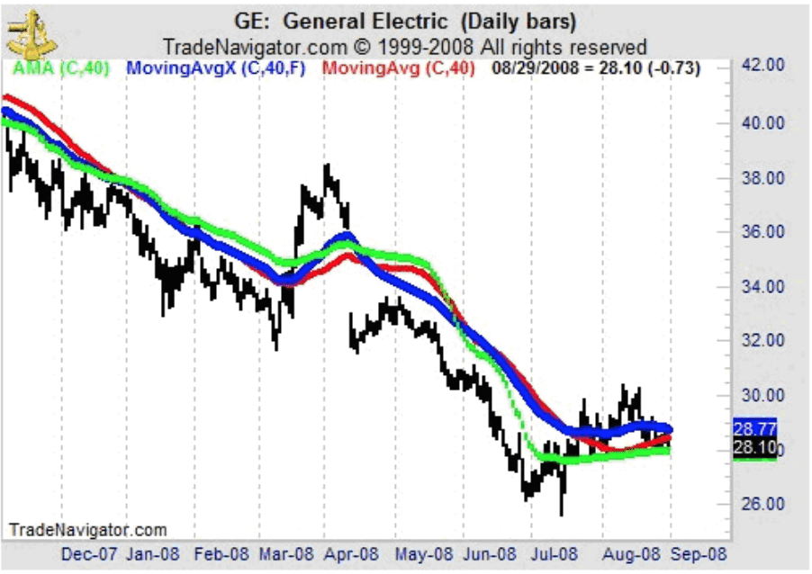

## Table of Contents

## What is an Adaptive Moving Average (AMA)?

An Adaptive Moving Average (AMA) is a type of moving average used in technical analysis that adjusts its sensitivity based on market volatility. Unlike traditional moving averages, which have a fixed period, the AMA changes its period dynamically to respond more quickly to price changes when the market is volatile and more slowly when the market is stable. This adaptability makes it useful for traders who want to minimize lag during fast market moves and reduce false signals during quieter periods.

The AMA was developed by Perry Kaufman and uses an efficiency ratio to determine how quickly it should adapt to new price data. The efficiency ratio measures the directional movement of the price relative to the total price movement over a given period. If the price is moving in a strong, consistent direction, the efficiency ratio will be high, causing the AMA to become more sensitive. Conversely, if the price is moving erratically or not moving much at all, the efficiency ratio will be low, and the AMA will become less sensitive. This feature helps traders to better follow trends and make more informed trading decisions.

## How does the Adaptive Moving Average differ from traditional moving averages?

The Adaptive Moving Average (AMA) and traditional moving averages both help traders see trends, but they work differently. Traditional moving averages, like the Simple Moving Average (SMA) or the Exponential Moving Average (EMA), use a set number of periods to calculate their values. For example, a 20-day SMA always looks at the last 20 days of price data. This fixed period means that these moving averages can be slow to react to sudden changes in the market, which can lead to delays in spotting new trends.

On the other hand, the AMA changes how quickly it reacts based on how the market is moving. It uses something called an efficiency ratio to figure out if the market is trending strongly or just moving around without much direction. When the market is moving a lot in one direction, the AMA becomes more sensitive and adjusts faster. If the market is quiet or moving erratically, the AMA slows down its adjustments. This makes the AMA better at following the market's ups and downs without getting too many false signals, which can be a big help for traders trying to make quick decisions.

## What is the formula used to calculate the Adaptive Moving Average?

The Adaptive Moving Average (AMA) uses a special formula to change how it reacts to price changes. It starts by figuring out something called the efficiency ratio (ER). The ER looks at how much the price has moved in one direction compared to all its movements over a certain time. You find the ER by taking the absolute difference between the current price and the price from a few periods ago, then dividing that by the sum of all the absolute price changes over those periods. If the price is moving strongly in one direction, the ER will be close to 1. If it's moving around a lot without going anywhere, the ER will be closer to 0.

Once you have the ER, you use it to find the smoothing constant (SC). The SC decides how quickly the AMA will change. It's calculated using the ER, along with two other numbers called the fast and slow constants. The fast constant is usually set to 2/(3+1) and the slow constant to 2/(30+1), but you can change these if you want. The SC is found by taking the fast constant minus the slow constant, multiplying that by the ER, and then adding the slow constant. Finally, the AMA is calculated using the SC. You take the current AMA, add the SC times the difference between the current price and the current AMA, and that gives you the new AMA. This way, the AMA can adjust quickly or slowly depending on what the market is doing.

## What are the key parameters of the AMA and how do they affect its performance?

The Adaptive Moving Average (AMA) uses a few key parameters to work well. The main one is the efficiency ratio (ER), which looks at how the price is moving. If the price is going strongly in one direction, the ER will be high, making the AMA react quickly. If the price is just moving around without going anywhere, the ER will be low, and the AMA will take its time to adjust. Another important parameter is the smoothing constant (SC), which is figured out using the ER and two other numbers called the fast and slow constants. The fast constant makes the AMA quick to change, while the slow constant makes it slower.

These parameters affect how the AMA works by changing how sensitive it is to new price data. A high ER means the market is trending, so the AMA uses a higher SC to catch up with the trend faster. This can help traders spot new trends quicker but might also lead to more false signals if the market suddenly changes direction. On the other hand, a low ER means the market is not moving much, so the AMA uses a lower SC to avoid reacting too much to small price changes. This can help reduce false signals during quiet times but might make the AMA slower to catch new trends. By adjusting these parameters, traders can make the AMA work better for different market conditions.

## How does the AMA adapt to market volatility?

The Adaptive Moving Average (AMA) changes how it works based on how much the market is moving around. It uses something called the efficiency ratio (ER) to figure out if the market is going up or down a lot or just moving a little bit. If the market is moving a lot in one direction, the ER will be high, and the AMA will start to change quickly to keep up with the market. This helps traders see new trends faster when the market is really moving.

On the other hand, if the market is not moving much or is just going back and forth, the ER will be low. When this happens, the AMA slows down and doesn't change as much. This helps to avoid getting tricked by small price changes that don't mean much. By doing this, the AMA can help traders make better decisions by reacting to the market in a way that makes sense for how the market is behaving at that time.

## What are the advantages of using an Adaptive Moving Average in trading?

Using an Adaptive Moving Average (AMA) in trading can help traders in a big way. The AMA changes how it works based on how the market is moving. When the market is going up or down a lot, the AMA gets quick and follows the trend closely. This means traders can see new trends faster and make decisions based on what's happening right now. It's like having a tool that can keep up with fast changes in the market, which can be really helpful for making quick trades.

On the other hand, when the market is not moving much or is just going back and forth, the AMA slows down. This helps traders avoid getting tricked by small price changes that don't mean much. By not reacting too much to these small moves, the AMA can help traders stay focused on the bigger picture and avoid making bad trades based on noise in the market. This makes the AMA a good tool for traders who want to follow trends without getting too many false signals.

## Can you provide a step-by-step example of calculating the AMA?

Let's say we want to calculate the Adaptive Moving Average (AMA) for a stock over 10 days. We'll start with the efficiency ratio (ER). Imagine the stock's price today is $50, and 10 days ago it was $45. The absolute difference between these prices is $5. Now, we need to find the total price movement over these 10 days. Let's say the daily price changes were $0.5, -$0.3, $0.7, -$0.2, $0.4, -$0.1, $0.6, -$0.3, $0.5, and $0.2. The sum of the absolute values of these changes is $3.9. The ER is then calculated as $5 divided by $3.9, which equals about 1.28. But since ER can't be more than 1, we'll use 1 for this example.

Next, we use the ER to find the smoothing constant (SC). Let's say we're using the common fast constant of 2/(3+1) = 0.5 and the slow constant of 2/(30+1) = 0.0645. The SC is calculated as (fast constant - slow constant) * ER + slow constant, which is (0.5 - 0.0645) * 1 + 0.0645 = 0.4355. Now, we can calculate the AMA. Let's say the AMA for the previous day was $48. The new AMA is the old AMA plus the SC times the difference between today's price and the old AMA, so it's $48 + 0.4355 * ($50 - $48) = $48 + 0.4355 * 2 = $48 + 0.871 = $48.871. This is how the AMA adapts to the market's movements, giving us a new value that reflects recent price changes.

## How does the AMA perform in trending versus ranging markets?

The Adaptive Moving Average (AMA) does a good job in trending markets. When the market is moving a lot in one direction, the AMA speeds up and follows the trend closely. This means it can help traders see new trends faster. For example, if a stock price is going up steadily, the AMA will start to go up too, helping traders know that it's a good time to buy. This quick reaction can be really helpful for traders who want to make quick decisions based on what's happening right now.

In ranging markets, where the price is just moving up and down without going anywhere, the AMA slows down. This helps to avoid getting tricked by small price changes that don't mean much. If the stock price is just bouncing around, the AMA won't move as much, helping traders stay focused on the bigger picture. By not reacting too much to these small moves, the AMA can help traders avoid making bad trades based on noise in the market. This makes the AMA a good tool for traders who want to follow trends without getting too many false signals.

## What are common strategies for using the AMA in trading systems?

One common strategy for using the Adaptive Moving Average (AMA) in trading is to use it as a trend-following indicator. When the AMA starts to move up or down quickly, it can show that the market is trending. Traders can use this signal to buy when the AMA is going up and sell when it's going down. This way, they can follow the trend and make trades that go along with the market's direction. It's like having a guide that helps you know when to jump on a moving train.

Another strategy is to use the AMA to spot when the market is ranging. When the AMA is moving slowly and not changing much, it can mean the market is just going back and forth without a clear direction. Traders can use this information to stay out of the market or use other tools like support and resistance levels to make trades. This helps them avoid making bad trades based on small price changes that don't mean much. By understanding when the market is ranging, traders can be more patient and wait for better opportunities.

## How can the AMA be combined with other indicators for enhanced analysis?

Traders often use the Adaptive Moving Average (AMA) along with other indicators to get a better picture of what's happening in the market. One popular way is to use the AMA with the Relative Strength Index (RSI). The RSI helps traders see if a stock is overbought or oversold. When the AMA shows a strong trend and the RSI is overbought, it might be a good time to sell. If the AMA is trending and the RSI is oversold, it could be a good time to buy. By using both indicators together, traders can make more informed decisions about when to enter or exit trades.

Another way to use the AMA is with the Moving Average Convergence Divergence (MACD). The MACD helps traders spot changes in the strength, direction, momentum, and duration of a trend. When the AMA is moving up and the MACD line crosses above its signal line, it can be a strong buy signal. If the AMA is going down and the MACD line crosses below its signal line, it might be a good time to sell. Combining the AMA with the MACD can help traders catch trends early and make trades that follow the market's direction more effectively.

## What are the potential pitfalls and limitations of using the AMA?

Using the Adaptive Moving Average (AMA) can be tricky because it might give you false signals sometimes. When the market is moving a lot, the AMA can change quickly. This can be good for catching trends, but it can also make you think there's a trend when there isn't one. If the market suddenly changes direction, the AMA might keep moving the old way for a bit, which can lead to bad trades. Also, the AMA uses a lot of math to figure out how fast it should change, and if you don't set the right numbers for the fast and slow constants, it might not work as well as you want.

Another thing to watch out for is that the AMA might not be as helpful in markets that are just going up and down without a clear direction. When the market is ranging, the AMA slows down, which can be good for avoiding false signals, but it might also make you miss out on small trading opportunities. It's important to remember that no indicator, including the AMA, is perfect. You should always use it with other tools and not rely on it alone to make trading decisions.

## How can one optimize the settings of the AMA for specific financial instruments?

To optimize the settings of the Adaptive Moving Average (AMA) for specific financial instruments, you need to look at how that instrument usually moves. Different stocks, currencies, or commodities can have different levels of volatility and trends. For example, if you're trading a stock that moves a lot and has strong trends, you might want to set the fast constant higher so the AMA can catch those trends faster. On the other hand, if you're trading something that doesn't move much or has a lot of small ups and downs, you might want to set the slow constant higher to avoid getting tricked by those small changes.

You can also try different settings and see how the AMA works with past price data. This is called backtesting. By looking at how the AMA would have worked in the past with different settings, you can find the best numbers for the fast and slow constants that fit the way your financial instrument moves. Remember, what works for one stock or market might not work for another, so it's important to keep testing and adjusting the settings as the market changes.

## What is Understanding Adaptive Moving Averages?

Adaptive Moving Averages (AMAs) are a class of technical analysis tools that dynamically adjust their parameters to account for changes in a financial instrument's price volatility. The Kaufman's Adaptive Moving Average (KAMA), developed by Perry J. Kaufman, is particularly noteworthy among these because of its ability to differentiate between significant price changes and market noise. This selectivity is made possible by KAMA's design, which moderates the speed and sensitivity of the moving average based on the observed volatility.

Traditional moving averages, such as the simple moving average (SMA) or the exponential moving average (EMA), apply a fixed weighting to price data over time. This structure often results in delayed reactions to swift market changes and generates false signals during periods of low volatility due to an inability to filter out noise effectively. In contrast, KAMA employs a more nuanced approach by adapting to market conditions, providing more responsive and reliable signals.

The adaptation mechanism of KAMA revolves around the concept of an Efficiency Ratio (ER), which gauges how efficiently prices are moving. The ER is calculated as follows:

$$

ER = \frac{\text{Change in Price}}{\text{Sum of Absolute Price Changes}}
$$

where "Change in Price" is the absolute difference between the current price and a price n periods earlier, and "Sum of Absolute Price Changes" is the total of absolute differences of the price over the same period. A higher ER indicates strong trending behavior with minimal volatility, whereas a lower ER suggests the presence of noise rather than a true market trend.

KAMA then integrates this ER into its smoothing constant (SC), which modulates the sensitivity of the moving average. The formula for adjusting the SC is:

$$

SC = [ER \times (2/(\text{fastest SC} + 1) - 2/(\text{slowest SC} + 1)) + 2/(\text{slowest SC} + 1)]^2
$$

The SC values control how quickly KAMA responds to new price information. Faster SC corresponds to higher sensitivity and follows prices closely, while a slower SC results in a smoother response, filtering out short-term fluctuations effectively.

Programming languages like Python can be used to implement KAMA. A basic implementation involves iterating over the price data, applying the aforementioned formulas to continuously adjust the moving average:

```python
def calculate_kama(prices, n, fastest_sc, slowest_sc):
    kama = [prices[0]]

    for i in range(1, len(prices)):
        change_in_price = abs(prices[i] - prices[max(0, i - n)])
        sum_of_changes = sum(abs(prices[j] - prices[j - 1]) for j in range(max(1, i - n + 1), i + 1))

        er = change_in_price / sum_of_changes if sum_of_changes != 0 else 0
        sc = ((er * (2 / (fastest_sc + 1) - 2 / (slowest_sc + 1)) + 2 / (slowest_sc + 1))**2)

        new_kama = kama[-1] + sc * (prices[i] - kama[-1])
        kama.append(new_kama)

    return kama
```

This code snippet calculates KAMA for a given time series of prices, taking into account a set period $n$ and specified fastest and slowest smoothing constants. The function dynamically adapts to market conditions, effectively filtering out noise, and providing traders with clearer trading signals.

## What are the benefits of using KAMA in algo trading?

Kaufman’s Adaptive Moving Average (KAMA) stands out in [algorithmic trading](/wiki/algorithmic-trading) due to its unique ability to adapt to changing market conditions, making it particularly beneficial for strategies like mean-reversion and trend-following. Unlike traditional moving averages, KAMA adjusts its sensitivity based on market [volatility](/wiki/volatility-trading-strategies), allowing it to provide a clearer distinction between meaningful price movements and market noise. This adaptability is crucial in reducing false signals, which are often a challenge in algorithmic trading.

In the context of mean-reversion strategies, KAMA can help traders identify potential reversal points by signaling when prices deviate significantly from their average. This is achieved due to KAMA's capability to slow down during sideways markets and speed up during trending conditions. By filtering out insignificant price changes, KAMA helps traders make better-informed decisions, reducing unnecessary trades and enhancing the precision of their algorithms.

For trend-following approaches, KAMA's responsiveness to price changes allows traders to capture trends more effectively. It dynamically adjusts to market conditions, ensuring that the generated signals remain relevant across different market phases. The ability to adapt not only improves the timing of entry and [exit](/wiki/exit-strategy) points but also maximizes the potential for capturing price movements fully.

Traders can further optimize their entry and exit points by leveraging KAMA's dynamic nature. By doing so, they enhance their system’s efficiency and potentially increase profitability. In practical terms, KAMA's formula incorporates an Efficiency Ratio (ER), which measures price efficiency, and a Smoothing Constant (SC), tailored to adapt to the given volatility:

$$
KAMA_t = KAMA_{t-1} + SC \times (Price_t - KAMA_{t-1})
$$

where

$$
ER = \frac{\text{Change in Price over N periods}}{\text{Sum of absolute price changes over N periods}}
$$

and SC is calculated based on ER to ensure that KAMA adapts its responsiveness appropriately.

As these factors work together, KAMA allows algorithmic traders to refine their strategies, thereby capitalizing on market opportunities while mitigating risks associated with short-term price fluctuations.

## How do you calculate KAMA: A Step-by-Step Guide?

To compute the Kaufman's Adaptive Moving Average (KAMA), it's essential to follow a systematic process involving the Efficiency Ratio (ER), the Smoothing Constant (SC), and the final calculation of the KAMA values. This structured method ensures that KAMA responds effectively to market dynamics.

### Step 1: Calculate the Efficiency Ratio (ER)

The Efficiency Ratio is a critical component that measures the price efficiency over a specific period. It is calculated using the formula:

$$
ER = \frac{{\text{Change in price over the period}}}{{\text{Sum of absolute price changes over the period}}}
$$

The change in price is simply the absolute difference between the current price and the price n periods ago. The sum of absolute price changes refers to the total of the absolute differences in closing prices between each successive day within the period.

### Step 2: Determine the Smoothing Constant (SC)

The Smoothing Constant modulates the sensitivity of KAMA and is derived from market volatility. It uses the Efficiency Ratio and two user-defined constants, $\text{fast}$ (least lag) and $\text{slow}$ (most lag), typically chosen as 2 and 30 respectively. The formula is:

$$
SC = \left(\frac{{ER \times (\text{fast} - \text{slow}) + \text{slow}}}{\text{scaling [factor](/wiki/factor-investing)}}\right)^2
$$

The scaling factor, often set at 30, ensures the smoothing process is appropriately scaled.

### Step 3: Compute KAMA

Once ER and SC are determined, you can calculate KAMA using the following iterative formula:

$$
KAMA_{\text{today}} = KAMA_{\text{yesterday}} + SC \times (\text{Price}_{\text{today}} - KAMA_{\text{yesterday}})
$$

The iterative nature of this calculation allows KAMA to dynamically adapt as market conditions fluctuate, thereby providing a reliable tool for traders on platforms like Zerodha.

### Example Python Implementation

Here is a basic Python function to calculate KAMA:

```python
import numpy as np

def calculate_kama(prices, n=10, fast=2, slow=30):
    kama = np.zeros_like(prices)
    er = np.zeros_like(prices)

    price_change = np.abs(prices[n:] - prices[:-n])
    volatility = np.sum(np.abs(np.diff(prices[:n])))

    for i in range(n, len(prices)):
        volatility += np.abs(prices[i] - prices[i-1])
        er[i] = price_change[i-n] / volatility if volatility != 0 else 0
        sc = ((er[i] * (fast - slow) + slow) / 30) ** 2
        kama[i] = kama[i-1] + sc * (prices[i] - kama[i-1])

    return kama

prices = np.array([/* list of price data */])
kama = calculate_kama(prices)
```

This code provides a foundation for calculating KAMA, which traders can modify or extend to incorporate into their trading algorithms on platforms like Zerodha, adapting dynamically to market volatility.

## What are the challenges and limitations?

While Kaufman’s Adaptive Moving Average (KAMA) presents many advantages for traders, it is essential to acknowledge its challenges and limitations. Despite its ability to adapt to market conditions and filter out noise, thereby providing potentially more accurate signals, KAMA is still susceptible to generating false signals, particularly during periods of heightened market volatility or erratic price movements. These false signals can lead to erroneous trades that might not align with a trader's strategic objectives, thus impacting profitability.

The calculation and implementation of KAMA in trading systems require a deep understanding of both algorithmic trading and technical analysis. The complexity arises from the series of mathematical computations involved in its derivation. Calculating KAMA entails determining the Efficiency Ratio (ER) and the smoothing constant (SC), both of which are crucial for KAMA's adaptability. The ER is computed using the formula:

$$
ER = \frac{{\text{Change in price}}}{{\text{Volatility}}}
$$

Whereas the SC is determined by:

$$
SC = \left(\frac{2}{{n+1}}\right)^\phi
$$

In these equations, $n$ represents the selected number of periods, and $\phi$ is a constant that modulates sensitivity to market changes. As such, implementing KAMA demands proficiency in executing these calculations accurately to ensure the moving average adapts correctly to market conditions.

Besides its complexity, traders must rigorously backtest KAMA within their algorithmic systems before utilizing it in a live trading environment. Backtesting allows traders to evaluate how the adaptive moving average performs under various market conditions historically and ensures that it aligns with their trading strategies and goals. By [backtesting](/wiki/backtesting), traders can optimize KAMA's parameters, such as the number of periods used in the ER and SC calculations, to maximize performance and mitigate potential risks associated with false signals.

In summary, while KAMA serves as a powerful tool for algorithmic trading, traders should be aware of the intricacies involved in its utilization. Adequate preparation, understanding, and backtesting are necessary steps to effectively incorporate KAMA into their trading systems, thus mitigating its inherent limitations while capitalizing on its adaptive strengths.

## References & Further Reading

[1]: Kaufman, P. J. (2013). ["Trading Systems and Methods, + Website" (5th Edition).](https://onlinelibrary.wiley.com/doi/book/10.1002/9781119202561) Wiley.

[2]: Kaufman, P. J. (1998). ["Smarter Trading: Improving Performance in Changing Markets."](https://www.amazon.com/Smarter-Trading-Improving-Performance-Changing/dp/0070340021) McGraw Hill Education.

[3]: Kaufman, P. J. (1987). ["The New Commodity Trading Systems and Methods."](https://archive.org/details/newcommoditytrad0000kauf) The New York Institute of Finance.

[4]: Chan, E. (2008). ["Quantitative Trading: How to Build Your Own Algorithmic Trading Business."](https://github.com/ftvision/quant_trading_echan_book) Wiley.

[5]: Stankov, S., & Rubin, E. (2020). ["Algorithmic Trading with Python: Quantitative Methods and Strategy Design."](https://www.harvard.com/book/9798632784986) Leanpub.

[6]: Jansen, S. (2020). ["Machine Learning for Algorithmic Trading: Predictive Models to Extract Signals From Market and Alternative Data for Systematic Trading Strategies with Python."](https://github.com/stefan-jansen/machine-learning-for-trading) Packt Publishing.

[7]: Lopez de Prado, M. (2018). ["Advances in Financial Machine Learning."](https://www.amazon.com/Advances-Financial-Machine-Learning-Marcos/dp/1119482089) Wiley.

[8]: Aronson, D. R. (2007). ["Evidence-Based Technical Analysis: Applying the Scientific Method and Statistical Inference to Trading Signals."](https://onlinelibrary.wiley.com/doi/book/10.1002/9781118268315) Wiley.

[9]: Zerodha. ["Kite Connect API Documentation."](https://kite.trade/docs/connect/v3/)