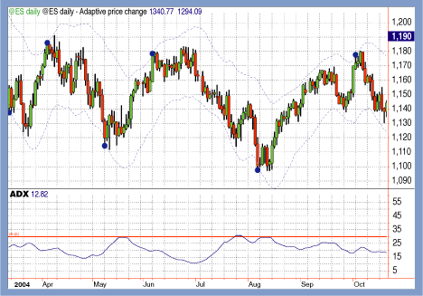

## Table of Contents

## What is the Adaptive Price Zone (APZ) technical indicator?

The Adaptive Price Zone (APZ) is a technical indicator used in trading to help predict where a stock's price might go next. It does this by creating zones or bands around the current price of a stock. These zones change and adapt based on how the stock has been moving recently. Traders use these zones to decide when to buy or sell a stock. If the price goes above the upper zone, it might be a good time to buy because the price could keep going up. If the price drops below the lower zone, it might be a good time to sell because the price could keep going down.

The APZ indicator is special because it adjusts to the stock's volatility, which means how much the stock's price changes over time. If the stock's price is moving a lot, the zones will be wider to account for bigger price swings. If the stock's price is not moving much, the zones will be narrower. This makes the APZ useful for different types of stocks and market conditions. By watching how the price interacts with these zones, traders can make better decisions about when to enter or exit a trade.

## How does the APZ indicator differ from other technical indicators?

The Adaptive Price Zone (APZ) indicator is different from other technical indicators because it adapts to how much a stock's price moves, which is called volatility. Many other indicators, like moving averages or the Relative Strength Index (RSI), use fixed calculations that don't change based on recent price movements. The APZ, on the other hand, creates zones around the current price that get wider or narrower depending on how much the price has been changing. This makes the APZ more flexible and useful in different market conditions.

Another way the APZ differs is in how it helps traders make decisions. While indicators like the Moving Average Convergence Divergence (MACD) or Bollinger Bands give signals based on crossovers or price touching certain lines, the APZ uses zones to suggest when to buy or sell. If the price moves above the upper zone, it might be a good time to buy, and if it drops below the lower zone, it might be a good time to sell. This zone-based approach can be easier for some traders to understand and use compared to other indicators that might require more complex analysis.

## What are the key components of the APZ indicator?

The Adaptive Price Zone (APZ) indicator has two main parts: the center line and the zones around it. The center line is like the middle of the road for the stock's price. It's usually based on the stock's recent average price. The zones are like lanes on either side of this road. They change size depending on how much the stock's price has been moving around lately. If the price is jumping a lot, the zones get bigger. If the price is staying pretty steady, the zones get smaller.

These zones help traders decide when to buy or sell the stock. If the price goes above the top zone, it might be a good time to buy because the price could keep going up. If the price drops below the bottom zone, it might be a good time to sell because the price could keep going down. The APZ is special because it pays attention to how much the stock's price is moving, which makes it work well in different situations.

## How is the APZ calculated?

The Adaptive Price Zone (APZ) is calculated by first finding the center line, which is usually the average price of the stock over a certain period. This average price helps set the middle of the APZ. Then, the zones around this center line are figured out by looking at how much the stock's price has been moving around lately. If the stock's price has been jumping a lot, the zones will be bigger. If the price has been staying pretty steady, the zones will be smaller.

To make the zones, the APZ uses something called volatility. Volatility is just a fancy word for how much the price changes. The APZ measures this by looking at the difference between the highest and lowest prices over a certain time. This difference helps decide how wide the zones should be. The wider the difference, the wider the zones. This way, the APZ can adjust to whatever the stock is doing and give traders good information about when to buy or sell.

## What time frames are best suited for using the APZ indicator?

The Adaptive Price Zone (APZ) indicator can be used on different time frames, but it works best on medium to long-term charts. This means looking at daily, weekly, or even monthly charts. These time frames give the APZ enough data to create accurate zones. When you use the APZ on these longer time frames, it can help you see big trends and make better decisions about when to buy or sell a stock.

Using the APZ on shorter time frames like hourly or minute charts can be trickier. The stock's price can move a lot in a short time, which can make the zones change quickly. This might make it harder to use the APZ to predict where the price is going. If you do use it on shorter time frames, it's important to watch how the zones change and understand that the signals might not be as reliable as on longer time frames.

## How can the APZ indicator be used to identify potential entry and exit points in trading?

The Adaptive Price Zone (APZ) indicator helps traders find good times to buy or sell a stock by creating zones around the current price. If the price of the stock goes above the top zone, it might be a good time to buy. This is because the price might keep going up. On the other hand, if the price drops below the bottom zone, it might be a good time to sell. This is because the price might keep going down. The zones change size depending on how much the stock's price has been moving around lately, so they can adapt to different situations.

Using the APZ to find entry and [exit](/wiki/exit-strategy) points works best on longer time frames like daily, weekly, or monthly charts. On these charts, the zones are more reliable because they have more data to work with. This helps traders see big trends and make better decisions. On shorter time frames like hourly or minute charts, the zones might change a lot and be less reliable. So, if you use the APZ on shorter time frames, you need to be careful and understand that the signals might not be as clear.

## Can the APZ indicator be used effectively in different market conditions?

The Adaptive Price Zone (APZ) indicator can be used effectively in different market conditions because it changes based on how much the stock's price is moving. If the market is calm and the stock's price isn't changing much, the APZ zones will be smaller. This helps traders see small changes in the price and make good decisions. If the market is wild and the stock's price is jumping around a lot, the APZ zones will get bigger. This helps traders understand that the price might keep moving a lot and plan their trades accordingly.

Using the APZ in different market conditions means paying attention to how the zones change. In a bull market, where prices are going up, the APZ can help traders find good times to buy when the price goes above the top zone. In a bear market, where prices are going down, the APZ can help traders find good times to sell when the price drops below the bottom zone. The key is to watch how the zones adapt to the market's ups and downs and use that information to make smart trading choices.

## What are common mistakes traders make when using the APZ indicator?

One common mistake traders make when using the Adaptive Price Zone (APZ) indicator is relying too much on short time frames. The APZ works best on longer time frames like daily or weekly charts because it needs enough data to create accurate zones. When traders use it on shorter time frames like hourly or minute charts, the zones can change a lot and be less reliable. This can lead to bad decisions because the signals might not be as clear.

Another mistake is not paying attention to how the zones change with the stock's volatility. The APZ is special because it adapts to how much the price is moving. If traders don't watch these changes, they might miss important signals about when to buy or sell. For example, if the zones get bigger because the price is jumping around a lot, traders need to understand that the price might keep moving a lot and adjust their strategies accordingly.

## How can the APZ indicator be integrated with other technical analysis tools?

The Adaptive Price Zone (APZ) indicator can be used with other tools to make better trading decisions. One way to do this is by using the APZ with moving averages. A moving average is a line that shows the average price of a stock over time. If the price goes above the top APZ zone and also crosses above a moving average, it might be a strong signal to buy. On the other hand, if the price drops below the bottom APZ zone and also crosses below a moving average, it might be a strong signal to sell. This combination can help traders confirm their decisions and feel more confident about when to enter or exit a trade.

Another way to use the APZ with other tools is by combining it with the Relative Strength Index (RSI). The RSI measures how fast and how much a stock's price is changing. If the price goes above the top APZ zone and the RSI is also high, it might mean the stock is overbought and could soon go down. If the price drops below the bottom APZ zone and the RSI is also low, it might mean the stock is oversold and could soon go up. By looking at both the APZ and the RSI, traders can get a better idea of when to buy or sell and avoid making bad trades based on just one indicator.

## What are some advanced strategies for using the APZ indicator to maximize trading performance?

One advanced strategy for using the Adaptive Price Zone (APZ) indicator to maximize trading performance is to combine it with trend analysis. Traders can look at longer time frames like weekly or monthly charts to identify the overall trend of the stock. If the stock is in an uptrend, traders can use the APZ to find good entry points when the price goes above the top zone. This can help them buy at the right time and ride the trend upwards. On the other hand, if the stock is in a downtrend, traders can use the APZ to find good exit points when the price drops below the bottom zone. This can help them sell at the right time and avoid big losses. By combining the APZ with trend analysis, traders can make more informed decisions and improve their trading performance.

Another advanced strategy is to use the APZ in combination with other indicators like the Moving Average Convergence Divergence (MACD) or the Relative Strength Index (RSI). For example, if the price goes above the top APZ zone and the MACD shows a bullish crossover, it can be a strong signal to buy. This is because both indicators are suggesting that the price might keep going up. Similarly, if the price drops below the bottom APZ zone and the RSI is in oversold territory, it can be a strong signal to sell. This is because both indicators are suggesting that the price might keep going down. By using the APZ along with other indicators, traders can get more confirmation for their trades and increase their chances of making profitable decisions.

## How does the APZ indicator adapt to volatility and price movements?

The Adaptive Price Zone (APZ) indicator changes based on how much a stock's price moves around, which is called volatility. If the stock's price is jumping a lot, the APZ zones will get bigger. This means the zones can handle bigger price swings without giving false signals. On the other hand, if the stock's price is not moving much, the APZ zones will get smaller. This helps traders see smaller changes in the price and make good decisions. By adjusting to the stock's volatility, the APZ can work well in different market situations.

The APZ calculates its zones by looking at the difference between the highest and lowest prices over a certain time. This difference helps decide how wide the zones should be. If the price difference is big, the zones will be wider. If the price difference is small, the zones will be narrower. This way, the APZ can adapt to whatever the stock is doing and give traders good information about when to buy or sell. By watching how the zones change with the stock's price movements, traders can use the APZ to make smarter trading choices.

## What are the limitations and potential drawbacks of relying on the APZ indicator for trading decisions?

One limitation of the APZ indicator is that it might not work well on short time frames like hourly or minute charts. The APZ needs enough data to create accurate zones, and shorter time frames can make the zones change a lot and be less reliable. This can lead to false signals and bad trading decisions. Traders need to be careful when using the APZ on short time frames and understand that the signals might not be as clear as on longer time frames like daily or weekly charts.

Another potential drawback is that the APZ can sometimes give late signals. Because the APZ adjusts to the stock's volatility, it might take some time for the zones to change and show a clear signal to buy or sell. This delay can mean that traders miss out on the best entry or exit points. It's important for traders to use the APZ along with other indicators and tools to confirm their decisions and avoid relying on it alone. By combining the APZ with other analysis methods, traders can get a better overall picture of the market and make more informed choices.

## How does the Adaptive Price Zone (APZ) work?

The Adaptive Price Zone (APZ) indicator operates by utilizing two dynamic bands that react to changes in price and market [volatility](/wiki/volatility-trading-strategies). These bands are calculated using exponential moving averages (EMA) and a measure of volatility, allowing the APZ to provide a responsive assessment of price movements.

The APZ bands expand and contract in response to volatility, widening during periods of high volatility and contracting during stable periods. This dynamic adjustment is facilitated by the underlying calculations, which incorporate the following elements:

1. **Exponential Moving Averages (EMA):** EMAs are used to smooth out price data, allowing the indicator to be more responsive to recent price changes. This is achieved by giving more weight to the most recent prices in the moving average calculation.

2. **Volatility Measurement:** The APZ uses a volatility component which is typically calculated based on the price ranges (the difference between high and low prices) over a specified period. This measure is integrated into the formula for the bands, affecting their width.

3. **Band Calculation:** The upper and lower bands of the APZ are determined by adding and subtracting a multiple of the calculated volatility from the EMA of the price. This is expressed by the following formulas:
$$
   \text{Upper Band} = \text{EMA} + (k \times \sigma)

$$
$$
   \text{Lower Band} = \text{EMA} - (k \times \sigma)

$$

   where $k$ is a user-defined multiplier that adjusts the sensitivity of the bands, and $\sigma$ represents the volatility value.

The primary usage of the APZ is to identify buy and sell signals based on price movements relative to these bands. A buy signal is typically generated when the price crosses below the lower band, indicating a potential upward reversal. Conversely, a sell signal arises when the price breaches the upper band, suggesting a possible downward reversal. These signals are especially effective in non-trending or sideways markets where prices tend to cycle or oscillate within a defined range.

Given the adaptive nature of the APZ, this indicator is particularly suitable for traders who aim to capitalize on market volatility, with an emphasis on identifying price patterns that signify potential turning points.

## How do you calculate the APZ?

The Adaptive Price Zone (APZ) indicator is calculated using a series of steps that focus on smoothing price data and assessing market volatility. This process begins with the application of a double-smoothed Exponential Moving Average (EMA), which aims to swiftly respond to price fluctuations while minimizing the lag often associated with moving averages. 

To calculate the APZ, we first compute the double-smoothed EMA of the closing price to represent the central tendency of the price movement. This process involves first calculating a single EMA, and then applying another EMA to this result:

1. **First EMA calculation**: $\text{EMA}_1 = \frac{\text{Price} - \text{EMA}_{\text{prev}}}{\text{n} + 1} + \text{EMA}_{\text{prev}}$

2. **Second EMA calculation**: $\text{EMA}_2 = \frac{\text{EMA}_1 - \text{EMA}_{2_{\text{prev}}}}{\text{n} + 1} + \text{EMA}_{2_{\text{prev}}}$

Here, $\text{n}$ is the number of periods used in the EMA calculation.

The next step in the APZ construction involves the incorporation of a volatility value. This value is derived from an EMA of the price ranges, calculated as the high minus the low over a short-term period. This step captures the market's volatility:

- **Volatility EMA**: 
$$
  \text{Vol}_{\text{EMA}} = \frac{(\text{High} - \text{Low})_{\text{current}} - (\text{High} - \text{Low})_{\text{prev}}}{\text{n}_{\text{vol}} + 1} + (\text{High} - \text{Low})_{\text{prev}}

$$

Finally, the upper and lower bands of the APZ are created using the calculated volatility EMA. A deviation [factor](/wiki/factor-investing), often determined by historical volatility data, is applied. This factor can be adjusted by traders to tailor the APZ to different financial instruments or trading intervals:

- **Upper Band**: 
$$
  \text{Upper Band} = \text{EMA}_2 + (\text{Vol}_{\text{EMA}} \times \text{Deviation Factor})

$$

- **Lower Band**: 
$$
  \text{Lower Band} = \text{EMA}_2 - (\text{Vol}_{\text{EMA}} \times \text{Deviation Factor})

$$

Traders often customize the deviation factor and time periods of the EMA to align with the characteristics of specific markets or instruments. This flexibility allows them to fine-tune the APZ for enhanced signal reliability and efficiency in diverse trading environments.

## How can APZ be combined with other indicators?

While the Adaptive Price Zone (APZ) is a powerful indicator in its own right, combining it with other indicators can yield even more robust trading signals. The Average Directional Index (ADX) is commonly paired with the APZ to assess the strength of a trend, which aids in corroborating potential reversals that the APZ identifies. The ADX, developed by J. Welles Wilder Jr., quantifies the strength of a trend by measuring the [momentum](/wiki/momentum) behind price movements. When used with APZ, the ADX can help traders distinguish between potential reversal points and mere price fluctuations.

The ADX formula involves calculating the difference between the directional movement indicators (+DI and -DI), which are derived from the high, low, and close prices over a specified period. The ADX itself is a smoothed moving average of the absolute value of the difference between these indicators. A high ADX value typically suggests a strong trend, while a low ADX value implies a weaker or no trend:

$$
\text{ADX} = \frac{100}{\text{Number of periods}} \times \text{Sum of the last N True Range values}
$$

In conjunction with APZ, trades can be more precisely timed by entering only when both indicator signals align. For instance, a potential reversal indicated by the APZ may be reinforced if the ADX shows a declining trend strength, suggesting a possible change in market direction.

Volume indicators are another valuable tool when combined with the APZ. They measure the intensity or [volume](/wiki/volume-trading-strategy) of trades and can offer further context about market activity. High volume can validate the strength of an APZ signal, as significant price movements on increased volume are generally more reliable. Popular volume indicators include the On-Balance Volume (OBV) and the Chaikin Money Flow (CMF). 

For instance, consider an [algorithmic trading](/wiki/algorithmic-trading) system where the APZ and ADX signals are integrated alongside a volume indicator such as the OBV:

```python
def trading_signal(apz, adx, obv):
    if apz['price'] < apz['lower_band'] and adx < threshold and obv_increasing:
        return "Buy"
    elif apz['price'] > apz['upper_band'] and adx > threshold and obv_decreasing:
        return "Sell"
    else:
        return "Hold"
```

By integrating these indicators, traders can generate signals that are both timely and validated by multiple sources, which enhances the precision of the trading strategies and reduces the likelihood of false signals. This combination of technical indicators allows traders to better navigate volatile markets while capitalizing on potential trends and reversals with a higher confidence level.

## References & Further Reading

[1]: Leibfarth, L. (2006). ["Adaptive Price Zone Indicator."](https://www.investopedia.com/articles/trading/10/adaptive-price-zone-indicator-explained.asp) Technical Analysis of STOCKS & COMMODITIES Magazine, Volume 24, Issue 6.

[2]: Wilder, J. W. (1978). ["New Concepts in Technical Trading Systems."](https://archive.org/details/newconceptsintec00wild) Trend Research.

[3]: Perry J., Kaufman. (2013). ["Trading Systems and Methods."](https://onlinelibrary.wiley.com/doi/book/10.1002/9781119202561) 5th Edition. John Wiley & Sons.

[4]: Aronson, D. R. (2006). ["Evidence-Based Technical Analysis: Applying the Scientific Method and Statistical Inference to Trading Signals."](https://www.amazon.com/Evidence-Based-Technical-Analysis-Scientific-Statistical/dp/0470008741) John Wiley & Sons.

[5]: Pring, M. J. (2002). ["Technical Analysis Explained: The Successful Investor's Guide to Spotting Investment Trends and Turning Points."](https://www.amazon.com/Technical-Analysis-Explained-Fifth-Successful/dp/0071825177) McGraw-Hill.

[6]: De Prado, M. L. (2018). ["Advances in Financial Machine Learning."](https://www.amazon.com/Advances-Financial-Machine-Learning-Marcos/dp/1119482089) Wiley.