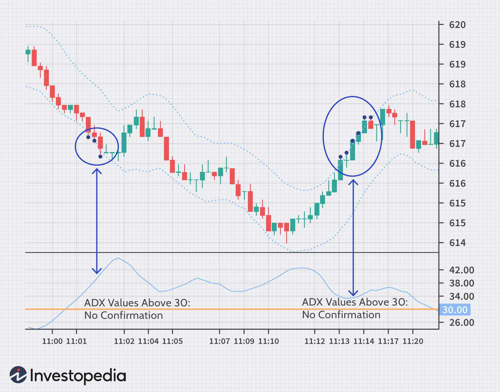

In the ever-evolving world of financial markets, traders and analysts are persistently seeking effective tools for better financial analysis. One such tool that has gained popularity over the years is the Adaptive Price Zone (APZ) indicator. The APZ is a technical indicator used within algorithmic trading systems to identify price trends and pinpoint potential turning points, making it a valuable asset in the trader's toolkit.

Developed to address the challenges of varying market conditions, the APZ provides a dynamic range for price movements, allowing traders to gauge market trends with improved accuracy. It operates by employing a set of adaptability principles that enable the bands to widen or narrow according to market volatility. This adaptation makes the APZ particularly effective in environments where markets do not exhibit clear trends, offering a way to navigate choppy and sideways movements.



In this article, we explore the APZ indicator's intricacies by examining its calculation methods, discussing its varied applications, and emphasizing its benefits. Furthermore, the article highlights how APZ can be integrated with other indicators, such as the Average Directional Index (ADX), to enhance the accuracy and reliability of trading signals. Through understanding the interplay between these tools, traders can better leverage the APZ in their algorithmic trading systems, ultimately honing their financial strategies to respond to market shifts effectively.

## Table of Contents

## What is the Adaptive Price Zone (APZ)?

The Adaptive Price Zone (APZ) is a technical indicator utilized in financial markets to identify potential reversal points by analyzing volatility in price movements. Created by Lee Leibfarth, the APZ applies a set of dynamic bands that are plotted on a price chart. These bands help traders assess current market trends by expanding or contracting based on the prevailing volatility conditions. Specifically, the distance between the bands increases during periods of high volatility and decreases during more stable periods, thereby offering a responsive measure to market fluctuations.

This indicator is particularly useful in non-trending or choppy market conditions, where traditional trend-following indicators might fail to provide accurate signals. The adaptiveness of APZ to changing market conditions allows traders to more effectively pinpoint turning points in the market, assisting them in making informed trading decisions. The effectiveness of the APZ in such conditions stems from its ability to dynamically adjust, offering valuable insights into the potential shifts in market direction when prices oscillate within defined ranges. Through its systematic approach, the APZ becomes a crucial component for traders seeking to navigate volatile market landscapes.

## How the Adaptive Price Zone (APZ) Works

The Adaptive Price Zone (APZ) indicator operates by utilizing two dynamic bands that react to changes in price and market [volatility](/wiki/volatility-trading-strategies). These bands are calculated using exponential moving averages (EMA) and a measure of volatility, allowing the APZ to provide a responsive assessment of price movements.

The APZ bands expand and contract in response to volatility, widening during periods of high volatility and contracting during stable periods. This dynamic adjustment is facilitated by the underlying calculations, which incorporate the following elements:

1. **Exponential Moving Averages (EMA):** EMAs are used to smooth out price data, allowing the indicator to be more responsive to recent price changes. This is achieved by giving more weight to the most recent prices in the moving average calculation.

2. **Volatility Measurement:** The APZ uses a volatility component which is typically calculated based on the price ranges (the difference between high and low prices) over a specified period. This measure is integrated into the formula for the bands, affecting their width.

3. **Band Calculation:** The upper and lower bands of the APZ are determined by adding and subtracting a multiple of the calculated volatility from the EMA of the price. This is expressed by the following formulas:
$$
   \text{Upper Band} = \text{EMA} + (k \times \sigma)

$$
$$
   \text{Lower Band} = \text{EMA} - (k \times \sigma)

$$

   where $k$ is a user-defined multiplier that adjusts the sensitivity of the bands, and $\sigma$ represents the volatility value.

The primary usage of the APZ is to identify buy and sell signals based on price movements relative to these bands. A buy signal is typically generated when the price crosses below the lower band, indicating a potential upward reversal. Conversely, a sell signal arises when the price breaches the upper band, suggesting a possible downward reversal. These signals are especially effective in non-trending or sideways markets where prices tend to cycle or oscillate within a defined range.

Given the adaptive nature of the APZ, this indicator is particularly suitable for traders who aim to capitalize on market volatility, with an emphasis on identifying price patterns that signify potential turning points.

## Calculating the APZ

The Adaptive Price Zone (APZ) indicator is calculated using a series of steps that focus on smoothing price data and assessing market volatility. This process begins with the application of a double-smoothed Exponential Moving Average (EMA), which aims to swiftly respond to price fluctuations while minimizing the lag often associated with moving averages. 

To calculate the APZ, we first compute the double-smoothed EMA of the closing price to represent the central tendency of the price movement. This process involves first calculating a single EMA, and then applying another EMA to this result:

1. **First EMA calculation**: $\text{EMA}_1 = \frac{\text{Price} - \text{EMA}_{\text{prev}}}{\text{n} + 1} + \text{EMA}_{\text{prev}}$

2. **Second EMA calculation**: $\text{EMA}_2 = \frac{\text{EMA}_1 - \text{EMA}_{2_{\text{prev}}}}{\text{n} + 1} + \text{EMA}_{2_{\text{prev}}}$

Here, $\text{n}$ is the number of periods used in the EMA calculation.

The next step in the APZ construction involves the incorporation of a volatility value. This value is derived from an EMA of the price ranges, calculated as the high minus the low over a short-term period. This step captures the market's volatility:

- **Volatility EMA**: 
$$
  \text{Vol}_{\text{EMA}} = \frac{(\text{High} - \text{Low})_{\text{current}} - (\text{High} - \text{Low})_{\text{prev}}}{\text{n}_{\text{vol}} + 1} + (\text{High} - \text{Low})_{\text{prev}}

$$

Finally, the upper and lower bands of the APZ are created using the calculated volatility EMA. A deviation [factor](/wiki/factor-investing), often determined by historical volatility data, is applied. This factor can be adjusted by traders to tailor the APZ to different financial instruments or trading intervals:

- **Upper Band**: 
$$
  \text{Upper Band} = \text{EMA}_2 + (\text{Vol}_{\text{EMA}} \times \text{Deviation Factor})

$$

- **Lower Band**: 
$$
  \text{Lower Band} = \text{EMA}_2 - (\text{Vol}_{\text{EMA}} \times \text{Deviation Factor})

$$

Traders often customize the deviation factor and time periods of the EMA to align with the characteristics of specific markets or instruments. This flexibility allows them to fine-tune the APZ for enhanced signal reliability and efficiency in diverse trading environments.

## Trading Applications of APZ

The Adaptive Price Zone (APZ) is a versatile tool applicable across various financial markets, offering significant utility in [algorithmic trading](/wiki/algorithmic-trading) systems. Traders often employ APZ to strategize long and short positions effectively. A long position is typically entered when the price moves beneath the lower APZ band, suggesting a potential reversal and subsequent upward movement. Conversely, a short position is initiated when the price crosses above the upper band, indicating a possible reversal to the downside. This approach allows traders to exploit price oscillations within a defined range, particularly advantageous in non-trending market conditions.

To enhance the accuracy of trading signals, it is advisable to utilize the APZ in conjunction with other technical indicators. Volume indicators, for instance, help assess the strength of a price move and validate the signals generated by the APZ. Similarly, the Average Directional Index (ADX) can be integrated to determine trend strength, providing a clearer picture of the market dynamics and confirming potential reversals indicated by the APZ.

In algorithmic trading, the APZ can be seamlessly incorporated into automated trading systems. By programming the rules for entering and exiting trades based on APZ signals, traders can efficiently capture opportunities presented by volatile markets. These automated systems can continuously monitor market conditions and execute trades with precision, thereby reducing the emotional and cognitive biases that often affect manual trading.

Here's a basic example of how one might implement an APZ-based trading strategy using Python:

```python
import pandas as pd
import numpy as np

# Example data loading
data = pd.read_csv('price_data.csv')  # Assume the data contains 'close', 'high', 'low' columns

# Define functions to calculate EMA and APZ bands
def ema(series, period):
    return series.ewm(span=period, adjust=False).mean()

def apz(data, ema_period=10, volatility_period=10, deviation_factor=2):
    price = data['close']
    high_low_range = data['high'] - data['low']
    ema_price = ema(price, ema_period)
    ema_volatility = ema(high_low_range, volatility_period)
    deviation = ema_volatility * deviation_factor
    upper_band = ema_price + deviation
    lower_band = ema_price - deviation
    return upper_band, lower_band

# Apply APZ calculation
data['upper_band'], data['lower_band'] = apz(data)

# Trading signals based on APZ
data['long_signal'] = np.where(data['close'] < data['lower_band'], 1, 0)
data['short_signal'] = np.where(data['close'] > data['upper_band'], -1, 0)

# Displaying the signals
print(data[['close', 'upper_band', 'lower_band', 'long_signal', 'short_signal']].head())
```

This code initializes by computing the exponential moving average (EMA) and APZ bands, and it generates trading signals based on the price interactions with these bands. This automated structure ensures quick responses to market changes, optimizing the decision-making process in trading strategies.

## Combining APZ with Other Indicators

While the Adaptive Price Zone (APZ) is a powerful indicator in its own right, combining it with other indicators can yield even more robust trading signals. The Average Directional Index (ADX) is commonly paired with the APZ to assess the strength of a trend, which aids in corroborating potential reversals that the APZ identifies. The ADX, developed by J. Welles Wilder Jr., quantifies the strength of a trend by measuring the [momentum](/wiki/momentum) behind price movements. When used with APZ, the ADX can help traders distinguish between potential reversal points and mere price fluctuations.

The ADX formula involves calculating the difference between the directional movement indicators (+DI and -DI), which are derived from the high, low, and close prices over a specified period. The ADX itself is a smoothed moving average of the absolute value of the difference between these indicators. A high ADX value typically suggests a strong trend, while a low ADX value implies a weaker or no trend:

$$
\text{ADX} = \frac{100}{\text{Number of periods}} \times \text{Sum of the last N True Range values}
$$

In conjunction with APZ, trades can be more precisely timed by entering only when both indicator signals align. For instance, a potential reversal indicated by the APZ may be reinforced if the ADX shows a declining trend strength, suggesting a possible change in market direction.

Volume indicators are another valuable tool when combined with the APZ. They measure the intensity or [volume](/wiki/volume-trading-strategy) of trades and can offer further context about market activity. High volume can validate the strength of an APZ signal, as significant price movements on increased volume are generally more reliable. Popular volume indicators include the On-Balance Volume (OBV) and the Chaikin Money Flow (CMF). 

For instance, consider an algorithmic trading system where the APZ and ADX signals are integrated alongside a volume indicator such as the OBV:

```python
def trading_signal(apz, adx, obv):
    if apz['price'] < apz['lower_band'] and adx < threshold and obv_increasing:
        return "Buy"
    elif apz['price'] > apz['upper_band'] and adx > threshold and obv_decreasing:
        return "Sell"
    else:
        return "Hold"
```

By integrating these indicators, traders can generate signals that are both timely and validated by multiple sources, which enhances the precision of the trading strategies and reduces the likelihood of false signals. This combination of technical indicators allows traders to better navigate volatile markets while capitalizing on potential trends and reversals with a higher confidence level.

## Limitations of APZ

Despite its effectiveness, the Adaptive Price Zone (APZ) indicator has certain limitations that traders should be aware of. The APZ is designed to identify potential turning points in price and is particularly effective in choppy market conditions. However, relying solely on APZ signals could lead to suboptimal trading decisions. Traders are advised to complement APZ signals with additional technical analysis or other indicators to improve accuracy.

One of the main limitations of the APZ is that it can produce false signals, especially in strongly trending markets. In such environments, price movements may persistently breach the APZ bands without reversing, leading to potential misinterpretation of signals. Therefore, traders should use APZ in conjunction with trend-confirming indicators, such as the Average Directional Index (ADX), to discern the strength of a trend and filter out false signals.

Market conditions significantly affect the reliability of the APZ. Volatility, in particular, plays a crucial role; during periods of low volatility, the APZ bands may compress, resulting in frequent breaches and potentially misleading signals. Conversely, during high volatility, the bands expand, which might delay the recognition of potential reversal points. This necessitates the adjustment of APZ parameters, such as the deviation factor, to better suit current market conditions, ensuring that the indicator remains responsive and relevant.

Traders must also account for the adaptive nature of the APZ, which means the indicator recalibrates based on recent price action and volatility. While this adaptability is a strength, it also implies that past APZ behavior might not be indicative of future performance, especially with shifting market dynamics. As a result, continuous monitoring and strategy adjustments are necessary to maintain effective use of the APZ in trading.

In summary, while the APZ is a valuable tool for identifying potential reversals, it should not be utilized in isolation. Integrating additional indicators and analyses, staying vigilant to changing market conditions, and adjusting the APZ settings are essential practices to mitigate its limitations and enhance trading performance.

## The Bottom Line

The Adaptive Price Zone (APZ) stands out as a valuable tool for traders, particularly due to its adeptness at responding to market volatility. This adaptability is a crucial feature, especially when dealing with non-trending markets where price movements are often choppy and less predictable. The APZ's primary strength lies in its ability to highlight potential reversals, offering traders insights into moments when the market may be shifting direction. This capability makes it a favored choice among traders who require tools that can effectively operate across different market conditions.

When traders integrate APZ with other technical indicators, its utility in financial analysis and algorithmic trading is significantly enhanced. Indicators such as the Average Directional Index (ADX) or volume indicators can confirm the signals generated by the APZ, providing a multi-faceted approach to market analysis. This combination allows traders to capture more robust trading signals and make informed decisions by considering multiple aspects of market behavior, which can lead to more effective trading strategies.

However, despite its strengths, traders need to maintain a holistic approach to maximize the effectiveness of the APZ. This involves a careful consideration of prevailing market conditions, as reliance solely on APZ signals without cross-verifying with additional instruments may lead to suboptimal trading outcomes. Integrating APZ with well-constructed trading plans and strategies that account for market dynamics is essential for achieving consistent results. Such strategies could include defining clear entry and [exit](/wiki/exit-strategy) rules, using stop-loss orders, and adhering to risk management principles. Ultimately, while the APZ is a potent component of the trading toolkit, its benefits are best realized when used in conjunction with comprehensive market analysis and disciplined trading practices.

## References & Further Reading

[1]: Leibfarth, L. (2006). ["Adaptive Price Zone Indicator."](https://www.investopedia.com/articles/trading/10/adaptive-price-zone-indicator-explained.asp) Technical Analysis of STOCKS & COMMODITIES Magazine, Volume 24, Issue 6.

[2]: Wilder, J. W. (1978). ["New Concepts in Technical Trading Systems."](https://archive.org/details/newconceptsintec00wild) Trend Research.

[3]: Perry J., Kaufman. (2013). ["Trading Systems and Methods."](https://onlinelibrary.wiley.com/doi/book/10.1002/9781119202561) 5th Edition. John Wiley & Sons.

[4]: Aronson, D. R. (2006). ["Evidence-Based Technical Analysis: Applying the Scientific Method and Statistical Inference to Trading Signals."](https://www.amazon.com/Evidence-Based-Technical-Analysis-Scientific-Statistical/dp/0470008741) John Wiley & Sons.

[5]: Pring, M. J. (2002). ["Technical Analysis Explained: The Successful Investor's Guide to Spotting Investment Trends and Turning Points."](https://www.amazon.com/Technical-Analysis-Explained-Fifth-Successful/dp/0071825177) McGraw-Hill.

[6]: De Prado, M. L. (2018). ["Advances in Financial Machine Learning."](https://www.amazon.com/Advances-Financial-Machine-Learning-Marcos/dp/1119482089) Wiley.