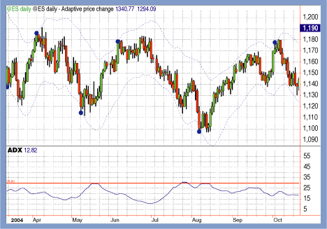

## Table of Contents

## What is an Adaptive Price Zone?

An Adaptive Price Zone, often called APZ, is a tool used in trading to help predict where the price of something might go next. It's like drawing lines on a chart to show where the price has been and where it might go. The zones change as the price moves, so they "adapt" to what's happening in the market. This can help traders see where the price might stop or turn around.

Traders use APZs to make decisions about buying or selling. If the price is near the bottom of an APZ, a trader might think it's a good time to buy because the price could go up. If the price is near the top of an APZ, a trader might think it's a good time to sell because the price could go down. By watching how the price moves within these zones, traders can try to make smarter choices about their trades.

## How does an Adaptive Price Zone differ from traditional pricing models?

An Adaptive Price Zone is different from traditional pricing models because it changes as the market changes. Traditional models often use fixed prices or set price ranges that don't move once they're set. For example, a store might set a price for a product and keep it the same for a long time. But an APZ moves with the market, so if the price of something goes up or down, the zones on the chart will move too. This helps traders see new opportunities as they happen.

Traditional pricing models are good for things that don't change much, like the price of a candy bar at a store. They're simple and easy to understand. But in trading, where prices can change a lot in a short time, these models can miss out on important changes. An APZ is better for trading because it can show where the price might go next based on what's happening right now. This makes it easier for traders to decide when to buy or sell.

## What are the key components of an Adaptive Price Zone?

An Adaptive Price Zone has a few key parts that help traders understand where prices might go. The first part is the zones themselves, which are areas on a price chart that show where the price has been and where it might go next. These zones change as the price moves, so they always show the most up-to-date information. The second part is the lines that make up the zones. These lines are drawn based on past prices and help traders see where the price might stop or turn around.

Another important part of an APZ is how it uses past data to predict future prices. By looking at where the price has been, the APZ can show where it might go next. This helps traders make better decisions about buying or selling. The last key component is how easy it is to see these zones on a chart. Traders can quickly look at the chart and see where the price is in relation to the zones, which helps them act fast in the market.

## How can businesses implement an Adaptive Price Zone?

Businesses can start using an Adaptive Price Zone by first looking at their past prices and sales data. They need to find out where prices have been and where they might go next. This means drawing lines on a chart to create zones that change as the price moves. These zones will show where the price has been high or low and help predict where it might go in the future. Businesses can use special software or tools that make it easier to draw these zones and keep them updated.

Once the zones are set up, businesses need to watch how the price moves within them. If the price is near the bottom of a zone, it might be a good time to raise the price a bit because the price could go up. If the price is near the top of a zone, it might be a good time to lower the price because the price could go down. By keeping an eye on these zones, businesses can make better decisions about when to change their prices. This can help them make more money by selling at the right times and not missing out on opportunities.

## What are the benefits of using an Adaptive Price Zone for a business?

Using an Adaptive Price Zone can help a business make more money by changing prices at the right times. When the price is near the bottom of a zone, it might be a good time to raise the price because it could go up. When the price is near the top of a zone, it might be a good time to lower the price because it could go down. This way, the business can sell things for more money when the price is going up and still sell things when the price is going down by lowering the price a bit. This helps the business make the most money from each sale.

Another benefit is that Adaptive Price Zones can help a business see new opportunities as they happen. Traditional pricing models use fixed prices that don't change, so they can miss out on changes in the market. But with APZs, the zones move with the market, so the business can see where the price might go next. This means they can act fast and make changes to their prices to take advantage of what's happening right now. This can help them stay ahead of other businesses and make more sales.

## Can you explain the algorithm behind Adaptive Price Zones?

The algorithm behind Adaptive Price Zones is all about looking at past prices and using them to guess where prices might go next. It starts by finding key points on a price chart, like where the price was really high or really low. These points help draw lines that make up the zones. The zones are not fixed; they move as the price changes. So if the price goes up, the zones move up too, and if the price goes down, the zones move down. This way, the zones always show the most up-to-date information about where the price has been and where it might go next.

The algorithm also uses math to figure out how big the zones should be. It looks at how much the price has moved in the past and uses that to decide where to draw the lines. This helps traders see where the price might stop or turn around. By watching how the price moves within these zones, traders can make better decisions about when to buy or sell. The zones are always changing, so the algorithm keeps updating them to give the best information possible. This makes it easier for businesses to see new opportunities and change their prices at the right times.

## What industries benefit most from Adaptive Price Zones?

The industries that benefit the most from Adaptive Price Zones are those where prices change a lot and fast, like trading and finance. In these industries, knowing where prices might go next is really important. Traders can use APZs to see where the price has been and where it might go, helping them decide when to buy or sell. This can help them make more money by selling at the right times and not missing out on chances to buy low and sell high.

Another industry that can benefit from APZs is retail, especially for things like electronics or fashion where prices can go up and down quickly. Retailers can use APZs to change their prices based on what's happening in the market. If the price of a product is going up, they can raise their prices to make more money. If the price is going down, they can lower their prices to keep selling. This helps them stay ahead of other stores and make the most money from each sale.

## How do Adaptive Price Zones respond to market changes?

Adaptive Price Zones change as the market changes. When the price of something goes up or down, the zones on the chart move too. This means they always show the newest information about where the price has been and where it might go next. Traders and businesses can see these changes happening and make quick decisions about buying or selling. This helps them take advantage of what's happening in the market right now.

Because APZs move with the market, they can help businesses see new chances to make money. If the price is going up, the zones move up, and businesses can raise their prices to make more money. If the price is going down, the zones move down, and businesses can lower their prices to keep selling. By watching these zones, businesses can stay ahead of others and make smart choices about when to change their prices.

## What are the potential challenges or limitations of implementing Adaptive Price Zones?

One challenge of using Adaptive Price Zones is that they need a lot of data to work well. Businesses need to have good information about past prices and sales to draw the zones on the chart. If they don't have enough data, the zones might not be very accurate, and this can make it hard to predict where prices will go next. Another challenge is that APZs can be hard to understand for people who are new to trading or pricing. It takes time to learn how to read the zones and use them to make decisions. This means businesses might need to train their staff or hire experts to help them use APZs correctly.

Another limitation is that APZs can sometimes give false signals. This means the zones might show that the price is going to go up or down, but then it doesn't happen. This can lead to businesses making the wrong choices about when to change their prices, which can cost them money. Also, APZs work best in markets where prices change a lot. In markets where prices stay the same for a long time, APZs might not be very helpful because there isn't enough movement to make the zones useful.

## How can data analytics enhance the effectiveness of Adaptive Price Zones?

Data analytics can make Adaptive Price Zones work better by helping businesses understand their past prices and sales. By looking at a lot of data, businesses can find patterns and trends that they might not see otherwise. This helps them draw the zones on the chart more accurately. When the zones are more accurate, businesses can predict where prices might go next with more confidence. This means they can make better choices about when to change their prices, which can help them make more money.

Also, data analytics can help businesses see what's happening in the market right now. By using real-time data, businesses can update their APZs quickly and keep them current. This lets them see new opportunities as they happen and act fast. For example, if the data shows that the price of something is going up, businesses can raise their prices right away to make more money. If the data shows the price is going down, they can lower their prices to keep selling. This way, data analytics helps businesses use APZs to stay ahead of others and make the most of their sales.

## What case studies demonstrate the successful use of Adaptive Price Zones?

One case study that shows how well Adaptive Price Zones work is from a big trading company. They started using APZs to help them decide when to buy and sell stocks. Before, they used fixed price models and often missed out on good chances to make money. But with APZs, they could see where the price of stocks might go next. This helped them buy stocks when the price was low and sell when the price was high. Over time, they made more money and were happy with how well APZs worked for them.

Another case study comes from a retail store that sells electronics. The store used APZs to change the prices of their products based on what was happening in the market. When the price of electronics went up, they raised their prices too, and when the price went down, they lowered their prices to keep selling. This helped them make more money from each sale and stay ahead of other stores. They found that using APZs made a big difference in how much money they made and how well they could compete in the market.

## What future trends might influence the development of Adaptive Price Zones?

In the future, more and more businesses might start using Adaptive Price Zones because of new technology. Computers and software are getting better at looking at a lot of data quickly. This means businesses can use APZs to see what's happening in the market right away and change their prices faster. Also, as more people learn about APZs, more businesses might want to use them to make more money. This could make APZs a common tool in trading and retail.

Another trend that might change APZs is how people shop. More people are buying things online, and prices can change a lot on the internet. APZs could help online stores change their prices quickly to match what's happening in the market. This way, they can sell things for more money when the price is going up and still sell things when the price is going down. As online shopping grows, APZs might become even more important for businesses to stay ahead.

## How does the APZ work?

The Adaptive Price Zone (APZ) indicator operates through a system of two dynamic bands that enclose the average price of an asset, with these bands reflecting the market's [volatility](/wiki/volatility-trading-strategies). The construction of the APZ involves calculating a moving average and then adjusting it by adding and subtracting an average of the recent price changes, scaled by a [factor](/wiki/factor-investing) related to price volatility. Mathematically, the calculation of the bands can be expressed as follows:

$$
\text{Upper Band} = \text{MA} + k \times \sigma
$$
$$
\text{Lower Band} = \text{MA} - k \times \sigma
$$

where $\text{MA}$ is the moving average of the asset's price, $\sigma$ represents the standard deviation of the recent price changes, and $k$ is a constant that adjusts the width of the bands according to volatility.

During periods of high volatility, the standard deviation, $\sigma$, increases, leading to a wider gap between the upper and lower bands. Conversely, when the market is stable, $\sigma$ decreases, resulting in narrower bands. This dynamic nature of the APZ helps traders identify potential market reversal points. When the price moves beyond these adaptive bands, it suggests that the prevailing price direction may be due for a reversal.

The practical application for traders involves looking for buy signals when the price breaches below the lower band, as this may suggest an oversold condition ripe for reversal to the upside. Conversely, a breach above the upper band could imply an overbought situation, indicating a potential downturn.

Incorporating this mechanism into trading strategies can be done programmatically. For instance, in Python, a simple APZ strategy might look like this:

```python
import numpy as np
import pandas as pd

def calculate_apz(price_series, window, k):
    ma = price_series.rolling(window=window).mean()
    std_dev = price_series.rolling(window=window).std()
    upper_band = ma + k * std_dev
    lower_band = ma - k * std_dev
    return upper_band, lower_band

# Example usage:
# price_series = pd.Series([...])  # hypothetical series of closing prices
# window = 20  # window for moving average and std deviation
# k = 1.5  # constant for band width

# upper_band, lower_band = calculate_apz(price_series, window, k)
```

This implementation calculates the upper and lower bands based on a given moving average window and a scaling constant, allowing traders to adapt the strategy to various market conditions. By integrating additional logic for position management, this script could form the basis of an automated APZ-based trading system.

## References & Further Reading

[1]: Leibfarth, L. (2005). ["The Adaptive Price Zone Indicator."](https://www.investopedia.com/articles/trading/10/adaptive-price-zone-indicator-explained.asp) Stocks & Commodities Magazine.

[2]: [Bollinger, J. (2001). "Bollinger on Bollinger Bands."](https://www.amazon.com/Bollinger-Bands-John/dp/0071373683) McGraw-Hill.

[3]: Lopez de Prado, M. (2018). ["Advances in Financial Machine Learning."](https://www.amazon.com/Advances-Financial-Machine-Learning-Marcos/dp/1119482089) Wiley.

[4]: Aronson, D. R. (2007). ["Evidence-Based Technical Analysis: Applying the Scientific Method and Statistical Inference to Trading Signals."](https://onlinelibrary.wiley.com/doi/book/10.1002/9781118268315) Wiley.

[5]: Chan, E. P. (2009). ["Quantitative Trading: How to Build Your Own Algorithmic Trading Business."](https://github.com/ftvision/quant_trading_echan_book) Wiley.