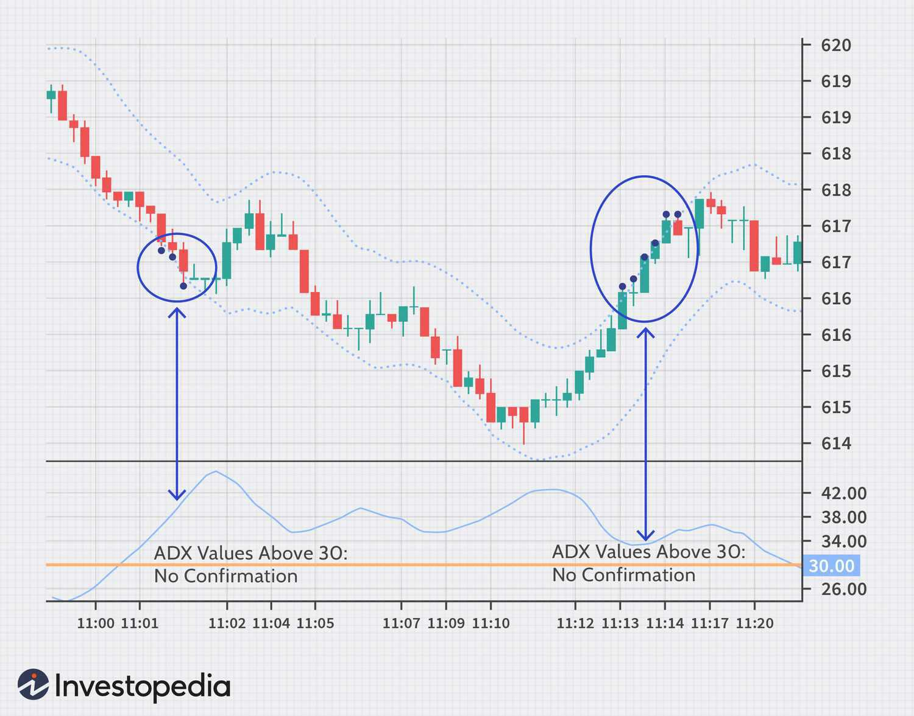

The world of trading is dynamic, demanding adaptability as strategies evolve with ever-changing market conditions. In this landscape, technical analysis is paramount for traders, offering tools and methodologies that help in deciphering market trends and potential reversals. One increasingly popular tool among traders is the Adaptive Price Zone (APZ) indicator, which is designed to navigate the unpredictable nature of financial markets.

Technical analysis employs chart-based techniques, leveraging price patterns and indicators to forecast future movements without the reliance on company-specific fundamentals. This analytical approach is crucial as it provides traders with a quantifiable method to make informed decisions. Amidst various technical tools, the Adaptive Price Zone has garnered attention for its distinctive ability to identify potential market reversals through volatility-adjusted bands.



The APZ indicator, developed by Lee Leibfarth, is particularly adept in environments characterized by stagnant or oscillating price movements. These conditions often pose challenges for traders, yet present lucrative opportunities when navigated correctly. With the APZ's volatility-based framework, traders can gain insights into price dynamics, enhancing their capacity to anticipate potential reversals, especially crucial in horizontal or choppy markets.

This article explores the specifics of the APZ trading strategy. We detail its functionality and its instrumental role in algorithmic trading. Moreover, we examine how traders can harness the APZ indicator in various market environments, making it a versatile tool for both manual and automated trading strategies.

## Table of Contents

## Understanding the Adaptive Price Zone (APZ)

Adaptive Price Zone (APZ) is a volatility-based technical indicator designed to help traders identify potential points of market reversal. This tool was developed by Lee Leibfarth and is particularly beneficial in environments where markets exhibit sideways or choppy behavior. The APZ's utility arises from its ability to use volatility-adjusted bands, which allows it to adapt to ongoing market conditions and provide traders with valuable insights into price movements and potential reversals.

The core feature of the APZ lies in its dynamic bands that vary in response to market volatility. The bands adjust themselves according to the fluctuations in price, expanding during periods of higher volatility and contracting during more stable phases. This characteristic makes the APZ especially valuable for traders who need a responsive tool that can indicate when prices are likely to reverse direction.

The mathematical foundation of the APZ ensures that it remains highly responsive to market conditions. This aspect is crucial for accurately identifying reversal points during periods when standard indicators may fail due to the lack of a clear trend. By capturing these subtleties in price action, the APZ allows traders to make more informed decisions.

In practical use, traders can observe the price movements relative to these adaptive bands. When the price breaches the upper or lower band, it often signals a potential reversal point, prompting traders to consider entering or exiting positions accordingly. By offering real-time adjustments to market [volatility](/wiki/volatility-trading-strategies), the APZ helps traders maintain an edge in uncertain market conditions.

The flexibility of APZ in adapting to varying market conditions without the necessity for constant parameter adjustments makes it an attractive option for both novice and experienced traders. Its design helps mitigate the risks associated with lateral market movements, providing a systematic framework to approach trading in volatile conditions.

## How the APZ Works

The Adaptive Price Zone (APZ) indicator operates through a system of two dynamic bands that enclose the average price of an asset, with these bands reflecting the market's volatility. The construction of the APZ involves calculating a moving average and then adjusting it by adding and subtracting an average of the recent price changes, scaled by a [factor](/wiki/factor-investing) related to price volatility. Mathematically, the calculation of the bands can be expressed as follows:

$$
\text{Upper Band} = \text{MA} + k \times \sigma
$$
$$
\text{Lower Band} = \text{MA} - k \times \sigma
$$

where $\text{MA}$ is the moving average of the asset's price, $\sigma$ represents the standard deviation of the recent price changes, and $k$ is a constant that adjusts the width of the bands according to volatility.

During periods of high volatility, the standard deviation, $\sigma$, increases, leading to a wider gap between the upper and lower bands. Conversely, when the market is stable, $\sigma$ decreases, resulting in narrower bands. This dynamic nature of the APZ helps traders identify potential market reversal points. When the price moves beyond these adaptive bands, it suggests that the prevailing price direction may be due for a reversal.

The practical application for traders involves looking for buy signals when the price breaches below the lower band, as this may suggest an oversold condition ripe for reversal to the upside. Conversely, a breach above the upper band could imply an overbought situation, indicating a potential downturn.

Incorporating this mechanism into trading strategies can be done programmatically. For instance, in Python, a simple APZ strategy might look like this:

```python
import numpy as np
import pandas as pd

def calculate_apz(price_series, window, k):
    ma = price_series.rolling(window=window).mean()
    std_dev = price_series.rolling(window=window).std()
    upper_band = ma + k * std_dev
    lower_band = ma - k * std_dev
    return upper_band, lower_band

# Example usage:
# price_series = pd.Series([...])  # hypothetical series of closing prices
# window = 20  # window for moving average and std deviation
# k = 1.5  # constant for band width

# upper_band, lower_band = calculate_apz(price_series, window, k)
```

This implementation calculates the upper and lower bands based on a given moving average window and a scaling constant, allowing traders to adapt the strategy to various market conditions. By integrating additional logic for position management, this script could form the basis of an automated APZ-based trading system.

## APZ in Technical Analysis

Technical analysis is a method that focuses on interpreting historical price movements and trading volumes through charts and indicators to forecast future market behavior. This approach stands in contrast to [fundamental analysis](/wiki/fundamental-analysis), which is based on evaluating a company's intrinsic value through its financial statements and industry position. Among various technical indicators, the Adaptive Price Zone (APZ) serves a specific role for traders who aim to capitalize on market reversals, particularly in volatile conditions.

The Adaptive Price Zone is designed to identify potential reversal points by using volatility-adjusted bands that change with market conditions. When integrated into technical analysis, the APZ provides a framework that can be highly beneficial for reversal trading strategies. This is particularly true in markets characterized by price fluctuations without a clear, sustained trend, often described as sideways or choppy markets. 

In technical analysis, indicators are frequently used alongside chart patterns to provide clarity on market trends and potential turning points. The APZ enhances this analysis framework by giving traders a dynamic tool that reflects real-time market conditions. The versatility of the APZ becomes more apparent when it is used in conjunction with other indicators, such as moving averages or [volume](/wiki/volume-trading-strategy) analysis. 

For instance, moving averages can confirm trend direction, while the APZ can signal potential reversal points when price breakthroughs occur. A common trading strategy might involve using a moving average to define the trend direction and the APZ to time entry and [exit](/wiki/exit-strategy) points based on price reversals. By letting the moving average filter out noise and using APZ to zero in on entry points, traders can construct a more robust trading strategy. Volume analysis further contributes to this by confirming the strength of the observed reversals or trends, enhancing the accuracy of trades.

By including the APZ within a broader technical analysis system, traders can efficiently exploit short-term market inefficiencies. The combination of indicators allows for a comprehensive approach to trading, balancing the immediacy of volatility signals provided by the APZ with the stabilizing metrics of trend-following indicators like moving averages. This layered analysis can provide critical insights, helping traders make informed decisions with an edge in volatile trading environments.

## Incorporating APZ into Algo Trading

Algorithmic trading, commonly known as algo trading, relies on automated systems programmed to execute trades based on specific, predefined conditions. This approach benefits significantly from indicators that can dynamically adjust to market conditions, such as the Adaptive Price Zone (APZ). APZ is especially well-suited for algo trading due to its capacity to adapt to market volatility, providing traders with dynamic and responsive trading signals.

One of the strengths of APZ in [algorithmic trading](/wiki/algorithmic-trading) is its inherent ability to adjust its bands according to market volatility. This characteristic allows it to offer trading signals that align closely with current market conditions. During periods of high volatility, the APZ bands widen, allowing traders to ascertain potential reversal points at more significant price movements. Conversely, in stable market conditions, the bands narrow, helping traders identify potential reversals in tighter ranges. This adaptability is particularly advantageous for algorithms, as it reduces the need for constant recalibration based on market shifts.

Incorporating APZ into an algorithmic trading system requires setting up trading rules that respond to price interactions with the APZ bands. Typically, an algorithm can be programmed to initiate a trade when the price crosses above or below the bands, suggesting a reversal. Such rules can be enhanced by integrating additional criteria, such as moving average crossovers or volume spikes, to improve the reliability of the trading signals.

For instance, a simple Python-based algorithm to incorporate APZ might look like this:

```python
import numpy as np

def calculate_apz(price_data, period=14, factor=2):
    # Calculate the simple moving average (SMA)
    sma = price_data.rolling(window=period).mean()

    # Calculate the standard deviation
    price_std = price_data.rolling(window=period).std()

    # Calculate the upper and lower bands
    upper_band = sma + (factor * price_std)
    lower_band = sma - (factor * price_std)

    return upper_band, lower_band

def trading_signal(price_data, upper_band, lower_band):
    signals = np.zeros(len(price_data))

    for i in range(1, len(price_data)):
        if price_data[i] > upper_band[i] and price_data[i-1] <= upper_band[i-1]:
            signals[i] = -1  # Signal to sell
        elif price_data[i] < lower_band[i] and price_data[i-1] >= lower_band[i-1]:
            signals[i] = 1  # Signal to buy

    return signals

# Example usage
price_data = ...  # Load your price data here, e.g., from a DataFrame
upper_band, lower_band = calculate_apz(price_data)
signals = trading_signal(price_data, upper_band, lower_band)
```

In this script, the `calculate_apz` function computes the upper and lower adaptive price zones by utilizing a simple moving average and a volatility factor (often set to 2). The `trading_signal` function uses the calculated APZ bands to generate buy or sell signals based on price breaches of these bands.

When implementing the APZ in live trading, it's crucial to combine these signals with robust risk management strategies to mitigate potential losses. Volume analysis and trend indicators may be integrated to provide additional context and ensure that trades executed by the algorithm align with broader market trends. By leveraging the adaptive nature of APZ, traders can enhance their algorithmic strategies, making them responsive to various market environments and conditions.

## Practical Applications and Use Cases

The Adaptive Price Zone (APZ) indicator offers versatility in trading across various asset classes, including stocks, [forex](/wiki/forex-system), and commodities. Its unique nature makes it highly effective in markets with no clear trends, enabling traders to exploit potential price reversals. The dynamic bands of the APZ, which adjust according to market volatility, provide valuable signals for these reversals when prices breach the bands.

To implement the APZ indicator successfully, it is crucial to integrate it with robust risk management strategies. Trading always carries inherent risks, and the APZ is no exception despite its adaptive design. Effective risk management can help mitigate potential losses while maximizing profits from trade signals generated by APZ.

Furthermore, combining the APZ with other technical indicators can enhance its effectiveness. For example, integrating moving averages can offer additional confirmation of trends or reversals, reinforcing the signals indicated by the APZ bands. Traders might also incorporate volume analysis to discern the strength of a price movement, thereby validating APZ signals.

Incorporating the APZ into a trading strategy may involve setting specific rules for entry and exit based on the interaction between the price and the APZ bands. For instance, traders might decide to enter a long position when the price falls below the lower band and shows signs of reversing upward, such as a bullish candlestick pattern. Conversely, a breach above the upper band followed by a bearish signal might suggest a short position. Customizing these rules to align with individual trading styles and risk profiles is key.

Below is an example of how one might implement a basic APZ-based trading strategy in Python:

```python
import numpy as np
import pandas as pd

# Example DataFrame with closing prices
data = pd.DataFrame({'close': [/* closing prices data here */]})

# Function to calculate APZ bands
def apz_indicator(prices, period=20, std_dev=2):
    sma = prices.rolling(window=period).mean()
    std = prices.rolling(window=period).std()
    upper_band = sma + std_dev * std
    lower_band = sma - std_dev * std
    return upper_band, lower_band

# Calculate APZ bands
data['upper_band'], data['lower_band'] = apz_indicator(data['close'])

# Sample signal generation
buy_signals = (data['close'] < data['lower_band'])
sell_signals = (data['close'] > data['upper_band'])

# Show signals in the DataFrame
data['buy_signal'] = buy_signals
data['sell_signal'] = sell_signals
```

This code snippet delineates a simple algorithmic setup for generating trade signals based on the APZ bands. It calculates the moving average and standard deviation to establish the dynamic bands, subsequently determining buy and sell signals when prices contact these boundaries.

Successful application of the APZ indicator requires constant monitoring and adjustment to suit changing market conditions and personal trading goals. By using APZ in conjunction with other technical tools and sound risk management practices, traders can effectively navigate and take advantage of a variety of market environments.

## Conclusion

Adaptive Price Zone (APZ) offers a reliable means to identify trading opportunities in volatile markets, providing traders with insights into potential price reversals and continuations. Its dynamic nature allows it to adjust to varying market conditions, making it a versatile tool both for manual chart analysis and for integration into algorithmic trading systems. By incorporating APZ into their trading strategies, traders can enhance their ability to respond to market volatility and identify entry and exit points with greater precision.

The indicator's adaptability is particularly advantageous in automated trading strategies. Since algorithmic systems rely on predefined parameters to execute trades, APZ's ability to adjust its bands according to market volatility ensures that signals remain relevant and timely. This responsiveness can help minimize false signals that might arise from static indicators failing to match market dynamics.

Traders looking to incorporate APZ into their trading arsenal should ensure it complements their broader strategy. This involves aligning the indicator's settings with their specific market approach and risk tolerance. Moreover, while APZ can independently offer valuable insights, its effectiveness is enhanced when used in conjunction with other technical indicators and sound risk management practices. Ensuring a well-rounded approach can help mitigate risks and maximize the utility of the APZ indicator.

In conclusion, the Adaptive Price Zone is a powerful tool for traders operating in volatile markets. Its ability to adjust based on market conditions enhances its utility across different trading environments. As part of a comprehensive strategy, APZ can significantly contribute to identifying and capitalizing on trading opportunities.

## References & Further Reading

[1]: Leibfarth, L. (2005). ["The Adaptive Price Zone Indicator."](https://www.investopedia.com/articles/trading/10/adaptive-price-zone-indicator-explained.asp) Stocks & Commodities Magazine.

[2]: [Bollinger, J. (2001). "Bollinger on Bollinger Bands."](https://www.amazon.com/Bollinger-Bands-John/dp/0071373683) McGraw-Hill.

[3]: Lopez de Prado, M. (2018). ["Advances in Financial Machine Learning."](https://www.amazon.com/Advances-Financial-Machine-Learning-Marcos/dp/1119482089) Wiley.

[4]: Aronson, D. R. (2007). ["Evidence-Based Technical Analysis: Applying the Scientific Method and Statistical Inference to Trading Signals."](https://onlinelibrary.wiley.com/doi/book/10.1002/9781118268315) Wiley.

[5]: Chan, E. P. (2009). ["Quantitative Trading: How to Build Your Own Algorithmic Trading Business."](https://github.com/ftvision/quant_trading_echan_book) Wiley.