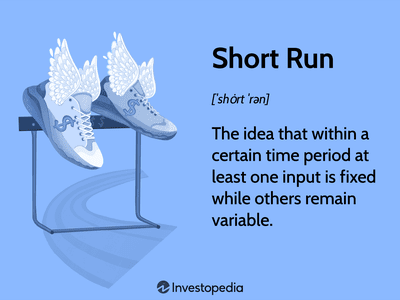

Algorithmic trading represents a significant leap forward in the integration of technology and finance. By leveraging computerized systems to execute trades at remarkable speeds, these algorithms have revolutionized how transactions are processed in modern financial markets. The benefits of algorithmic trading are manifold, including enhanced speed, improved accuracy, and the capacity to process vast amounts of data, which collectively contribute to more efficient trading strategies.

However, the sophisticated nature of algorithmic trading systems necessitates rigorous and precise documentation. Efficient documentation serves as the backbone for compliance, risk management, and performance assessment, ensuring that traders and regulatory bodies alike can trace and understand each step of the trading process. Detailed records help in delineating how trading decisions are made and executed, providing clarity and accountability in an often opaque industry.



As trading strategies become more intricate, the documentation must evolve to capture every nuance and modification. This is where an example document addition addendum becomes invaluable. An addendum enhances the original documentation by incorporating updates and modifications to the existing algorithms, thereby maintaining the relevance and accuracy of the recorded information. It plays a critical role in refining trading strategies by accommodating changes in market conditions or regulatory requirements.

This article aims to highlight the necessity of meticulous documentation in algorithmic trading and demonstrate how an addition addendum can significantly enhance the clarity and adaptability of trading processes. By understanding the roles and benefits of proper documentation, traders can optimize their strategies while ensuring compliance and minimizing risk, ultimately contributing to a more robust financial trading framework.

## Table of Contents

## Understanding Algorithmic Trading

Algorithmic trading, often referred to as algo trading, encompasses the use of computer programs to automate the execution of trading orders on financial markets. This method leverages mathematical models and algorithms to make high-speed decisions by processing vast quantities of data, all while operating with minimal human intervention. 

The concept of algorithmic trading first emerged in the 1970s in the context of stock exchanges, primarily as a tool for large institutional traders looking to execute large orders without significantly impacting the market price. Over the decades, advancements in computing technology and increased adoption of electronic trading platforms have facilitated its rapid evolution. Today, algo trading commands a dominant presence in global financial markets, ranging from equities and commodities to foreign exchange and cryptocurrencies.

The primary benefits of algo trading derive from its inherent capabilities in speed, accuracy, and efficiency. Algorithms can execute and manage thousands of transactions in the time it would take a human trader to complete a single trade. This speed advantage allows for the exploitation of small price differentials across different markets, leading to potential profitability. Additionally, the precision of algo trading reduces the likelihood of errors that are prevalent in manual trading and allows traders to analyze and act upon large datasets instantaneously, thus improving market efficiency.

Key strategies employed in [algorithmic trading](/wiki/algorithmic-trading) include:

1. **Arbitrage**: This strategy seeks to benefit from price discrepancies of a security across different markets or forms. By rapidly buying and selling the security in multiple markets, algorithms can secure profits before the price variance resolves.

2. **Trend Following**: A trend-following algorithm attempts to capitalize on upward or downward market trends. By analyzing historical price data, these algorithms identify ongoing trends and execute trades in the direction of the trend.

3. **Market Making**: This strategy involves placing buy and sell orders on market listings to capture the spread between the bid and ask prices. Market-making algorithms help enhance liquidity and improve the efficiency of financial markets.

Despite its advantages, algorithmic trading is not without challenges. Technical failures, such as software bugs and hardware issues, pose significant risks. These failures can lead to substantial financial losses if not swiftly identified and corrected. Furthermore, the unpredictable nature of markets can render pre-programmed algorithms less effective, especially in volatile conditions. This unpredictability emphasizes the necessity for ongoing refinement of algorithms to adapt to changing market dynamics.

Overall, algorithmic trading serves as a crucial component of modern financial markets, embodying both efficiency and complexity. Its role in executing trade orders with remarkable speed and accuracy cannot be understated, even as it contends with the inherent uncertainties and technical challenges of today’s financial landscape.

## The Role of Documentation in Algo Trading

Documentation is a critical component in the development and execution of trading algorithms. It acts as a foundation for creating robust and efficient systematic trading processes. By maintaining comprehensive records, traders can establish a framework that supports not only the technical aspects of algorithmic trading but also the operational and regulatory dimensions.

One of the primary roles of documentation is to ensure transparency and accountability in trading operations. Detailed records of algorithmic processes allow for clear tracking of decision-making pathways and strategy implementations. This transparency is essential for both internal and external stakeholders, providing insights into the workings of trading systems and ensuring responsible conduct in financial markets.

Regulatory requirements are another compelling reason for maintaining detailed documentation in algorithmic trading. Various financial authorities demand rigorous documentation processes as part of compliance. These requirements are in place to prevent market manipulation and to ensure financial stability. Proper documentation helps traders adhere to these standards by providing evidence of compliance with trade regulations and rules, thereby mitigating risks associated with regulatory breaches.

Beyond compliance, documentation supports the [backtesting](/wiki/backtesting) and validation of trading strategies. By maintaining comprehensive records, traders can simulate historical scenarios to evaluate the efficacy of their strategies. This historical testing is crucial for predicting future performances and making data-driven decisions, thus improving the reliability of the trading systems. Moreover, documented strategies can be revisited and recalibrated to suit current market conditions, providing a means to iterate and refine approaches continuously.

Effective troubleshooting and optimization processes are heavily reliant on thorough documentation. In the event of technical issues or unexpected market events, well-documented systems allow for quicker identification and resolution of problems. Documentation serves as a reference point to trace errors, analyze their impact, and implement solutions. Additionally, it facilitates the ongoing optimization of algorithms by keeping track of past changes and their outcomes, thereby systematically improving trading performance over time.

In summary, documentation is indispensable in algorithmic trading for ensuring transparency, meeting regulatory obligations, validating strategies through backtesting, and optimizing algorithms continuously. Traders who invest in comprehensive documentation enhance their capability to navigate the complexities of financial markets while maintaining the integrity and effectiveness of their trading systems.

## What is an Example Document Addition Addendum?

An example document addition addendum in the context of algorithmic trading is a supplementary document created to articulate any modifications or updates applied to existing trading algorithms. It serves as an extension to the primary documentation, ensuring that all changes within the trading strategy are meticulously recorded, thus maintaining comprehensive documentation integrity. This addendum includes several critical components, such as:

1. **Modifications and Updates**: It precisely details any alterations to the algorithm's code, parameters, or strategy logic. For instance, a change might include updating the algorithm to incorporate new trading signals, optimizing existing parameters for better performance, or correcting errors identified in previous versions.

2. **Purpose of Enhancing Clarity**: The addendum is vital in promoting a deeper understanding of the trading strategies employed. By clearly capturing changes, it aids in assessing the impact of such modifications on the performance and risk management measures of the trading system.

3. **Capturing Market and Regulatory Changes**: Addendums are indispensable for documenting adjustments made in response to shifting market conditions or alterations in regulatory requirements. For example, a change in market volatility might necessitate updates to risk management protocols, which would be precisely documented in the addendum. Similarly, evolving regulatory frameworks might require compliance updates, which must be clearly articulated in the documentation.

Examples of scenarios necessitating the creation of an addendum include:

- **Regulatory Updates**: Suppose a regulatory body introduces new guidelines affecting algorithmic trading operations. An addendum would be created to document the modifications made to ensure compliance with the updated regulations.

- **Market Shifts**: A significant change in market conditions, such as increased volatility or liquidity changes, may require adjustments to the algorithm. These adjustments would be detailed in an addendum to ensure the trading strategy remains adaptable and effective.

- **Technical Errors or Performance Enhancements**: Detection of coding errors or opportunities for performance improvements during backtesting or live trading may lead to modifications in the algorithm, requiring thorough documentation in an addendum.

In summary, an example document addendum is an essential tool for maintaining the efficacy, compliance, and transparency of algorithmic trading systems, allowing traders to make informed, data-driven decisions while adapting to rapidly evolving financial landscapes.

## Creating Effective Addendums for Algo Trading

Creating effective addendums for algorithmic trading involves several structured steps to ensure clarity, accuracy, and adaptability in the documentation of trading strategies. These addendums are critical in maintaining the efficiency and compliance of algo trading operations.

### Steps for Creating a Well-Structured Addendum

1. **Initial Assessment and Objective Definition**: Begin by clearly understanding the purpose of the addendum. Whether it is to address a regulatory change, update a strategy based on new market data, or incorporate technological advancements, defining the objective is crucial.

2. **Documentation Framework**: Establish a framework that outlines the key components of the addendum. This typically includes:
   - **Scope of Changes**: A detailed description of what is being updated or modified.
   - **Justification**: The rationale behind the changes, supported by data or regulatory requirements.
   - **Impact Analysis**: An evaluation of how these changes affect existing algorithms and trading outcomes.

3. **Clear and Concise Language**: Use straightforward language to ensure that the updates are understandable. Avoid technical jargon unless necessary and ensure that terms are consistently defined throughout the document.

4. **Team Collaboration**: Engage team members from different areas such as compliance, technical development, and trading strategy to provide input and review the addendum. This collaborative approach ensures that all modifications are accurately documented and aligned with organizational objectives.

5. **Version Control and Tracking**: Implement a robust version control system to manage changes over time. This can be achieved through tools like Git or specialized documentation management software. Each version should be timestamped and include a changelog detailing what modifications were made and who authorized them.

   ```python
   # Example of using Git for version control
   import os

   os.system('git init')  # Initialize a new Git repository
   os.system('git add addendum.md')  # Track changes to the addendum document
   os.system('git commit -m "Initial addendum version"')
   ```

6. **Adaptation to Market and Regulatory Changes**: Continually update addendums to reflect evolving market conditions and regulatory adjustments. Regularly scheduled reviews and updates are essential to maintain the document's relevance and compliance.

### Best Practices for Effective Addendums

- **Consistency**: Ensure consistency in format and terminology across all documentation to prevent misunderstandings.

- **Stakeholder Engagement**: Regularly involve stakeholders in the review process to gather diverse perspectives and insights into how changes might impact the trading strategy from various angles.

- **Review and Approval Process**: Establish a review and approval workflow where changes are scrutinized by relevant authorities before implementation. This not only enhances accuracy but also improves accountability and compliance adherence.

By following these steps, organizations can create addendums that contribute to more transparent, agile, and compliant algo trading practices. This systematic approach not only improves the efficacy of trading algorithms but also elevates the overall performance and strategic capability of trading operations in a dynamic market environment.

## Benefits of Using Addendums in Algo Trading

Addendums play a pivotal role in making algorithmic trading strategies more agile and adaptable. These supplementary documents allow traders to quickly incorporate necessary adjustments in their trading algorithms without overhauling the entire documentation. By strategically updating addendums, traders can seamlessly respond to new data, market trends, and technological advancements, thereby maintaining a competitive edge.

In terms of risk management and compliance, addendums are invaluable. They provide a structured method to document changes in algorithms, ensuring that all modifications are accounted for and aligned with regulatory standards. For example, risk parameters can be adjusted or updated in an addendum, which facilitates compliance with financial regulations like MiFID II or FINRA’s rules. This meticulous documentation approach enhances the organization's ability to monitor and mitigate trading risks effectively.

Addendums also enhance communication among team members and stakeholders by serving as a centralized repository of all changes and updates. They ensure that everyone involved in the trading process—from developers to compliance officers—is aligned on the current strategy and operational parameters. This alignment fosters more cohesive teamwork and ensures all stakeholders have access to the same accurate and up-to-date information.

Furthermore, during audits, addendums provide a clear and comprehensive record of strategic changes and updates. Auditors can trace every modification, decision, and the rationale behind it, facilitating a smoother audit process. This clarity not only supports compliance but also reinforces the integrity and reliability of trading systems by demonstrating robust documentation practices.

The overall impact of addendums on the efficacy and performance of trading algorithms is substantial. By enabling continuous improvements and refinements, addendums ensure that algorithms remain responsive and aligned with market dynamics. This enhanced adaptability allows trading systems to exploit market opportunities effectively while maintaining compliance and operational transparency. Consequently, well-documented addendums contribute significantly to the success and sustainability of algorithmic trading operations.

## Conclusion

Thorough documentation is a cornerstone of successful algorithmic trading, providing a solid framework for ensuring transparency, compliance, and adaptability in an ever-evolving financial landscape. An example document addition addendum plays a critical role in this process by offering detailed insights into strategic modifications, thus enhancing clarity and understanding among stakeholders. This level of documentation allows traders to swiftly adapt to changes, ensuring that trading strategies remain robust and compliant with regulatory standards.

Regular updates and reviews of documentation are not merely recommended but essential. As trading environments evolve, documentation must reflect these changes to maintain the relevance and efficacy of trading algorithms. This practice supports continuous improvement and helps in preemptively addressing potential risks and compliance issues.

Adopting best practices in documentation is a proactive measure that can significantly optimize trading efforts. By maintaining comprehensive records and keeping them current, traders can substantially improve their operational efficiency, risk management, and strategic execution. Incorporating addendums into trading frameworks is a strategic move that fosters enhanced collaboration, clearer communication, and better oversight, all of which are crucial for the long-term success of algorithmic trading endeavors.

In concluding this discussion, traders are encouraged to consider the integration of example document addition addendums into their algorithmic trading frameworks. Such integration not only fortifies the trading process against unpredictability but also ensures that trading strategies are agile and adaptive, ready to meet the challenges of fast-paced market dynamics.

## References & Further Reading

[1]: Bergstra, J., Bardenet, R., Bengio, Y., & Kégl, B. (2011). ["Algorithms for Hyper-Parameter Optimization."](https://proceedings.neurips.cc/paper/2011/file/86e8f7ab32cfd12577bc2619bc635690-Paper.pdf) Advances in Neural Information Processing Systems 24.

[2]: ["Advances in Financial Machine Learning"](https://www.amazon.com/Advances-Financial-Machine-Learning-Marcos/dp/1119482089) by Marcos Lopez de Prado

[3]: ["Evidence-Based Technical Analysis: Applying the Scientific Method and Statistical Inference to Trading Signals"](https://www.amazon.com/Evidence-Based-Technical-Analysis-Scientific-Statistical/dp/0470008741) by David Aronson

[4]: ["Machine Learning for Algorithmic Trading"](https://github.com/stefan-jansen/machine-learning-for-trading) by Stefan Jansen

[5]: ["Quantitative Trading: How to Build Your Own Algorithmic Trading Business"](https://www.amazon.com/Quantitative-Trading-Build-Algorithmic-Business/dp/1119800064) by Ernest P. Chan