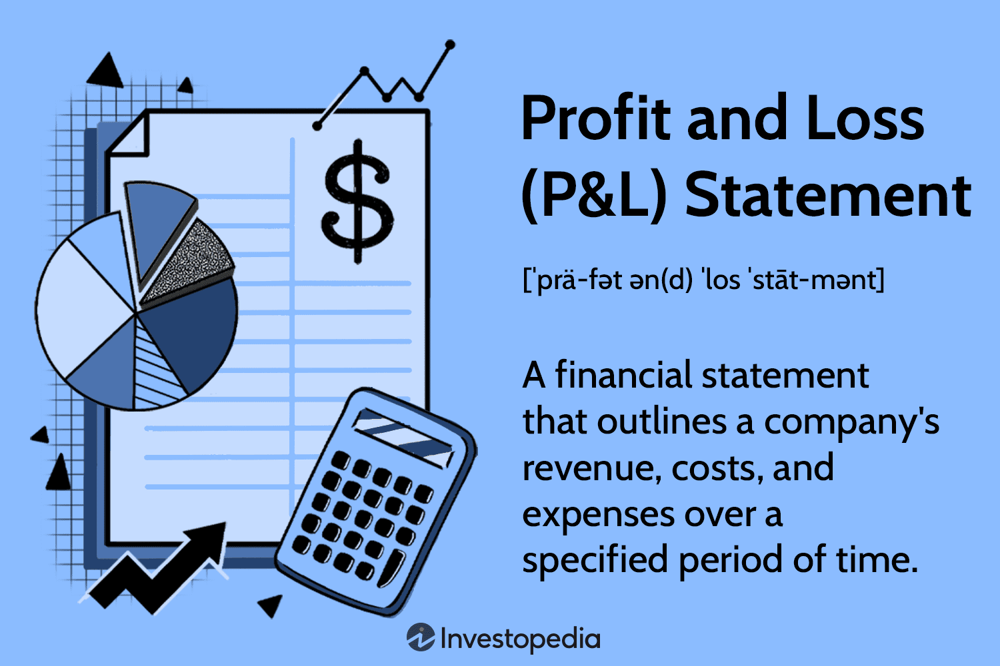

## Table of Contents

## What does 'adding to a losing position' mean in finance?

Adding to a losing position in finance means buying more of an investment that has already gone down in value. Imagine you bought some shares in a company, but then the price of those shares dropped. Instead of selling, you decide to buy even more shares at the lower price, hoping that the price will eventually go back up.

This strategy can be risky because it means you are putting more money into something that is not doing well. If the price keeps falling, you could lose even more money. However, some investors use this approach because they believe the investment will recover and they want to lower their average cost per share. It's important to be careful and think about the risks before adding to a losing position.

## Why might someone consider adding to a losing position?

Someone might consider adding to a losing position because they believe the investment will eventually go back up in value. They might have done research and feel confident that the reasons for the price drop are temporary. By buying more shares at a lower price, they can lower their average cost per share. This means if the price does go back up, they could make a bigger profit than if they had just held onto their original shares.

However, this strategy can be risky. If the price keeps falling, the investor could lose even more money. It's like betting more money on a horse that's already losing the race. So, people need to think carefully and make sure they understand the risks before deciding to add to a losing position. Sometimes, it might be better to cut losses and invest that money in something else that has a better chance of doing well.

## What are the risks associated with adding to a losing position?

Adding to a losing position can be very risky. When you buy more of an investment that has already gone down in value, you are putting more money into something that is not doing well. If the price keeps falling, you could lose a lot more money than you started with. It's like doubling down on a bet that's already losing, which can lead to bigger losses.

Another risk is that you might be wrong about the investment recovering. Sometimes, the reasons for the price drop are not temporary, and the investment might never go back up. If you keep adding to a losing position, you could end up losing a lot of money on something that will never recover. It's important to be careful and think about whether the investment really has a good chance of going back up before you put more money into it.

## Can you explain the concept of 'averaging down' in relation to adding to a losing position?

Averaging down is a strategy that people use when they add to a losing position. It means buying more of an investment that has gone down in price. The idea is to lower the average cost of each share you own. For example, if you bought a stock at $100 per share and it drops to $50, you might buy more shares at $50. This would bring your average cost per share down, so if the stock price goes back up, you could make more money.

However, averaging down is risky. If the stock keeps going down, you could lose even more money because you put more money into something that's not doing well. It's like betting more money on a losing horse. You need to be careful and think about why the stock went down in the first place. If the reasons are serious and the stock might not go back up, averaging down could lead to big losses.

## What psychological factors influence the decision to add to a losing position?

One big psychological [factor](/wiki/factor-investing) that influences the decision to add to a losing position is something called loss aversion. This means people feel the pain of losing money much more than they feel the joy of making money. So, when an investment goes down, people might think that if they buy more at the lower price, they can make up for their losses when the price goes back up. It's like hoping to fix a bad situation by making it bigger.

Another factor is overconfidence. Some people believe they know more about the market than they really do. They might think they can predict when the price will go back up, so they keep buying more of the losing investment. This can lead them to ignore warning signs and make risky choices. It's important to be careful and not let these feelings push you into making bad decisions with money.

## How does the strategy of adding to a losing position differ between stocks and options?

When you add to a losing position with stocks, you're buying more shares of a company whose stock price has gone down. You might do this because you think the price will go back up, and by buying more at a lower price, you can lower your average cost per share. This can be risky because if the stock keeps going down, you could lose even more money. But with stocks, you own a piece of the company, so there's a chance the company could recover and the stock price could go back up.

Adding to a losing position with options is different and can be even riskier. Options are contracts that give you the right to buy or sell a stock at a certain price by a certain date. If the stock price goes down, the value of your option might go down too, and options have an expiration date. If you buy more options when they're losing value, you're betting that the stock will move in your favor before the options expire. If it doesn't, you could lose all the money you put into the options, because they could become worthless when they expire. So, adding to a losing position with options can be a lot riskier than doing it with stocks.

## What are some common mistakes investors make when adding to losing positions?

One common mistake investors make when adding to losing positions is not understanding why the investment went down in the first place. They might think it's just a temporary drop and keep buying more without doing enough research. But if the reasons for the drop are serious, like the company is losing money or facing big problems, the investment might keep going down. It's important to really understand what's happening before deciding to put more money into it.

Another mistake is letting emotions guide their decisions. Investors can feel a strong need to fix their losses, so they buy more of the losing investment hoping it will go back up. This is called loss aversion. They might also be overconfident, thinking they know more than they do and can predict the market. This can lead them to ignore warning signs and make risky choices. It's better to take a step back, look at the facts, and make a careful decision instead of letting feelings take over.

Lastly, investors often forget about the risks of adding to a losing position. They might focus too much on the possible gains and not enough on what could go wrong. If the investment keeps going down, they could lose a lot more money. It's important to think about how much risk you're willing to take and whether it's worth it to keep putting money into something that's not doing well. Sometimes, it's better to cut your losses and invest in something else that has a better chance of doing well.

## How can technical analysis be used to decide whether to add to a losing position?

Technical analysis can help you decide whether to add to a losing position by looking at charts and patterns that show how the price of an investment has moved in the past. You might see that the price has gone down, but if you notice certain patterns like a 'double bottom' or 'support level,' it could mean the price might go back up soon. These patterns can give you a clue that the drop might be temporary, and it might be a good time to buy more to lower your average cost.

However, technical analysis isn't perfect and can be tricky. Just because a pattern looks good on a chart doesn't mean the price will definitely go up. You need to be careful and use other information too, like news about the company or the overall market. If the technical analysis shows a strong pattern and other signs look good, you might feel more confident about adding to a losing position. But if the patterns are weak or the news is bad, it might be better to wait or even sell your investment instead of buying more.

## What role does diversification play when considering adding to a losing position?

Diversification means spreading your money across different kinds of investments, like stocks, bonds, and real estate. When you think about adding to a losing position, it's important to look at your whole investment plan. If you already have a lot of money in the investment that's losing value, adding more might make your plan less diverse. This can be risky because if that investment keeps going down, it could hurt your whole plan a lot. So, before you add to a losing position, think about how it fits with your other investments and if it will keep your plan balanced.

On the other hand, if your plan is already very diverse, adding a little more to a losing position might not be as risky. You might feel okay about putting a bit more money into it if you believe it will go back up and you have other investments to help balance out the risk. But it's still important to be careful and think about the big picture. Make sure that adding to a losing position won't mess up your overall plan and that you're not putting too much of your money into one thing.

## Can you discuss any successful case studies where adding to a losing position led to a profitable outcome?

One successful case study of adding to a losing position is the story of Warren Buffett and his investment in American Express in the 1960s. American Express was hit hard by a scandal, and its stock price dropped a lot. But Buffett believed in the company's long-term value. He bought more shares at the lower price, lowering his average cost. Over time, American Express recovered, and Buffett made a huge profit from his investment. This shows that if you really understand a company and believe in its future, adding to a losing position can pay off.

Another example is when investors added to their positions in Apple stock during the 2008 financial crisis. Apple's stock price fell along with the rest of the market, but some investors saw it as a chance to buy more at a lower price. They believed in Apple's products and leadership. As the economy recovered, Apple's stock soared, and those who added to their positions during the downturn made a lot of money. These examples show that adding to a losing position can be profitable if you do your homework and have confidence in the investment's long-term potential.

## How should an investor assess their risk tolerance before deciding to add to a losing position?

Before deciding to add to a losing position, an investor should think about how much risk they can handle. Risk tolerance is about how much money you can afford to lose without it affecting your life too much. You need to look at your whole money situation, like how much you have saved, how much you earn, and what your future money goals are. If you're okay with taking bigger risks because you have a lot of other money to fall back on, you might feel more comfortable adding to a losing position. But if losing more money would really hurt you, it's better to be careful and not take that risk.

It's also important to think about your feelings and how you react to losing money. Some people get very upset when they lose money, and that can make them make bad choices. If you know you don't handle losses well, you might want to avoid adding to a losing position because it could make you feel even worse. On the other hand, if you can stay calm and think clearly even when things aren't going well, you might be okay with taking that risk. The key is to know yourself and your money situation well before making any big decisions.

## What are the advanced strategies for managing and potentially recovering from a losing position in a professional trading environment?

In a professional trading environment, one advanced strategy for managing and potentially recovering from a losing position is to use stop-loss orders and trailing stops. A stop-loss order automatically sells your investment if it drops to a certain price, helping you limit your losses. A trailing stop moves up with the price of the investment, so if the price goes up, the stop-loss level goes up too. This can help you lock in some profits while still giving the investment room to grow. By using these tools, traders can manage their risk better and avoid adding more money to a losing position without a plan.

Another strategy is to use hedging techniques, like buying put options or short selling related assets. If you own a stock that's losing value, you can buy a put option on that stock. This gives you the right to sell the stock at a set price, which can help you make back some money if the stock keeps going down. Short selling means borrowing shares and selling them, hoping to buy them back later at a lower price. These strategies can help protect your money while you wait for the original investment to recover. But they are complex and need a good understanding of the market, so they're usually used by experienced traders.

Lastly, professional traders might use a strategy called dollar-cost averaging to recover from a losing position. Instead of putting all their money into the losing investment at once, they spread it out over time. They buy a little bit more of the investment regularly, no matter what the price is doing. This can lower their average cost and reduce the impact of big price swings. It's a way to slowly build up their position and give the investment time to recover, without risking too much money at once.

## References & Further Reading

[1]: Malkiel, B. G. (1990). ["A Random Walk Down Wall Street"](https://yourknowledgedigest.org/wp-content/uploads/2020/04/a-random-walk-down-wall-street.pdf). W.W. Norton & Company.

[2]: Fisher, P. A. (1958). ["Common Stocks and Uncommon Profits"](https://financialfreedomisajourney.com/wp-content/uploads/2024/08/Common-Stocks-and-Uncommon-Profits-Philip-Fisher.pdf). Harper & Brothers.

[3]: Kahneman, D., & Tversky, A. (1979). ["Prospect Theory: An Analysis of Decision under Risk,"](http://web.mit.edu/curhan/www/docs/Articles/15341_Readings/Behavioral_Decision_Theory/Kahneman_Tversky_1979_Prospect_theory.pdf) Econometrica, 47(2), 263-291.

[4]: Aronson, D. R. (2007). ["Evidence-Based Technical Analysis: Applying the Scientific Method and Statistical Inference to Trading Signals"](https://www.amazon.com/Evidence-Based-Technical-Analysis-Scientific-Statistical/dp/0470008741). Wiley.

[5]: Chan, E. P. (2008). ["Quantitative Trading: How to Build Your Own Algorithmic Trading Business"](https://github.com/ftvision/quant_trading_echan_book). Wiley.

[6]: Jansen, S. (2018). ["Machine Learning for Algorithmic Trading"](https://github.com/stefan-jansen/machine-learning-for-trading). Packt Publishing.

[7]: Lopez de Prado, M. (2018). ["Advances in Financial Machine Learning"](https://www.amazon.com/Advances-Financial-Machine-Learning-Marcos/dp/1119482089). Wiley.