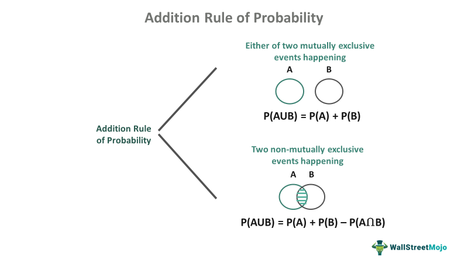

Probability theory is integral to the world of trading, especially in algorithmic trading strategies. At its core, probability offers a mathematical framework to quantify the uncertainty and risks constantly present in financial markets. This theoretical foundation enables traders to forecast potential outcomes and devise strategies accordingly. One of the fundamental rules within probability theory is the addition rule, which is crucial for assessing scenarios where multiple events could occur. Understanding basic probability rules such as the addition rule can significantly enhance trading models by providing insights into the likelihood of various market events.

This article explores the addition rule of probability, its applicability in trading, and the formulas involved. The addition rule is used to determine the probability of either one event or another occurring, making it essential for risk assessment and decision-making processes in trading. Traders employ these probability concepts to predict market movements and make informed decisions, ultimately striving to balance potential rewards with the inherent risks.



Algorithmic trading, in particular, benefits from the integration of probability theory, as algorithms rely on mathematical models to evaluate market conditions and execute trades autonomously. By incorporating principles like the addition rule, these models can more accurately predict market behavior and adjust strategies dynamically to optimize performance.

Let’s explore how the addition rule of probability plays a vital role in algorithmic trading and how traders can use it to develop sophisticated trading models that better navigate the complexities of financial markets.

## Table of Contents

## Understanding Probability in Trading

Probability plays a significant role in trading by quantifying the uncertainty associated with future events. This is vital because financial markets are inherently unpredictable, and traders must make decisions in the face of this uncertainty. By assigning probabilities to various possible outcomes, traders can make more informed decisions and formulate strategies that anticipate diverse market movements.

Trading decisions frequently rely on assessments of the likelihood that particular events will occur, often using historical data as a guide. For instance, traders might use past market performance to gauge the probability of a stock price rising or falling. This historical data provides the statistical foundation upon which probabilities are calculated, enabling traders to estimate risks and potential outcomes. The process involves analyzing patterns and identifying statistical anomalies that may influence future market behavior.

Algorithmic trading, which involves the use of complex mathematical models to execute trading strategies, heavily incorporates probability to evaluate and optimize trades. Algorithms are designed to process vast amounts of data and execute trades based on predetermined quantitative criteria. Probability helps these algorithms assess varying market conditions and make quick, data-driven trading decisions. They may employ stochastic models, which incorporate randomness and are particularly useful in modeling price movements and other market phenomena.

Learning probability is crucial for traders aiming to develop strategies that minimize risks and maximize returns. For example, understanding probability distributions allows traders to recognize potential price ranges and calculate the expected returns for different trading strategies. Moreover, concepts like expected value and variance are essential for evaluating potential profits and risks. In practice, a trader may use Python to implement a simple probability-based model that uses historical data to predict future stock prices. Here's a basic example:

```python
import numpy as np

# Historical stock prices
prices = np.array([150, 152, 146, 149, 155, 157, 158])

# Calculate daily returns
returns = np.diff(prices) / prices[:-1]

# Calculate probability of price increase
prob_increase = np.sum(returns > 0) / len(returns)

print(f'Probability of stock price increase: {prob_increase:.2f}')
```

In this Python snippet, we calculate daily returns from a historical series of stock prices and determine the probability of the stock price increasing on any given day. This basic example illustrates how probability can offer insights into likely future events, enabling traders to craft more astute trading strategies.

In conclusion, a thorough understanding of probability allows traders to navigate uncertainty more effectively, constructing strategies that can adapt to and exploit market conditions. The use of probability in trading not only enhances decision-making but also equips traders with the analytical tools necessary to maximize their financial outcomes in unpredictable environments.

## The Addition Rule of Probability

The addition rule of probability is a fundamental concept that plays a significant role in evaluating the likelihood of multiple events in the context of trading. This rule is employed to determine the probability of either of two events occurring, essential for scenarios where traders assess 'either/or' probabilities in financial markets.

Mathematically, the basic addition rule is expressed as:

$$
P(A \text{ or } B) = P(A) + P(B) - P(A \text{ and } B)
$$

Here, $P(A)$ and $P(B)$ are the probabilities of events A and B occurring independently, while $P(A \text{ and } B)$ is the probability of both events occurring simultaneously. The necessity to subtract $P(A \text{ and } B)$ arises because when adding $P(A)$ and $P(B)$, the intersection where both events occur is counted twice.

In financial markets, this probability rule helps traders understand the overall risks and opportunities when dealing with multi-event scenarios. For instance, a trader assessing the likelihood of either an increase in a stock's price or a corresponding rise in the overall market index can utilize this rule to evaluate the combined probability more precisely.

By comprehending the addition rule, traders can develop more sophisticated strategies within trading algorithms. These algorithms often need to process complex data sets and predict outcomes based on multiple potential scenarios. Incorporating the addition rule supports accurate probability estimations, facilitating better risk management and decision-making processes.

Furthermore, the application of this rule aids in identifying correlations and dependencies among various financial instruments. This understanding subsequently informs the creation of algorithms that can adjust to market dynamics by interpreting probabilities as part of a larger, interdependent system of events. Mastery of such probability concepts is indispensable for traders aiming to optimize their strategies and anticipate market movements effectively.

## Formulas and Calculations

Exploring the mathematical foundation behind the addition rule is crucial for accurate application in [algorithmic trading](/wiki/algorithmic-trading). The addition rule of probability is given by:

$$
P(A \text{ or } B) = P(A) + P(B) - P(A \text{ and } B)
$$

This fundamental formula is employed to calculate the likelihood of either one of two events happening, which is pivotal when assessing risks and opportunities within a trading strategy.

### Probability Calculations in Market Scenarios

Traders often face scenarios requiring the computation of probabilities across events. Consider a market where an asset might either increase or decrease based on certain economic indicators. If the probability of an uptrend (event A) is 0.4 and a strong economic result (event B) is 0.3, and the probability of both occurring simultaneously (i.e., uptrend with a strong economic result) is 0.1, using the formula, we calculate:

$$
P(A \text{ or } B) = P(A) + P(B) - P(A \text{ and } B)
$$

$$
P(A \text{ or } B) = 0.4 + 0.3 - 0.1 = 0.6
$$

Thus, the probability of either an uptrend or a strong economic result is 0.6, assisting the trader in understanding potential outcomes.

### Independent vs. Dependent Events

For independent events, the computation simplifies as the occurrence of one does not affect the other. The probability of A and B occurring is simply the product of their individual probabilities: 

$$
P(A \text{ and } B) = P(A) \cdot P(B)
$$

However, in the context of dependent events, such as a trading strategy involving correlated assets, consideration of conditional probabilities is necessary. 

For dependent events:

$$
P(A \text{ and } B) = P(A) \cdot P(B|A)
$$

where $P(B|A)$ indicates the probability of event B occurring given that A has already occurred. Adjusting formulas to reflect dependencies is critical in scenarios with economic indicators affecting multiple asset classes.

### Common Mistakes in Probability Calculations

1. **Ignoring Dependencies**: Misjudging events as independent when they are actually dependent can lead to incorrect risk assessments.

2. **Double Counting**: Failing to subtract the probability of the intersection of events often results in an overestimated aggregate probability.

3. **Incorrect Data Interpretation**: Utilizing historical data without considering regime changes or market anomalies can skew probability calculations.

By accurately applying the addition rule, traders can enhance their algorithmic models' reliability. Understanding how to adjust calculations for independent and dependent scenarios allows traders to design robust strategies that consider intertwined market factors.

## Applying Probability in Algorithmic Trading

Probability models are integral in the development of algorithmic trading strategies, playing a vital role in predicting market trends. Algorithmic trading systems execute orders based on predefined criteria using sophisticated mathematical models that incorporate statistical and probabilistic techniques. Traders leverage these models to execute high-frequency trading, optimize portfolios, and improve overall trading efficiency.

The addition rule of probability is particularly valuable in evaluating the likelihood of different market events occurring. This rule allows traders to determine the probability of either of two events happening, which is essential in assessing risks and aligning trading strategies with current market conditions. The formula for the addition rule of probability is:

$$
P(A \text{ or } B) = P(A) + P(B) - P(A \text{ and } B)
$$

In trading, this formula is used to calculate the probability of multiple market triggers coinciding, such as significant economic announcements affecting stock prices in various sectors. 

For example, consider two market events: a sudden drop in oil prices (Event A) and a rise in technology stock prices (Event B). Using historical data, a trader might calculate $P(A)$ and $P(B)$, then use the addition rule to estimate the probability of either event influencing a technology sector index.

Algorithmic platforms use this probabilistic insight to implement rules-based strategies. These platforms can automatically adjust trading strategies based on the calculated probabilities, ensuring that trades are aligned with both predicted trends and pre-defined risk tolerance levels. Python, a popular programming language in algorithmic trading, can be used to implement these probabilistic models. Below is a sample code snippet that demonstrates how to calculate probability using the addition rule:

```python
def calculate_probability(event_A, event_B, intersection_AB):
    return event_A + event_B - intersection_AB

P_A = 0.30  # Probability of event A
P_B = 0.25  # Probability of event B
P_AB = 0.10  # Probability of both events A and B

P_A_or_B = calculate_probability(P_A, P_B, P_AB)
print("Probability of either event A or B:", P_A_or_B)
```

This understanding enables algorithmic traders to craft strategies that are not only reactive but also adaptive. By continuously analyzing probabilities and adjusting strategies, traders can respond effectively to dynamic market conditions, mitigate risks, and seize opportunities for profit. Incorporating probability models into trading algorithms provides a robust framework for navigating the complexities of modern financial markets.

## Conclusion

The addition rule of probability is a fundamental concept in understanding and analyzing market dynamics. In trading, this rule enables traders to evaluate the probability of multiple market events occurring independently or simultaneously. The formula, P(A or B) = P(A) + P(B) - P(A and B), provides a comprehensive framework for assessing the likelihood of either event A or event B happening, considering any overlap between them. This understanding is crucial for developing broader algorithmic trading strategies that can effectively navigate the complexities of financial markets.

By mastering these probability formulas, traders gain a competitive edge. Enhanced predictive capabilities allow for more informed decision-making, which is essential for identifying profitable opportunities and mitigating risks. A comprehensive grasp of probability helps traders quantify uncertainty, leading to a more analytical and systematic approach to risk management. This transformation in how traders approach risks is vital for adapting to the inherent [volatility](/wiki/volatility-trading-strategies) and unpredictability of markets.

With practice, these probability concepts can be smoothly integrated into trading strategies, ensuring that traders are equipped to handle dynamic market conditions. By continuously refining their understanding and application of probability, traders can develop more robust and adaptable strategies, ultimately leading to better trading outcomes. The integration of probability into algorithmic trading not only improves the execution of trading models but also plays a pivotal role in optimizing portfolio performance and enhancing overall market participation.

## References & Further Reading

[1]: Lopez de Prado, M. (2018). ["Advances in Financial Machine Learning."](https://www.amazon.com/Advances-Financial-Machine-Learning-Marcos/dp/1119482089) John Wiley & Sons.

[2]: Chan, E. P. (2009). ["Quantitative Trading: How to Build Your Own Algorithmic Trading Business."](https://github.com/ftvision/quant_trading_echan_book) John Wiley & Sons.

[3]: Aronson, D. R. (2007). ["Evidence-Based Technical Analysis: Applying the Scientific Method and Statistical Inference to Trading Signals."](https://onlinelibrary.wiley.com/doi/book/10.1002/9781118268315) John Wiley & Sons.

[4]: Jansen, S. (2020). ["Machine Learning for Algorithmic Trading."](https://github.com/stefan-jansen/machine-learning-for-trading) Packt Publishing.

[5]: Hull, J. C. (2018). ["Options, Futures, and Other Derivatives."](https://www.semanticscholar.org/paper/Options%2C-Futures%2C-and-Other-Derivatives-Hull/89bdee500c8623864fc9eb7a471546aa713acc44) Pearson. 

[6]: Bodie, Z., Kane, A., & Marcus, A. J. (2013). ["Investments and Portfolio Management"](). McGraw-Hill Education.

[7]: Taleb, N. N. (2007). ["The Black Swan: The Impact of the Highly Improbable."](https://www.jstor.org/stable/23045073) Random House.