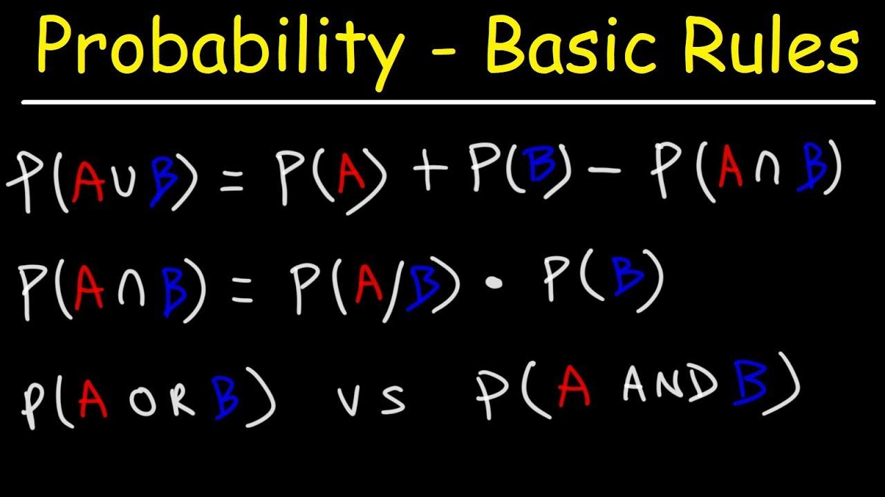

## Table of Contents

## What is the basic concept of probability?

Probability is a way to talk about how likely something is to happen. It's like guessing, but with math. Imagine you have a bag with different colored marbles. If you want to know the chance of picking a red marble, you count how many red marbles there are and divide that by the total number of marbles. That number is the probability. It's always between 0 and 1, where 0 means it will never happen and 1 means it will definitely happen.

You can also think about probability in everyday life. For example, if it's raining outside, there's a high probability you'll get wet if you go out without an umbrella. Or, if you flip a coin, there's a 50% chance it will land on heads because there are only two sides, and they're equally likely. Probability helps us make decisions when we're not sure what will happen, by giving us a better idea of what might happen based on what we know.

## What is the addition rule for probability?

The addition rule for probability helps us figure out the chance of either one thing happening or another thing happening, or both. Imagine you want to know the probability of drawing a heart or a diamond from a deck of cards. You add the probability of drawing a heart to the probability of drawing a diamond. But, if there's a chance that both events could happen at the same time (like drawing a card that's both a heart and a diamond, which can't happen), you have to subtract that overlap. So, the rule is: add the probabilities of the two events, then subtract the probability of both events happening together.

Let's use an example to make it clearer. Say you roll a die and you want to know the chance of rolling a 1 or a 2. The probability of rolling a 1 is 1/6, and the probability of rolling a 2 is also 1/6. Since rolling a 1 and a 2 at the same time is impossible, there's no overlap to subtract. So, you just add the probabilities: 1/6 + 1/6 = 2/6, which simplifies to 1/3. That's the chance of rolling a 1 or a 2. This rule is super helpful for figuring out the odds when you're dealing with more than one event.

## How do you apply the addition rule when events are mutually exclusive?

When events are mutually exclusive, it means they can't happen at the same time. For example, if you roll a die, you can't roll a 1 and a 2 at the same time. When you're trying to find the probability of one of these events happening, you just add their probabilities together. There's no need to subtract anything because there's no overlap - the events can't both happen.

So, let's say you want to know the chance of rolling a 1 or a 6 on a die. The probability of rolling a 1 is 1/6, and the probability of rolling a 6 is also 1/6. Since these events are mutually exclusive, you just add the probabilities: 1/6 + 1/6 = 2/6, which simplifies to 1/3. That's how easy it is to use the addition rule when events can't happen at the same time.

## Can you explain the formula for the addition rule of probability?

The addition rule of probability is a simple way to figure out the chance of one thing happening or another thing happening. The formula is: P(A or B) = P(A) + P(B) - P(A and B). Here, P(A) is the probability of event A happening, P(B) is the probability of event B happening, and P(A and B) is the probability of both events A and B happening at the same time. The tricky part is the last bit, P(A and B), because if A and B can happen together, you have to subtract that chance to avoid counting it twice.

When events A and B are mutually exclusive, it means they can't happen at the same time. In this case, P(A and B) is zero because there's no way for both to happen together. So, the formula gets simpler: P(A or B) = P(A) + P(B). For example, if you roll a die and want to know the chance of rolling a 1 or a 2, you just add the probabilities of rolling a 1 (which is 1/6) and rolling a 2 (also 1/6). Since rolling a 1 and a 2 at the same time is impossible, you don't need to subtract anything, and the answer is 1/6 + 1/6 = 2/6, or 1/3.

## What is the difference between mutually exclusive and non-mutually exclusive events?

Mutually exclusive events are things that can't happen at the same time. For example, if you flip a coin, it can land on heads or tails, but not both at once. These events are like opposite choices where [picking](/wiki/asset-class-picking) one means the other can't happen. When you want to know the chance of one of these events happening, you just add their probabilities together. There's no need to worry about subtracting anything because they can't overlap.

Non-mutually exclusive events are different because they can happen at the same time. Imagine you're drawing a card from a deck and you want to know the chance of getting a heart or a face card. A card can be both a heart and a face card, like the Queen of Hearts. So, when you calculate the probability of one or the other happening, you add the probabilities of getting a heart and getting a face card, but then you have to subtract the chance of getting a card that's both a heart and a face card. This way, you don't count the overlap twice.

## How do you calculate the probability of the union of two events that are not mutually exclusive?

When you want to figure out the chance of one thing happening or another thing happening, and those things can happen at the same time, you need to use a special rule. This rule is called the addition rule for the union of two events. You start by adding the chance of the first event happening to the chance of the second event happening. But, because these events can happen together, you need to be careful not to count that overlap twice. So, after adding the two chances, you subtract the chance of both events happening at the same time.

For example, imagine you're drawing a card from a deck and you want to know the chance of getting a heart or a face card. There are 13 hearts in a deck, so the chance of getting a heart is 13/52. There are 12 face cards (3 for each suit), so the chance of getting a face card is 12/52. But, there are 3 cards that are both hearts and face cards (the Jack, Queen, and King of Hearts), so the chance of getting a card that's both is 3/52. To find the chance of getting a heart or a face card, you add 13/52 and 12/52, which equals 25/52. Then, you subtract the 3/52 chance of getting a card that's both, which gives you 22/52, or 11/26. That's the chance of drawing a heart or a face card from a deck.

## Can you provide an example of using the addition rule with real-life scenarios?

Imagine you're at a birthday party and there's a big box of candies. You want to know the chance of picking either a red candy or a blue candy. There are 10 red candies and 8 blue candies out of a total of 30 candies. The chance of picking a red candy is 10/30, and the chance of picking a blue candy is 8/30. But, there's also a candy that's both red and blue - it's a special swirled candy, and there's only one of those. So, the chance of picking the swirled candy is 1/30. To find the chance of picking a red or a blue candy, you add 10/30 and 8/30, which equals 18/30. Then, you subtract the 1/30 chance of picking the swirled candy, which gives you 17/30. That's the chance of picking a red or a blue candy from the box.

Now, let's think about another scenario at a school event. You're trying to guess if it will rain or if there will be a lot of people at the event. The weather forecast says there's a 30% chance of rain, and from past events, you know there's a 60% chance of a big crowd. But, you also know that when it rains, there's usually a smaller crowd - about a 20% chance that both rain and a big crowd happen together. To find the chance of either rain or a big crowd, you add the 30% chance of rain to the 60% chance of a big crowd, which equals 90%. Then, you subtract the 20% chance of both happening together, which gives you 70%. So, there's a 70% chance of either rain or a big crowd at the school event.

## How does the addition rule extend to more than two events?

The addition rule for probability can work with more than just two events. Imagine you have three different things that could happen, like picking a red, blue, or green marble from a bag. You want to know the chance of picking any one of these colors. You start by adding up the chance of picking a red marble, the chance of picking a blue marble, and the chance of picking a green marble. But, you have to be careful because sometimes a marble could be more than one color, like a marble that's both red and blue. So, after adding up the chances, you need to subtract the chances of picking a marble that's both red and blue, both red and green, and both blue and green. If there's a marble that's all three colors, you subtract that chance too.

Let's use a real-life example to make it clear. Say you're at a fair and you want to know the chance of winning a prize from either the ring toss game, the balloon dart game, or the fishing game. The chance of winning at the ring toss is 20%, at the balloon dart game is 30%, and at the fishing game is 10%. But, some people can win at more than one game. For example, there's a 5% chance someone wins at both the ring toss and the balloon dart game, a 3% chance at both the ring toss and the fishing game, and a 2% chance at both the balloon dart and the fishing game. There's also a 1% chance someone wins at all three games. To find the total chance of winning at least one game, you add 20%, 30%, and 10%, which equals 60%. Then, you subtract 5%, 3%, and 2% for the overlaps, and finally subtract 1% for winning all three. So, the total chance of winning at least one game is 60% - 5% - 3% - 2% - 1% = 49%.

## What are common mistakes to avoid when applying the addition rule?

One common mistake when using the addition rule is forgetting to subtract the overlap when events can happen at the same time. Imagine you're counting the chance of picking a red or a blue marble from a bag. If you just add the chances of picking a red marble and a blue marble without subtracting the chance of picking a marble that's both red and blue, you'll count that special marble twice. Always remember to subtract the chance of both events happening together if they can overlap.

Another mistake is not realizing when events are mutually exclusive. If two things can't happen at the same time, like rolling a 1 or a 2 on a die, you don't need to subtract anything. Just add the chances together. Sometimes people get confused and try to subtract the chance of both events happening together even when it's impossible, which can mess up your calculation. Keep it simple and only subtract when there's a chance for both events to happen at once.

## How does the addition rule relate to other probability rules like the multiplication rule?

The addition rule and the multiplication rule are both important ways to figure out the chances of different things happening, but they work in different situations. The addition rule helps you find the chance of one thing happening or another thing happening. You add the chances together, and if those things can happen at the same time, you subtract the chance of both happening to avoid counting it twice. On the other hand, the multiplication rule is used to find the chance of one thing happening and then another thing happening. You multiply the chances of each event happening. This rule is useful when you're looking at events that happen one after the other, like flipping a coin twice and wanting to know the chance of getting heads both times.

These two rules often work together in more complex situations. For example, if you want to know the chance of picking a red or a blue marble from a bag and then flipping a coin to get heads, you might use the addition rule first to find the chance of picking a red or a blue marble, and then use the multiplication rule to find the chance of that happening and then getting heads on the coin flip. Understanding how to use both rules and when to use them can help you figure out the chances of all sorts of different events happening, making it easier to predict outcomes in real life.

## Can you discuss any advanced applications or extensions of the addition rule in probability theory?

The addition rule can be extended to more complex situations in probability theory, like when you're dealing with lots of events or events that are connected in special ways. Imagine you're at a big party with different games and you want to know the chance of winning at least one game. If there are many games, you can use the principle of inclusion-exclusion, which is like a bigger version of the addition rule. It helps you add up the chances of winning each game, then subtract the chances of winning at two games at the same time, add back the chances of winning at three games at the same time, and so on. This way, you make sure you're not counting any overlaps too many times or missing any.

Another advanced use of the addition rule is in conditional probability, where the chance of something happening can change based on other things that have already happened. For example, if you know it's raining, the chance of people showing up to an outdoor event might be different. You can use the addition rule along with the multiplication rule to figure out these changing chances. By understanding how events are connected and how the chances can change, you can use the addition rule to solve more complicated problems in areas like [statistics](/wiki/bayesian-statistics), finance, and even medicine, where predicting outcomes based on different conditions is really important.

## How can the addition rule be used in statistical analysis or decision-making processes?

The addition rule can be really helpful in statistical analysis and decision-making. Imagine you're a doctor trying to figure out if a patient has one disease or another. You can use the addition rule to add up the chances of the patient having each disease, and if it's possible for them to have both at the same time, you subtract that chance. This way, you get a better idea of how likely it is that the patient has at least one of the diseases. It helps doctors make better decisions about what tests to run or what treatments to suggest.

In business, the addition rule can be used to make decisions about risks and opportunities. Say you're a manager trying to decide whether to launch a new product or expand into a new market. You can use the addition rule to figure out the chance of success in either the new product launch or the market expansion. If there's a chance that both could be successful at the same time, you subtract that overlap. This gives you a clearer picture of your overall chance of success, helping you decide which path to take. By using the addition rule, you can make smarter choices based on the chances of different outcomes.

## What is the Addition Rule of Probability?

The addition rule of probability is a fundamental concept that plays a significant role in evaluating the likelihood of multiple events in the context of trading. This rule is employed to determine the probability of either of two events occurring, essential for scenarios where traders assess 'either/or' probabilities in financial markets.

Mathematically, the basic addition rule is expressed as:

$$
P(A \text{ or } B) = P(A) + P(B) - P(A \text{ and } B)
$$

Here, $P(A)$ and $P(B)$ are the probabilities of events A and B occurring independently, while $P(A \text{ and } B)$ is the probability of both events occurring simultaneously. The necessity to subtract $P(A \text{ and } B)$ arises because when adding $P(A)$ and $P(B)$, the intersection where both events occur is counted twice.

In financial markets, this probability rule helps traders understand the overall risks and opportunities when dealing with multi-event scenarios. For instance, a trader assessing the likelihood of either an increase in a stock's price or a corresponding rise in the overall market index can utilize this rule to evaluate the combined probability more precisely.

By comprehending the addition rule, traders can develop more sophisticated strategies within trading algorithms. These algorithms often need to process complex data sets and predict outcomes based on multiple potential scenarios. Incorporating the addition rule supports accurate probability estimations, facilitating better risk management and decision-making processes.

Furthermore, the application of this rule aids in identifying correlations and dependencies among various financial instruments. This understanding subsequently informs the creation of algorithms that can adjust to market dynamics by interpreting probabilities as part of a larger, interdependent system of events. Mastery of such probability concepts is indispensable for traders aiming to optimize their strategies and anticipate market movements effectively.

## What are Formulas and Calculations?

Exploring the mathematical foundation behind the addition rule is crucial for accurate application in [algorithmic trading](/wiki/algorithmic-trading). The addition rule of probability is given by:

$$
P(A \text{ or } B) = P(A) + P(B) - P(A \text{ and } B)
$$

This fundamental formula is employed to calculate the likelihood of either one of two events happening, which is pivotal when assessing risks and opportunities within a trading strategy.

### Probability Calculations in Market Scenarios

Traders often face scenarios requiring the computation of probabilities across events. Consider a market where an asset might either increase or decrease based on certain economic indicators. If the probability of an uptrend (event A) is 0.4 and a strong economic result (event B) is 0.3, and the probability of both occurring simultaneously (i.e., uptrend with a strong economic result) is 0.1, using the formula, we calculate:

$$
P(A \text{ or } B) = P(A) + P(B) - P(A \text{ and } B)
$$

$$
P(A \text{ or } B) = 0.4 + 0.3 - 0.1 = 0.6
$$

Thus, the probability of either an uptrend or a strong economic result is 0.6, assisting the trader in understanding potential outcomes.

### Independent vs. Dependent Events

For independent events, the computation simplifies as the occurrence of one does not affect the other. The probability of A and B occurring is simply the product of their individual probabilities: 

$$
P(A \text{ and } B) = P(A) \cdot P(B)
$$

However, in the context of dependent events, such as a trading strategy involving correlated assets, consideration of conditional probabilities is necessary. 

For dependent events:

$$
P(A \text{ and } B) = P(A) \cdot P(B|A)
$$

where $P(B|A)$ indicates the probability of event B occurring given that A has already occurred. Adjusting formulas to reflect dependencies is critical in scenarios with economic indicators affecting multiple asset classes.

### Common Mistakes in Probability Calculations

1. **Ignoring Dependencies**: Misjudging events as independent when they are actually dependent can lead to incorrect risk assessments.

2. **Double Counting**: Failing to subtract the probability of the intersection of events often results in an overestimated aggregate probability.

3. **Incorrect Data Interpretation**: Utilizing historical data without considering regime changes or market anomalies can skew probability calculations.

By accurately applying the addition rule, traders can enhance their algorithmic models' reliability. Understanding how to adjust calculations for independent and dependent scenarios allows traders to design robust strategies that consider intertwined market factors.

## How can probability be applied in algorithmic trading?

Probability models are integral in the development of algorithmic trading strategies, playing a vital role in predicting market trends. Algorithmic trading systems execute orders based on predefined criteria using sophisticated mathematical models that incorporate statistical and probabilistic techniques. Traders leverage these models to execute high-frequency trading, optimize portfolios, and improve overall trading efficiency.

The addition rule of probability is particularly valuable in evaluating the likelihood of different market events occurring. This rule allows traders to determine the probability of either of two events happening, which is essential in assessing risks and aligning trading strategies with current market conditions. The formula for the addition rule of probability is:

$$
P(A \text{ or } B) = P(A) + P(B) - P(A \text{ and } B)
$$

In trading, this formula is used to calculate the probability of multiple market triggers coinciding, such as significant economic announcements affecting stock prices in various sectors. 

For example, consider two market events: a sudden drop in oil prices (Event A) and a rise in technology stock prices (Event B). Using historical data, a trader might calculate $P(A)$ and $P(B)$, then use the addition rule to estimate the probability of either event influencing a technology sector index.

Algorithmic platforms use this probabilistic insight to implement rules-based strategies. These platforms can automatically adjust trading strategies based on the calculated probabilities, ensuring that trades are aligned with both predicted trends and pre-defined risk tolerance levels. Python, a popular programming language in algorithmic trading, can be used to implement these probabilistic models. Below is a sample code snippet that demonstrates how to calculate probability using the addition rule:

```python
def calculate_probability(event_A, event_B, intersection_AB):
    return event_A + event_B - intersection_AB

P_A = 0.30  # Probability of event A
P_B = 0.25  # Probability of event B
P_AB = 0.10  # Probability of both events A and B

P_A_or_B = calculate_probability(P_A, P_B, P_AB)
print("Probability of either event A or B:", P_A_or_B)
```

This understanding enables algorithmic traders to craft strategies that are not only reactive but also adaptive. By continuously analyzing probabilities and adjusting strategies, traders can respond effectively to dynamic market conditions, mitigate risks, and seize opportunities for profit. Incorporating probability models into trading algorithms provides a robust framework for navigating the complexities of modern financial markets.

## References & Further Reading

[1]: Lopez de Prado, M. (2018). ["Advances in Financial Machine Learning."](https://www.amazon.com/Advances-Financial-Machine-Learning-Marcos/dp/1119482089) John Wiley & Sons.

[2]: Chan, E. P. (2009). ["Quantitative Trading: How to Build Your Own Algorithmic Trading Business."](https://github.com/ftvision/quant_trading_echan_book) John Wiley & Sons.

[3]: Aronson, D. R. (2007). ["Evidence-Based Technical Analysis: Applying the Scientific Method and Statistical Inference to Trading Signals."](https://onlinelibrary.wiley.com/doi/book/10.1002/9781118268315) John Wiley & Sons.

[4]: Jansen, S. (2020). ["Machine Learning for Algorithmic Trading."](https://github.com/stefan-jansen/machine-learning-for-trading) Packt Publishing.

[5]: Hull, J. C. (2018). ["Options, Futures, and Other Derivatives."](https://www.semanticscholar.org/paper/Options%2C-Futures%2C-and-Other-Derivatives-Hull/89bdee500c8623864fc9eb7a471546aa713acc44) Pearson. 

[6]: Bodie, Z., Kane, A., & Marcus, A. J. (2013). ["Investments and Portfolio Management"](). McGraw-Hill Education.

[7]: Taleb, N. N. (2007). ["The Black Swan: The Impact of the Highly Improbable."](https://www.jstor.org/stable/23045073) Random House.