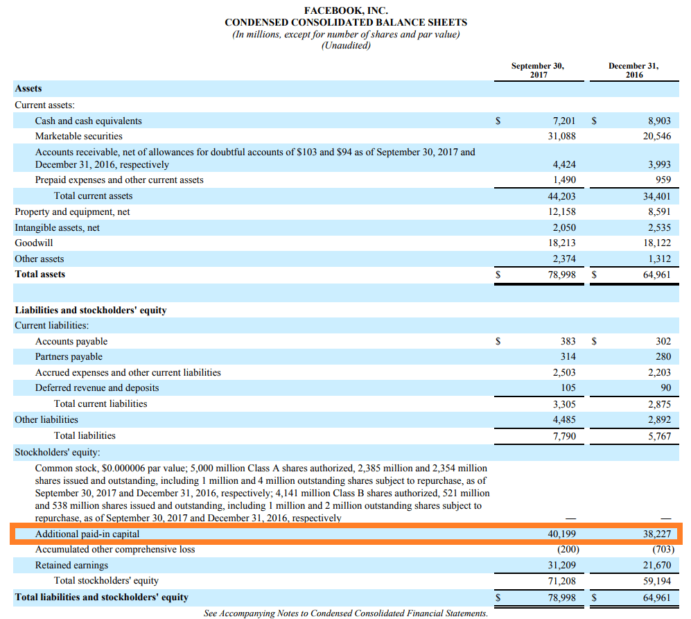

## Table of Contents

## What is Additional Paid-in Capital (APIC)?

Additional Paid-in Capital (APIC) is the money that a company gets from selling its stock above the stock's face value, also known as the par value. When a company issues stock, it sets a par value, which is a small, arbitrary amount. If the stock is sold for more than this par value, the extra money is recorded as APIC. This is important because it shows how much investors are willing to pay over the basic value of the stock, reflecting their confidence in the company.

APIC is listed on the company's balance sheet under shareholders' equity. It is a key part of a company's total equity because it represents the additional funds that the company has raised from its shareholders. This money can be used by the company for various purposes, such as expanding the business, investing in new projects, or paying down debt. Understanding APIC helps investors see how much capital the company has raised beyond the minimum required by its stock issuance.

## How is Additional Paid-in Capital different from the par value of stock?

The par value of a stock is a small, fixed amount that is set by the company when it issues the stock. It's like a minimum price for the stock, but it's usually very low, often just a few cents. When a company sells its stock, it can't sell it for less than the par value. The par value is more of a legal requirement and doesn't really reflect what the stock is actually worth.

Additional Paid-in Capital (APIC), on the other hand, is the money that the company gets from selling its stock above the par value. If a company sells a stock with a par value of $0.01 for $10, the extra $9.99 goes into APIC. This shows how much investors are willing to pay over the basic value of the stock. APIC is important because it tells us how much extra money the company has raised from its shareholders, which can be used for growing the business or other investments.

## Why is Additional Paid-in Capital important for a company?

Additional Paid-in Capital (APIC) is important for a company because it shows how much money the company has raised from selling its stock above the par value. This extra money can be used for many things like growing the business, starting new projects, or paying off debts. It's like getting extra cash that the company can use to do more things and become bigger.

APIC also tells investors how much they believe in the company. If people are willing to pay a lot more than the par value for the stock, it means they think the company is going to do well. This can make the company look good to other investors and help it raise even more money in the future. So, APIC is not just about the money the company has now, but also about how confident people are in its future.

## How is Additional Paid-in Capital recorded on a company's balance sheet?

Additional Paid-in Capital (APIC) is shown on a company's balance sheet under the section called "Shareholders' Equity." This part of the balance sheet lists all the money that comes from the company's owners, or shareholders. APIC is the extra money the company gets when it sells its stock for more than the par value. So, if a stock has a par value of $0.01 and is sold for $10, the $9.99 extra goes into APIC.

This money is important because it shows how much extra cash the company has raised from its shareholders. It's not just the basic amount from selling the stock, but the extra that people are willing to pay. This extra money can be used by the company to grow, start new projects, or pay off debts. So, APIC helps show how much the company can do with the money it gets from its shareholders.

## Can Additional Paid-in Capital be negative, and if so, under what circumstances?

Additional Paid-in Capital (APIC) is usually a positive number because it shows the extra money a company gets when it sells its stock for more than the par value. But, in some rare cases, APIC can be negative. This happens if a company gives back more money to its shareholders than it got from them in the first place.

For example, if a company buys back its own stock for more than what it originally sold it for, this can make APIC negative. This is not common, but it can happen if the company wants to return a lot of money to its shareholders. When APIC is negative, it means the company has given back more money than it received from selling its stock above the par value.

## What is the relationship between Additional Paid-in Capital and retained earnings?

Additional Paid-in Capital (APIC) and retained earnings are both parts of a company's equity, but they come from different places. APIC is the extra money a company gets when it sells its stock for more than the par value. It shows how much investors are willing to pay over the basic value of the stock. This money can be used by the company to grow its business, start new projects, or pay off debts. It's like extra cash that the company has from its shareholders.

Retained earnings, on the other hand, are the profits that a company keeps instead of giving them back to shareholders as dividends. This money comes from the company's earnings over time and is kept to help the business grow or save for future needs. Retained earnings show how much money the company has made and kept from its operations. Both APIC and retained earnings are important because they help the company have more money to use for its goals, but they come from different sources: APIC from selling stock and retained earnings from the company's profits.

## How does issuing stock above par value affect Additional Paid-in Capital?

When a company sells its stock for more money than the par value, the extra money goes into Additional Paid-in Capital (APIC). The par value is a small, set amount that the company decides on when it creates the stock. If a company sells a stock with a par value of $0.01 for $10, the $9.99 difference is added to APIC. This shows how much extra money the company gets from its shareholders, which can be used to grow the business or start new projects.

APIC is important because it tells us how much investors believe in the company. If people are willing to pay a lot more than the par value, it means they think the company will do well in the future. This extra money helps the company have more funds to use for its goals, like expanding or investing in new ideas. So, issuing stock above par value directly increases the company's APIC, which is a big part of its total equity.

## What are the tax implications of Additional Paid-in Capital for a company?

Additional Paid-in Capital (APIC) is the extra money a company gets when it sells its stock for more than the par value. This money is not considered income for the company, so it's not taxed right away. Instead, APIC is added to the company's equity, which is like the company's net worth. Because it's not income, the company doesn't have to pay taxes on APIC when it gets it.

But, there can be tax effects later on. If the company uses the money from APIC to buy things that can be written off for taxes, like equipment or buildings, it might be able to lower its taxable income in the future. Also, if the company gives back the money to shareholders as dividends, those dividends might be taxed. So, while APIC itself isn't taxed when it's received, how the company uses it can affect its taxes down the road.

## How does Additional Paid-in Capital impact a company's book value?

Additional Paid-in Capital (APIC) is the extra money a company gets when it sells its stock for more than the par value. This extra money is added to the company's equity, which is shown on the balance sheet. When you add APIC to the company's equity, it makes the book value of the company higher. The book value is like the total value of the company according to its financial records, and it's found by subtracting the company's debts from its total assets.

Because APIC increases the equity part of the balance sheet, it directly affects the book value. If a company sells its stock for more than the par value and adds that money to APIC, it shows that investors believe in the company and are willing to pay more for its stock. This can make the company look more valuable on paper, which is important for investors and others who look at the company's financial health. So, APIC can make a company's book value go up, showing that the company has more money from its shareholders to use for growing and improving the business.

## In what ways can Additional Paid-in Capital be used by a company?

Additional Paid-in Capital (APIC) is the extra money a company gets when it sells its stock for more than the par value. This money can be used by the company in many ways. One way is to grow the business. The company can use APIC to open new stores, start new projects, or buy new equipment. This helps the company get bigger and do more things. Another way is to pay off debts. If the company owes money, it can use APIC to pay it back, which can make the company's finances healthier.

APIC can also be used to invest in new ideas or technologies. If the company thinks a new idea could make it more successful, it can use APIC to try it out. This can help the company stay ahead of others in its industry. Lastly, the company can keep the money from APIC as a safety net. If something unexpected happens, like a drop in sales, the company can use this money to keep going until things get better. So, APIC gives the company more options and helps it plan for the future.

## How does the treatment of Additional Paid-in Capital differ under different accounting standards (e.g., GAAP vs. IFRS)?

Additional Paid-in Capital (APIC) is treated a bit differently under the two main accounting standards: Generally Accepted Accounting Principles (GAAP) used in the United States and International Financial Reporting Standards (IFRS) used in many other countries. Under GAAP, APIC is shown as a separate line item on the balance sheet under shareholders' equity. It represents the amount of money a company gets from selling its stock above the par value. This clear separation helps investors see how much extra money the company has raised from its shareholders.

Under IFRS, the concept similar to APIC is called "share premium." Like GAAP, IFRS also requires companies to show share premium on the balance sheet under equity. However, IFRS allows more flexibility in how companies can use this money. For example, under IFRS, a company can use share premium to cover certain losses or issue bonus shares, which might not be as straightforward under GAAP. Despite these differences, both standards aim to give a clear picture of how much extra money a company has from selling its stock above the par value.

## What are some advanced strategies for managing and optimizing Additional Paid-in Capital?

One advanced strategy for managing and optimizing Additional Paid-in Capital (APIC) is to use it for strategic investments that can boost the company's growth and profitability. For example, a company might use APIC to acquire another business that can help it enter new markets or offer new products. This can create more value for shareholders because it can lead to higher profits in the future. Another strategy is to use APIC to fund research and development projects. By investing in new technologies or innovative ideas, a company can stay ahead of its competitors and keep growing. This can make the company more attractive to investors, who might be willing to pay even more for the stock, increasing APIC further.

Another strategy involves using APIC to manage the company's capital structure more effectively. A company might use APIC to buy back its own shares when it believes the stock is undervalued. This can increase the value of the remaining shares and make the company's stock more appealing to investors. Additionally, a company could use APIC to pay down high-interest debt, which can lower the company's interest expenses and improve its financial health. By carefully managing how APIC is used, a company can not only grow but also strengthen its financial position, making it more stable and attractive to investors.

## What is Understanding Additional Paid-In Capital?

Additional Paid-In Capital (APIC) is a key concept in corporate finance, representing the excess amount investors are willing to pay above the par value of a company's stock. Par value is generally a nominal amount assigned to a stock at issuance and often set at a minimal value. APIC is thus calculated using the formula:

$$
\text{APIC} = (\text{Issue Price} - \text{Par Value}) \times \text{Number of Shares Sold}
$$

APIC is documented on the equity side of a company's balance sheet, under shareholders' equity, providing insight into the additional funds generated over and above the nominal par value from the sale of stock.

### Real-World Examples

A practical example can be seen in companies like Apple Inc. If Apple issues stock with a par value of $0.01 per share and sells it for $150 per share, and if 1,000,000 shares are sold, the APIC would be computed as:

$$
\text{APIC} = (150 - 0.01) \times 1,000,000 = 149,990,000
$$

Another example is Facebook (now Meta Platforms, Inc.). When Facebook conducted its Initial Public Offering (IPO), it issued shares at prices significantly above par value, resulting in substantial APIC, reflecting robust investor confidence and willingness to invest beyond the stated nominal value.

### Benefits of APIC for Companies

APIC offers several advantages when raising capital:

1. **Debt-Free Capital**: One of the most significant benefits is that it allows companies to raise capital without incurring debt. This aspect is crucial for maintaining a healthier balance sheet as it avoids the imposition of obligatory interest payments, unlike financing through loans or bonds.

2. **Investor Confidence**: A substantial APIC is often indicative of strong market confidence, suggesting that investors trust the company’s potential for growth and profitability.

3. **Enhanced Financial Flexibility**: By augmenting equity capital through APIC, companies gain greater financial flexibility to undertake expansions, R&D investments, or acquisitions, aligning with long-term strategic goals.

4. **Improved Leverage Ratios**: Increasing the equity portion of a company’s capital structure can lead to better leverage ratios, vital for risk management and favorable credit ratings.

In conclusion, APIC plays a pivotal role in the financial architecture of businesses, offering an efficient mechanism for raising funds while strengthening market confidence and preserving corporate strategic flexibility.

## What is the Role of Stock Equity in Capital Finance?

Stock equity signifies ownership in a corporation through the holding of shares. It is a crucial component of corporate finance, offering two primary types: common and preferred stock. 

Common stock represents the most basic form of ownership and typically provides shareholders with voting rights. The value of common stock is subject to market fluctuations and corporate performance. Holders may receive dividends, although these are not guaranteed and depend on the company's profitability and reinvestment strategies.

Preferred stock, on the other hand, usually does not grant voting rights but provides a higher claim on assets and earnings than common stock. This includes fixed dividends, which must be paid out before dividends to common stockholders. In the event of liquidation, preferred stockholders are prioritized over common shareholders in receiving their investments back.

Stock equity is documented in a company's financial statements under shareholders' equity. This section comprises both capital contributed by shareholders and retained earnings. The balance sheet outlines these changes, reflecting stock issuances, buybacks, and dividend payments. The equation for shareholders' equity can be represented as:

$$

\text{Shareholders' Equity} = \text{Total Assets} - \text{Total Liabilities} 
$$

Stock issuance profoundly influences a company's financial structure. It can lead to an increase in cash flow and capital, allowing for expansion and reducing reliance on debt. However, issuing new stock can dilute existing shares, impacting earnings per share and, consequently, stock price. For example, raising $1 million by issuing additional shares increases cash flow by that amount while simultaneously diluting ownership.

Equity financing is strategically used for corporate growth, supporting ventures such as mergers and acquisitions or funding research and development. Unlike debt financing, which incurs obligations to repay with interest, equity financing involves trading ownership stakes for capital, thus sidestepping immediate financial liabilities. Companies often prefer equity financing during uncertain economic times when debt financing becomes more costly due to increased interest rates.

In summary, stock equity is vital in shaping a company's financial landscape and strategic potential. Understanding its intricacies aids in harnessing it for capital growth while balancing the inherent risks and benefits associated with dilution and ownership exchange.

## How do you calculate and analyze paid-in capital?

Paid-In Capital (PIC) is an essential component of a company's equity structure, representing the funds raised by the company through equity offerings. To accurately calculate Paid-In Capital, a step-by-step approach is required.

### Calculating Paid-In Capital

1. **Identify the Par Value**: The par value is the nominal value of a share as stated in the corporate charter. It is typically a minimal amount, often $0.01 or $1 per share.

2. **Determine the Issue Price**: This is the price at which the shares are sold to investors during an offering.

3. **Calculate the Paid-In Capital for Each Share**: Subtract the par value from the issue price to find the Paid-In Capital per share. 
$$
   \text{Paid-In Capital per Share} = \text{Issue Price} - \text{Par Value}

$$

4. **Multiply by the Number of Shares Issued**: To find the total Paid-In Capital, multiply the Paid-In Capital per share by the total number of shares issued.
$$
   \text{Total Paid-In Capital} = \text{Paid-In Capital per Share} \times \text{Number of Shares Issued}

$$

### Differences Between Paid-In Capital and Additional Paid-In Capital (APIC)

While Paid-In Capital includes both the par value of shares and any amount paid by investors above this par value, Additional Paid-In Capital specifically refers to the excess amount over the par value. Therefore:

- **Paid-In Capital** comprises the entire amount received by the company from the sale of stock. It is the sum of the par value and APIC.
- **APIC** represents only the premium paid by investors over the par value of the stock.

### Relevance of APIC in Understanding Investor Confidence and Corporate Strategy

APIC is a critical indicator of investor confidence in a company. A high APIC suggests that investors are willing to pay significantly above the par value, reflecting their belief in the company's potential for growth and profit. From a corporate strategy perspective, a robust APIC can enhance a company's financial position without incurring additional debt, allowing for investments in expansion, research, and development.

### Case Studies Illustrating Successful Capital Raising Through APIC

Several companies have effectively utilized APIC to raise capital, demonstrating its strategic importance:

1. **Example 1 - TechCorp Inc.**: TechCorp, in its IPO, issued shares at a price significantly higher than their par value, resulting in substantial APIC. This capital allowed the company to invest in cutting-edge technology, leading to a rapid increase in market share.

2. **Example 2 - HealthWell Corp.**: By leveraging APIC through successive equity offerings, HealthWell was able to fund multiple acquisitions, aiding their expansion into new markets. This strategy not only improved their cash flow but also enhanced their competitive edge in the healthcare industry.

These case studies demonstrate that effective management of APIC can lead to strategic outcomes that align with long-term corporate goals, enhancing overall shareholder value.

## References & Further Reading

[1]: ["Equity Asset Valuation"](https://www.amazon.com/Equity-Asset-Valuation-Institute-Investment/dp/1119628105) by Jerald E. Pinto, Elaine Henry, Thomas R. Robinson, and John D. Stowe

[2]: ["Corporate Finance: A Practical Approach"](https://www.amazon.com/Corporate-Finance-Practical-Michelle-Clayman/dp/1118105370) by Michelle R. Clayman, Martin S. Fridson, and George H. Troughton

[3]: ["Algorithmic Trading and DMA: An introduction to direct access trading strategies"](https://archive.org/details/algorithmictradi0000john) by Barry Johnson

[4]: ["Advances in Financial Machine Learning"](https://www.amazon.com/Advances-Financial-Machine-Learning-Marcos/dp/1119482089) by Marcos Lopez de Prado

[5]: ["Quantitative Trading: How to Build Your Own Algorithmic Trading Business"](https://www.amazon.com/Quantitative-Trading-Build-Algorithmic-Business/dp/1119800064) by Ernest P. Chan

[6]: Fama, E.F. (1970). ["Efficient Capital Markets: A Review of Theory and Empirical Work."](https://www.jstor.org/stable/2325486) Journal of Finance, 25(2), 383-417.

[7]: Black, F., & Scholes, M. (1973). ["The Pricing of Options and Corporate Liabilities."](https://www.cs.princeton.edu/courses/archive/fall09/cos323/papers/black_scholes73.pdf) Journal of Political Economy, 81(3), 637-654.