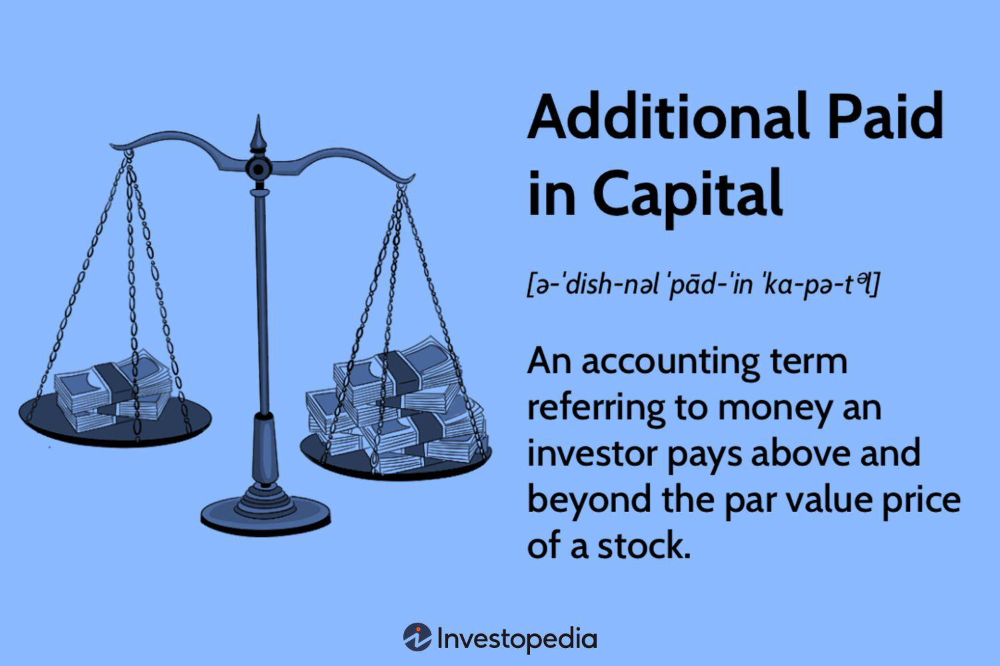

Stock equity represents ownership in a corporation, typically divided into shares of common or preferred stock. This financial instrument is fundamental to corporate finance as it provides a mechanism for raising capital without incurring debt. Stock equity allows companies to access funds needed for expansion, research and development, and other strategic initiatives, by offering investors a share in the company’s future profits and growth. Investors, in return, gain the ability to influence corporate governance through voting rights associated with their shares, and potentially earn returns through dividends and stock price appreciation. Thus, equity financing plays a crucial role in balancing a company’s capital structure and optimizing its financial performance.

Additional Paid-In Capital (APIC) refers to the amount received by a company from investors above the par value of its stock during an issuance. APIC serves as an important component of equity in the balance sheet and reflects investor confidence in the company's prospects. It is calculated as the difference between the issue price of the stock and its par value, expressed as:



$$
\text{APIC} = (\text{Issue Price} - \text{Par Value}) \times \text{Number of Shares Issued}
$$

The higher the APIC, the more capital a company raises without increasing its debt load, strengthening its financial position and giving it more flexibility in its operations and investment decisions.

Algorithmic trading has revolutionized modern finance by automating the trading process based on pre-defined criteria, often using complex mathematical models and algorithms. This technique allows traders and financial institutions to execute orders at unprecedented speeds and volumes, leveraging vast amounts of financial data, including equity metrics like APIC. Algorithmic trading enhances market efficiency and liquidity but also introduces new challenges like the potential for systemic risks and market anomalies.

This article aims to explore the intricate relationships between stock equity, APIC, and algorithmic trading. By understanding these interconnected components, companies and investors can better navigate the financial landscape and refine their strategies for [capital raising](/wiki/hedge-fund-capital-raising), financial reporting, and trading operations. This comprehensive analysis will provide valuable insights into optimizing financial strategies and achieving sustainable growth in today’s dynamic markets.

## Table of Contents

## Understanding Additional Paid-In Capital

Additional Paid-In Capital (APIC) is a key concept in corporate finance, representing the excess amount investors are willing to pay above the par value of a company's stock. Par value is generally a nominal amount assigned to a stock at issuance and often set at a minimal value. APIC is thus calculated using the formula:

$$
\text{APIC} = (\text{Issue Price} - \text{Par Value}) \times \text{Number of Shares Sold}
$$

APIC is documented on the equity side of a company's balance sheet, under shareholders' equity, providing insight into the additional funds generated over and above the nominal par value from the sale of stock.

### Real-World Examples

A practical example can be seen in companies like Apple Inc. If Apple issues stock with a par value of $0.01 per share and sells it for $150 per share, and if 1,000,000 shares are sold, the APIC would be computed as:

$$
\text{APIC} = (150 - 0.01) \times 1,000,000 = 149,990,000
$$

Another example is Facebook (now Meta Platforms, Inc.). When Facebook conducted its Initial Public Offering (IPO), it issued shares at prices significantly above par value, resulting in substantial APIC, reflecting robust investor confidence and willingness to invest beyond the stated nominal value.

### Benefits of APIC for Companies

APIC offers several advantages when raising capital:

1. **Debt-Free Capital**: One of the most significant benefits is that it allows companies to raise capital without incurring debt. This aspect is crucial for maintaining a healthier balance sheet as it avoids the imposition of obligatory interest payments, unlike financing through loans or bonds.

2. **Investor Confidence**: A substantial APIC is often indicative of strong market confidence, suggesting that investors trust the company’s potential for growth and profitability.

3. **Enhanced Financial Flexibility**: By augmenting equity capital through APIC, companies gain greater financial flexibility to undertake expansions, R&D investments, or acquisitions, aligning with long-term strategic goals.

4. **Improved Leverage Ratios**: Increasing the equity portion of a company’s capital structure can lead to better leverage ratios, vital for risk management and favorable credit ratings.

In conclusion, APIC plays a pivotal role in the financial architecture of businesses, offering an efficient mechanism for raising funds while strengthening market confidence and preserving corporate strategic flexibility.

## The Role of Stock Equity in Capital Finance

Stock equity signifies ownership in a corporation through the holding of shares. It is a crucial component of corporate finance, offering two primary types: common and preferred stock. 

Common stock represents the most basic form of ownership and typically provides shareholders with voting rights. The value of common stock is subject to market fluctuations and corporate performance. Holders may receive dividends, although these are not guaranteed and depend on the company's profitability and reinvestment strategies.

Preferred stock, on the other hand, usually does not grant voting rights but provides a higher claim on assets and earnings than common stock. This includes fixed dividends, which must be paid out before dividends to common stockholders. In the event of liquidation, preferred stockholders are prioritized over common shareholders in receiving their investments back.

Stock equity is documented in a company's financial statements under shareholders' equity. This section comprises both capital contributed by shareholders and retained earnings. The balance sheet outlines these changes, reflecting stock issuances, buybacks, and dividend payments. The equation for shareholders' equity can be represented as:

$$

\text{Shareholders' Equity} = \text{Total Assets} - \text{Total Liabilities} 
$$

Stock issuance profoundly influences a company's financial structure. It can lead to an increase in cash flow and capital, allowing for expansion and reducing reliance on debt. However, issuing new stock can dilute existing shares, impacting earnings per share and, consequently, stock price. For example, raising $1 million by issuing additional shares increases cash flow by that amount while simultaneously diluting ownership.

Equity financing is strategically used for corporate growth, supporting ventures such as mergers and acquisitions or funding research and development. Unlike debt financing, which incurs obligations to repay with interest, equity financing involves trading ownership stakes for capital, thus sidestepping immediate financial liabilities. Companies often prefer equity financing during uncertain economic times when debt financing becomes more costly due to increased interest rates.

In summary, stock equity is vital in shaping a company's financial landscape and strategic potential. Understanding its intricacies aids in harnessing it for capital growth while balancing the inherent risks and benefits associated with dilution and ownership exchange.

## Algorithmic Trading: Leveraging Financial Metrics

Algorithmic trading refers to the use of computer algorithms to automate trading decisions and execute trades at optimal speeds and frequencies. These algorithms leverage mathematical models and computational power to analyze vast datasets and identify trading opportunities with high precision. The objective is to maximize returns and minimize risks by exploiting market inefficiencies that are imperceptible to human traders.

A critical aspect of [algorithmic trading](/wiki/algorithmic-trading) is the utilization of financial metrics to inform strategy design. Metrics such as Additional Paid-In Capital (APIC) provide insights into investor sentiment and corporate financial strategies. APIC, which represents the excess amount investors pay over the par value of stock, can be indicative of strong market confidence in a company's potential for growth. As such, it becomes valuable data for algorithms seeking to predict stock price movements.

Traders integrate equity and APIC data in algorithmic trading using sophisticated techniques. For instance, algorithms might analyze fluctuations in APIC levels relative to market conditions and corporate announcements to assess whether a stock is undervalued or overvalued. Python-coded trading models can incorporate real-time data feeds and historical trends to build predictive models. For example:

```python
# Example of a simple moving average strategy that uses APIC data
import numpy as np
import pandas as pd

def trading_strategy(apic_data, stock_prices, short_window=40, long_window=100):
    signals = pd.DataFrame(index=stock_prices.index)
    signals['signal'] = 0.0

    # Calculate short and long simple moving averages of stock prices
    signals['short_mavg'] = stock_prices['close'].rolling(window=short_window, min_periods=1).mean()
    signals['long_mavg'] = stock_prices['close'].rolling(window=long_window, min_periods=1).mean()

    # Signal logic: buy when short_mavg > long_mavg and APIC is rising
    signals['signal'][short_window:] = np.where(
        (signals['short_mavg'][short_window:] > signals['long_mavg'][short_window:]) & 
        (apic_data['trend'] > 0), 1.0, 0.0)

    # Generate trading orders
    signals['positions'] = signals['signal'].diff()

    return signals
```

The primary advantage of algorithmic trading using equity analytics is the ability to quickly respond to market changes. Algorithms can execute trades instantly, taking advantage of short-term price discrepancies. This capability significantly enhances market [liquidity](/wiki/liquidity-risk-premium) and efficiency.

However, algorithmic trading also presents risks. Market [volatility](/wiki/volatility-trading-strategies) can be exacerbated by the fast-paced nature of algorithmic transactions, potentially leading to flash crashes. Moreover, reliance on algorithms can lead to systemic risks if multiple algorithms act on the same signals simultaneously. Thus, while algorithmic trading offers improved accuracy and efficiency, it necessitates robust risk management frameworks to mitigate adverse outcomes. 

In conclusion, algorithmic trading that leverages financial metrics like APIC has transformed trading dynamics in modern finance. The continuous refinement of these algorithms, coupled with comprehensive data analytics, promises to further optimize trading strategies and enhance market functioning.

## Calculating and Analyzing Paid-In Capital

Paid-In Capital (PIC) is an essential component of a company's equity structure, representing the funds raised by the company through equity offerings. To accurately calculate Paid-In Capital, a step-by-step approach is required.

### Calculating Paid-In Capital

1. **Identify the Par Value**: The par value is the nominal value of a share as stated in the corporate charter. It is typically a minimal amount, often $0.01 or $1 per share.

2. **Determine the Issue Price**: This is the price at which the shares are sold to investors during an offering.

3. **Calculate the Paid-In Capital for Each Share**: Subtract the par value from the issue price to find the Paid-In Capital per share. 
$$
   \text{Paid-In Capital per Share} = \text{Issue Price} - \text{Par Value}

$$

4. **Multiply by the Number of Shares Issued**: To find the total Paid-In Capital, multiply the Paid-In Capital per share by the total number of shares issued.
$$
   \text{Total Paid-In Capital} = \text{Paid-In Capital per Share} \times \text{Number of Shares Issued}

$$

### Differences Between Paid-In Capital and Additional Paid-In Capital (APIC)

While Paid-In Capital includes both the par value of shares and any amount paid by investors above this par value, Additional Paid-In Capital specifically refers to the excess amount over the par value. Therefore:

- **Paid-In Capital** comprises the entire amount received by the company from the sale of stock. It is the sum of the par value and APIC.
- **APIC** represents only the premium paid by investors over the par value of the stock.

### Relevance of APIC in Understanding Investor Confidence and Corporate Strategy

APIC is a critical indicator of investor confidence in a company. A high APIC suggests that investors are willing to pay significantly above the par value, reflecting their belief in the company's potential for growth and profit. From a corporate strategy perspective, a robust APIC can enhance a company's financial position without incurring additional debt, allowing for investments in expansion, research, and development.

### Case Studies Illustrating Successful Capital Raising Through APIC

Several companies have effectively utilized APIC to raise capital, demonstrating its strategic importance:

1. **Example 1 - TechCorp Inc.**: TechCorp, in its IPO, issued shares at a price significantly higher than their par value, resulting in substantial APIC. This capital allowed the company to invest in cutting-edge technology, leading to a rapid increase in market share.

2. **Example 2 - HealthWell Corp.**: By leveraging APIC through successive equity offerings, HealthWell was able to fund multiple acquisitions, aiding their expansion into new markets. This strategy not only improved their cash flow but also enhanced their competitive edge in the healthcare industry.

These case studies demonstrate that effective management of APIC can lead to strategic outcomes that align with long-term corporate goals, enhancing overall shareholder value.

## Impact of APIC on Corporate Finance Strategies

Additional Paid-In Capital (APIC) is a crucial element in corporate finance, serving as a strategic tool for companies aiming to bolster their financial standing. APIC represents the excess amount investors are willing to pay over the par value of stock during an equity issuance. This financial metric reflects investor confidence and provides companies with flexibility in managing their funds.

### Strengthening Financial Position with APIC

Companies leverage APIC to enhance their financial position by increasing their equity base without incurring additional debt. This approach can improve the debt-to-equity ratio, making the company more attractive to investors and creditors by displaying a sound capital structure. APIC also provides a buffer that companies can use for operational needs or strategic investments, reinforcing financial stability.

### Influence of Equity Financing on Market Perception and Stock Performance

Equity financing, and consequently the APIC, significantly impacts market perception and stock performance. When a company issues new stock, it signals growth opportunities and capital flexibility to the market. A healthy APIC indicates robust investor demand, often leading to positive market sentiment and potential stock price appreciation. Conversely, excessive equity issuance may dilute existing shareholder value, prompting critical market evaluation.

### Comparison between Equity and Other Financial Instruments

Raising capital through equity financing, including the accrual of APIC, has distinct advantages and disadvantages compared to other financial instruments such as debt financing. While equity financing avoids interest obligations and reduces financial risk, it may result in ownership dilution and lower earnings per share for existing shareholders. Conversely, debt financing allows companies to retain full control but imposes repayment obligations and interest expenses, which can strain cash flows.

### Role in Mergers, Acquisitions, and Strategic Expansions

APIC plays a pivotal role in facilitating mergers, acquisitions, and strategic expansions. Companies with substantial APIC reserves can use these funds to pursue acquisition targets or enter new markets without resorting to debt financing. This strategic use of APIC allows companies to seize growth opportunities more swiftly and align with long-term business goals. During mergers, a strong APIC can serve as a bargaining chip, negotiating better terms and enhancing competitive positioning.

In summary, APIC is instrumental in corporate financial strategy, from fortifying balance sheets to influencing market dynamics and strategic growth initiatives. Understanding and effectively utilizing APIC can enable companies to navigate the financial landscape more adeptly and pursue expansion objectives with greater confidence.

## Conclusion

Additional Paid-In Capital (APIC) plays a crucial role in stock equity and corporate finance as it represents the excess amount investors are willing to pay over the par value of stock. This capital strength is vital for companies looking to bolster their financial structures without incurring debt. Efficient management of APIC can lead to a healthier balance sheet, showcasing a company's ability to attract investor confidence and execute strategic growth initiatives.

Algorithmic trading has become a significant aspect of contemporary financial strategy, reshaping how market data and financial metrics, including APIC, are utilized. The precision and speed offered by algorithms enable traders to exploit subtle market efficiencies and implement strategies that rely heavily on real-time data, potentially leading to optimized investment decisions. However, the reliance on such technology also introduces risks such as market volatility and systemic failures, emphasizing the need for robust risk management frameworks.

Looking ahead, the landscape of equity financing and algorithmic trading is likely to evolve with advancements in technology and increased data accessibility. Innovations in [artificial intelligence](/wiki/ai-artificial-intelligence) and [machine learning](/wiki/machine-learning) could enhance the predictive capabilities of trading algorithms, offering deeper insights into market trends and investor behavior. At the same time, companies may explore novel equity financing techniques, like equity crowdfunding and tokenization, broadening their access to capital.

In this dynamic environment, it is essential for companies and investors to continually refine their financial strategies. By understanding the interplay between equity components like APIC and leveraging the power of algorithmic trading, stakeholders can position themselves to capitalize on emerging market opportunities. Encouraging collaboration between financial strategists, data scientists, and technology developers will be pivotal in fostering a future-ready financial ecosystem.

## References & Further Reading

[1]: ["Equity Asset Valuation"](https://www.amazon.com/Equity-Asset-Valuation-Institute-Investment/dp/1119628105) by Jerald E. Pinto, Elaine Henry, Thomas R. Robinson, and John D. Stowe

[2]: ["Corporate Finance: A Practical Approach"](https://www.amazon.com/Corporate-Finance-Practical-Michelle-Clayman/dp/1118105370) by Michelle R. Clayman, Martin S. Fridson, and George H. Troughton

[3]: ["Algorithmic Trading and DMA: An introduction to direct access trading strategies"](https://archive.org/details/algorithmictradi0000john) by Barry Johnson

[4]: ["Advances in Financial Machine Learning"](https://www.amazon.com/Advances-Financial-Machine-Learning-Marcos/dp/1119482089) by Marcos Lopez de Prado

[5]: ["Quantitative Trading: How to Build Your Own Algorithmic Trading Business"](https://www.amazon.com/Quantitative-Trading-Build-Algorithmic-Business/dp/1119800064) by Ernest P. Chan

[6]: Fama, E.F. (1970). ["Efficient Capital Markets: A Review of Theory and Empirical Work."](https://www.jstor.org/stable/2325486) Journal of Finance, 25(2), 383-417.

[7]: Black, F., & Scholes, M. (1973). ["The Pricing of Options and Corporate Liabilities."](https://www.cs.princeton.edu/courses/archive/fall09/cos323/papers/black_scholes73.pdf) Journal of Political Economy, 81(3), 637-654.