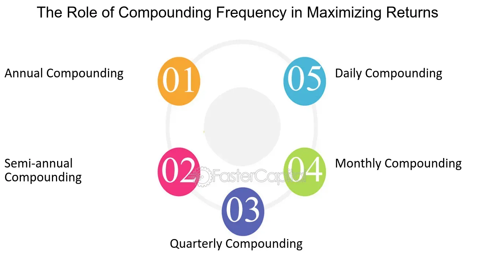

## Table of Contents

## What is financial compounding and how does it work?

Financial compounding is like a snowball that gets bigger as it rolls down a hill. It's when the money you invest or save earns more money over time, and then that extra money earns even more money. Imagine you put some money in a savings account that gives you interest. The interest you earn gets added to your original amount, and then you earn interest on the new, bigger amount. This keeps happening, making your money grow faster and faster.

Let's say you start with $100 and the bank gives you 10% interest every year. After the first year, you'll have $110. In the second year, you'll earn 10% on $110, so you'll get $11 more, making it $121. This process continues, and over many years, your money can grow a lot. The key is to start early and let time do its magic. The longer your money is invested, the more it can compound and grow.

## Why is understanding financial compounding important for personal finance?

Understanding financial compounding is really important for personal finance because it shows how your money can grow over time. If you know about compounding, you can make smart choices about saving and investing. For example, if you start saving early, even small amounts can turn into a lot of money because of compounding. It's like planting a seed and watching it grow into a big tree. The sooner you start, the bigger your tree can get.

Compounding also helps you see why it's good to leave your money invested for a long time. If you keep taking your money out, you stop the compounding process, and your money won't grow as much. By understanding this, you can plan better for things like buying a house, paying for college, or retiring. It's all about letting your money work for you over time, so you can reach your financial goals.

## What are the common challenges people face with financial compounding?

One common challenge people face with financial compounding is impatience. Many people want to see quick results, but compounding takes time. It's like waiting for a tree to grow from a seed. If you keep digging up the seed to check if it's growing, you'll never get a tree. People need to understand that to really benefit from compounding, they have to be patient and let their money grow over many years.

Another challenge is not starting early enough. The magic of compounding works best over a long time. If you start saving and investing when you're young, your money has more time to grow. But many people wait until they're older to start, and then they don't get to see their money grow as much. It's like starting a race late and trying to catch up. The earlier you start, the better off you'll be.

A third challenge is not understanding how compounding works. Some people think saving a little bit won't make a difference, but even small amounts can grow a lot over time. Others might not realize that taking money out of their investments stops the compounding process. If people don't understand these things, they might not make the best choices with their money. It's important to learn about compounding so you can use it to help you reach your financial goals.

## How can someone start benefiting from compounding interest?

To start benefiting from compounding interest, you should open a savings or investment account that offers interest. Look for accounts with good interest rates, like high-yield savings accounts or certain types of investment accounts. Once you have the account, put some money into it. The more you put in, the more it can grow. It's like planting seeds in a garden; the more seeds you plant, the bigger your garden will be.

After you've put money into your account, leave it there and let it grow. Don't take money out because that stops the compounding process. Over time, the interest you earn will be added to your original amount, and you'll start [earning](/wiki/earning-announcement) interest on the new, bigger amount. This keeps happening, making your money grow faster and faster. The key is to be patient and let time do its magic. The longer you leave your money in, the more it can compound and grow into a big amount.

## What are the differences between simple and compound interest?

Simple interest and compound interest are two ways to earn money on your savings or investments, but they work differently. Simple interest is easy to understand. It's when you earn interest only on the money you originally put in, called the principal. For example, if you put $100 in a bank account that gives you 5% simple interest every year, you'll earn $5 each year, no matter how long you leave your money in the account. The interest stays the same every year because it's only based on the original $100.

Compound interest is more powerful because it lets your money grow faster. With compound interest, you earn interest not just on the money you originally put in, but also on the interest you've already earned. It's like a snowball rolling down a hill, getting bigger and bigger. Using the same example, if you put $100 in a bank account with 5% compound interest every year, after the first year, you'll have $105. In the second year, you'll earn 5% on $105, so you'll get $5.25 more, making it $110.25. This keeps happening, and over time, your money grows much more than with simple interest.

## How does the frequency of compounding affect the growth of investments?

The frequency of compounding can make a big difference in how fast your investments grow. When you earn compound interest, the more often the interest is added to your account, the quicker your money can grow. For example, if you have $100 in an account with 5% interest, and the interest is compounded yearly, you'll have $105 at the end of the year. But if the interest is compounded every six months, you'll earn interest on $105 halfway through the year, and then earn more interest on the new amount for the second half of the year. This means you'll end up with more money than if it was compounded just once a year.

The more often the interest is compounded, like monthly or even daily, the more your money can grow. It's like watering a plant more often to help it grow faster. If you have the choice, [picking](/wiki/asset-class-picking) an account that compounds interest more frequently can help you reach your financial goals sooner. Just remember, the key is to leave your money in the account and let the compounding work its magic over time.

## What role does time play in the effectiveness of compounding?

Time is super important when it comes to compounding. The longer you leave your money to grow, the bigger it can get. It's like planting a seed and letting it turn into a tree. If you start saving early, even small amounts can turn into a lot of money over many years. The magic of compounding works best when you give it time to do its thing. So, the earlier you start saving and investing, the more time your money has to grow and the more you can benefit from compounding.

Think of compounding like a snowball rolling down a hill. The longer it rolls, the bigger it gets. If you only let it roll for a short time, it won't get very big. But if you let it roll for a long time, it can turn into a huge snowball. That's why it's good to start saving and investing as early as you can and to leave your money in for as long as possible. The more time you give it, the more your money can grow.

## How can inflation impact the real returns from compounding?

Inflation can make the money you earn from compounding worth less over time. Imagine you save money and it grows because of compounding. But if the prices of things you buy, like food and clothes, go up faster than your money grows, you might not be able to buy as much with your savings as you thought. This is because inflation means the value of money goes down. So, even though your money is growing thanks to compounding, if inflation is high, the real value of your savings might not be growing as much.

To deal with this, you need to think about how much inflation might affect your savings. If you can find investments that grow faster than inflation, your money will still be worth more over time. For example, if inflation is 2% a year, you want your investments to grow by more than 2% a year to keep up. By understanding inflation and choosing the right investments, you can make sure that compounding helps your money grow in a way that keeps up with or even beats inflation.

## What strategies can be used to maximize the benefits of compounding?

To make the most out of compounding, start saving and investing as early as you can. The longer your money is invested, the more time it has to grow. Think of it like planting a seed; the sooner you plant it, the bigger the tree can grow. Even if you can only save a little bit at first, it's better to start early. Over time, even small amounts can turn into a lot of money because of compounding. So, don't wait to start saving and investing—do it as soon as you can.

Another good strategy is to reinvest the money you earn. When you get interest or dividends, put that money back into your investment instead of spending it. This way, you'll earn more interest on a bigger amount, and your money will grow even faster. It's like rolling a snowball down a hill; the bigger it gets, the more snow it can pick up. Also, try to find investments that offer good interest rates and compound more often, like monthly or daily. The more often your money compounds, the quicker it can grow. By following these strategies, you can really make the most out of compounding and see your money grow over time.

## How do taxes affect the compounding of investments?

Taxes can take a bite out of the money you earn from your investments. When you earn interest, dividends, or capital gains, you might have to pay taxes on that money. This means you won't get to keep all of the money you earn, so there will be less money left to compound and grow over time. It's like if you were trying to grow a plant, but someone kept taking some of the water away. The plant would still grow, but not as fast as it could if it had all the water.

To make the most out of compounding, you can look for ways to reduce the taxes you have to pay. One way to do this is by using tax-advantaged accounts like IRAs or 401(k)s. These accounts let your money grow without being taxed right away, so more of your money can compound over time. It's like giving your plant extra water to help it grow bigger and stronger. By understanding how taxes work and using smart strategies, you can keep more of your money working for you and see your investments grow even more over time.

## What are the advanced mathematical models used to predict compounding effects?

To predict how compounding works over time, people use some special math formulas. One of the most common ones is the compound interest formula, which looks like this: A = P(1 + r/n)^(nt). Here, A is the amount of money you'll have at the end, P is the money you start with, r is the interest rate, n is how often the interest is added, and t is the time in years. This formula helps you figure out how much your money will grow if you know these things. It's like a recipe for making your money grow over time.

Another way to look at compounding is by using something called the Rule of 72. This is a quick trick to guess how long it will take your money to double. You just divide 72 by the interest rate, and that tells you about how many years it will take. For example, if your interest rate is 6%, it will take about 12 years for your money to double (72 divided by 6 is 12). These formulas and rules help people plan their savings and investments better, so they can see how their money will grow over time.

## How can one mitigate the risks associated with compounding in volatile markets?

When you invest your money, the value can go up and down because of things happening in the market. This can make it hard to know how much your money will grow with compounding. To help with this, you can spread your money out in different types of investments. This is called diversification. If you put all your money in one thing and it goes down, you could lose a lot. But if you spread your money out, some investments might go down, but others might go up, so it balances out. This way, you can still benefit from compounding, even if the market is up and down.

Another way to handle the ups and downs of the market is to keep investing over time, no matter what the market is doing. This is called dollar-cost averaging. Instead of putting all your money in at once, you put in a little bit every month or every paycheck. When the market is down, you buy more shares for the same amount of money, and when it's up, you buy fewer. Over time, this can help you buy shares at a lower average price. By doing this, you can still see your money grow with compounding, even in a market that moves a lot.

## What is Understanding Financial Compounding?

Financial compounding is a powerful process that transforms reinvested returns into exponential growth over time. This characteristic distinguishes compound interest from simple interest. In simple interest, the interest is calculated on the initial principal, or starting amount, for each period. In contrast, compound interest calculates interest on the initial principal as well as on the accumulated interest from previous periods. This cumulative effect substantially increases the amount of interest earned over time.

To illustrate the distinction between compound and simple interest, consider an initial investment of $1,000 at an annual [interest rate](/wiki/interest-rate-trading-strategies) of 5% over three years. Under simple interest, each year would contribute $50 in interest ($1,000 * 0.05), resulting in a total of $150 in interest by the end of three years. The future value would thus be $1,150.

Conversely, with compound interest, the interest generated each year is added to the principal, so each subsequent interest calculation begins with a larger base. In the first year, the interest earned remains $50 ($1,000 * 0.05), but in the second year, interest is calculated on $1,050, resulting in $52.50 ($1,050 * 0.05). By the third year, interest is computed on $1,102.50, yielding $55.13 ($1,102.50 * 0.05). Therefore, the total amount after three years, when compounded annually, is approximately $1,157.63, demonstrating the advantage of compound growth.

The power of compounding lies in its relationship with time; longer investment periods exponentially amplify its effects. This phenomenon is captured mathematically by the formula for compound interest: 

$$
A = P \left(1 + \frac{r}{n}\right)^{nt}
$$

where $A$ represents the future value of the investment, $P$ is the principal investment amount, $r$ denotes the annual interest rate (in decimal form), $n$ is the number of times interest is compounded per year, and $t$ stands for the number of years the money is invested for.

The significance of time becomes apparent with historical stock market investments. For instance, the S&P 500 index has historically returned an average annual return of around 7% after adjusting for inflation. An investment of $10,000 in the S&P 500 in 1983, left untouched and compounded annually, would have grown to over $100,000 by 2023.

Such real-world data highlight both the potency and potential of financial compounding. By understanding the mechanics of compounding, investors can harness these gains over extended periods. This understanding underscores the need for strategies that maximize time in the market and reinvestment of returns, critical for capitalizing on compounding's exponential growth potential.

## References & Further Reading

[1]: Bergstra, J., Bardenet, R., Bengio, Y., & Kégl, B. (2011). ["Algorithms for Hyper-Parameter Optimization."](https://dl.acm.org/doi/10.5555/2986459.2986743) Advances in Neural Information Processing Systems 24.

[2]: ["Advances in Financial Machine Learning"](https://www.amazon.com/Advances-Financial-Machine-Learning-Marcos/dp/1119482089) by Marcos Lopez de Prado

[3]: ["Evidence-Based Technical Analysis: Applying the Scientific Method and Statistical Inference to Trading Signals"](https://www.amazon.com/Evidence-Based-Technical-Analysis-Scientific-Statistical/dp/0470008741) by David Aronson

[4]: ["Machine Learning for Algorithmic Trading"](https://github.com/stefan-jansen/machine-learning-for-trading) by Stefan Jansen

[5]: ["Quantitative Trading: How to Build Your Own Algorithmic Trading Business"](https://github.com/LucindaYa/quant-resources/blob/master/Quantitative%20Trading%20How%20to%20Build%20Your%20Own%20Algorithmic%20Trading%20Business.pdf) by Ernest P. Chan