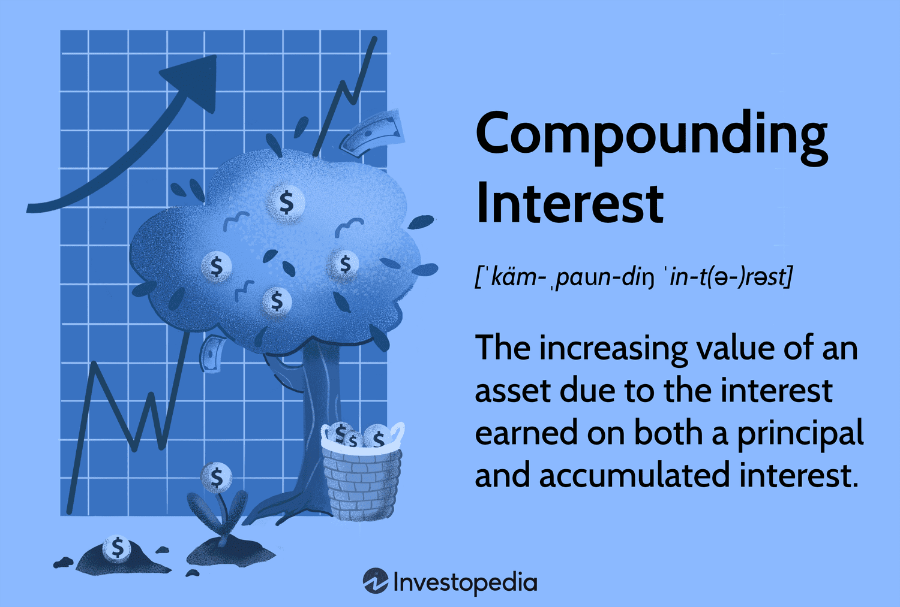

Compounding is a cornerstone in finance, epitomizing the principle where reinvested returns generate additional earnings, ultimately resulting in exponential capital growth over time. This mathematical phenomenon hinges on the reinvestment of profits, allowing wealth to amass at an accelerating rate. It is precisely this multiplication of wealth that underlies the aspirational nature of compounding, making it a fundamental concept for any investor or trader aiming for long-term financial growth. Compounding captivates with its promise of exponential returns, yet it demands a comprehensive understanding to harness its full potential. This article seeks to explore this intriguing interplay between the mechanics of compounding, the inherent challenges it presents, and its strategic application in algorithmic trading.

Understanding financial compounding extends beyond mere calculations. It is pivotal for investors to grasp its dynamics to effectively grow their wealth and navigate the volatility of financial markets. Compounding is distinguished from simple interest in that it factors in the reinvestment of gains over each period, creating a snowball effect that magnifies earnings. The compounding formula: 



$$
A = P \left(1 + \frac{r}{n}\right)^{nt}
$$

illustrates how an initial principal $P$, compounded at a rate $r$, across $n$ periods per year, over $t$ years, can dramatically burgeon one's investment. While the mathematical principles might be straightforward, applying them in real-world trading requires navigating numerous challenges and devising strategies to mitigate risk and loss.

Algorithmic trading represents a new frontier for employing compounding strategies, integrating technology with finance to maximize returns. Employing advanced algorithms, traders can exploit both short-term and long-term compounding opportunities by executing rapid, data-driven trades. Such strategies leverage the power of machine learning, complex mathematical models, and cutting-edge computational resources to make split-second decisions that individual human traders cannot match.

In this article, we will explore the various facets of compounding and its application. Beginning with the advantages and mechanics of compounding, we will confront the investment challenges posed by fluctuating markets. We will also outline the strategic use of algorithmic trading to capitalize on compounding opportunities, and propose methods to optimize these strategies for sustained profitability. Ultimately, this narrative aims to equip readers with an enriched understanding of compounding—a concept embodied not as an abstract mathematical model, but as a practical tool in navigating the dynamic, often turbulent waters of the financial world.

## Table of Contents

## Understanding Financial Compounding

Financial compounding is a powerful process that transforms reinvested returns into exponential growth over time. This characteristic distinguishes compound interest from simple interest. In simple interest, the interest is calculated on the initial principal, or starting amount, for each period. In contrast, compound interest calculates interest on the initial principal as well as on the accumulated interest from previous periods. This cumulative effect substantially increases the amount of interest earned over time.

To illustrate the distinction between compound and simple interest, consider an initial investment of $1,000 at an annual [interest rate](/wiki/interest-rate-trading-strategies) of 5% over three years. Under simple interest, each year would contribute $50 in interest ($1,000 * 0.05), resulting in a total of $150 in interest by the end of three years. The future value would thus be $1,150.

Conversely, with compound interest, the interest generated each year is added to the principal, so each subsequent interest calculation begins with a larger base. In the first year, the interest earned remains $50 ($1,000 * 0.05), but in the second year, interest is calculated on $1,050, resulting in $52.50 ($1,050 * 0.05). By the third year, interest is computed on $1,102.50, yielding $55.13 ($1,102.50 * 0.05). Therefore, the total amount after three years, when compounded annually, is approximately $1,157.63, demonstrating the advantage of compound growth.

The power of compounding lies in its relationship with time; longer investment periods exponentially amplify its effects. This phenomenon is captured mathematically by the formula for compound interest: 

$$
A = P \left(1 + \frac{r}{n}\right)^{nt}
$$

where $A$ represents the future value of the investment, $P$ is the principal investment amount, $r$ denotes the annual interest rate (in decimal form), $n$ is the number of times interest is compounded per year, and $t$ stands for the number of years the money is invested for.

The significance of time becomes apparent with historical stock market investments. For instance, the S&P 500 index has historically returned an average annual return of around 7% after adjusting for inflation. An investment of $10,000 in the S&P 500 in 1983, left untouched and compounded annually, would have grown to over $100,000 by 2023.

Such real-world data highlight both the potency and potential of financial compounding. By understanding the mechanics of compounding, investors can harness these gains over extended periods. This understanding underscores the need for strategies that maximize time in the market and reinvestment of returns, critical for capitalizing on compounding's exponential growth potential.

## Investment Challenges Due to Compounding

Financial compounding is a powerful concept that can exponentially grow investments by reinvesting returns over time. However, its effectiveness is not immune to the challenges posed by financial market dynamics. One of the primary challenges in leveraging compounding within financial markets is market [volatility](/wiki/volatility-trading-strategies), which can significantly impact compounded returns. Market volatility refers to fluctuations in asset prices over a period of time. These fluctuations can adversely affect compounded returns, especially when negative returns occur. For example, a 50% loss requires a subsequent 100% gain to break even, demonstrating how negative returns can have a disproportionately detrimental effect on long-term compounding.

Additionally, the concept of [dispersion](/wiki/dispersion-trading) of returns further complicates the compounding process. Dispersion of returns refers to the variability of investment returns over time. Higher dispersion, often synonymous with greater volatility, can lead to lower compound returns. This effect is due to the mathematical principle that the arithmetic mean of returns is higher than the geometric mean, which accounts for compounding. For instance, consider an investment with returns of +20%, -10%, and +5% over three years. The arithmetic mean return is 5%, while the geometric mean return is approximately 4.91%, indicating the damping effect volatility has on compounded growth.

Investors employ various strategies to mitigate these challenges. Diversification is one such strategy, which involves spreading investments across a wide range of asset classes to reduce exposure to any single asset's risks. By diversifying, investors can potentially achieve a more stable return profile, thus smoothing the path for compounding. Active portfolio management also plays a crucial role. This strategy entails regularly adjusting the composition of an investment portfolio to adapt to changing market conditions, thereby potentially enhancing returns and mitigating the impact of volatility on compounding.

Ultimately, while compounding remains a formidable tool for wealth accumulation, investors must remain vigilant in addressing market challenges. They can do this through diversification and active portfolio management to ensure that the full potential of compounding is realized, despite the inherent volatility of financial markets.

## Algorithmic Trading and Compounding

Algorithmic trading, a definitive aspect of modern financial markets, involves the use of advanced mathematical models and complex algorithms to execute high-frequency trades. This sophisticated form of trading relies on pre-programmed strategies to make decisions at speeds significantly faster than human capability, often leveraging the minute price discrepancies across markets. High-frequency trading ([HFT](/wiki/high-frequency-trading-strategies)), a subset of [algorithmic trading](/wiki/algorithmic-trading), is specifically designed to execute thousands of trades per second. This rapid execution allows traders to exploit very short-term opportunities that may arise from inefficiencies in the market.

Compounding enhances the strategy of algorithmic trading by adding both complexity and opportunity. In finance, compounding reflects the reinvestment of earnings, where investment returns themselves generate additional returns over time. In the context of algorithmic trading, the rapid pace can amplify the effects of compounding, as frequent trades enable the continuous reinvestment of profits, even within fractions of a second.

The application of compounding in algorithmic trading is particularly evident through short-term compounding opportunities. In this scenario, trading algorithms are programmed to capitalize on small price movements repeatedly. By doing so, they incrementally increase their capital base, allowing for reinvestment in subsequent trades. The cumulative effect over numerous trades can be substantial, potentially leading to exponential growth under optimal market conditions.

To effectively harness the potential of compounding, algorithmic trading relies heavily on technological tools and systems. These include high-speed data feeds, direct market access, and advanced computing infrastructure. Algorithms require real-time data processing capabilities and robust computational power to analyze market conditions instantaneously and execute trades. Moreover, [machine learning](/wiki/machine-learning) models are increasingly integrated into algorithmic systems to improve predictive analytics and adapt to evolving market dynamics.

Algorithmic trading platforms are typically equipped with risk management features to monitor and control potential losses, preserving the benefits of compounding. These systems often include stop-loss mechanisms and dynamic rebalancing to adjust positions in real-time, based on market fluctuations. Python, with its vast libraries such as NumPy and pandas, is commonly used for quantitative analysis and developing trading algorithms. The following sample code illustrates a basic framework for implementing a simple trading algorithm with a focus on maximizing compounding effects:

```python
import numpy as np

initial_investment = 10000  # Starting capital
daily_return_rate = 0.001   # Example daily return rate
days = 252  # Trading days in a year

capital = initial_investment

for day in range(days):
    # Simulate daily returns and compound
    capital *= (1 + daily_return_rate * np.random.normal(1, 0.05))

print(f"End of year capital with compounding: {capital:.2f}")
```

In summary, algorithmic trading offers a robust framework for exploiting compounding, enabling traders to achieve potentially higher returns through rapid cycles of reinvestment. By integrating cutting-edge technology and sophisticated algorithms, traders can efficiently capitalize on the compounding effects, navigating the complexities of financial markets with precision.

## Strategies for Successful Compounding in Trading

In trading, successful compounding hinges on effective risk management, a robust trading strategy, and the strategic use of technology. Risk management is paramount in preserving and growing capital. Position sizing is a critical tactic, allowing traders to determine the amount of capital allocated to a single trade, thus controlling potential losses. By risking only a small portion of the total portfolio on each trade, typically 1-2%, traders can endure a series of losses without significant capital depletion. Stop-loss orders are another vital risk management tool, automatically selling an asset once it reaches a predefined price threshold, thereby limiting losses and protecting profits.

Setting clear financial goals and crafting a comprehensive trading plan are fundamental in leveraging compounding benefits effectively. A well-defined trading plan outlines entry and [exit](/wiki/exit-strategy) strategies, risk tolerance, and specific financial targets. By setting such parameters, traders can avoid emotional decision-making, adhere to disciplined execution, and maximize compounded returns over time.

Automated systems and trading algorithms play a significant role in consistently reinvesting gains. These technologies enable traders to execute strategies with precision and efficiency, capitalizing on numerous market opportunities. Trading algorithms can be programmed to automate entry and exit points, adjust position sizes, and reinvest profits seamlessly. For instance, with Python, one could set a trading algorithm that automatically adjusts investment size based on predefined parameters using libraries such as pandas and NumPy, enhancing performance consistency.

```python
import numpy as np

def calculate_position_size(balance, risk_per_trade, stop_loss):
    # Risk amount based on a percentage of the current balance
    risk_amount = balance * risk_per_trade
    # Position size calculation
    position_size = risk_amount / stop_loss
    return position_size

# Example usage
balance = 10000  # current portfolio balance
risk_per_trade = 0.01  # risk 1% per trade
stop_loss = 50  # hypothetical stop-loss value in dollars

position_size = calculate_position_size(balance, risk_per_trade, stop_loss)
print(f"Recommended position size: {position_size}")
```

Real-life trading instances underscore the transformative impact of compounding. For example, the Medallion Fund managed by Renaissance Technologies is renowned for its compounded annual returns exceeding 30% over several decades. This extraordinary performance is attributed to strategic reinvestment, stringent risk management, and advanced algorithmic trading strategies that exploit short-term compounding opportunities.

In conclusion, mastering compounding in trading requires a judicious blend of risk management, strategic planning, and technological application. By understanding and implementing these elements, traders can significantly enhance their financial performance, harnessing the full potential of compounding to achieve long-term growth.

## Conclusion

Compounding remains a powerful tool in the sphere of investment and trading, driving exponential capital growth by reinvesting returns to generate additional earnings over time. While the potential of compounding is significant, it also comes with challenges that must be carefully managed. A pivotal takeaway is the importance of risk mitigation strategies, which are essential for preserving and enhancing compounded growth. Techniques such as diversification, strategic asset allocation, and disciplined portfolio management play critical roles in shielding investments from adverse market movements.

Time is another crucial element in maximizing compounding benefits. As demonstrated, longer investment horizons typically lead to enhanced compounding effects, given that the process involves [earning](/wiki/earning-announcement) returns not only on the initial principal but also on accumulated returns over successive periods. Therefore, patience and a long-term perspective are vital for investors who wish to harness the full potential of compounding.

Algorithmic trading presents novel opportunities to optimize compounding benefits. By employing sophisticated algorithms and mathematical models, traders can exploit short-term market inefficiencies and execute numerous trades at high frequencies. Such strategies can potentially leverage small price movements to achieve rapid gains, which are then reinvested to augment compounded returns. The use of automated systems enhances the consistency and precision of trades, further amplifying the compounding process.

In conclusion, understanding and applying the principles of compounding can significantly enhance one's investment and trading strategies. While challenges exist, they are not insurmountable with proper risk management and strategic planning. By leveraging the power of compounding, particularly through novel mechanisms like algorithmic trading, investors have the potential to significantly boost their financial performance. Readers are encouraged to integrate these insights into their own strategies, ensuring a balanced approach that mitigates risk while pursuing growth.

## References & Further Reading

[1]: Bergstra, J., Bardenet, R., Bengio, Y., & Kégl, B. (2011). ["Algorithms for Hyper-Parameter Optimization."](https://dl.acm.org/doi/10.5555/2986459.2986743) Advances in Neural Information Processing Systems 24.

[2]: ["Advances in Financial Machine Learning"](https://www.amazon.com/Advances-Financial-Machine-Learning-Marcos/dp/1119482089) by Marcos Lopez de Prado

[3]: ["Evidence-Based Technical Analysis: Applying the Scientific Method and Statistical Inference to Trading Signals"](https://www.amazon.com/Evidence-Based-Technical-Analysis-Scientific-Statistical/dp/0470008741) by David Aronson

[4]: ["Machine Learning for Algorithmic Trading"](https://github.com/stefan-jansen/machine-learning-for-trading) by Stefan Jansen

[5]: ["Quantitative Trading: How to Build Your Own Algorithmic Trading Business"](https://github.com/LucindaYa/quant-resources/blob/master/Quantitative%20Trading%20How%20to%20Build%20Your%20Own%20Algorithmic%20Trading%20Business.pdf) by Ernest P. Chan