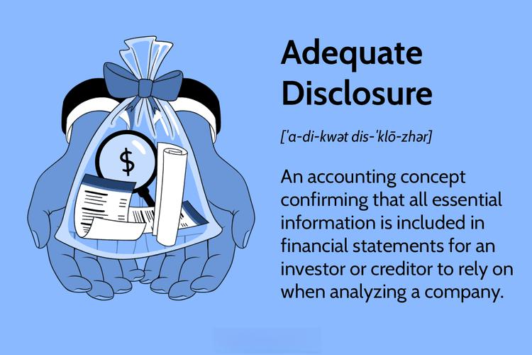

Algorithmic trading utilizes complex algorithms to automate trade execution, enabling rapid decision-making and execution at high speeds and large volumes. This technology-driven approach has become central to modern financial markets due to its efficiency in managing large sets of data and executing trades faster than human capabilities. The advent and growth of algorithmic trading have ushered in significant advantages, such as improved liquidity and tighter spreads, yet they also pose challenges concerning market integrity and investor protection.

The necessity for disclosure—openly sharing relevant trading practices and strategies—and transparency—the easy accessibility and understanding of trading activities—has never been more critical. These elements are pivotal for maintaining market integrity and gaining investor trust. In algorithmic trading, disclosure involves sharing the essential operations and strategies of trading algorithms with relevant market participants and regulatory bodies. Quality disclosure ensures that the shared information sufficiently informs stakeholders about the associated risks and operations involved.

Transparency plays a crucial role in allowing both regulators and investors to grasp the complexities and potential risks of trading activities. It helps in ensuring fair market participation, contributes to accurate pricing, and facilitates informed decision-making, which, in turn, supports the stability and reliability of financial markets.

This article discusses how imperative disclosure and transparency have become with the widespread use of algorithmic trading. It emphasizes the significance of regulatory frameworks designed to instill these practices and foster an environment that mitigates risks while building trust in the financial ecosystem.

## Table of Contents

## Understanding Disclosure in Algorithmic Trading

Disclosure in algorithmic trading is a critical practice that ensures transparency and trust between traders, investors, and regulatory bodies. It involves the provision of essential information concerning trading practices, strategies, and risk management approaches to relevant parties. The necessity of such disclosures has grown alongside the increasing complexity and volume of algorithmic trading activities in global financial markets.

Key details of trading algorithms, including their design, execution parameters, and risk controls, must be made available to market participants and regulatory authorities. This transparency helps foster an environment where market participants can operate on a level playing field, reducing the likelihood of unfair advantages and enhancing the fairness and efficiency of the markets.

Several types of disclosures are frequently mandated by financial markets and regulatory bodies. These include:

1. **Algorithmic Strategies:**
   - Details regarding the strategies employed by trading algorithms must be disclosed. This includes the types of assets traded, the conditions under which trades are executed, and any predictive models or rules used by the algorithms. Such information helps regulators understand the market impact of these trades and aids in monitoring compliance with trading norms.

2. **Risk Management Practices:**
   - Information about risk management approaches is essential. This includes data on risk assessment methods, stop-loss mechanisms, contingency protocols, and capital allocation strategies to ensure stability. By disclosing risk management practices, algorithmic traders can demonstrate their commitment to maintaining market integrity and managing systemic risks.

3. **Performance Metrics:**
   - Performance-related disclosures, such as execution quality metrics, slippage, and transaction costs, provide insights into the effectiveness of the trading systems. These metrics allow both regulators and investors to assess the competency of the trading algorithms and ensure that they are not causing undue market disruption.

4. **System Architecture and Security Measures:**
   - Disclosure of the underlying system architecture and security protocols is also crucial. This ensures that the trading systems are robust, secure, and equipped to handle high-frequency transactions without succumbing to cyber threats or technical failures.

These disclosures are generally enforced through regulatory frameworks that differ across jurisdictions. For example, in the United States, the Securities and Exchange Commission (SEC) requires certain disclosures to maintain market transparency, while in the European Union, similar requirements are enforced under directives like MiFID II.

By requiring extensive disclosure of trading practices and risk management strategies, regulators can better monitor compliance with market regulations, reduce systemic risk, and protect investor interests. This comprehensive transparency allows market participants to make informed decisions, fostering a more robust financial market ecosystem.

## The Concept of Adequate Disclosure

Adequate disclosure is a critical concept in financial markets, aimed at ensuring that investors and regulators have access to comprehensive and accurate information about a company's financial status and operational practices. In [algorithmic trading](/wiki/algorithmic-trading), adequate disclosure takes on added significance due to the complex and often opaque nature of trading algorithms and strategies. The following discussion outlines the principles of adequate disclosure and its implications for high-frequency trading.

The primary goal of adequate disclosure is to provide transparency in financial reporting, allowing stakeholders to understand a company's financial health and operational strategies. This transparency is essential in maintaining trust and facilitating informed investment decisions. In traditional financial reporting, disclosures typically cover areas such as financial performance, risk factors, and corporate governance. However, in the context of algorithmic trading, disclosure must be extended to cover the unique characteristics and risks associated with high-frequency trading ([HFT](/wiki/high-frequency-trading-strategies)) practices.

Algorithmic trading, and particularly HFT, involves executing large volumes of trade orders at extremely high speeds, often leveraging sophisticated algorithms and vast amounts of data. These strategies can significantly impact market dynamics, necessitating a higher degree of disclosure to ensure market participants and regulators understand the implications of these practices. Key information that should be disclosed includes:

1. **Algorithmic Strategies**: Detailed descriptions of the trading strategies used, including the logic and decision-making processes embedded within the algorithms. This information helps assess the potential market impact and the associated risks.

2. **Risk Management Practices**: Adequate disclosure should outline the risk management frameworks in place to mitigate losses and prevent market disruptions. This includes information on counterparty risk, liquidity risk, and system failure protocols.

3. **Performance Metrics**: Data on the performance of trading algorithms, such as success rates, execution speeds, and the financial outcomes of trades. This allows investors and regulators to evaluate the efficacy and reliability of the algorithms.

4. **Compliance Measures**: Information on how the company ensures compliance with relevant regulatory requirements, which may include measures to prevent market manipulation or unfair trading practices.

The implications of adequate disclosure for companies engaged in HFT are profound. By providing clear and comprehensive disclosures, these companies not only comply with regulatory mandates but also build trust with investors by demonstrating their commitment to transparency and accountability. Furthermore, adequate disclosure can serve as a protective measure for companies, as it helps preempt regulatory scrutiny and potential legal challenges.

However, achieving adequate disclosure in algorithmic trading is not without challenges. Companies must balance the need for transparency with the protection of proprietary trading algorithms and intellectual property. This necessitates developing a disclosure framework that provides sufficient detail without compromising competitive advantages.

In conclusion, adequate disclosure in algorithmic trading plays an essential role in fostering a transparent and efficient market. As algorithmic trading continues to evolve, so too must the strategies and frameworks for ensuring that these complex and fast-paced activities are conducted with the necessary degree of openness and accountability.

## The Role of Transparency in Algorithmic Trading

Transparency in algorithmic trading refers to the level of openness and accessibility concerning information related to trading activities, specifically regarding the algorithms and strategies employed, order types used, and the associated risks. This transparency is fundamental for enabling investors and regulatory bodies to comprehend the dynamics of trading activities, ensure fair market participation, accurate pricing, and foster informed investment decisions.

One primary mechanism through which transparency is achieved in algorithmic trading is through regulatory requirements that mandate disclosure of algorithmic trading activities. These regulations often require firms to report on the logic and functioning of their trading algorithms, including the parameters and strategies employed. Such disclosures ensure that regulators have a comprehensive understanding of the potential impacts of these trading activities on market stability.

Additionally, advanced monitoring systems are employed by both firms and regulatory bodies to enhance transparency. These systems utilize real-time data analytics and [machine learning](/wiki/machine-learning) techniques to track and analyze trading patterns, identifying any anomalies or suspicious activities that could indicate manipulative behavior. By providing real-time insights into the markets, these technologies allow for rapid responses to any emerging risks, thereby helping to maintain market integrity.

Transparency also promotes competition and innovation by leveling the playing field among market participants. When all participants have similar access to information, it reduces the potential for unfair advantages and encourages a more competitive trading environment. Furthermore, transparency aids in the accurate pricing of securities, as it ensures that all available information is reflected in the market prices, leading to more efficient markets.

The role of transparency in ensuring informed investment decisions cannot be understated. When investors have access to detailed information about the trading practices and potential risks, they can make better assessments of the value and risk associated with their investments, leading to more rational and effective portfolio management.

In conclusion, transparency in algorithmic trading is a critical [factor](/wiki/factor-investing) in maintaining market integrity and trust. Through regulatory frameworks, advanced monitoring technologies, and equal access to information, transparency ensures that market activities are fair, prices are accurate, and investment decisions are well-informed. Without such transparency, the complex and rapid nature of algorithmic trading could pose significant risks to financial markets.

## Regulatory Frameworks and Compliance

Regulatory bodies worldwide have established comprehensive frameworks to oversee algorithmic trading, addressing transparency and compliance to safeguard market integrity and investor interests. A prominent example is the Securities and Exchange Commission (SEC) in the United States, which enforces regulations such as the Securities Exchange Act of 1934. This act mandates that algorithmic traders register as broker-dealers and comply with requirements such as maintaining accurate records and reporting financial status. It also includes the Regulation National Market System (Reg NMS), which aims to enhance fairness and transparency by ensuring equal access to market data and preventing market fragmentation.

In the European Union, the Markets in Financial Instruments Directive II (MiFID II) plays a crucial role in governing algorithmic trading. MiFID II, implemented in 2018, requires algorithmic trading firms to maintain detailed records of trading activities and submit regular reports to regulatory authorities. It also mandates risk controls to prevent market disturbances and requires firms to disclose information about their trading algorithms and strategies. This regulation is part of a broader effort to increase transparency and protect against market abuse by ensuring that trades are conducted on regulated trading venues.

In addition to the SEC and MiFID II, other significant regulatory frameworks exist across different jurisdictions. For example, The Financial Conduct Authority (FCA) in the UK sets guidelines that require firms engaged in algorithmic trading to implement systems to manage risks and ensure compliance with market rules. Similarly, the Australian Securities and Investments Commission (ASIC) enforces regulations that call for robust risk management systems and stress testing of algorithms to prevent market disruptions.

These regulatory requirements are designed to prevent potential risks associated with algorithmic trading, such as flash crashes, and to ensure market stability. By mandating adequate disclosure and transparency, these frameworks help build investor confidence and uphold the integrity of financial markets. They demand firms to implement comprehensive risk management strategies, maintain detailed records, and submit to regular audits and inspections by regulatory authorities.

The convergence of these regulations underscores a global commitment to maintaining transparency in algorithmic trading. However, the complexity of cross-border transactions necessitates ongoing collaboration among regulatory bodies to harmonize standards and practices. By aligning regulatory requirements, these bodies aim to mitigate systemic risks and protect investors, thereby fostering a reliable and transparent algorithmic trading environment.

## Challenges and Issues in Ensuring Disclosure and Transparency

Ensuring disclosure and transparency in algorithmic trading involves several complex challenges. One primary issue is the protection of proprietary algorithms. These algorithms are often the core competitive advantage for trading firms, and they contain sensitive information that, if disclosed fully, could undermine competitiveness and innovation. Balancing this need with regulatory requirements for transparency is a delicate task. Strategies to address this include implementing a framework for partial disclosure where only necessary information—such as risk parameters and execution methods—are shared, thus safeguarding proprietary elements.

The complexity of data also poses a significant challenge. Algorithmic trading generates vast amounts of data, often in real-time, which must be managed, analyzed, and reported. This data complexity requires sophisticated systems and protocols to ensure that disclosures are both accurate and meaningful. Firms can leverage advanced data analytics and machine learning models to streamline data processing and enhance the quality of information provided. For instance, employing natural language processing (NLP) can help in analyzing unstructured data to ensure that it meets disclosure standards.

Varying regulatory requirements across jurisdictions create another layer of complexity. Different regions have their own sets of regulations, such as the Securities and Exchange Commission (SEC) in the United States and the Markets in Financial Instruments Directive (MiFID II) in the European Union. This necessitates a nuanced understanding of each regulatory framework and often requires firms to adapt their strategies for compliance. Developing a flexible compliance strategy, which includes a comprehensive understanding of local regulations and the ability to quickly adapt to changes, is essential for firms operating in multiple jurisdictions.

Data privacy and security are also significant concerns. The sensitive nature of trading data necessitates robust cybersecurity measures to prevent breaches and protect investor information. This is particularly pertinent as cyber threats continue to evolve. Ensuring the security of data involves implementing encryption protocols, adopting multi-factor authentication, and regularly updating security software to safeguard against potential threats. A comprehensive risk management strategy that includes these measures can help mitigate the risk of data breaches.

In conclusion, while the challenges of ensuring disclosure and transparency in algorithmic trading are substantial, they are not insurmountable. By adopting strategic frameworks for partial disclosure, leveraging advanced data processing technologies, crafting flexible compliance strategies, and implementing robust cybersecurity measures, firms can effectively address these challenges, ensuring regulatory compliance and maintaining market integrity.

## Future Trends in Disclosure and Transparency

The future landscape of algorithmic trading is poised to undergo significant transformation with the integration of advanced technologies such as [artificial intelligence](/wiki/ai-artificial-intelligence) (AI) and real-time data analytics. These technologies promise to enhance transparency by enabling more sophisticated analysis and monitoring of trading activities. AI algorithms can process vast amounts of data at unprecedented speeds, allowing for the detection of patterns and anomalies that might indicate market manipulation or other illicit activities. This capability not only supports regulatory compliance but also enables more informed decision-making by market participants.

Real-time data analytics play a crucial role in this transformation by providing instant insights into trading activities. As trading occurs at high frequencies and volumes, real-time analytics allow for immediate assessment and response, enhancing both operational efficiency and market transparency. This immediacy aids in the identification of trading irregularities, enabling quicker regulatory interventions and ensuring the orderly functioning of financial markets. 

In parallel, there is a discernible trend towards the global standardization of regulations and real-time reporting. Efforts are being made to harmonize regulatory frameworks across jurisdictions, facilitating more streamlined compliance processes for multinational trading firms. Such standardization reduces the complexity and costs associated with adhering to a myriad of regional regulations. Real-time reporting, supported by technological advancements, is anticipated to further align global regulatory practices, improving market surveillance and reducing the scope for regulatory [arbitrage](/wiki/arbitrage).

Several anticipated developments could reshape disclosure and transparency practices in the industry. Blockchain technology, for instance, offers the potential for immutable and transparent record-keeping, which could be applied to maintain audit trails of trading activities. This would support both compliance and transparency by providing clear, unalterable records of trades. Additionally, machine learning models could assist in predictive analytics, forecasting potential market behaviors and associated risks, thus enhancing proactive regulatory interventions and investor protections.

In summary, the confluence of AI, real-time data analytics, and trends towards regulatory standardization are set to redefine the transparency and disclosure landscape in algorithmic trading. These advancements promise not only to fortify market integrity but also to foster a more predictable and trustworthy trading environment.

## Conclusion

Disclosure and transparency are pivotal elements in ensuring the integrity and efficiency of algorithmic trading within financial markets. Comprehensive and clear disclosure practices enable market participants, including investors and regulatory bodies, to access crucial information, thereby enhancing trust and market stability. Such practices help demystify complex trading algorithms and strategies, ensuring that all relevant parties have a clear understanding of the trading activities and the potential risks involved.

Moreover, the dynamics of global financial markets are continually evolving, necessitating a sustained focus on regulatory landscapes and technological advancements. As technologies such as artificial intelligence and real-time data analytics become more prevalent, they offer tools to enhance transparency and streamline the flow of information. These tools can be pivotal in real-time monitoring and reporting, aiding in the accurate valuation of assets and fair trading practices.

Regulatory frameworks, such as the Securities and Exchange Commission (SEC) in the United States and the Markets in Financial Instruments Directive II (MiFID II) in the European Union, underscore the importance of adhering to stringent transparency standards. These regulations safeguard market integrity and protect investor interests by mandating detailed algorithmic trading disclosures.

The continued focus on these evolving regulatory requirements and technological innovations is crucial for fostering a transparent trading environment. As algorithmic trading continues to grow in scale and complexity, these foundational principles of disclosure and transparency will remain essential for maintaining the robustness and resilience of financial markets.

## References & Further Reading

[1]: Lopez de Prado, M. (2018). ["Advances in Financial Machine Learning."](https://www.amazon.com/Advances-Financial-Machine-Learning-Marcos/dp/1119482089) Wiley.

[2]: Bandyopadhyay, S., & Sen, J. (2016). ["Algorithmic Trading: Challenges and Opportunities."](https://www.semanticscholar.org/paper/Internet-of-Things-Applications-and-Challenges-in-Bandyopadhyay-Sen/9dd2ac174976960a911b60cee7f21747b6233bf5) Procedia Computer Science.

[3]: Chan, E. (2008). ["Quantitative Trading: How to Build Your Own Algorithmic Trading Business."](https://github.com/ftvision/quant_trading_echan_book) Wiley.

[4]: MiFID II. (2014). ["Markets in Financial Instruments Directive (2014/65/EU)."](https://eur-lex.europa.eu/eli/dir/2014/65/oj/eng) Official Journal of the European Union.

[5]: Securities and Exchange Commission (SEC). (1934). ["Securities Exchange Act of 1934."](https://www.sec.gov/rules-regulations/statutes-regulations) U.S. Securities and Exchange Commission.