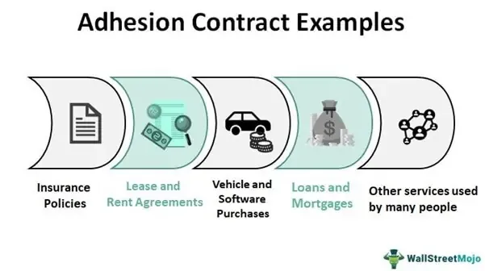

Adhesion contracts have gained significant prominence in the legal landscape of contract law, with their importance further amplified in the domain of algorithmic trading. These contracts, often characterized by their "take-it-or-leave-it" nature, are drafted by one party with superior bargaining power and offered to another party with limited negotiation capacity. This dynamic is prevalent across numerous industries, most notably in finance and technology, where the need for streamlined agreements with large user bases is paramount.

In the context of finance, particularly algorithmic trading, adhesion contracts facilitate the rapid execution of trades by providing standardized terms that market participants must accept to access trading platforms and services. Algorithmic trading, which employs complex algorithms to execute orders at speeds and frequencies beyond human capabilities, relies heavily on these pre-defined agreements to ensure operational efficiency and legal clarity. Consequently, understanding the enforceability of adhesion contracts becomes crucial for individuals and businesses engaged in algorithmic trading, where financial stakes and risks are high.

Contract law governs the framework within which adhesion contracts operate, focusing on principles of fairness and mutual consent. Courts scrutinize these contracts for elements such as unconscionability—where the terms are unjust or excessively one-sided—and transparency, which plays a vital role in minimizing disputes and protecting the interests of both parties. As algorithmic trading continues to evolve, so too does the necessity for legal standards that address the unique dynamics of digital and automated environments.

This examination sets the groundwork for a comprehensive analysis of adhesion contracts, emphasizing their enforceability within the sphere of algorithmic trading. It highlights the ongoing challenge of balancing innovation with legal compliance, underscoring the importance of continual adaptation and collaboration among legal experts, technologists, and financial participants. As the financial sector advances, the call for transparent and equitable contractual practices remains vital to maintaining trust and efficiency in the ever-changing landscape of algorithmic trading.

## Table of Contents

## Understanding Adhesion Contracts

Adhesion contracts are legally binding agreements typically drafted by a party with significantly greater bargaining power, such as corporations or large institutions. These agreements are often offered on a "take-it-or-leave-it" basis, leaving the weaker party, usually consumers or small business entities, with little to no capacity to negotiate terms. This characteristic structure streamlines transactions by providing standardized contracts that facilitate widespread use across various sectors.

One defining feature of adhesion contracts is their nature of being non-negotiable for one of the parties involved. This is common in industries like technology and finance, where companies offer standardized service agreements or user licenses. For instance, when an individual downloads an app or subscribes to an online service, they commonly agree to the terms outlined in an adhesion contract by simply clicking "I agree," without the opportunity to modify any clauses.

The technology sector frequently employs adhesion contracts due to the vast numbers of transactions and agreements processed. Software licensing agreements, for example, are standardized to ensure consistent application across extensive user bases. Similarly, in finance, services such as online banking platforms or investment tools often utilize standardized contracts to enhance operational efficiency and mitigate the costs associated with drafting individual agreements for each user.

The advantages of adhesion contracts lie primarily in their efficiency. Standardization allows for quick processing of agreements, which is crucial for industries with large consumer bases where individualized contract negotiation would be impractical. From an operational perspective, these contracts reduce the administrative burden and legal costs associated with drafting multiple contracts. This streamlining is beneficial both for businesses and consumers, as it facilitates easier access to services and products.

However, criticisms of adhesion contracts focus on the perceived imbalance of power. The party offering the contract often holds disproportionate influence, dictating terms that may overly favor their interests at the expense of the signatory’s rights or benefits. This imbalance can lead to situations where consumers agree to terms that they do not fully understand or that may be unfavorable due to the absence of negotiation power. Critics argue that this undermines the contract's fairness and could potentially lead to exploitation.

In summation, while adhesion contracts serve to simplify and codify agreements across industries like technology and finance, they [carry](/wiki/carry-trading) inherent criticisms primarily centered on power dynamics between contracting parties. Understanding these contracts' structure and function is crucial for recognizing both their efficiencies and their potential drawbacks.

## Enforceability of Adhesion Contracts

Adhesion contracts, often characterized by their "take-it-or-leave-it" nature, present unique challenges in terms of enforceability within contract law. The enforceability of these contracts hinges on several key factors, primarily revolving around the doctrines of unconscionability and fairness. Unconscionability is a critical legal principle used by courts to assess whether an adhesion contract is excessively unfair or oppressive toward one party. This doctrine is generally dissected into two components: procedural and substantive unconscionability. Procedural unconscionability assesses the conditions under which the contract was signed, focusing on the potential inequalities in bargaining power and the ability of the weaker party to understand and negotiate the terms. Substantive unconscionability, on the other hand, examines the actual terms of the contract, identifying whether they are overly harsh or one-sided.

Notable case law provides valuable insights into the circumstances under which courts have either upheld or nullified adhesion contracts. For instance, the landmark case of *Williams v. Walker-Thomas Furniture Co.*, 350 F.2d 445 (D.C. Cir. 1965), highlighted the importance of unconscionability in evaluating contract terms. In this case, the court emphasized the need to consider both the procedural and substantive aspects when determining the fairness and enforceability of a contract. Another significant case is *AT&T Mobility LLC v. Concepcion*, 563 U.S. 333 (2011), where the U.S. Supreme Court upheld the enforceability of arbitration clauses in adhesion contracts, underscoring the complex interplay between unconscionability and federal arbitration laws.

Transparency plays an essential role in enhancing the enforceability of adhesion contracts by ensuring that all parties have a clear understanding of the terms and implications of the agreement. Transparency involves the provision of clear, straightforward information, reducing the asymmetry of information between parties and fostering a greater balance of interests. This transparency is particularly crucial in the digital age, where contracts are often accepted online with minimal interaction or negotiation.

The digital age also poses new challenges and opportunities for adhesion contracts, prompting considerations for updated legislation. Traditional contract laws may not adequately address the complexities introduced by digital platforms and algorithmic processes, necessitating a reevaluation of legislative frameworks. Potential updates could focus on ensuring fairness and transparency within the unique dynamics of digital contracts, protecting parties from unfair terms while accommodating the needs of rapidly evolving technological environments.

In conclusion, the enforceability of adhesion contracts is a multifaceted issue influenced by principles of unconscionability, notable case precedents, the importance of transparency, and the potential need for legislative updates in the face of digital transformations. Courts continue to grapple with maintaining a balance between protecting weaker parties and recognizing the efficiency benefits of standardized contracts, particularly in fast-paced technological contexts.

## Algorithmic Trading and Contractual Dynamics

Algorithmic trading refers to the use of computer algorithms to automate trading decisions in financial markets. These algorithms execute quantifiable strategies based on patterns and data analysis at speeds and frequencies that are beyond human capacity. Algorithmic trading is integral to modern financial markets due to its ability to enhance trading efficiency, reduce transaction costs, and manage large volumes of trades effectively.

In the context of [algorithmic trading](/wiki/algorithmic-trading) platforms and services, adhesion contracts play a significant role. These contracts, often presented on a "take-it-or-leave-it" basis, govern the terms and conditions under which users engage with algorithmic trading systems. Given the complexity and standardized nature of such platforms, adhesion contracts provide a mechanism for rapid user onboarding and operation across diverse traders and institutions.

Standardized agreements are paramount in facilitating quick and efficient trading operations. By eliminating the need for individual negotiation, these agreements streamline access to algorithmic trading systems, ensuring consistency and predictability in contractual obligations. This standardization supports the high-speed nature of algorithmic trading, where any delay could result in financial loss or missed market opportunities.

However, adhesion contracts in algorithmic trading also present unique challenges and risks. The inherent imbalance of power can lead to terms that disproportionately favor the drafting party, often the algorithmic trading service providers. Users, particularly smaller traders, may encounter unfair terms that limit liability or enforce strict compliance measures. There is also the risk of insufficient transparency, which can obscure critical contract details, potentially leading to disputes and legal challenges.

The necessity for rigorous compliance and risk management is critical when drafting contracts associated with algorithmic trading. Trading platforms must adhere to legal standards and regulatory requirements to protect their interests and those of their clients. This involves clear communication of contract terms, implementing robust dispute resolution mechanisms, and continuously monitoring legal developments that may impact contract enforceability. Compliance teams need to ensure that contracts are regularly updated to reflect changes in regulation, technology, and market conditions to minimize potential legal pitfalls.

Overall, while adhesion contracts are essential for the operational efficiency of algorithmic trading, striking a balance between standardization and fairness is imperative to mitigate risks and uphold equitable trading practices. As algorithmic trading continues to evolve, ongoing legal vigilance and adaptable contractual frameworks are essential to navigate its complex dynamics effectively.

## Balancing Innovation and Legal Compliance

Innovation in algorithmic trading continues to redefine the landscape of financial markets, challenging traditional contract frameworks to adapt rapidly. This rapidly evolving industry relies on the development of software that can execute pre-defined trading strategies with minimal human intervention. As a result, it grapples with balancing the innovative impulse of algorithmic trading systems with the rigors of legal compliance. The technology-driven nature of algorithmic trading often pushes conventional contract frameworks to their limits, necessitating agile approaches to contractual standards.

Algorithmic trading by its nature requires agreements that facilitate quick decision-making and execution. However, static legal standards can sometimes impede the agility of modern business models. Standardization through adhesion contracts may streamline transactions, but it can also create conflicts when rigid contractual terms clash with the rapidly evolving nature of algorithmic trading. This conflict is particularly evident when unforeseen technological advancements or market conditions render existing contract terms obsolete or impractical.

Legal innovation is crucial to ensure that the legal framework keeps pace with these technology-driven market changes. Lawmakers and legal professionals need to embrace flexible frameworks and provide pathways for adapting contractual terms swiftly in response to technological shifts. This may involve developing adaptive contract clauses that can accommodate changes in regulation or technology, as well as incorporating legal oversight mechanisms within algorithmic systems themselves.

For companies involved in algorithmic trading, ensuring their contracts remain legally robust involves adopting best practices that emphasize transparency, compliance, and foresight. This includes conducting thorough risk assessments and implementing compliance measures to identify potential legal and financial risks associated with algorithmic strategies. Employing a dynamic review process can help ensure that contract terms reflect current legal standards and market conditions, thereby mitigating the risk of costly conflicts or litigation.

Technological advancements, particularly in [artificial intelligence](/wiki/ai-artificial-intelligence) (AI), are poised to significantly impact future contractual agreements and dispute resolution. AI can assist in drafting contracts that reflect ever-evolving market needs and ensure compliance by incorporating real-time data analytics. AI-driven platforms might also facilitate efficient dispute resolution by providing predictive analysis and fairness assessments based on historical data, potentially reducing the need for lengthy legal proceedings.

In conclusion, balancing innovation with legal compliance in algorithmic trading requires a concerted effort to harmonize agile business models with evolving legal standards. Embracing legal innovation, adhering to best practices, and leveraging technological advancements like AI are essential steps towards crafting a robust, adaptable contractual framework that serves the interests of all parties involved in algorithmic trading.

## Conclusion

In concluding the exploration of adhesion contracts within the sphere of algorithmic trading, the intricate relationship between these contracts and their enforceability emerges as a central theme. Algorithmic trading, characterized by high-speed transactions and complex algorithms, operates on the backbone of standard agreements, often in the form of adhesion contracts. These contracts, while providing efficiency and scalability, also raise critical questions of fairness and legal robustness.

Maintaining a delicate equilibrium between innovation and legal compliance is paramount. As algorithmic trading rapidly evolves, pushing the limits of traditional contract frameworks, the importance of ensuring that legal standards keep pace cannot be overstated. This balance is key to safeguarding the interests of all parties involved, from individual traders to large financial institutions.

The complex dynamics at play necessitate ongoing dialogue and collaboration among legal experts, technologists, and financial market participants. This collaboration is crucial in developing legal frameworks that can effectively address the unique challenges posed by algorithmic trading, while also allowing for technological advancements.

Furthermore, there is a pressing need for continuous education and adaptation to ensure that contracts in algorithmic trading remain fair and effective. This involves staying informed about legal developments, technological innovations, and market changes that could impact contractual practices. 

Finally, a strong call to action for transparency and fairness is essential. As the financial industry continues to evolve, all stakeholders must commit to practices that uphold these values, ensuring that contracts are not only efficient and enforceable but also equitable. This ongoing commitment will help navigate the future landscape of finance, where innovation and legal integrity coalesce.

## References & Further Reading

[1]: Kessler, J., & Rabin, R. (2011). ["Analyzing Adhesion Contracts: Transparency and Fairness in Online Interactions."](https://pmc.ncbi.nlm.nih.gov/articles/PMC10988141/) National Consumer Law Center.

[2]: Radin, M. J. (2013). ["Boilerplate: The Fine Print, Vanishing Rights, and the Rule of Law."](https://academic.oup.com/princeton-scholarship-online/book/30656) Princeton University Press.

[3]: *AT&T Mobility LLC v. Concepcion*, 563 U.S. 333 (2011). Available at [Justia](https://supreme.justia.com/cases/federal/us/563/333/).

[4]: Lopez de Prado, M. (2018). ["Advances in Financial Machine Learning."](https://www.amazon.com/Advances-Financial-Machine-Learning-Marcos/dp/1119482089) Wiley.

[5]: Williams v. Walker-Thomas Furniture Co., 350 F.2d 445 (D.C. Cir. 1965). Available at [CaseMine](https://law.justia.com/cases/federal/appellate-courts/F2/350/445/74531/).