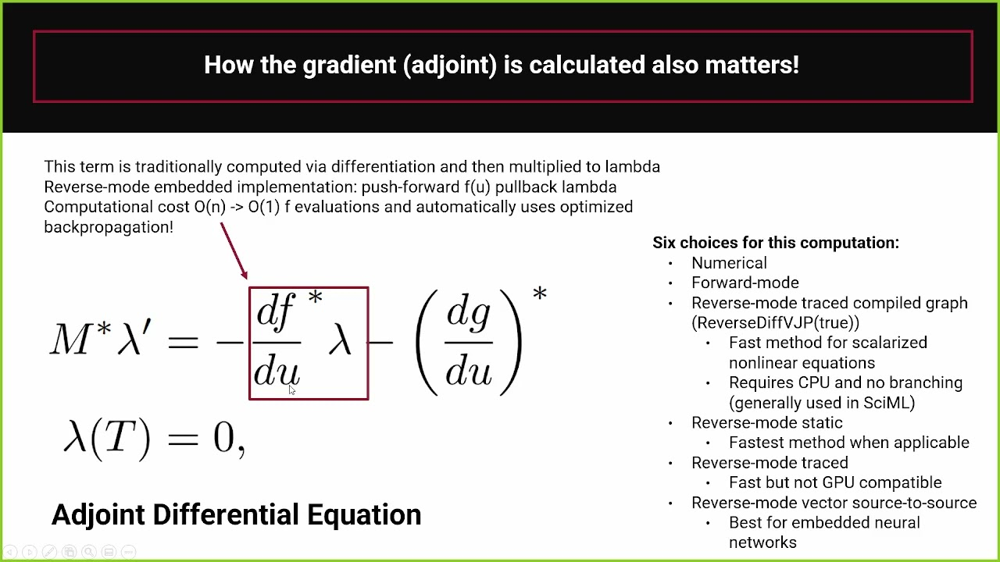

## Table of Contents

## What is Adjoint Algorithmic Differentiation (AAD)?

Adjoint Algorithmic Differentiation (AAD) is a method used to calculate the gradients of a function more efficiently, especially when dealing with large and complex systems. Imagine you have a big math problem with lots of variables, and you want to know how changing one variable affects the final result. AAD helps you do this faster by working backwards from the final result to each variable, instead of calculating the impact of each variable one by one.

In simple terms, AAD is like finding the best path to climb a mountain. Instead of trying every single route, you start at the top and trace your way back down to see which paths got you there most efficiently. This technique is very useful in fields like finance and engineering, where models can have thousands of variables and traditional methods would take too long to compute. By using AAD, you can save a lot of time and computational resources.

## How does AAD differ from other differentiation methods like forward mode?

Adjoint Algorithmic Differentiation (AAD) and forward mode differentiation are both ways to calculate how changing one variable affects a whole math problem, but they do it differently. Forward mode differentiation starts at the beginning of your math problem and follows the calculations step by step, figuring out how each variable changes the final result. It's like climbing a mountain by trying different paths from the bottom up. This method is good when you have fewer variables to check because it's straightforward and easy to follow.

On the other hand, AAD works backwards from the final result to each variable. It's like starting at the top of the mountain and tracing your way back down to see which paths got you there most efficiently. This method is much faster when you have a lot of variables because it doesn't need to recalculate the entire problem for each variable. Instead, it calculates the impact of all variables in one go, making it a powerful tool for complex systems with many variables.

In summary, forward mode is like exploring from the start, while AAD is like reverse-engineering from the end. Forward mode is simpler and works well with fewer variables, but AAD shines when you have a large number of variables and need to save time and computational resources.

## What are the basic principles behind the adjoint method?

The adjoint method is like a smart way to solve a big puzzle. Imagine you have a huge math problem with lots of pieces, and you want to know how each piece affects the final answer. Instead of trying to figure out the impact of each piece one by one, which would take forever, the adjoint method starts at the end and works backward. It looks at the final answer and traces back to see how each piece contributed to it. This backward approach means you don't have to redo the whole puzzle for every piece, making it much faster.

This method is especially useful when you have a lot of pieces to check. Think of it like trying to find the best route up a mountain. Instead of climbing up every possible path from the bottom, you start at the top and work your way down to see which paths were the most important. This saves a lot of time and effort, especially when the mountain has many different routes. By using the adjoint method, you can efficiently understand how all the pieces fit together and affect the final result, which is super helpful in fields like finance and engineering where models can be very complex.

## Can you explain the concept of the adjoint state in AAD?

The adjoint state in Adjoint Algorithmic Differentiation (AAD) is like a special helper that makes the backward journey easier. Imagine you're trying to find out how each ingredient affects the taste of a cake. Instead of baking the cake over and over with different amounts of each ingredient, you bake it once and then use the adjoint state to figure out how each ingredient contributed to the final taste. The adjoint state keeps track of how changes at the end of the recipe affect the ingredients at the beginning, so you don't have to redo the whole process for each ingredient.

Think of the adjoint state as a map that helps you trace the path from the final result back to the starting point. When you're dealing with a complex math problem with lots of variables, the adjoint state guides you through the backward journey, showing how each variable impacts the final answer without needing to recalculate everything. This makes the process much faster and more efficient, especially when you have a lot of variables to check.

## What are the primary applications of AAD in computational science?

Adjoint Algorithmic Differentiation (AAD) is widely used in computational science, especially in fields where models are complex and have many variables. One of the main applications is in finance, where AAD helps to calculate the sensitivity of financial instruments to different risk factors. This is crucial for risk management and pricing derivatives. Instead of running lots of simulations to see how each [factor](/wiki/factor-investing) affects the price, AAD can do this much faster by working backwards from the final price to each factor.

Another important application is in engineering, particularly in optimization and design. Engineers use AAD to improve the design of things like airplanes or cars by figuring out how changes in design affect performance. This helps them make better designs without having to test every possible change one by one. AAD makes the process faster and more efficient, saving time and computational resources.

In addition to finance and engineering, AAD is also used in other fields like meteorology and climate science. Here, it helps scientists understand how different factors affect weather patterns and climate models. By using AAD, they can run simulations more efficiently, which is important when dealing with the large and complex models used in these areas.

## How is AAD implemented in programming languages like C++ or Python?

Implementing Adjoint Algorithmic Differentiation (AAD) in programming languages like C++ or Python involves creating a way to track and calculate how changing one variable affects the final result of a function. In C++, you might use libraries like CoDiPack or Adept, which provide tools to automatically differentiate your code. These libraries work by recording the operations in your code and then running them backwards to compute the gradients. You would need to modify your existing code to use these libraries, which might involve wrapping your variables and functions in special types that track the operations.

In Python, you can use libraries like PyTorch or TensorFlow, which have built-in support for automatic differentiation. These libraries make it easier to implement AAD because they handle the backward pass automatically. You simply define your model or function using the library's framework, and then you can easily compute gradients by calling the appropriate methods. This makes AAD more accessible in Python, as you don't need to manually code the backward pass or modify your existing code as extensively as you might in C++.

## What are the computational advantages of using AAD over traditional methods?

Adjoint Algorithmic Differentiation (AAD) is like a super-fast shortcut for solving big math problems. When you have a lot of variables to check, traditional methods can take a long time because they need to recalculate the entire problem for each variable. AAD, on the other hand, works backwards from the final result to each variable in one go. This means you don't have to redo the whole problem multiple times, which saves a lot of time and computational power. It's like finding the best path up a mountain by starting at the top and tracing your way back down, instead of trying every single route from the bottom.

This efficiency is a big deal in fields like finance and engineering, where models can have thousands or even millions of variables. Traditional methods would be too slow and resource-intensive for these complex models. AAD makes it possible to quickly understand how all the variables affect the final result, which is crucial for tasks like risk management, pricing financial instruments, or optimizing designs. By using AAD, you can run simulations and calculations much faster, making it easier to work with large and complicated systems.

## Can you describe a simple example where AAD is applied?

Imagine you're baking a cake, and you want to know how changing the amount of sugar affects the taste. Instead of baking the cake over and over with different amounts of sugar, you can use Adjoint Algorithmic Differentiation (AAD). With AAD, you bake the cake once, taste it, and then work backwards to see how the sugar contributed to the final taste. It's like having a special tool that helps you figure out the impact of sugar without needing to bake the cake multiple times.

Let's say you have a simple math problem where you want to know how changing one number affects the final answer. You have a formula like `y = 2x + 3`, and you want to see how changing `x` affects `y`. With traditional methods, you'd have to plug in different values of `x` and calculate `y` each time. But with AAD, you calculate `y` once, and then use AAD to work backwards from `y` to `x` to see how `x` affects `y`. This way, you don't have to recalculate the whole formula for each new value of `x`, making it much faster and easier.

## What challenges are encountered when scaling AAD to large systems?

When using Adjoint Algorithmic Differentiation (AAD) on really big systems, one of the main challenges is keeping track of all the steps and variables. Imagine you're trying to solve a huge puzzle with thousands of pieces. AAD needs to remember every move you make to work backwards correctly. This can use up a lot of computer memory, especially if the system is very complex. If you run out of memory, the computer might slow down or even stop working, making it hard to finish the task.

Another challenge is making sure the AAD code works well with the existing system. Sometimes, the original code might not be set up in a way that makes it easy to use AAD. You might need to change the code, which can be tricky and time-consuming. Also, as the system gets bigger, small mistakes or errors can become bigger problems. It's like trying to find a tiny piece missing from a giant puzzle; it can be really hard to spot and fix these issues, but they can mess up your whole solution if you don't catch them.

## How does memory management play a role in the efficiency of AAD?

Memory management is super important for making Adjoint Algorithmic Differentiation (AAD) work well, especially with big systems. When you use AAD, it needs to remember all the steps it takes to solve a problem. This means it can use up a lot of the computer's memory. If the system is really big, with lots of variables and steps, AAD might need more memory than the computer has. This can make the computer slow down or even stop working, which is not good when you're trying to solve a problem quickly.

To make AAD more efficient, you have to be smart about how you use memory. One way to do this is by using special techniques to clear out memory that you don't need anymore as you go along. This helps keep the computer running smoothly and makes sure AAD can finish its job without running out of space. Good memory management means AAD can handle bigger and more complex problems without getting bogged down, making it a powerful tool for solving tough math puzzles.

## What are some advanced techniques for optimizing AAD performance?

One way to make Adjoint Algorithmic Differentiation (AAD) faster is by using something called checkpointing. Imagine you're baking a cake and writing down every step so you can go back and see what you did. Checkpointing is like only writing down the really important steps, so you don't have to remember everything. This saves a lot of memory because you don't need to keep track of every tiny detail. By only saving the big steps, you can still go back and figure out how each ingredient affected the cake, but it's much easier on your computer's memory.

Another technique is called parallel processing. Think of it like having a team of friends help you bake multiple cakes at the same time. Each friend can work on a different part of the problem, making everything go much faster. With AAD, you can split the work into smaller pieces and let different parts of the computer work on them at the same time. This can make AAD run a lot quicker, especially when you're dealing with really big and complicated problems. By using these techniques, you can make AAD more efficient and handle bigger tasks without slowing down.

## How can AAD be integrated into existing simulation and optimization frameworks?

Integrating Adjoint Algorithmic Differentiation (AAD) into existing simulation and optimization frameworks can make them much faster and more efficient. Imagine you have a big puzzle, and you want to solve it quickly. AAD helps by working backwards from the final answer to figure out how each piece affects the whole puzzle. To add AAD to your existing system, you might need to use special tools or libraries that can handle the backward calculations. For example, in programming languages like C++ or Python, you can use libraries like CoDiPack, Adept, PyTorch, or TensorFlow to help you set up AAD. These libraries can make it easier to track how changes in your variables affect the final result without having to redo the whole simulation.

Sometimes, integrating AAD means you have to change your existing code a bit. It's like adding new rules to your puzzle-solving game to make it quicker. You might need to wrap your variables and functions in special types that the AAD library can understand. This can take some time and effort, but it's worth it because AAD can save a lot of time and computational power, especially when you're dealing with big and complex systems. By carefully planning how to add AAD to your framework, you can make your simulations and optimizations run much faster and handle more variables without slowing down.

## References & Further Reading

[1]: Griewank, A., & Walther, A. (2008). ["Evaluating Derivatives: Principles and Techniques of Algorithmic Differentiation"](https://epubs.siam.org/doi/book/10.1137/1.9780898717761) (2nd ed.). Society for Industrial and Applied Mathematics.

[2]: Naumann, U. (2012). ["The Art of Differentiating Computer Programs: An Introduction to Algorithmic Differentiation"](https://epubs.siam.org/doi/book/10.1137/1.9781611972078). Society for Industrial and Applied Mathematics.

[3]: Giles, M. B., & Glasserman, P. (2006). "Smoking Adjoints: Fast Monte Carlo Greeks," _Risk Magazine_.

[4]: Capriotti, L., & Pironneau, O. (2007). ["Fast Greeks by Algorithmic Differentiation"](http://www.luca-capriotti.net/pdfs/Finance/jcf_capriotti_press_web.pdf), _The Journal of Computational Finance_, 11(3), 3-35.

[5]: Savine, A. (2018). ["Modern Computational Finance: AAD and Parallel Simulations"](https://antoinesavine.com/wp-content/uploads/2020/12/ssrn-id3735414-1.pdf). John Wiley & Sons.

[6]: Aldridge, I. (2013). ["High-Frequency Trading: A Practical Guide to Algorithmic Strategies and Trading Systems"](https://onlinelibrary.wiley.com/doi/pdf/10.1002/9781119203803.fmatter) (2nd ed.). John Wiley & Sons.

[7]: Narayanan, S., & Keane, A. J. (2010). "Algorithmic Differentiation in Computational Finance: The Greeks Made Easy," _Journal of Risk_, 12(3), 1-31.

[8]: Capriotti, L. (2011). "Fast Greeks by Algorithmic Differentiation in Practice," _Risk Magazine_.

[9]: Bücker, H. M., Corliss, G. F., Hovland, P., Naumann, U., & Norris, B. (Eds.). (2006). ["Automatic Differentiation: Applications, Theory, and Implementations"](https://link.springer.com/book/10.1007/3-540-28438-9). Springer.