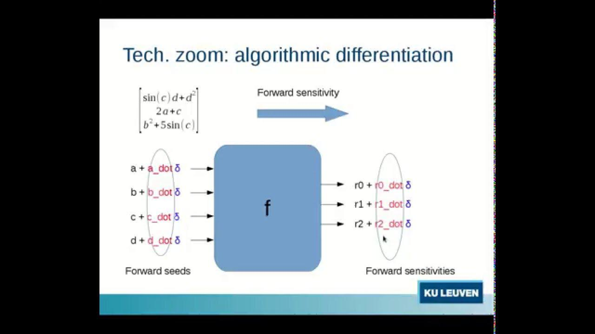

Differentiation plays a vital role in finance by enabling the analysis of how small changes in inputs affect outputs. This is particularly crucial in risk management, pricing derivatives, and optimizing portfolios. Adjoint Algorithmic Differentiation (AAD) is a computational technique that efficiently calculates gradients, which are necessary for these analyses. Unlike traditional methods of differentiation, which can be computationally expensive and inefficient, AAD provides a more effective means to compute derivatives of functions, especially in complex financial models. By transforming the way gradients are computed, AAD has become essential in handling the intricate calculations required in finance.

Algorithmic trading uses computer algorithms to automatically execute trading strategies based on pre-defined criteria. This relies heavily on advanced mathematical tools like AAD to perform real-time risk assessments and optimize performance. The ability to quickly and accurately compute derivatives makes AAD indispensable for algorithmic traders who need to manage large portfolios, evaluate risk, and execute trades efficiently. The reliance on precise mathematical modeling in trading strategies underscores the importance of AAD in the finance sector.

The purpose of this article is to investigate how AAD and algorithmic trading intersect, highlighting the benefits and challenges associated with their integration. By exploring this topic, we aim to provide insights into how AAD can enhance algorithmic trading through improved computational efficiency and accuracy. Additionally, we will examine current applications of AAD in trading and explore its potential future contributions to the field.

## Table of Contents

## What is Adjoint Algorithmic Differentiation?

Adjoint Algorithmic Differentiation (AAD) is a computational technique employed to efficiently compute the derivatives of functions, which are frequently represented as sequences of algorithmic operations. Unlike traditional differentiation methods such as symbolic differentiation or finite differences, AAD leverages the chain rule of calculus to propagate derivatives in a reverse mode, making it particularly advantageous for functions with a high number of input variables and a single output.

The fundamental principle of AAD involves performing a forward pass and a reverse pass during computation. In the forward pass, the primary function is evaluated, keeping track of intermediate variables and operations. In the subsequent reverse pass, AAD computes the derivatives by traversing backward through the computational graph, starting from the output and moving toward the inputs. This reverse accumulation makes AAD especially efficient for evaluating gradients of scalar-valued functions, such as loss functions in optimization problems.

AAD differs from traditional differentiation methods in several critical ways. Symbolic differentiation can be costly in terms of memory and computation for complex functions, and while finite differences are straightforward to implement, they suffer from numerical inaccuracies and inefficiency, particularly in high-dimensional spaces. AAD, by contrast, provides exact derivatives and scales linearly with the number of input variables, making it both accurate and computationally efficient. 

Key applications of AAD span various industries, including computational finance, aerospace, and engineering. In computational finance, AAD is invaluable for the rapid and accurate calculation of risk sensitivities, known as "Greeks," of financial instruments, which are essential for pricing and risk management. In engineering, AAD is applied in optimization tasks where derivative information is crucial for design sensitivity analysis.

The benefits of employing AAD in computational finance are considerable. As financial markets demand precise and rapid response to changing conditions, AAD offers the ability to compute risk measures and optimize portfolios efficiently. This capability leads to more accurate pricing models and effective risk mitigation strategies. Furthermore, AAD can substantially reduce computational costs compared to other differentiation methods, as it significantly decreases the time complexity of derivative computations.

In summary, Adjoint Algorithmic Differentiation stands out due to its efficiency, accuracy, and versatility across various complex systems, particularly highlighting its pivotal role in the computational finance industry.

## The Role of AAD in Algorithmic Trading

Algorithmic trading refers to the execution of trading strategies, using automated and pre-programmed software to place orders at speeds and frequencies impossible for human traders. These strategies rely on mathematical models and algorithms to make decisions. The use of sophisticated tools is crucial in this context to ensure efficiency and accuracy in trades.

Sensitivity analysis and risk management play a pivotal role in [algorithmic trading](/wiki/algorithmic-trading), as they allow traders to understand and quantify the impact of variables on trading outcomes. This understanding aids in optimizing strategies to mitigate risks and improve profitability. Adverse market conditions and price fluctuations can be swiftly addressed by evaluating the sensitivities of portfolio value to changes in underlying market factors.

The integration of Adjoint Algorithmic Differentiation (AAD) in portfolio optimization and derivative pricing provides significant advantages. AAD efficiently computes derivatives of complex functions that define trading strategies, thus facilitating sensitivity analysis. For example, in portfolio optimization, AAD can be used to calculate the gradient of the objective function, typically related to maximizing returns or minimizing risk.

Consider the function $f(x) = g(h(x))$, where $h: \mathbb{R}^n \rightarrow \mathbb{R}^m$ and $g: \mathbb{R}^m \rightarrow \mathbb{R}$. AAD helps us find the derivatives of $f$ with respect to $x$ by using the chain rule efficiently. Instead of the traditional forward mode, which can be computationally expensive for functions with many input variables, AAD applies the reverse mode to calculate all derivatives in a single backward pass. This capability is particularly useful in computing the Greeks in derivative pricing, optimizing computational resources, and thus increasing trading efficiency.

In algorithmic trading, AAD's application can be found in various case studies. For example, a quant fund might utilize AAD for calculating the sensitivities of option prices to underlying assets swiftly, which is necessary for dynamic hedging strategies. By implementing AAD, such funds can significantly reduce computational costs and time, which is a substantial advantage over traditional differentiation methods.

Moreover, within the scope of risk management, AAD assists in stress testing a trading strategy. By providing the necessary sensitivity measures under various hypothetical market conditions, trading algorithms can be fine-tuned for robustness.

Overall, the incorporation of AAD in algorithmic trading enhances the precision and speed of computations required for sensitivity analysis, enabling better and more informed trading decisions. This results in improved risk management, efficiency in portfolio management, and potentially higher operational profitability.

## Advantages of Using AAD in Algorithmic Trading

Adjoint Algorithmic Differentiation (AAD) is a computational technique that provides several advantages in algorithmic trading, particularly in terms of efficiency, scalability, real-time analysis, and cost reduction. These benefits make it a valuable tool for traders seeking to optimize their strategies and enhance profitability.

### Efficiency: Speed and Accuracy in Computations

AAD accelerates the computation of derivatives, which are essential in financial modeling and risk management. Unlike traditional finite difference methods, AAD calculates gradients accurately without the need for perturbations, thus avoiding the numerical errors associated with finite difference approximations. This precision is crucial when dealing with complex financial derivatives and risk measures such as Value at Risk (VaR) or Greeks in options pricing. By significantly reducing computation time, AAD allows traders to simulate and evaluate strategies swiftly, leading to more timely and informed decision-making.

### Scalability: Handling Large Portfolios and Complex Models

Algorithmic trading often involves managing extensive portfolios comprising various asset classes and financial instruments. AAD's reverse mode of differentiation is particularly well-suited for functions with a large number of input parameters but fewer output results, which is common in trading models. This capability enables the effective handling of large-scale portfolios without a proportional increase in computational costs. Moreover, AAD can be integrated into existing algorithmic trading platforms, enhancing their ability to process complex models and large datasets efficiently.

### Real-Time Analysis and Decision Making

In trading, the ability to perform real-time analysis is critical. AAD supports this by providing quick and accurate sensitivity analysis, which is essential for assessing market risks and identifying opportunities as they arise. Real-time derivative calculations allow for dynamic adjustment of trading strategies in response to market conditions, thus enabling traders to capitalize on short-lived market inefficiencies. AAD's speed in computing these derivatives means that real-time risk assessments and adjustments can be performed at a pace required by high-frequency trading environments.

### Reducing Computational Costs and Improving Profitability

By streamlining the process of calculating derivatives, AAD reduces the computational resources required for complex financial evaluations. This reduction in computational load translates into lower operational costs for trading firms. Additionally, the improved accuracy and speed of AAD can lead to better-informed trading decisions, minimizing losses and maximizing returns. By providing precise risk metrics and derivative pricing in a more efficient manner, AAD enhances the overall profitability of trading operations.

In summary, Adjoint Algorithmic Differentiation offers significant advantages in algorithmic trading, primarily through its efficiency, scalability, real-time analysis capabilities, and cost-effective nature. These benefits underscore its status as an indispensable tool for modern financial trading strategies.

## Challenges and Considerations

Adjoint Algorithmic Differentiation (AAD) presents several challenges and considerations that need to be addressed to effectively implement it in financial contexts, particularly in algorithmic trading.

**Technical Challenges in Implementing AAD**

Implementing AAD involves intricate steps, as it requires changes to existing computational frameworks. A major challenge is the transformation of the original code to generate both the primal outputs and their derivatives efficiently. This often necessitates an in-depth understanding of the entire computational process, including the underlying mathematical models and coding structures.

Technical difficulties arise from the complexity of composing derivatives through chain rules, where the adjoint method must maintain and manage a potentially large amount of information. Optimizing this process demands a balance between memory usage and computational speed, a balance not easily achieved.

**Limitations of AAD in Certain Financial Contexts**

AAD, while powerful, presents limitations in specific financial contexts where high-frequency updates are pivotal. In environments demanding rapid computations, the overhead of maintaining adjoint models can be prohibitive. Additionally, in uncertain market conditions, where models require frequent recalibration, the static nature of predetermined derivative calculations can prove inadequate, potentially leading to inaccurate sensitivity analysis and risk assessments.

**Balancing Complexity and Usability**

The process of implementing AAD can introduce significant complexity into trading systems. For financial professionals, striking a balance between the comprehensive implementation of AAD schemes and maintaining usability of these systems is crucial. This may involve designing user interfaces that effectively mask the underlying complexity from end-users while still providing robust tools for financial modeling and risk management. 

Further, training is imperative to ensure that analysts and programmers alike can leverage AAD without inadvertently introducing errors or inefficiencies into the trading algorithms. Concerns regarding usability also extend to debugging and maintaining AAD-enhanced systems, which can be more involved than traditional setups due to the additional layers of computation.

**Ensuring Robustness and Stability in Trading Algorithms**

Ensuring stability is a critical consideration in the deployment of AAD algorithms within trading systems. Algorithms must not only provide accurate derivatives but also remain stable across diverse market conditions. This necessitates rigorous testing against historical data and stress scenarios to evaluate performance comprehensively. Robustness can be further enhanced by incorporating fallback mechanisms and fail-safes that maintain market positions and valuations despite potential computational anomalies.

Moreover, as market conditions evolve, continuous updates and recalibrations of algorithms are needed to maintain alignment with market dynamics. This requirement for adaptability highlights the importance of dynamic configuration capabilities in AAD systems, ensuring that they remain resilient and effective over time.

Effective implementation of AAD in algorithmic trading thus demands a considered approach, one that thoroughly addresses these challenges while maximizing the potential benefits of precision and computational efficiency. With careful management and innovation, financial institutions can harness the power of AAD to enhance trading strategies and outcomes.

## Conclusion

Adjoint Algorithmic Differentiation (AAD) has emerged as an essential tool in the domain of algorithmic trading due to its numerous benefits. By efficiently computing sensitivities, AAD enables rapid and accurate derivative calculations, which are crucial for risk management and portfolio optimization. Its adoption allows financial institutions to enhance decision-making processes, ultimately leading to more profitable trading strategies. The ability to handle vast amounts of data with increased precision has made AAD a valuable asset in computational finance.

Looking towards the future, the landscape of finance technology is expected to evolve, with an increased focus on scalability and real-time data analysis. As trading models grow in complexity, the need for sophisticated methods such as AAD will become more pronounced. AAD's capacity to integrate seamlessly into existing frameworks while providing substantial gains in computational efficiency will be instrumental in addressing the rising demands of the industry. Additionally, innovations in [machine learning](/wiki/machine-learning) and [artificial intelligence](/wiki/ai-artificial-intelligence) may further amplify the impact of AAD by enhancing its capabilities for adaptive and automated trading strategies.

The potential of AAD in revolutionizing algorithmic trading is vast. By facilitating more rigorous analytical methods, it offers the precision needed to identify and exploit market opportunities. Financial professionals are encouraged to explore and integrate AAD into their trading operations. By doing so, they can achieve a competitive edge through refined risk assessment, improved accuracy in pricing derivatives, and minimized computational costs.

To remain relevant in the fast-paced world of financial technology, adoption of cutting-edge methodologies like AAD is imperative. As the industry advances, professionals equipped with knowledge and expertise in AAD will be better positioned to navigate the challenges and seize the opportunities presented by future trends in algorithmic trading.

## References

Comprehensive list of sources and literature on AAD:

1. **Griewank, A., & Walther, A. (2008).** _Evaluating Derivatives: Principles and Techniques of Algorithmic Differentiation_ (2nd ed.). Society for Industrial and Applied Mathematics. This book provides a deep dive into the principles and techniques of algorithmic differentiation, including both forward and reverse mode, which are essential concepts for understanding AAD.

2. **Naumann, U. (2012).** _The Art of Differentiating Computer Programs: An Introduction to Algorithmic Differentiation_. Society for Industrial and Applied Mathematics. This text introduces the fundamentals of algorithmic differentiation and provides insights into its applications in computational sciences, including financial contexts.

3. **Giles, M. B., & Glasserman, P. (2006).** "Smoking Adjoints: Fast Monte Carlo Greeks," _Risk Magazine_. This paper presents techniques for efficiently computing sensitivities (Greeks) in Monte Carlo simulations using adjoint techniques, which are critical in financial risk management.

4. **Capriotti, L., & Pironneau, O. (2007).** "Fast Greeks by Algorithmic Differentiation," _The Journal of Computational Finance_, 11(3), 3-35. This article discusses the application of AAD in the computation of Greeks, illustrating how adjoint methods can speed up derivative pricing in finance.

5. **Savine, A. (2018).** _Modern Computational Finance: AAD and Parallel Simulations_. John Wiley & Sons. This comprehensive book focuses on the application of AAD in computational finance, featuring practical examples and real-world case studies.

Further reading on algorithmic trading and finance:

6. **Aldridge, I. (2013).** _High-Frequency Trading: A Practical Guide to Algorithmic Strategies and Trading Systems_ (2nd ed.). John Wiley & Sons. This guide explores various algorithmic trading strategies and discusses the technical foundation required to implement them effectively.

7. **Narayanan, S., & Keane, A. J. (2010).** "Algorithmic Differentiation in Computational Finance: The Greeks Made Easy," _Journal of Risk_, 12(3), 1-31. This paper discusses how algorithmic differentiation simplifies the computation of Greeks, enhancing the efficiency and accuracy of financial models.

Links to case studies and real-world applications:

8. **Capriotti, L. (2011).** "Fast Greeks by Algorithmic Differentiation in Practice," _Risk Magazine_. This case study shows the usage of AAD in a practical setting, offering insights into real-world implementations in financial institutions.

9. **Bücker, H. M., Corliss, G. F., Hovland, P., Naumann, U., & Norris, B. (Eds.). (2006).** _Automatic Differentiation: Applications, Theory, and Implementations_. Springer. This collection features multiple applications of automatic differentiation across various fields, including finance, with firsthand accounts of implementation experiences.

For access to research papers, [books](/wiki/algo-trading-books), or specific case studies, consult academic databases such as JSTOR, IEEE Xplore, or directly through the publishers' websites. Additionally, resources like SSRN (Social Science Research Network) may offer insights into ongoing research and discussions in financial technology.

## References & Further Reading

[1]: Griewank, A., & Walther, A. (2008). ["Evaluating Derivatives: Principles and Techniques of Algorithmic Differentiation"](https://epubs.siam.org/doi/book/10.1137/1.9780898717761) (2nd ed.). Society for Industrial and Applied Mathematics.

[2]: Naumann, U. (2012). ["The Art of Differentiating Computer Programs: An Introduction to Algorithmic Differentiation"](https://epubs.siam.org/doi/book/10.1137/1.9781611972078). Society for Industrial and Applied Mathematics.

[3]: Giles, M. B., & Glasserman, P. (2006). "Smoking Adjoints: Fast Monte Carlo Greeks," _Risk Magazine_.

[4]: Capriotti, L., & Pironneau, O. (2007). ["Fast Greeks by Algorithmic Differentiation"](http://www.luca-capriotti.net/pdfs/Finance/jcf_capriotti_press_web.pdf), _The Journal of Computational Finance_, 11(3), 3-35.

[5]: Savine, A. (2018). ["Modern Computational Finance: AAD and Parallel Simulations"](https://antoinesavine.com/wp-content/uploads/2020/12/ssrn-id3735414-1.pdf). John Wiley & Sons.

[6]: Aldridge, I. (2013). ["High-Frequency Trading: A Practical Guide to Algorithmic Strategies and Trading Systems"](https://onlinelibrary.wiley.com/doi/pdf/10.1002/9781119203803.fmatter) (2nd ed.). John Wiley & Sons.

[7]: Narayanan, S., & Keane, A. J. (2010). "Algorithmic Differentiation in Computational Finance: The Greeks Made Easy," _Journal of Risk_, 12(3), 1-31.

[8]: Capriotti, L. (2011). "Fast Greeks by Algorithmic Differentiation in Practice," _Risk Magazine_.

[9]: Bücker, H. M., Corliss, G. F., Hovland, P., Naumann, U., & Norris, B. (Eds.). (2006). ["Automatic Differentiation: Applications, Theory, and Implementations"](https://link.springer.com/book/10.1007/3-540-28438-9). Springer.