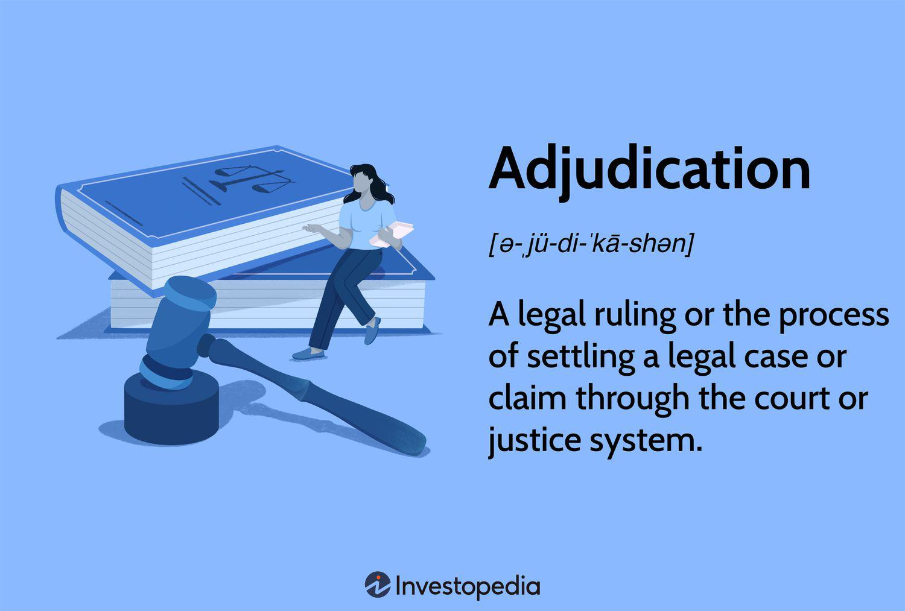

The integration of legal process adjudication with algorithmic trading has become increasingly significant in the contemporary financial world. As financial markets continue to embrace automation and rely on complex algorithms for trading, the intersection of legal frameworks and algorithmic protocols emerges as a critical area of focus. The confluence of these two domains presents unique challenges and opportunities for various stakeholders, including investors, regulators, financial institutions, and legal professionals.

Understanding the interplay between legal adjudication and algorithmic trading is essential to maintaining market integrity and efficiency. The rapid evolution of trading technologies, characterized by high-frequency and automated transactions, necessitates robust legal oversight to address disputes that may arise from these high-speed trading activities. Adjudication, as a formal process of resolving such disputes, plays a vital role in ensuring compliance with legal standards and enhancing trust within financial markets.

The melding of these disciplines is particularly crucial for addressing discrepancies, potential misconduct, and technical failures that can occur in algorithmic trading. Legal adjudication offers structured mechanisms to address such issues effectively, thereby stabilizing relationships among market participants. The dynamic environment of algorithmic trading underscores the necessity for continuous adaptation and realignment of legal processes to support the fast-paced advancements in trading technologies.

This article aims to unravel the complex relationship between legal adjudication processes and the world of algorithmic trading. By examining the role of adjudication in resolving disputes emanating from automated trading practices, it explores the potential for leveraging technological innovations, such as blockchain and artificial intelligence, to enhance adjudication processes. With a focus on the intersection of legal and algorithmic protocols, the article seeks to illuminate the pathways through which these disciplines can harmonize to foster a transparent and equitable trading environment.

In summary, the convergence of legal adjudication and algorithmic trading represents a significant development in financial markets, offering both challenges and opportunities. Ensuring compliance, mitigating risks, and enhancing market efficiency remain paramount objectives. As the global financial landscape continues to evolve, stakeholders must remain vigilant in adapting adjudication practices to uphold market stability and integrity.

## Table of Contents

## Understanding Legal Process Adjudication

Legal process adjudication is the structured mechanism through which disputes are resolved via judicial or quasi-judicial bodies. This process underpins the enforcement of legal standards, ensuring that individuals, corporations, and entities abide by established laws and regulations. In the financial services sector, adjudication serves as a cornerstone for maintaining market integrity.

At its core, the adjudication process involves a comprehensive examination of evidence and legal principles to reach a fair and impartial decision. This process addresses conflicts that arise from various market activities, ensuring that any discrepancies in trading practices are meticulously scrutinized and resolved.

Adjudication is particularly significant in trading contexts, where it handles issues related to trade discrepancies, fraud, and regulatory violations. The complexity of financial transactions, combined with the speed at which they occur, often leads to situations requiring legal intervention. Adjudication provides a structured framework for resolving these issues, thereby stabilizing relationships and trust within the financial markets.

The robust nature of legal adjudication processes mitigates the risks posed by unethical trading behaviors, such as market manipulation or insider trading. By providing a mechanism for impartial dispute resolution, adjudication helps in upholding market fairness and protecting the interests of all market participants. Through its role in overseeing compliance and resolving disputes, legal process adjudication plays an indispensable part in fostering a stable and transparent financial ecosystem.

## Dispute Resolution in Algorithmic Trading

Algorithmic trading, or algo trading, is a method of executing orders using automated pre-programmed trading instructions that consider variables such as time, price, and [volume](/wiki/volume-trading-strategy). Due to the high-speed nature and complexity of algo trading, it introduces the possibility of discrepancies, errors, and potential manipulations, all of which require effective dispute resolution mechanisms.

Dispute resolution in [algorithmic trading](/wiki/algorithmic-trading) is primarily concentrated on addressing inaccuracies and technical failures. These issues may arise due to software bugs, network outages, or unexpected market conditions that the algorithm fails to handle properly. For example, an algorithm might execute trades at an incorrect price or fail to follow market conditions. To address these concerns, robust frameworks are needed to identify and mitigate such risks promptly.

Key components of these frameworks include monitoring systems that track the performance of trading algorithms in real-time. By leveraging technologies such as [machine learning](/wiki/machine-learning), these systems can detect anomalies that might indicate a malfunction or market manipulation. Furthermore, they provide tools for back-testing algorithms under different scenarios to ensure reliability before deployment. Regulatory bodies often mandate these testing regimes to prevent potential market disruptions.

Adjudication processes in algorithmic trading play a crucial role in resolving disputes related to errors, manipulations, and compliance failures. When an error occurs, it may lead to financial losses, which can become a point of contention among participants such as brokers, traders, and exchanges. The adjudication process involves detailed investigations, where all trading data is scrutinized to determine the cause and the liable entity.

Regulatory bodies, such as the U.S. Securities and Exchange Commission (SEC) and the Commodity Futures Trading Commission (CFTC), provide oversight and establish guidelines to manage and resolve disputes. These bodies are tasked with ensuring transparency and fairness in trading practices. They often require trading firms to maintain comprehensive records and logs of their trading activities that can be audited whenever necessary.

Financial institutions, including investment banks and hedge funds, play a pivotal role in developing internal policies and controls to manage algo trading risks. These measures include risk management protocols that can detect and halt trading operations when unusual patterns are observed. Legal professionals, specializing in financial regulations, work alongside these institutions to design compliance frameworks that align with regulatory standards.

Effective dispute resolution in algorithmic trading not only safeguards the interests of individual market participants but also preserves the integrity and stability of financial markets. As algo trading continues to evolve, continual improvements in legal and technological strategies will be essential to address the dynamic challenges it presents.

## Technological Innovations in Adjudication

Technology plays a crucial role in streamlining adjudication processes in algorithmic trading. One of the most significant technological innovations in this field is blockchain technology. With its decentralized and immutable ledger, blockchain technology ensures transparency and reliability. The tamper-proof nature of blockchain records is instrumental in aiding dispute resolution as it provides a clear and verifiable transaction history. This transparency reduces the likelihood of fraud and enhances trust among market participants.

Artificial intelligence (AI) and machine learning (ML) technologies also contribute significantly to the adjudication process. These technologies enable the analysis of massive datasets generated by high-frequency trading. By identifying trading patterns and detecting anomalies, AI and ML facilitate the early detection of errors or manipulative behavior. For instance, AI algorithms can be employed to monitor trades in real-time, flagging any suspicious activities that may require further adjudication. Moreover, these technologies can automate parts of the resolution process, reducing the time and cost associated with human oversight.

Blockchain platforms also enable the execution of smart contracts, which are self-executing contracts with the terms of the agreement directly written into code. These smart contracts can automate the processes of trade confirmation and settlement, ensuring that transactions are executed precisely as intended without the need for intermediaries. By automatically enforcing contractual obligations, smart contracts reduce the scope for disputes and enhance operational efficiency.

These technological advancements are crucial in ensuring quick, equitable, and efficient dispute resolution within the high-speed environment of algorithmic trading. By integrating blockchain, AI, and ML into the adjudication processes, stakeholders can improve the effectiveness of dispute management and bolster overall market stability. This synergy between technology and legal frameworks is vital for safeguarding investor interests and maintaining the integrity of financial markets.

## Case Studies in Adjudication and Algo Trading

Real-world examples underline the critical necessity of robust adjudication systems in the sphere of algorithmic trading, as evidenced by significant cases like the Knight Capital Group incident. On August 1, 2012, Knight Capital Group, a prominent financial services firm, experienced a catastrophic trading glitch that resulted in a pre-tax loss of approximately $440 million. This incident was triggered by a software error within Knight’s trading algorithms, leading to the execution of millions of unwanted stock trades over a 45-minute period. The faulty code, meant for a new trading system, was inadvertently activated in the live trading environment, highlighting the destructive potential of errors in high-frequency trading systems.

The aftermath of the Knight Capital incident underscored the necessity for comprehensive risk management strategies and robust adjudication frameworks. Regulatory bodies, including the U.S. Securities and Exchange Commission (SEC), were swift in their investigation, subsequently imposing a $12 million fine on Knight Capital for violations of market access regulations. The adjudication process was central to uncovering the oversight failures within Knight's risk management and systems testing protocols, thereby enforcing regulatory compliance and prompting necessary industry-wide reforms.

This case has since served as a catalyst for changes in internal control mechanisms and risk management practices across the financial industry. Firms have been encouraged to adopt more rigorous software testing protocols, enhance their internal audit functions, and improve overall governance structures. Additionally, the incident spotlighted the importance of real-time monitoring systems capable of identifying and rectifying erroneous trades promptly, thus protecting the market's integrity.

Learning from such high-impact incidents is vital for enhancing adjudication mechanisms in algorithmic trading. As the complexity and speed of trading algorithms continue to grow, ensuring robust systems are in place to address potential failures becomes increasingly crucial. The insights gathered from the Knight Capital Group case contribute to a broader understanding of the risks posed by algorithmic trading and the essential role of adjudication in maintaining a fair and orderly market.

## Challenges and Future Directions

The complexity of trading algorithms presents significant obstacles in the proper adjudication of disputes within algorithmic trading. These algorithms often involve intricate formulas and heuristic models that adapt to market conditions in real-time. Understanding their operation requires expertise not only in financial markets but also in sophisticated programming and data analysis. This complexity can hinder effective adjudication, as legal professionals and regulators may struggle to decipher the intricate nuances that underpin algorithmic decision-making.

Additionally, the vast volume of data generated by high-frequency trading ([HFT](/wiki/high-frequency-trading-strategies)) necessitates advanced storage solutions and efficient analytical methods. High-frequency trading can generate terabytes of data daily, posing challenges for storage infrastructure and data management. Analyzing this data at scale requires robust systems and algorithms capable of identifying patterns and irregularities. Solutions typically involve distributed computing and advanced data compression techniques to manage and process such extensive datasets.

Cross-border trading adds another layer of complexity due to varying regulatory jurisdictions and legal frameworks. Financial markets often operate globally, but legal systems are predominantly national. This divergence can lead to conflicts in regulatory expectations, compliance requirements, and adjudication processes. For example, what is deemed acceptable practice in one jurisdiction may constitute a violation in another, complicating cross-border enforcement and dispute resolution.

Looking ahead, development of more robust regulatory frameworks and collaborative adjudication networks will be essential. Such frameworks should aim to harmonize regulations across borders, reducing inconsistencies and facilitating smoother international trading operations. Collaborative practices may involve shared data repositories and joint enforcement actions, fostering a more unified approach to global market regulation.

Continued advancements in technology hold promise for refining adjudication processes in algorithmic trading. AI, for instance, can automate the analysis of trading data, rapidly detecting anomalies and potential manipulations. Blockchain technology offers secure, immutable record-keeping, ensuring transparency and accountability in trading activities. These technologies can significantly enhance the efficiency and accuracy of dispute adjudication, ultimately promoting market integrity and stability. 

In conclusion, overcoming the challenges inherent in algorithmic trading requires multifaceted approaches involving regulatory enhancement, technological innovation, and international cooperation. As algorithmic trading continues to evolve, so too must the mechanisms that govern and adjudicate its practices.

## Conclusion

Adjudication in algorithmic trading is fundamental to ensuring that all market participants operate within a fair and compliant framework. The integration of legal frameworks with technological innovations facilitates efficient dispute resolution and is crucial in safeguarding investor interests. As technological advancements continue to reshape financial markets, it is imperative for stakeholders, including regulatory bodies, financial institutions, and legal professionals, to remain vigilant and proactive in adapting adjudication practices to these changes.

The synergy between legal expertise and technological advancements underpins the future efficacy of dispute resolution in algorithmic trading. Through continuous improvement and strategic innovation, adjudication processes will significantly contribute to market stability and integrity. Notably, the incorporation of technologies such as blockchain, [artificial intelligence](/wiki/ai-artificial-intelligence), and machine learning can enhance transparency, reduce errors, and streamline the adjudication process. These technologies enable detailed analyses of trading patterns and automate resolution processes, thus expediting dispute resolution and minimizing the potential for market disruption.

To maintain a robust adjudication framework, continuous adaptation and collaboration among international jurisdictions are vital. As algorithmic trading transcends borders, harmonizing legal standards across different jurisdictions remains a challenge, albeit a necessary endeavor for coherent dispute resolution mechanisms. As such, the sustained evolution of adjudication practices in the context of algorithmic trading will heavily depend on fostering collaborative networks that reconcile different regulatory environments with emerging technologies.

## References & Further Reading

[1]: Romano, R. (1996). ["A Thumbnail Sketch of Derivative Securities and Their Regulation."](https://digitalcommons.law.umaryland.edu/mlr/vol55/iss1/4/) Maryland Law Review, 55(1), 1-35.

[2]: Aldridge, I. (2013). ["High-Frequency Trading: A Practical Guide to Algorithmic Strategies and Trading Systems."](https://books.google.com/books/about/High_Frequency_Trading.html?id=6l0DDQAAQBAJ) Wiley.

[3]: MacKenzie, D. (2018). ["Material Signals: A Historical Sociology of High-Frequency Trading."](https://www.semanticscholar.org/paper/Material-Signals%3A-A-Historical-Sociology-of-MacKenzie/a3347764ea03c35bddbc703940a907c6e52f6f6b) Theory, Culture & Society, 36(1), 3-29.

[4]: Yadav, P. K. (1992). ["Market Microstructure: A Practitioner’s Perspective."](https://www.researchgate.net/publication/240311531_Market_Microstructure_A_Practitioner's_Guide) Financial Markets, Institutions & Instruments, 1(3), 1-63.

[5]: Michelberger, P. (2015). ["Financial Trading and Investment Systems: A Guide to Trading the Markets Successfully."](https://www.sciencedirect.com/org/science/article/pii/S1470875224001727) Palgrave Macmillan.

[6]: Narang, R. K. (2013). ["Inside the Black Box: A Simple Guide to Quantitative and High-Frequency Trading."](https://onlinelibrary.wiley.com/doi/book/10.1002/9781118662717) Wiley.

[7]: Barberis, N., & Thaler, R. (2003). ["A Survey of Behavioral Finance."](https://www.nber.org/papers/w9222) In Handbook of the Economics of Finance (Vol. 1, pp. 1053-1128).