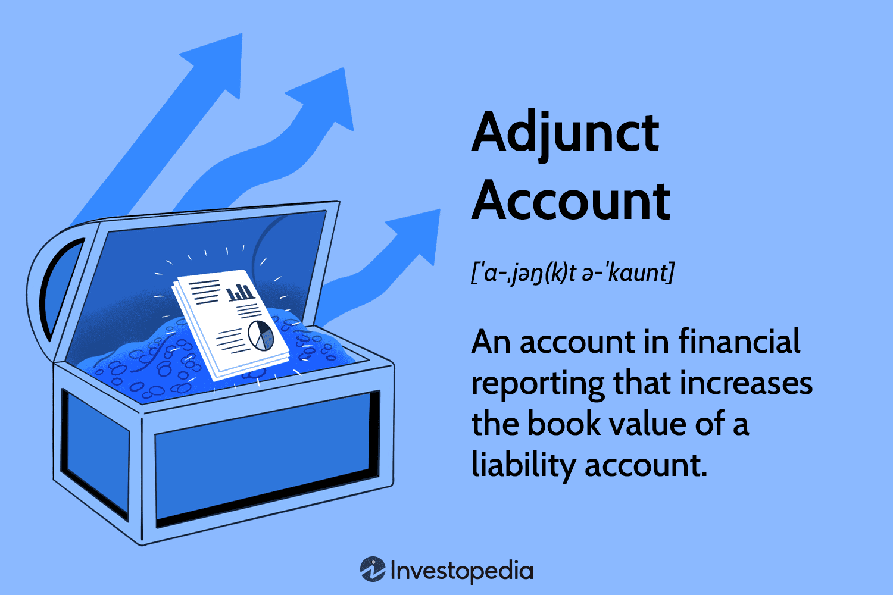

In the dynamic world of finance, understanding various accounting concepts is crucial for effective management and financial reporting. Among these concepts, adjunct accounts hold a significant place. These accounts serve as tools for increasing the valuation of liability accounts, thereby providing a more clarified view of a company's financial position. By adjusting the book value of liabilities, adjunct accounts facilitate a more accurate representation of a company’s financial health and obligations.

The significance of adjunct accounts in the accounting field lies in their ability to offer supplementary data. This additional detail often proves vital for stakeholders who require a robust understanding of a company's liabilities. Unlike other accounting mechanisms, adjunct accounts augment the book value directly, ensuring that all financial statements portray a true and fair view of a company’s financial state.



In this article, we explore various facets of adjunct accounts, including their importance in accounting practices, how they compare with contra accounts, and their application in algorithmic trading and modern finance. Ultimately, understanding how adjunct accounts improve financial transparency and decision-making will offer valuable insights for accountants, analysts, and financial strategists alike.

## Table of Contents

## Understanding Adjunct Accounts

An adjunct account in financial reporting serves to enhance the book value of a liability account by adding credit balances. This approach contrasts with contra accounts, which reduce the value of an account by means of debit entries. The primary function of adjunct accounts is to increase transparency in financial data, providing stakeholders with a more precise understanding of a company's financial obligations.

These accounts are typically used alongside primary liability accounts to furnish a comprehensive and detailed view of financial liabilities. For instance, when a company issues bonds at a premium, the amount exceeding the bond's face value is recorded in an adjunct account. This recording mechanism ensures that the total financial obligation to bondholders is accurately represented.

To illustrate, consider a company that issues bonds with a face value of $1,000,000 at a 5% premium. The premium is calculated as:

$$
\text{Premium} = 1,000,000 \times 0.05 = 50,000
$$

The premium indicates that the bondholders pay $1,050,000 for the bonds. Here, the adjunct account is used to record the $50,000, which adequately adjusts the liability account to reflect the true obligation of $1,050,000 rather than just the face value of $1,000,000.

In accounting terms, the journal entry to reflect this transaction would involve crediting the "Premium on Bonds Payable" adjunct account while also crediting "Bonds Payable" for the face value of the bonds. This ensures that the financial statements present an accurate portrayal of liabilities, supporting more effective decision-making and financial management.

Furthermore, by integrating adjunct accounts, companies can achieve a higher level of detail in their financial reporting. This addition aids analysts, investors, and other stakeholders in assessing the true financial health and obligations of the entity. The adoption of adjunct accounts, therefore, stands as a crucial practice for enhancing financial transparency and reliability.

## Role of Adjunct Accounts in Financial Reporting

Adjunct accounts are key elements in financial reporting that enhance the clarity of financial statements by augmenting liability accounts with additional details. This is crucial for providing a transparent representation of a company's financial position and obligations. By offering more granularity, adjunct accounts facilitate better precision in corporate finance, which is vital for compliance, accurate reporting, and maintaining investor trust.

These accounts are particularly important when dealing with financial instruments such as bonds. They provide an accurate reflection of the carrying amount, helping to ensure that liabilities are neither understated nor overstated. For example, if a company issues bonds at a premium, the adjunct account accommodates the premium portion, highlighting the actual obligation beyond the bond's face value. This ensures that financial statements accurately portray the company's total liabilities, thus bolstering the reliability of financial data provided to stakeholders.

In practice, the implementation of adjunct accounts supports the adherence to accounting principles and standards, like those outlined by the Generally Accepted Accounting Principles (GAAP) or International Financial Reporting Standards (IFRS). By correctly applying adjunct accounts, companies can provide a transparent view of their financial obligations, which aids in aligning with regulatory requirements and fostering confidence among investors and creditors.

In sum, adjunct accounts are instrumental in presenting a true and fair view of a company's liabilities. By improving the accuracy of financial statements, they play a vital role in corporate finance, ensuring that companies remain compliant while supporting informed decision-making by internal and external stakeholders.

## Adjunct Accounts vs. Contra Accounts

When discussing valuation tools in accounting, adjunct and contra accounts serve distinct purposes, each influencing financial statements in unique ways. Adjunct accounts are designed to increase the reported value of liabilities, thereby enhancing the accuracy of financial obligations on the balance sheet. In contrast, contra accounts function to decrease the value of related assets, providing a more conservative estimate of financial standing.

Adjunct accounts are often associated with situations where liabilities exceed their face value due to market conditions or contractual terms. A common example is when bonds are issued at a premium. The premium, which represents the excess of the selling price over the face value, is recorded in an adjunct account. This adjustment ensures that the bond's real financial obligation is accurately reflected. The formula used to calculate the bond premium can be illustrated as:

$$
\text{Bond Premium} = \text{Selling Price} - \text{Face Value}
$$

Here's a Python snippet to calculate the bond premium:

```python
def calculate_bond_premium(selling_price, face_value):
    return selling_price - face_value

selling_price = 1050  # example value
face_value = 1000  # example value
premium = calculate_bond_premium(selling_price, face_value)
print("Bond Premium:", premium)
```

On the other hand, contra accounts reduce the carrying amount of assets to present a more conservative view. An example is a discount on bonds payable, which arises when bonds are issued at less than their face value. This discount is recorded in a contra liability account, decreasing the bond's carrying value and reflecting a reduced obligation. The formula for calculating the bond discount is:

$$
\text{Bond Discount} = \text{Face Value} - \text{Selling Price}
$$

The contrasting roles of these account types highlight their importance in providing a more nuanced view of a company's financial health. Adjunct accounts ensure liabilities are not understated, while contra accounts maintain the integrity of asset valuations by ensuring they are not overstated. Both mechanisms are crucial for achieving transparency and accuracy in financial reporting, thereby aiding stakeholders in making informed decisions based on authentic financial data.

## Adjunct Accounts in Algorithmic Trading

In [algorithmic trading](/wiki/algorithmic-trading), adjunct accounts can offer critical insights that enhance the decision-making process and strategy development. These accounts serve as a resource for in-depth financial analysis, beyond what conventional accounting entries provide. By maintaining an adjunct account, a company clarifies its financial obligations, which can be particularly beneficial in evaluating its solvency and long-term financial stability. Algorithmic traders, who rely on a multitude of data points to drive trading decisions, can incorporate information from adjunct accounts into their models.

One of the primary benefits of using adjunct accounts in trading algorithms is the ability to precisely determine a company's financial health. These accounts provide a transparent view of liabilities that aren’t always evident with typical financial statements. For instance, the premium on bonds, stored in adjunct accounts, indicates a higher commitment by the company to the bondholders, which could suggest greater financial stability and influence the assessment of risk and return profiles.

To illustrate, consider a trading algorithm that evaluates companies based on their debt-to-equity ratio. By incorporating data from adjunct accounts, the algorithm can achieve more accurate estimations of liabilities, leading to a better-informed calculation of financial ratios. Python, a popular language in algorithmic trading due to its extensive libraries for financial data analysis, can be used to include adjunct account data. Here's a simple example of how such a feature might be implemented:

```python
def calculate_adjusted_leverage_ratio(total_liabilities, total_equity, adjunct_liabilities):
    """
    Calculate the adjusted debt-to-equity ratio by incorporating adjunct accounts.

    :param total_liabilities: float, total liabilities from the balance sheet
    :param total_equity: float, total equity from the balance sheet
    :param adjunct_liabilities: float, additional liabilities from adjunct accounts
    :return: float, adjusted debt-to-equity ratio
    """
    adjusted_liabilities = total_liabilities + adjunct_liabilities
    return adjusted_liabilities / total_equity

# Example usage
total_liabilities = 5000000  # Example value from financial statements
total_equity = 3000000      # Example value from financial statements
adjunct_liabilities = 200000  # Example value from adjunct accounts

adjusted_ratio = calculate_adjusted_leverage_ratio(total_liabilities, total_equity, adjunct_liabilities)
print("Adjusted Debt-to-Equity Ratio:", adjusted_ratio)
```

The integration of adjunct accounts ensures that the trading algorithms are not swayed by misleading standard accounts that fail to reveal the complete financial picture. This capability is vital for traders looking to identify investment opportunities that are based on a company's true financial circumstance, rather than just surface metrics. By enhancing the models with comprehensive financial data, trading strategies can achieve improved precision and potentially higher returns while minimizing risks associated with undiscovered financial exposures.

## Implementing Adjunct Accounts for Enhanced Financial Strategies

Implementing adjunct accounts within financial strategies offers considerable benefits by enhancing the accuracy and transparency of financial reports. Fundamentally, adjunct accounts are supplementary accounts used to increase the book value of liabilities, thereby providing a more precise insight into a company's financial obligations. This additional layer of clarity allows businesses to present a more complete financial portrait, which is vital for informed decision-making and robust financial management.

Utilizing adjunct accounts improves the precision of financial statements, thereby fostering better strategic decision-making. Accurate financial representations enable company executives to assess the real scope of obligations, such as premiums on bonds payable, and make more informed strategic decisions. When financial data reflects true liabilities accurately, it supports clearer communication with stakeholders and potential investors, enhancing investor relations.

Moreover, adjunct accounts play a pivotal role in financial forecasting. By maintaining an accurate record of liabilities, companies can anticipate future financial needs more effectively. This accuracy enables a clearer projection of cash flows and obligations, aiding in the development of comprehensive financial strategies that align with a company's long-term goals. Accountants and financial analysts leverage this detailed information to perform in-depth analyses, thereby contributing to developing strategies that are responsive to the actual financial position of the company.

For example, when a company issues bonds at a premium, the amount exceeding the face value is recorded in an adjunct account. This account adjusts the liabilities accurately, ensuring that the carrying amount reflects the true financial obligation. This precise representation allows analysts to [factor](/wiki/factor-investing) in real-time liabilities when constructing financial forecasts or conducting risk assessments.

Integrating adjunct accounts into financial management ensures consistent, reliable financial data that is critical for maintaining transparency. This integration fosters trust among stakeholders, who rely on precise financial information for making informed decisions. As a result, adjunct accounts become essential tools not only for financial reporting but also for strategic financial planning and management.

In conclusion, the strategic implementation of adjunct accounts elevates the quality of financial data available to companies, thereby enhancing their ability to formulate and execute effective financial strategies. This enhancement ultimately supports improved decision-making processes, strengthened stakeholder confidence, and a solid foundation for achieving long-term financial objectives.

## Conclusion

Adjunct accounts are a vital component of advanced accounting practices, providing detailed insights into a company's financial liabilities. By increasing the book value of liabilities, adjunct accounts offer a transparent financial picture that is instrumental for effective decision-making and strategic planning. This distinct characteristic sets them apart from other types of accounts, underscoring their importance in enhancing financial transparency and accuracy.

As businesses and financial markets grow in complexity, the comprehension and implementation of adjunct accounts become increasingly essential. Accountants, financial analysts, and trading experts can greatly benefit from mastering these concepts. With adjunct accounts, stakeholders can achieve more accurate financial reporting, fostering better strategic decisions and improved investor relations. Harnessing the potential of adjunct accounts enables clearer financial forecasting and enhances overall financial health assessments, which are critical in today's dynamic economic landscape.

## References & Further Reading

[1]: ["Financial Accounting: A User Perspective"](https://www.amazon.com/Financial-Accounting-Perspective-Robert-Hoskin/dp/0470676604) by Gary A. Porter and Curtis L. Norton

[2]: ["Financial Accounting and Reporting"](https://www.investopedia.com/terms/f/financialaccounting.asp) by Barry Elliott and Jamie Elliott

[3]: ["Intermediate Accounting"](https://www.pearson.com/en-us/subject-catalog/p/intermediate-accounting/P200000005904/9780136946649) by Donald E. Kieso, Jerry J. Weygandt, and Terry D. Warfield

[4]: ["Advances in Financial Machine Learning"](https://www.amazon.com/Advances-Financial-Machine-Learning-Marcos/dp/1119482089) by Marcos Lopez de Prado

[5]: ["Algorithmic Trading: Winning Strategies and Their Rationale"](https://www.amazon.com/Algorithmic-Trading-Winning-Strategies-Rationale-ebook/dp/B00CY5HC0U) by Ernest P. Chan