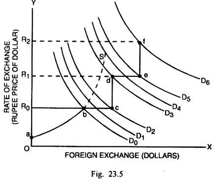

In the ever-evolving landscape of global finance, exchange rates play a pivotal role in determining economic health and international trade dynamics. Among various exchange rate regimes, the adjustable peg exchange rate system stands out due to its unique blend of fixed and flexible characteristics. This system allows a country's currency value to be pegged to a major foreign currency, such as the US dollar or the euro, while permitting occasional adjustments to address economic disparities or market pressures.

Historically, adjustable pegs were integral to agreements like the Bretton Woods System, which established the international monetary framework post-World War II. This system pegged currencies to the US dollar, which was, in turn, convertible to gold. The goal was to provide a stable exchange rate environment conducive to global economic reconstruction and growth. Although the Bretton Woods System collapsed in 1971, the adjustable peg concept persisted, offering countries the advantage of exchange rate stability while retaining the capacity for adjustments.



Understanding adjustable pegs is crucial not only for economic policymakers but also for market participants, especially in the contemporary financial ecosystem where technology-driven practices like algorithmic trading have become prevalent. Algorithmic trading leverages computer algorithms to execute trades based on predefined criteria, significantly impacting currency markets. The intersection of stable, predictable exchange rates provided by adjustable pegs and the efficiency of algorithmic trading creates a compelling dynamic, driving innovation in financial strategies.

This article explores the mechanisms and implications of adjustable peg exchange rates, examining their historical context, how they operate, and their evolving role alongside modern financial technologies such as algorithmic trading. By comprehensively understanding these elements, stakeholders can better navigate and leverage the complexities of today's global financial systems.

## Table of Contents

## Understanding Adjustable Peg Exchange Rates

An adjustable peg is an exchange rate regime that allows a country's currency to be pegged to a major currency, such as the US dollar or the euro, with allowances to readjust its value as necessary. This system is historically significant as it formed the foundation of the Bretton Woods Agreement, established in 1944, which aimed to stabilize global financial relations in the post-World War II economic order. This arrangement provided a middle ground between fixed and floating exchange rate systems, offering countries a mechanism to maintain economic stability while retaining some monetary policy flexibility.

In an adjustable peg system, a government's central bank closely manages the exchange rate by intervening in foreign exchange markets to buy or sell currency, thus influencing the supply and demand dynamics. This intervention helps maintain the pegged rate within a narrow band around the target currency. A key feature of this regime is the ability to alter the pegged rate when necessary, particularly in response to significant economic events, changes in trade balances, or inflation differentials, thus providing a tool for adjusting economic imbalances without resorting to extreme measures.

The adjustable peg system mitigates excessive [volatility](/wiki/volatility-trading-strategies) in foreign exchange markets, which is crucial for ensuring a stable trade environment and enhancing investor confidence. By anchoring their currency to a stable foreign currency, countries can import the low inflation levels of the reserve currency, contributing to domestic economic stability. For exporting countries, a stable exchange rate under an adjustable peg helps protect against abrupt competitive shifts, reinforcing their trade positions.

The pegging process is nuanced and requires vigilant monitoring of both international market conditions and domestic economic indicators. Central banks may deploy a basket of currencies to provide extra stability, adjusting pegs based on a weighted average. This may involve complex calculations and sophisticated financial instruments to achieve the desired economic outcomes, offering both predictability and adaptability in the global market. 

This balance is crucial: while too rigid a peg could hinder a country's ability to respond to economic shocks, too frequent adjustments could undermine credibility and lead to speculative attacks. Therefore, an effective adjustable peg system necessitates a careful assessment of economic metrics and timely policy interventions to maintain optimal balance and competitiveness in the global market.

## Algorithmic Trading in Currency Markets

Algorithmic trading, commonly referred to as algo trading, significantly transforms operations within currency markets through the use of sophisticated computer algorithms. This method allows traders to execute large volumes of transactions at incredibly high speeds and frequencies, often surpassing the capabilities of human intervention. The main advantage lies in its efficiency and precision, enabling rapid decision-making based on predetermined parameters set in the algorithms.

In currency markets, also known as the Forex market, where fluctuations can happen in fractions of a second, the ability to execute trades swiftly is paramount. Algo trading optimizes the timing of transactions and reduces transaction costs, facilitating increased [liquidity](/wiki/liquidity-risk-premium) and reduced market impact per trade. This technological advancement enhances the capacity to exploit [arbitrage](/wiki/arbitrage) opportunities and implement complex trades that align with specific strategies.

Algorithmic trading in currency markets relies on several strategies, including [statistical arbitrage](/wiki/statistical-arbitrage), trend-following strategies, and mean-reversion strategies. Each strategy analyses market conditions and price variations to trigger automated buy or sell orders. For instance, a trend-following algorithm might track historical patterns of currency movements and execute trades positively correlated to the prevailing market trend. 

A simple Python example of a basic moving average crossover strategy, which is a typical algorithmic approach, might involve:

```python
import numpy as np
import pandas as pd

# Load currency data
data = pd.read_csv('currency_data.csv')
short_window = 40
long_window = 100

# Calculate moving averages
data['short_mavg'] = data['Close'].rolling(window=short_window, min_periods=1).mean()
data['long_mavg'] = data['Close'].rolling(window=long_window, min_periods=1).mean()

# Generate signals
data['signal'] = 0.0
data['signal'][short_window:] = np.where(data['short_mavg'][short_window:] > data['long_mavg'][short_window:], 1.0, 0.0)

# Calculate positions
data['positions'] = data['signal'].diff()

# Display signals
print(data[['Date', 'Close', 'short_mavg', 'long_mavg', 'signal', 'positions']].tail())
```

This simple script calculates short-term and long-term moving averages for a currency pair, generating buy signals when the short-term average crosses above the long-term average, and sell signals when it crosses below. Such strategies underscore the decision-making process at the core of [algorithmic trading](/wiki/algorithmic-trading), leveraging statistical data and real-time analytics.

Inherently, algorithmic trading's reliance on historical data and predefined rules means that it can efficiently handle routine tasks in volatile but structured environments. However, it also faces challenges such as adapting to sudden market shifts that are not accounted for within its programmed parameters. Despite these challenges, the precision and speed of algorithmic trading continue to offer distinct advantages, reinforcing its utility in contemporary currency markets.

## The Interplay of Adjustable Pegs and Algo Trading

Algorithmic trading leverages the stability provided by pegged currencies to execute precise transactions in the Foreign Exchange (Forex) markets. In a pegged exchange rate system, a country's currency is tied to another major currency, such as the U.S. dollar or the euro. This stability reduces exchange rate volatility, creating a more predictable environment that benefits algorithmic trading strategies.

Predictability is crucial for algorithmic trading systems, which often depend on stable market conditions to function effectively. These systems are programmed to execute trades based on predetermined criteria, such as price movements, timing, or statistical models. The reduction in volatility offered by pegged currencies minimizes the risk of unforeseen market shifts, allowing algorithms to operate with greater certainty and precision.

For example, consider a simple algorithm designed to buy a currency when its value drops to a certain level and sell when it increases. In a volatile market, sudden and unexpected fluctuations could trigger unintended trades, leading to potential losses. However, in a market with a pegged exchange rate, where such fluctuations are less frequent, the algorithm can execute its strategy more reliably.

This interplay can be illustrated through a Python snippet simulating a basic algorithmic strategy in a stable currency market:

```python
def execute_trade(current_rate, peg_rate):
    if current_rate < peg_rate - 0.01:
        return "Buy"
    elif current_rate > peg_rate + 0.01:
        return "Sell"
    else:
        return "Hold"

# Simulating trades with a pegged currency rate
peg_rate = 1.5  # Example pegged rate
current_rates = [1.49, 1.51, 1.52, 1.48]  # Simulated currency rates

for rate in current_rates:
    action = execute_trade(rate, peg_rate)
    print(f"Current Rate: {rate}, Action: {action}")
```

In this illustration, the algorithm assesses the current exchange rate relative to the pegged rate and decides whether to buy, sell, or hold the currency. The stability of the pegged exchange rate ensures that the algorithm's decisions are based on consistent and reliable data, enhancing trading efficiency and the potential for profit.

While the stability of pegged currencies provides a conducive environment for algorithmic trading, it is not without challenges. Central banks can adjust peg levels, sometimes with little warning, requiring algorithmic systems to adapt quickly. Despite these challenges, the combination of adjustable pegs and algorithmic trading remains a potent strategy in the quest for optimizing trade efficiencies and economic stability in the Forex markets.

## Benefits and Challenges of Combining Adjustable Pegs and Algo Trading

The combination of adjustable peg exchange rates and algorithmic trading presents both opportunities and hurdles within the [forex](/wiki/forex-system) market. Under pegged systems, the reduction in currency volatility provides a fertile ground for algorithmic trading strategies that can exploit stable yet narrow trading ranges to generate profits. This stability allows algorithms to implement strategies such as mean reversion or [pair trading](/wiki/pair-trading), where algorithms capitalize on slight deviations in currency values that are quickly corrected due to the predictability of the peg. For instance, if a currency is pegged to another within a narrow band, algorithms can identify and exploit brief movements towards the edge of this band, executing trades that profit as the currency returns to its central value.

However, this advantageous environment is paired with significant challenges. When central banks decide to adjust the peg level or the band within which the currency can fluctuate, algorithmic systems must recalibrate quickly to maintain their effectiveness. This requires algorithms to have adaptive features that can respond in near real-time to new information, which may include changes in interest rates, geopolitical events, or shifts in economic policy. The necessity for rapid adaptation emphasizes the role of sophisticated computational models and [machine learning](/wiki/machine-learning) in modern trading systems. These models must be capable of reassessing historical data, recalibrating risk parameters, and redeploying trading strategies efficiently.

An important Python snippet that can be used for such adaptations might involve machine learning models retrained in response to the peg adjustments. Below is a simple example of how a retraining process might be initiated based on new input data:

```python
from sklearn.model_selection import train_test_split
from sklearn.ensemble import RandomForestRegressor
import numpy as np

# Assume X_new and y_new are our updated inputs and labels following a peg adjustment
X_new, y_new = np.random.rand(100, 10), np.random.rand(100)

# Splitting the new data for retraining
X_train, X_test, y_train, y_test = train_test_split(X_new, y_new, test_size=0.2, random_state=42)

# Define the model
model = RandomForestRegressor(n_estimators=100, random_state=42)

# Retrain the model with new data
model.fit(X_train, y_train)

# Evaluate the retrained model
print("Model Score:", model.score(X_test, y_test))
```

Ultimately, while adjustable pegs provide algorithmic traders with a structure that they can rely on for predictable entries and exits, the dynamism introduced by potential adjustments requires a robust infrastructure capable of navigating these shifts. Such an environment demands constant innovation and enhancement of algorithmic systems to sustain competitive trading efficiency in the global financial markets.

## Conclusion

Adjustable peg exchange rates play a vital role in international finance by providing a mix of stability and flexibility. This system allows countries to maintain a stable currency value while also retaining the option to realign as economic conditions change. Such adaptability is essential for countries to manage their competitive position in a global market that is often characterized by volatility and uncertainty.

The integration of algorithmic trading with adjustable peg systems offers significant potential for financial innovation. Algorithmic trading, which leverages high-speed computing to execute trades based on predefined strategies, thrives in environments where predictable patterns can be discerned. The stability provided by adjustable pegs creates opportunities for these algorithms to operate effectively, as they can exploit narrow-margin trades with reduced exposure to erratic market fluctuations.

Despite the benefits, challenges exist when central banks decide to adjust the peg levels. These adjustments can lead to sudden shifts in currency valuation, which requires algorithms to be agile and responsive. Investment communities are compelled to continually advance their technological capabilities to handle such transitions smoothly. This involves developing sophisticated algorithms and employing machine learning techniques to anticipate policy changes and adapt trading strategies in real-time.

To maximize the advantages of combining adjustable pegs with algorithmic trading, stakeholders in global finance must focus on innovation and adaptability. By doing so, they can enhance trade efficiencies and contribute to economic stability across markets. As technology progresses, it will be crucial for finance professionals to integrate new tools and strategies, ensuring that they can navigate the intricate dynamics of international currency markets effectively.

## References & Further Reading

[1]: ["The Bretton Woods Transcripts"](https://centerforfinancialstability.org/brettonwoods_docs.php) by Kurt Schuler and Andrew Rosenberg

[2]: ["The Theory and Practice of Exchange Control in Germany"](https://link.springer.com/book/10.1007/978-94-015-5301-8) by Moritz J. Bonn

[3]: Obstfeld, M., & Taylor, A. (2004). ["Global Capital Markets: Integration, Crisis, and Growth"](https://assets.cambridge.org/97805216/33178/frontmatter/9780521633178_frontmatter.pdf). Cambridge University Press.

[4]: ["Advances in Financial Machine Learning"](https://www.amazon.com/Advances-Financial-Machine-Learning-Marcos/dp/1119482089) by Marcos Lopez de Prado

[5]: ["Quantitative Trading: How to Build Your Own Algorithmic Trading Business"](https://www.amazon.com/Quantitative-Trading-Build-Algorithmic-Business/dp/1119800064) by Ernest P. Chan

[6]: ["Machine Learning for Algorithmic Trading: Predictive models to extract signals from market and alternative data for systematic trading strategies with Python"](https://www.amazon.com/Machine-Learning-Algorithmic-Trading-alternative/dp/1839217715) by Stefan Jansen