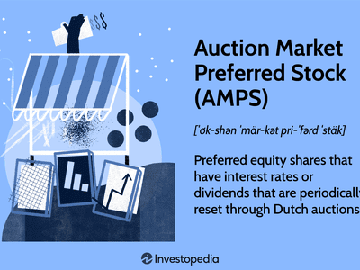

## Table of Contents

## What is Adjustable-Rate Preferred Stock (ARPS)?

Adjustable-Rate Preferred Stock (ARPS) is a type of preferred stock where the dividend rate changes over time. Unlike regular preferred stock, which usually has a fixed dividend rate, ARPS adjusts its dividend based on changes in interest rates or other economic indicators. This means that if interest rates go up, the dividend payments on ARPS might increase, and if interest rates go down, the dividends might decrease.

Investors might choose ARPS because they offer the potential for higher returns compared to fixed-rate preferred stocks, especially in a rising interest rate environment. However, this also comes with more risk, as the dividends can fluctuate. ARPS can be a good option for investors who are willing to take on this extra risk in exchange for the possibility of earning more income over time.

## How does ARPS differ from traditional preferred stock?

ARPS, or Adjustable-Rate Preferred Stock, is different from traditional preferred stock mainly because its dividend rate can change. With traditional preferred stock, the dividend rate stays the same all the time. But with ARPS, the dividend rate goes up or down based on things like interest rates. So, if interest rates go up, the dividends on ARPS might go up too. If interest rates go down, the dividends might go down.

This makes ARPS a bit riskier than traditional preferred stock because the income you get can change. But it can also be more rewarding if interest rates go up. People who invest in ARPS are usually okay with taking a bit more risk because they hope to earn more money over time. On the other hand, people who like a steady income might prefer traditional preferred stock because the dividends don't change.

## What are the key features of ARPS?

Adjustable-Rate Preferred Stock, or ARPS, has a special feature where the dividend rate can change over time. Unlike regular preferred stock, where the dividend stays the same, ARPS adjusts its dividend based on things like interest rates. This means if interest rates go up, the dividends on ARPS might go up too. If interest rates go down, the dividends might go down. This makes ARPS different because the amount of money you get from it can change.

Because the dividend rate can change, ARPS is a bit riskier than regular preferred stock. But it can also be more rewarding if interest rates go up. People who invest in ARPS are usually okay with taking a bit more risk because they hope to earn more money over time. If you like a steady income and don't want the amount to change, you might prefer regular preferred stock. But if you're okay with some ups and downs and want the chance to earn more, ARPS could be a good choice.

## How is the dividend rate determined for ARPS?

The dividend rate for Adjustable-Rate Preferred Stock (ARPS) is decided by looking at changes in interest rates or other economic indicators. If interest rates go up, the dividend rate on ARPS might go up too. If interest rates go down, the dividend rate might go down. This means the amount of money you get from ARPS can change over time, depending on what's happening with interest rates.

The exact way the dividend rate changes is set out in the rules for the ARPS. These rules say how often the rate will be looked at and changed, and what it will be based on. It might be tied to a specific [interest rate](/wiki/interest-rate-trading-strategies), like the prime rate or the federal funds rate. So, if you own ARPS, you need to keep an eye on these rates because they will affect how much money you get from your investment.

## What are the benefits of investing in ARPS?

One benefit of investing in Adjustable-Rate Preferred Stock (ARPS) is that it can offer higher returns compared to regular preferred stock. Since the dividend rate on ARPS changes with interest rates, if interest rates go up, the dividends you get can go up too. This means you might earn more money over time, especially if interest rates keep rising. This can be really good for people who are okay with taking a bit more risk because they want the chance to earn more.

Another benefit is that ARPS can help protect against inflation. When inflation goes up, interest rates often go up too. Because ARPS adjusts its dividends based on interest rates, it can help keep your investment's value from going down as much when prices are rising. This makes ARPS a smart choice if you think inflation might be a problem in the future and you want to keep your money's value strong.

## What are the risks associated with ARPS?

One risk of investing in Adjustable-Rate Preferred Stock (ARPS) is that your dividends can go down if interest rates go down. Unlike regular preferred stock, where the dividend stays the same, ARPS changes with interest rates. So, if interest rates drop, you might get less money from your investment. This can be a problem if you're counting on a steady income, because the amount you get can change and might not be as much as you expected.

Another risk is that ARPS can be harder to sell quickly. Because the dividend rate changes, some investors might not want to buy ARPS when interest rates are low, making it harder for you to sell your shares if you need to. This means you might have to wait longer or sell at a lower price than you hoped for. So, if you need your money back quickly, ARPS might not be the best choice because it can be less liquid than other types of investments.

## How can ARPS be used in a diversified investment portfolio?

Adjustable-Rate Preferred Stock (ARPS) can be a useful part of a diversified investment portfolio because it offers a way to earn more money if interest rates go up. Since the dividend rate on ARPS changes with interest rates, it can be good for investors who want to take a bit more risk for the chance to earn higher returns. By including ARPS in your portfolio, you can balance out investments that have fixed returns, like regular preferred stock or bonds, with something that might grow more if the economy does well.

Another way ARPS can help with diversification is by protecting against inflation. When prices go up, interest rates often go up too, and ARPS adjusts its dividends based on these rates. This means that if inflation starts to rise, the money you get from ARPS can increase, helping to keep the value of your investment strong. So, by adding ARPS to your mix of investments, you can have a strategy that works well in different economic situations, making your overall portfolio more balanced and resilient.

## What are the tax implications of investing in ARPS?

When you invest in Adjustable-Rate Preferred Stock (ARPS), you need to think about taxes. The dividends you get from ARPS are usually taxed as regular income. This means they are taxed at the same rate as your salary or wages, which can be higher than the tax rate for other types of investments like long-term capital gains. So, if you're in a high tax bracket, the dividends from ARPS might take a bigger bite out of your earnings.

Another thing to know is that if you sell your ARPS for more than you paid for it, you might have to pay capital gains tax. If you hold the ARPS for more than a year before selling, you'll pay the long-term capital gains tax rate, which is usually lower than the rate for regular income. But if you sell it within a year, you'll pay the short-term capital gains tax rate, which is the same as your regular income tax rate. So, it's important to think about how long you plan to keep your ARPS and how it will affect your taxes.

## How do market conditions affect the performance of ARPS?

Market conditions can really change how well Adjustable-Rate Preferred Stock (ARPS) does. When interest rates go up, ARPS usually does better because its dividend rate goes up too. This means people who own ARPS get more money. But if interest rates go down, the dividends from ARPS go down too, so people might get less money than they expected. Also, if the economy is doing well and companies are making more money, ARPS might do better because people feel more confident about investing in stocks.

Another thing that can affect ARPS is how much people want to buy it. If a lot of people want to buy ARPS, its price might go up. But if people are worried about the economy or interest rates, they might not want to buy ARPS, and its price could go down. This makes ARPS a bit riskier because its value can change a lot depending on what's happening in the market. So, it's important to keep an eye on interest rates and the overall economy if you're thinking about investing in ARPS.

## What are the typical terms and conditions of ARPS?

Adjustable-Rate Preferred Stock (ARPS) comes with certain terms and conditions that investors need to know. One important thing is how often the dividend rate changes. This could be every few months or once a year, depending on what the company decides. The rate is usually based on something like the prime rate or the federal funds rate. This means if those rates go up or down, the dividend on ARPS will go up or down too. Another thing to look at is the minimum and maximum dividend rates. Some ARPS have a floor and a ceiling, so the dividend can't go too low or too high no matter what happens with interest rates.

Another part of the terms and conditions is how long you have to keep the ARPS before you can sell it. Some ARPS might have rules that say you can't sell it for a certain amount of time, or there might be penalties if you sell too soon. Also, if the company that issued the ARPS runs into money problems, they might be able to stop paying dividends or even change the terms of the ARPS. So, it's good to read all the details carefully to understand what you're getting into and what could happen in different situations.

## How does the reset mechanism work in ARPS?

The reset mechanism in Adjustable-Rate Preferred Stock (ARPS) is how the dividend rate changes over time. It's usually tied to a specific interest rate, like the prime rate or the federal funds rate. When this interest rate changes, the dividend rate on the ARPS changes too. For example, if the prime rate goes up by 1%, the dividend rate on the ARPS might go up by the same amount. This means that if you own ARPS, you need to keep an eye on these interest rates because they will affect how much money you get from your investment.

The reset happens on a set schedule, which could be every few months or once a year, depending on what the company decides. The exact terms are written down in the ARPS's rules, so you know when to expect the dividend rate to change. Sometimes, there might be a minimum and maximum rate set, so even if interest rates go crazy, the dividend won't go too low or too high. This reset mechanism is what makes ARPS different from regular preferred stock, where the dividend stays the same no matter what happens with interest rates.

## What are the historical performance trends of ARPS compared to other investment options?

Historically, Adjustable-Rate Preferred Stock (ARPS) has shown performance that's closely tied to changes in interest rates. When interest rates go up, ARPS usually does well because its dividend rate goes up too. This can make it a good choice for investors who think interest rates will rise. But when interest rates go down, the dividends from ARPS go down as well, which can hurt its performance. Over time, ARPS has had ups and downs, but it can offer higher returns than regular preferred stock or bonds when interest rates are rising.

Compared to other investments like stocks, bonds, and regular preferred stock, ARPS can be a bit riskier because its dividends change with interest rates. Stocks can offer higher returns but come with more risk because their prices can go up and down a lot. Bonds usually offer a fixed return, which can be safer but might not grow as much if interest rates rise. Regular preferred stock gives a steady dividend, which is good for people who want a reliable income. So, ARPS fits in the middle: it's riskier than bonds and regular preferred stock but might not grow as much as stocks when the market is doing well.

## References & Further Reading

[1]: ["The Handbook of Fixed Income Securities, Chapter on Preferred Stock"](https://www.mhprofessional.com/the-handbook-of-fixed-income-securities-ninth-edition-9781260473896-usa-group) by Frank J. Fabozzi

[2]: ["Guide to Preferred Stock"](https://stockanalysis.com/term/preferred-stock/) by Joseph Meyer

[3]: ["Advances in Financial Machine Learning"](https://www.amazon.com/Advances-Financial-Machine-Learning-Marcos/dp/1119482089) by Marcos Lopez de Prado

[4]: ["Quantitative Trading: How to Build Your Own Algorithmic Trading Business"](https://www.amazon.com/Quantitative-Trading-Build-Algorithmic-Business/dp/1119800064) by Ernest P. Chan

[5]: ["Machine Learning for Algorithmic Trading"](https://github.com/stefan-jansen/machine-learning-for-trading) by Stefan Jansen