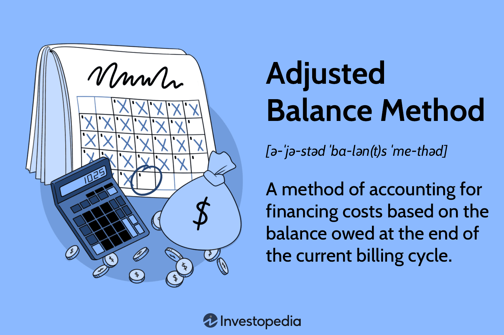

## Table of Contents

## What is the Adjusted Balance Method?

The Adjusted Balance Method is a way banks use to figure out how much interest you owe on your credit card each month. They take your balance at the start of the month, then subtract any payments you made during that month. They don't count any new charges you made. The interest is then calculated on this adjusted balance.

This method is good for people who pay their bills on time because it can save them money on interest. If you pay your bill early in the billing cycle, the bank will subtract that payment before calculating the interest. This means you'll pay less interest than if the bank used a different method that doesn't adjust the balance.

## How does the Adjusted Balance Method differ from other balance calculation methods?

The Adjusted Balance Method is different from other ways banks calculate credit card interest. With the Adjusted Balance Method, the bank takes your balance at the beginning of the month and subtracts any payments you made during that month. They don't add any new charges you made. This means if you pay your bill early, you'll have a lower balance to calculate interest on, which can save you money.

Other methods, like the Average Daily Balance Method, work differently. With the Average Daily Balance Method, the bank adds up your balance every day of the month, then divides by the number of days to get an average. They use this average to calculate interest. This method can lead to more interest if you carry a balance because it includes new charges and doesn't reduce the balance as much with early payments.

Another method is the Previous Balance Method. Here, the bank calculates interest on your balance from the start of the month, without considering any payments or new charges you made during the month. This can result in higher interest charges because it doesn't account for any payments you might have made early in the billing cycle. Each method affects how much interest you pay, so it's important to know which one your bank uses.

## Can you explain the steps involved in calculating an adjusted balance?

To calculate an adjusted balance, start with the balance on your credit card at the beginning of the billing cycle. This is the amount you owed before any new charges or payments were made during the month. Next, look at all the payments you made during the billing cycle. Add up these payments and subtract the total from the beginning balance. This gives you the adjusted balance. The bank then calculates interest on this adjusted balance, not on the original balance or any new charges you made during the month.

For example, if your beginning balance was $1,000 and you made a payment of $300 during the month, your adjusted balance would be $700. The bank would then calculate interest on this $700, not on the $1,000 or any new purchases you made. This method can save you money on interest if you pay your bill early in the billing cycle because the payment reduces the balance used for the interest calculation.

## What are the advantages of using the Adjusted Balance Method for credit card billing?

The Adjusted Balance Method is good for people who pay their credit card bills on time. If you pay your bill early in the month, this method can save you money on interest. That's because the bank subtracts your payment from the beginning balance before calculating interest. So, if you start with a $1,000 balance and pay $300 early, you'll only pay interest on $700, not the full $1,000.

This method is different from others like the Average Daily Balance Method or the Previous Balance Method. Those methods might charge you more interest because they don't reduce the balance as much with early payments. With the Adjusted Balance Method, you have a clear way to lower your interest costs by paying your bill early. This makes it easier to manage your credit card debt and save money over time.

## Are there any disadvantages to using the Adjusted Balance Method?

The Adjusted Balance Method is good for people who pay their credit card bills on time, but it can have some downsides. If you don't pay your bill early in the month, you won't benefit from this method. The interest is calculated on the balance at the start of the month minus any payments you made. If you pay late or not at all, you'll still owe interest on the full starting balance, which can be more than with other methods that might consider new charges or payments differently.

Another disadvantage is that not many banks use the Adjusted Balance Method anymore. Most banks use the Average Daily Balance Method, which can be more accurate for daily transactions and new charges. If your bank doesn't use the Adjusted Balance Method, you won't be able to take advantage of its potential savings. So, it's important to know which method your bank uses to understand how your interest is calculated and how you can manage your payments effectively.

## How does the Adjusted Balance Method affect interest charges on a credit card?

The Adjusted Balance Method changes how much interest you pay on your credit card. It starts with your balance at the beginning of the month and then subtracts any payments you made during that month. This means if you pay your bill early, you'll pay interest on a smaller amount. For example, if you start with a $1,000 balance and pay $300 early, you'll only pay interest on $700. This can save you money because the interest is calculated on a lower balance.

However, if you don't pay your bill early or at all, the Adjusted Balance Method won't help you save on interest. You'll still pay interest on the full starting balance minus any payments. This could be more than with other methods that might consider new charges or payments differently. Also, not many banks use the Adjusted Balance Method anymore, so you might not be able to benefit from it unless your bank still uses it.

## In what scenarios would the Adjusted Balance Method be most beneficial for a consumer?

The Adjusted Balance Method is most helpful for people who pay their credit card bills early in the month. If you start with a $1,000 balance and pay $300 early, you'll only pay interest on $700. This can save you money because the interest is calculated on a smaller amount. So, if you can pay your bill early, this method can lower your interest costs.

However, this method won't help if you don't pay your bill early or at all. You'll still pay interest on the full starting balance minus any payments. This could be more than with other methods that might consider new charges or payments differently. Also, not many banks use the Adjusted Balance Method anymore, so you might not be able to benefit from it unless your bank still uses it.

## How is the Adjusted Balance Method implemented by financial institutions?

Financial institutions that use the Adjusted Balance Method start by looking at the balance on your credit card at the beginning of the billing cycle. They then subtract any payments you made during that month from this starting balance. They don't add any new charges you made during the month. This gives them the adjusted balance, which is the amount they use to calculate the interest you owe. If you pay your bill early, the bank subtracts that payment before calculating the interest, which can save you money.

However, not many banks use the Adjusted Balance Method anymore. Most banks have switched to other methods like the Average Daily Balance Method, which can be more accurate for daily transactions and new charges. If a bank does use the Adjusted Balance Method, it's important for consumers to know this, as it can affect how much interest they pay. Paying the bill early in the billing cycle can really help lower the interest costs with this method.

## What are the regulatory considerations for using the Adjusted Balance Method?

The Adjusted Balance Method is a way banks calculate interest on credit cards. There are rules that banks have to follow when they use this method. These rules come from places like the Federal Reserve and the Consumer Financial Protection Bureau. They make sure that banks are fair and clear about how they charge interest. Banks have to tell customers which method they use, so people know how their interest is calculated.

Not many banks use the Adjusted Balance Method anymore. Most have switched to other methods like the Average Daily Balance Method. But if a bank does use the Adjusted Balance Method, they have to follow the same rules as with other methods. This means they need to be clear about how they calculate interest and make sure it's fair to customers. If a bank doesn't follow these rules, they could get in trouble with regulators.

## How does the Adjusted Balance Method impact credit card APR calculations?

The Adjusted Balance Method changes how banks figure out the interest you owe on your credit card. They start with your balance at the beginning of the month and then subtract any payments you made during that month. This means if you pay your bill early, you'll pay interest on a smaller amount. For example, if you start with a $1,000 balance and pay $300 early, you'll only pay interest on $700. This can save you money because the interest rate, or APR, is applied to a lower balance.

However, if you don't pay your bill early or at all, the Adjusted Balance Method won't help you save on interest. You'll still pay interest on the full starting balance minus any payments. This could be more than with other methods that might consider new charges or payments differently. Also, not many banks use the Adjusted Balance Method anymore, so you might not be able to benefit from it unless your bank still uses it.

## Can you provide a case study or example where the Adjusted Balance Method significantly impacted a consumer's finances?

Imagine Sarah, who has a credit card with a $2,000 balance at the start of the month. Her bank uses the Adjusted Balance Method to calculate interest. Sarah decides to pay $500 early in the billing cycle. Because her bank subtracts this payment from her starting balance, she only pays interest on $1,500 instead of the full $2,000. With an APR of 18%, this means Sarah pays interest on a smaller amount, saving her money. If she had waited until the end of the month to pay, she would have paid interest on the full $2,000.

Over time, these savings can add up. Let's say Sarah continues this habit of paying early for a year. Each month, she pays $500 early on her $2,000 balance. By using the Adjusted Balance Method, Sarah saves on interest every month. At the end of the year, these savings could amount to a significant sum, helping her manage her finances better and reduce the total cost of her credit card debt. This example shows how the Adjusted Balance Method can be very helpful for people who can pay their bills early.

## What future trends or potential changes might affect the use of the Adjusted Balance Method in the financial industry?

In the future, fewer banks might use the Adjusted Balance Method because it's not as common as it used to be. Many banks have switched to the Average Daily Balance Method, which can be more accurate for daily transactions and new charges. If more banks keep moving to this other method, the Adjusted Balance Method might become even less popular. Also, new technology and better ways to track spending could make other methods more appealing to banks.

However, if rules from places like the Federal Reserve or the Consumer Financial Protection Bureau change, it could affect how banks use the Adjusted Balance Method. If these rules start to favor methods that help consumers save money on interest, more banks might start using the Adjusted Balance Method again. It's hard to predict exactly what will happen, but changes in rules and technology could play a big role in whether banks keep using this method or not.

## How does the adjusted balance method work?

The adjusted balance method calculates interest based on the balance remaining at the end of the billing cycle, after any payments or credits have been subtracted from the initial balance. This approach effectively lowers the balance used to calculate interest, which can reduce the total interest charged.

To understand the mechanics, consider a billing cycle where the initial balance is $1,000. During this cycle, a payment of $300 is made. Using the adjusted balance method, the balance on which interest is calculated becomes $700, rather than the original $1,000. This can be expressed mathematically as:

$$
\text{Adjusted Balance} = \text{Initial Balance} - \text{Payments and Credits}
$$

$$
\text{Adjusted Balance} = 1000 - 300 = 700
$$

This method excludes any new purchases made during the billing cycle from the interest calculation until the next cycle. This delay in charging interest on recent purchases provides a financial advantage to consumers who actively pay off portions of their debt. 

The exclusion of new purchases stems from how this method prioritizes the balance existing prior to current expenditures for interest calculations. By focusing only on the reduced initial balance, the consumer benefits from a lower principal amount upon which interest accumulates, given timely payments or credits. 

Overall, the adjusted balance method encourages better financial practices by allowing individuals to more effectively manage their credit card expenses and reduce interest payments over time.

## References & Further Reading

[1]: ["Credit Card Interest Calculation Methods"](https://www.forbes.com/advisor/credit-cards/how-is-your-credit-card-interest-calculated/) by Consumer Financial Protection Bureau.

[2]: López de Prado, M. (2018). ["Advances in Financial Machine Learning"](https://www.amazon.com/Advances-Financial-Machine-Learning-Marcos/dp/1119482089). Wiley.

[3]: Chan, E. P. (2009). ["Quantitative Trading: How to Build Your Own Algorithmic Trading Business"](https://github.com/ftvision/quant_trading_echan_book). Wiley.

[4]: Jansen, S. (2020). ["Machine Learning for Algorithmic Trading: Predictive models to extract signals from market and alternative data for systematic trading strategies with Python"](https://github.com/stefan-jansen/machine-learning-for-trading). Packt Publishing.

[5]: Aronson, D. R. (2006). ["Evidence-Based Technical Analysis: Applying the Scientific Method and Statistical Inference to Trading Signals"](https://www.amazon.com/Evidence-Based-Technical-Analysis-Scientific-Statistical/dp/0470008741). Wiley.