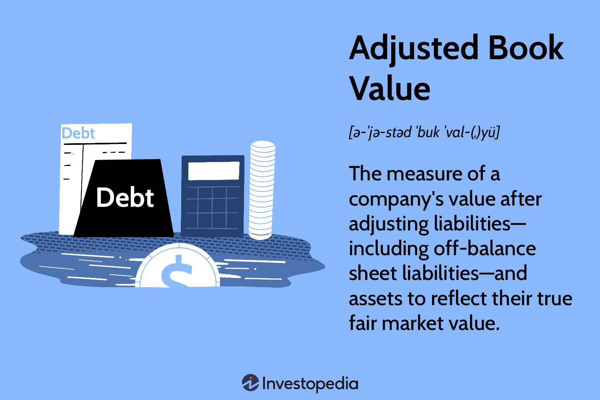

## Table of Contents

## What is the adjusted book value?

The adjusted book value is a way to figure out how much a company is really worth by making changes to its book value. Book value is what you get when you take everything a company owns and subtract what it owes. But sometimes, the numbers on the books don't show the true value of things. So, to find the adjusted book value, you might add or subtract money to make the numbers more accurate. For example, if a company's building is worth more now than when they bought it, you would add that extra value to the book value.

Adjusted book value is useful for investors who want a clearer picture of a company's worth. It helps them see if the company's assets are worth more or less than what's written down. By making these adjustments, investors can make better decisions about whether to buy, sell, or hold onto their investments. It's like getting a second opinion on the value of the company, which can be really helpful when making big financial choices.

## How does adjusted book value differ from book value?

Book value is like a basic report card for a company. It's what you get when you take everything the company owns (its assets) and subtract everything it owes (its liabilities). This number gives you a quick idea of the company's worth based on its financial records. But sometimes, the numbers in these records don't show the real value of things. For example, a building might be worth more now than when the company bought it, but the book value won't show that increase.

That's where adjusted book value comes in. It's like a more detailed report card that tries to fix the problems with the basic one. To find the adjusted book value, you make changes to the book value to make it more accurate. You might add value if something is worth more now, or subtract it if it's worth less. This gives investors a better idea of what the company is really worth, helping them make smarter choices about buying or selling the company's stock.

## Why is adjusted book value important in financial analysis?

Adjusted book value is important in financial analysis because it gives a more accurate picture of a company's worth. The regular book value might not show the true value of a company's assets and liabilities. For example, if a company owns a building that's worth more now than when they bought it, the book value won't show that increase. By adjusting the book value, analysts can see a more realistic value of the company, which helps them make better decisions.

This adjusted number is useful for investors who want to know if a company's stock is a good buy. If the adjusted book value is higher than the book value, it might mean the company is worth more than what's on the books. This can help investors decide if they should buy, sell, or hold onto their shares. By using adjusted book value, investors and analysts can get a clearer view of a company's financial health and make more informed choices.

## What types of adjustments are typically made to calculate the adjusted book value?

When calculating the adjusted book value, people often make changes to the numbers on the company's books to make them more accurate. One common adjustment is for the value of assets. For example, if a company owns a building that's now worth more than what they paid for it, they would add this extra value to the book value. They might also adjust for things like equipment that's worn out or outdated, reducing its value on the books. Another adjustment could be for intangible assets like patents or trademarks, which might be worth more or less than what's shown.

Another type of adjustment is for liabilities. Sometimes, a company might have debts that are not fully reflected in the book value. For instance, if there are hidden costs or future obligations that aren't shown, these would need to be added to get a true picture. Also, if some liabilities are overstated, they might be reduced. These adjustments help to show a more realistic view of what the company owes.

In addition to assets and liabilities, adjustments can be made for other factors like goodwill, which is the extra value a company has from its reputation or customer base. If the goodwill on the books is too high or too low, it needs to be adjusted. All these changes help to give a clearer and more accurate picture of the company's true worth, which is really helpful for investors and analysts trying to make smart decisions.

## Can you explain how to calculate the adjusted book value with an example?

To calculate the adjusted book value, you start with the regular book value, which is what you get when you subtract a company's liabilities from its assets. Then, you make changes to this number to make it more accurate. For example, if a company owns a building that's now worth more than what they paid for it, you would add this extra value to the book value. You might also adjust for things like equipment that's worn out or outdated, reducing its value on the books. And if the company has debts that aren't fully shown on the books, you would add these to get a true picture of what the company owes.

Let's say there's a company called ABC Corp. The regular book value of ABC Corp is $1 million, calculated by taking their assets of $1.5 million and subtracting their liabilities of $0.5 million. But, ABC Corp owns a building that's now worth $200,000 more than what they paid for it. They also have some old equipment that's worth $50,000 less than what's on the books. And they have a hidden debt of $30,000 that isn't shown in the liabilities. To find the adjusted book value, you would add the extra value of the building ($200,000), subtract the reduced value of the equipment ($50,000), and add the hidden debt ($30,000). So, the adjusted book value would be $1 million + $200,000 - $50,000 - $30,000 = $1.12 million. This gives a more accurate picture of what ABC Corp is really worth.

## In what scenarios would a company's adjusted book value be significantly different from its book value?

A company's adjusted book value can be significantly different from its book value in scenarios where the market value of its assets has changed a lot since they were bought. For example, if a company owns land or buildings that are now worth a lot more because the area has become popular, the adjusted book value would be higher. On the other hand, if the company has old equipment that's not worth as much as it used to be, the adjusted book value would be lower. These changes in asset values can make a big difference between the book value and the adjusted book value.

Another scenario is when a company has hidden costs or debts that aren't shown in the regular book value. For instance, if a company has future obligations like environmental cleanup costs or legal settlements that aren't on the books, the adjusted book value would be lower because these liabilities would be added. Also, if a company's goodwill - the extra value from its reputation or customer base - is overstated or understated, adjustments would be made to reflect the true value, which could significantly change the adjusted book value compared to the regular book value.

## How does adjusted book value impact investment decisions?

Adjusted book value is important for people who want to invest in a company. It gives them a better idea of what the company is really worth. If the adjusted book value is a lot higher than the regular book value, it might mean the company's assets are worth more than what's on the books. This could make the company's stock a good buy because it's worth more than what people think. On the other hand, if the adjusted book value is lower, it might mean the company's worth less than what's on the books, which could make investors think twice about buying its stock.

Investors use the adjusted book value to help them decide if they should buy, sell, or keep their shares in a company. By looking at the adjusted book value, they can see if the company's assets and liabilities are accurately reflected. This helps them make smarter choices. For example, if the adjusted book value shows that the company is undervalued, an investor might decide to buy more shares. If it shows the company is overvalued, they might sell their shares to avoid losing money. In this way, adjusted book value plays a big role in making investment decisions.

## What are the limitations of using adjusted book value for valuation purposes?

Using adjusted book value for valuation has some limits. One big problem is that it can be hard to know the right numbers to use for adjustments. For example, figuring out how much a building is worth now or how much a company's reputation is really worth can be tricky. Different people might come up with different numbers, which means the adjusted book value could be different depending on who's doing the math. This can make it hard for investors to trust the adjusted book value as a solid measure of a company's worth.

Another issue is that adjusted book value doesn't tell the whole story about a company. It focuses on what the company owns and owes, but it doesn't show how well the company is doing in other areas, like how much money it's making or how good its future looks. For example, a company might have a high adjusted book value because it owns a lot of valuable stuff, but if it's not making any money, the high book value might not mean much. So, while adjusted book value can be helpful, it's just one piece of the puzzle when trying to figure out if a company is a good investment.

## How do different industries apply adjusted book value differently?

In different industries, the way adjusted book value is used can be different because what's important to one industry might not be as important to another. For example, in the real estate industry, the value of buildings and land can change a lot over time. So, real estate companies often adjust their book value to show the current market value of their properties. This helps investors see if the company's real estate is worth more or less than what's on the books. On the other hand, in the tech industry, companies might focus more on adjusting for things like patents and software, which can be worth a lot more than their original cost. This helps show the true value of the company's intangible assets.

Another example is in the manufacturing industry, where the value of machinery and equipment can change a lot due to wear and tear or new technology. Manufacturers might adjust their book value to show the real value of their equipment, which could be less than what's on the books if it's old or outdated. In contrast, in the finance industry, companies might need to adjust for things like loan portfolios or securities, which can change in value due to market conditions. This helps give a clearer picture of the company's financial health and helps investors make better decisions based on the adjusted values.

## What role does adjusted book value play in mergers and acquisitions?

Adjusted book value is really important when companies are thinking about merging or being bought out. It helps them figure out how much a company is really worth. When two companies are talking about joining together, they need to know if the price they're thinking about is fair. The adjusted book value gives them a better idea of the company's worth by making changes to the regular book value. For example, if a company owns a building that's worth more now than when they bought it, the adjusted book value would show that extra value. This helps the companies agree on a fair price for the merger or acquisition.

In mergers and acquisitions, the adjusted book value can also show if a company is a good buy. If the adjusted book value is a lot higher than the regular book value, it might mean the company's assets are worth more than what's on the books. This could make the company a good target for a buyout because it's worth more than what people think. On the other hand, if the adjusted book value is lower, it might mean the company's worth less than what's on the books. This could make the buyer think twice about going through with the deal. By using adjusted book value, companies can make smarter choices about merging or buying another company.

## How can adjusted book value be used to assess the financial health of a company?

Adjusted book value helps people see how healthy a company's finances are by giving a more accurate picture of what the company is worth. It does this by making changes to the regular book value, which is just the company's assets minus its liabilities. For example, if a company owns a building that's now worth more than when they bought it, the adjusted book value would show that extra value. This helps investors and analysts understand if the company's assets are worth more or less than what's written down, which is important for figuring out if the company is doing well financially.

By looking at the adjusted book value, people can see if a company is in good shape or if it might be struggling. If the adjusted book value is a lot higher than the regular book value, it might mean the company's assets are worth more than people thought, which is a good sign. But if the adjusted book value is lower, it could mean the company's worth less than what's on the books, which might be a warning sign. This information helps investors decide if they should buy, sell, or hold onto their shares in the company, and it helps the company's leaders make better decisions about their business.

## What advanced techniques can be used to refine the calculation of adjusted book value for more accurate valuations?

To make the adjusted book value more accurate, you can use some advanced techniques. One way is to get help from experts who know a lot about valuing different kinds of assets. For example, if a company owns a lot of land or buildings, you might hire a real estate expert to figure out what those properties are really worth now. If the company has patents or other special rights, you might get help from someone who knows about valuing those things. These experts can give you numbers that are more accurate than just guessing or using old values, which makes the adjusted book value more reliable.

Another technique is to use special computer programs and math models to figure out the value of assets and liabilities. These models can look at a lot of information at once, like how the market is doing, how much similar assets are selling for, and how the company's business is going. By using these models, you can make the adjusted book value even more accurate. For example, if a company has a lot of debts that change in value because of interest rates, these models can help figure out what those debts are worth right now. This helps give a clearer picture of the company's financial health and makes it easier for investors to make smart choices.

## What is the understanding of Financial Valuation and Book Value?

Financial valuation is fundamental in assessing a company's true worth. It provides investors with data-driven insights necessary for making informed investment decisions. Central to financial valuation is the concept of book value, which is calculated as the net asset value of a company. This is done by subtracting total liabilities from total assets using data from balance sheets.

$$
\text{Book Value} = \text{Total Assets} - \text{Total Liabilities}
$$

Book value offers insight into the company's financial standing at a given point in time. However, the book value approach has its limitations due to the reliance on historical cost accounting, which might not reflect current market conditions or the actual economic value of assets. To address this, adjusted book value is employed, taking into account fair market values for a more accurate valuation.

Adjusted book value provides a refined assessment by integrating factors such as the present market value of assets and potential liabilities, thus presenting a more realistic picture of the company's worth. Adjustments might include reevaluating real estate, machinery, and intangible assets like patents or trademarks to mirror current market scenarios.

The accurate valuation of both tangible and intangible assets is crucial for a comprehensive understanding of a company's financial health. While tangible assets are relatively straightforward to value, intangible assets require careful consideration given their complexity and impact on a company's competitive advantage. Accurately evaluating these ensures that investors comprehend foundational valuation concepts effectively.

Traditional valuation approaches, such as book and adjusted book values, remain integral in evaluating a company’s financial stability and investment potential. They provide a stable groundwork for comparing companies within an industry and assessing whether a company is undervalued or overvalued relative to its peers. This information is vital for investors looking to optimize their portfolios by identifying promising investment opportunities or avoiding financially unstable ventures. 

In an evolving financial environment, these valuation methodologies continue to offer significant insights into the core financial attributes of companies, guiding investors toward prudent and strategic investment decisions.

## What is the Role of Corporate Finance in Business Valuation?

Corporate finance is a crucial component in the valuation of businesses, fundamentally aligning company strategies with shareholder value creation. At its core, corporate finance encompasses strategic financial planning and resource allocation aimed at maximizing a company's worth to its owners. This involves a range of activities, including optimizing capital structures, fostering sound investment strategies, and ensuring companies are valued accurately for both immediate and long-term prospects.

One of the primary roles of corporate finance in valuation is the optimization of capital structure. This is the mix of debt, equity, and other financial instruments used to fund a company's operations and growth. An optimally designed capital structure minimizes the cost of capital, thus enhancing shareholder value. The cost of capital can be expressed through the Weighted Average Cost of Capital (WACC) formula:

$$
\text{WACC} = \frac{E}{V} \times \text{Re} + \frac{D}{V} \times \text{Rd} \times (1 - \text{Tc})
$$

where $E$ is the market value of equity, $D$ is the market value of debt, $V$ is the total market value of the company’s financing (equity + debt), $\text{Re}$ is the cost of equity, $\text{Rd}$ is the cost of debt, and $\text{Tc}$ is the corporate tax rate.

Capital structure decisions impact a company's risk profile and potential returns, influencing how investors perceive its intrinsic value and growth potential. Sound corporate finance strategies can noticeably alter a company's market valuation by striking a balance between leveraging debt for growth and maintaining financial stability.

Furthermore, the interplay between corporate finance and adjusted book value approaches provides insights into the technical asset value and market outlook of a company. While book value offers a snapshot of a company's net asset value at a specific time, corporate finance strategies manipulate these values through financial maneuvers such as mergers, acquisitions, and asset divestitures that reshape the balance sheet and perceived value.

Practical examples of corporate finance strategies impacting perceived values include restructuring initiatives that streamline operations, reduce costs, or improve productivity. These corporate actions enhance investment attractiveness by potentially boosting forecasted earnings without necessarily altering the company's tangible asset base significantly.

In today's fast-paced financial markets, near-real-time analysis offered by corporate finance tools is indispensable in understanding current market conditions and their impact on valuations. Sophisticated financial models and forecasting tools equip corporations with the ability to rapidly analyze economic indicators, market trends, and competitive dynamics, culminating in informed decision-making that safeguards and boosts company valuations.

Incorporating financial data into these models, analysts can simulate various scenarios that predict how changes in interest rates, taxation, or market sentiments might affect business valuation, allowing companies to hedge risks and seize opportunities promptly. This dynamic integration of corporate finance into valuation frameworks enables a more nuanced and resilient approach to managing and projecting business value in fluctuating markets.

## References & Further Reading

[1]: Fernández, P., Linares, P., & Fernández Acín, I. (2016). ["Company Valuation Methods. The Most Common Errors in Valuations."](https://papers.ssrn.com/sol3/papers.cfm?abstract_id=274973) SSRN Electronic Journal.

[2]: Bodie, Z., Kane, A., & Marcus, A. J. (2014). ["Essentials of Investments"](https://books.google.com/books/about/EBOOK_Investments_Global_edition.html?id=BMsvEAAAQBAJ) (9th ed.). McGraw-Hill Education.

[3]: Damodaran, A. (2012). ["Investment Valuation: Tools and Techniques for Determining the Value of Any Asset."](https://books.google.com/books/about/Investment_Valuation.html?id=5SRHAAAAQBAJ) Wiley Finance.

[4]: Pardo, R. (2008). ["The Evaluation and Optimization of Trading Strategies."](https://onlinelibrary.wiley.com/doi/book/10.1002/9781119196969) John Wiley & Sons.

[5]: Hasbrouck, J. (2007). ["Empirical Market Microstructure: The Institutions, Economics, and Econometrics of Securities Trading."](https://academic.oup.com/book/52241) Oxford University Press.

[6]: Nison, S. (1991). ["Japanese Candlestick Charting Techniques: A Contemporary Guide to the Ancient Investment Techniques of the Far East."](https://www.amazon.com/Japanese-Candlestick-Charting-Techniques-Contemporary/dp/0139316507) Prentice Hall Press.