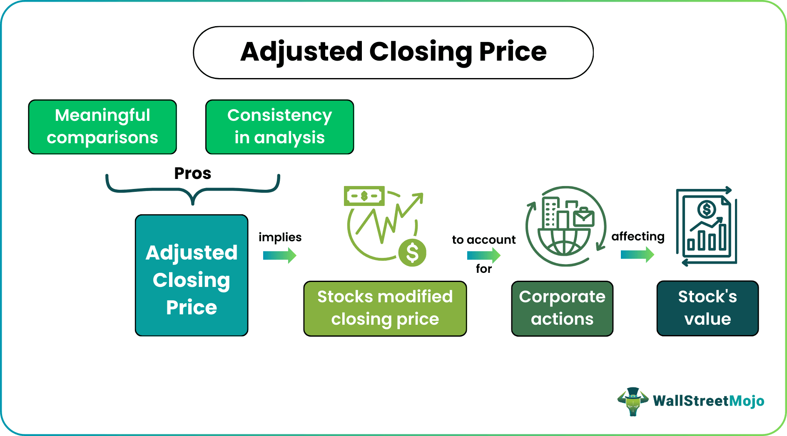

The stock market is a complex landscape where investors and analysts seek to determine the value and future potential of securities. At the heart of this analysis lies the concept of adjusted closing prices, a critical metric that goes beyond the raw price data to provide a more accurate and meaningful depiction of a stock's value over time. Unlike unadjusted closing prices, which reflect the last trading price of a security at the end of a trading day, adjusted closing prices account for corporate actions such as dividends and stock splits that affect a company's stock value.

Dividends, which are profit distributions to shareholders, and stock splits, where a company increases its number of shares while reducing its stock price proportionally, are pivotal in altering the perceived value of a stock. These corporate actions necessitate adjustments in historical prices to reflect the true performance of the stock. Without adjusting for these events, analysts might interpret stock performance inaccurately, leading to flawed financial analyses and investment decisions.



In financial analysis, adjusted closing prices are invaluable for providing a continuous and consistent view of stock performance. They enable the comparison of historical data, devoid of distortions from corporate actions, thus facilitating more robust investment appraisals and strategic decisions. This adjusted data is indispensable for long-term investors who are primarily concerned with the fundamental growth and timeline performance of their investments, requiring an accurate picture of historical trends.

Moreover, the role of adjusted closing prices extends to algorithmic trading, where high-frequency trading systems and complex algorithms execute trades based on refined data inputs. Accurate historical stock data is crucial for developing and executing these trading strategies, as it improves the precision of predictive models and enhances decision-making processes in real-time trading scenarios.

This article explores the profound impact of adjusted closing prices across various facets of stock market analysis and trading strategies. Through a thorough understanding of these adjustments, investors and traders can make more informed and effective decisions, navigating the intricacies of the stock market with greater confidence.

## Table of Contents

## What is Adjusted Closing Price?

The adjusted closing price of a stock is a comprehensive metric that reflects a stock's market value, incorporating adjustments for corporate actions. Unlike the unadjusted closing price, which solely reflects the last price at which a stock trades on any given day, the adjusted closing price accounts for dividends, stock splits, and other corporate events that can significantly impact an equity's value.

### Definition and Explanation

The adjusted closing price modifies the standard closing price to give a more accurate depiction of a stock's value over time. This adjustment is crucial for investors and analysts who aim to conduct precise historical analyses of stock price movements. By accounting for corporate actions, the adjusted closing price provides a more authentic measure of a stock's performance.

### Differentiation from Unadjusted Closing Price

Unadjusted closing prices simply denote the last transacted price on a trading day without considering external factors like corporate actions that may have altered the stock's valuation. For instance, if a company issues dividends or goes through a stock split, the absolute value of an unadjusted closing price may appear misleading in retrospective evaluations. Here lies the fundamental distinction: adjusted closing prices recalibrate the stock's closing value to [factor](/wiki/factor-investing) in these variations, providing a continuity that raw prices can't offer.

### Role of Corporate Actions in Price Adjustments

Corporate actions such as dividends, stock splits, mergers, and acquisitions significantly influence stock prices. Dividends result in the direct payment of a portion of the company’s earnings to shareholders, typically causing a drop in the stock’s price by the dividend amount. Stock splits alter the number of shares outstanding, affecting per-share pricing. In both scenarios, adjusted closing prices are recalculated to ensure historical continuity and comparability. The formula for adjusting a stock price for a stock split is:

$$
\text{Adjusted Price} = \frac{\text{Closing Price}}{\text{Stock Split Ratio}}
$$

For dividends, the adjustment might follow the formulation:

$$
\text{Adjusted Price} = \text{Closing Price} - \text{Dividend Amount}
$$

### Importance for Accurate Historical Analysis

The necessity for adjusted closing prices becomes pronounced when performing historical stock analysis. They serve as a cornerstone for comparing past and present stock prices by neutralizing the effects of corporate actions. Analysts and investors striving for accurate performance metrics and reducing error in time series analysis prioritize these adjusted figures. Without them, comparing performance over time or across different stocks becomes flawed, potentially leading to misinformed investment decisions. 

By utilizing adjusted closing prices, stakeholders can ensure a consistent and accurate evaluation of stock performance, making it an essential tool in financial analysis and trading strategies.

## Understanding Stock Price Adjustments

Stock price adjustments are crucial for accurate financial analysis and trading decisions. They ensure that historical price data represents a continuous and comparable timeline, accounting for corporate actions like stock splits, dividends, and rights offerings that impact a company's stock value and investor perception.

### Stock Splits and Their Impact

A stock split occurs when a company increases the number of its outstanding shares to improve the stock's [liquidity](/wiki/liquidity-risk-premium). While the total market value remains unchanged, the price per share decreases proportionally to the split ratio. For example, in a 2-for-1 stock split, a shareholder with 1 share worth $100 will have 2 shares worth $50 each after the split. This adjustment maintains the investor's total value while facilitating more trading activity due to the lower share price.

Mathematically, the adjustment can be expressed as:

$$

\text{Adjusted Price} = \frac{\text{Unadjusted Price}}{\text{Split Ratio}} 
$$

Stock splits do not alter the dividend yield or market capitalization, but they can affect the stock's perceived affordability, often attracting a broader range of investors.

### Influence of Dividends on Stock Prices

Dividends are cash payments to shareholders, representing a company's earnings distribution. When dividends are declared, the stock price typically decreases on the ex-dividend date by approximately the dividend amount. To illustrate:

$$

\text{Adjusted Closing Price} = \text{Unadjusted Closing Price} - \text{Dividend per Share} 
$$

This adjustment is essential for investors tracking performance over time, as it ensures that the apparent price drop is not mistaken for a market decline but recognized as a dividend distribution.

### Rights Offerings and Their Effects on Prices

Rights offerings allow existing shareholders to purchase additional shares at a discounted price, diluting the share value. These offerings are typically exercised over a short period and impact the stock price as the market adjusts to the increased share [volume](/wiki/volume-trading-strategy). Adjusting historical prices for rights offerings involves factoring in the new shares' effect on the stock's value, maintaining data continuity, and preventing misleading price trends.

The formula for adjusting the price in rights offerings is:

$$

\text{Adjusted Price} = \left(\frac{\text{Old Shares} \times \text{Old Price} + \text{New Shares} \times \text{Subscription Price}}{\text{Total Shares After Offering}}\right) 
$$

### Necessity of Adjustments for Data Accuracy

Adjustments are critical for maintaining accurate and meaningful historical stock data. Without them, evaluating a stock's performance over time would be fraught with inaccuracies that skew analyses and distort true financial performance. Adjusted data helps investors make informed decisions by:

- Providing consistency in time-series analysis.
- Allowing fair comparisons across different time periods.
- Enabling accurate evaluation of investment strategies and portfolio performance.

Ultimately, understanding and implementing stock price adjustments ensures that financial analyses reflect genuine market movements rather than distortions caused by corporate actions.

## Importance in Financial Analysis

Adjusted closing prices are crucial for financial analysis as they offer a more accurate representation of a stock's performance over time. Unlike raw closing prices, adjusted closing prices account for corporate actions such as dividends, stock splits, and rights offerings. Ignoring these adjustments can lead to misleading evaluations and skewed performance assessments.

**Assessing Stock Performance**

Adjusted closing prices are vital for evaluating a stock's performance accurately. For instance, if a stock undergoes a two-for-one split, the share price is halved, but the stockholder now holds twice as many shares. Merely looking at the raw price post-split would falsely suggest the stock's value has decreased. Adjusted prices provide a consistent basis for stock evaluation by accommodating such changes.

**Avoiding Misleading Analyses**

Using raw closing prices can lead to erroneous conclusions. For instance, a high dividend-paying stock might appear to have lost value over time when in fact, the value is being delivered to shareholders through dividends. Adjusted closing prices incorporate dividend payouts, giving a clearer picture of total returns. This ensures investors and analysts do not underestimate a stock's long-term performance.

**Benefits for Long-term Investors and Portfolio Management**

For long-term investors, adjusted closing prices are instrumental in accurately tracking investment performance over time. They allow for a standardized comparison between different stocks and time periods. This data is pivotal for portfolio management, where assessing the historical performance of investments guides decisions on asset allocation and strategy adjustments.

**Integration into Stock Performance Evaluations**

Using adjusted closing prices facilitates a more meaningful analysis of stock returns by enabling comparisons free from distortions caused by corporate actions. This becomes evident, for example, in technical analysis, where price patterns are integral. Adjusted prices ensure that calculated technical indicators, such as moving averages, mirror the genuine market conditions.

**Python Code for Adjusting Closing Prices**

Here is a simplified Python example to calculate the adjusted closing price considering dividends and stock splits:

```python
def calculate_adjusted_price(closing_price, dividends, split_factor):
    adjusted_price = (closing_price - dividends) / split_factor
    return adjusted_price

# Example usage:
closing_price = 100
dividends = 2
split_factor = 2  # 2-for-1 split

adjusted_price = calculate_adjusted_price(closing_price, dividends, split_factor)
print(f"Adjusted Closing Price: {adjusted_price}")
```

This code illustrates the adjustment process by subtracting dividends from the closing price and dividing by the split factor, giving a more accurate portrayal of the stock's value.

By recognizing the significance of adjusted prices, investors can enhance their analysis and make well-informed decisions, benefiting from a comprehensive understanding of stock performance.

## Algorithmic Trading and Adjusted Prices

Adjusted closing prices play a crucial role in enhancing [algorithmic trading](/wiki/algorithmic-trading) strategies by providing more accurate historical data that reflects the true value of securities over time. Adjusted data accounts for corporate actions such as dividends, stock splits, and rights offerings, which can significantly impact raw price data. By incorporating these adjustments, traders and algorithms can make more precise predictions and decisions, reducing the risk of misinterpretation that could be caused by unadjusted data.

### Enhancing Precision in Trading Models

Algorithmic trading models rely heavily on historical price data to forecast future price movements and identify trading opportunities. Unadjusted closing prices can mislead these models, especially when corporate actions occur that alter the perceived value of a stock. For instance, a stock split increases the number of shares outstanding and thus reduces the price per share. Without adjusting for this action, a trading model might falsely interpret the stock price drop as a loss in value, leading to flawed predictions.

Adjusted closing prices compensate for such discrepancies by recalibrating the price data. The calculation typically involves adjusting past prices by a factor that accounts for splits, dividends, and similar events. This adjustment ensures that the price series reflects a continuous and consistent value, rather than external fluctuations irrelevant to the intrinsic value of the stock. For example, if a company issues a 2-for-1 stock split, the adjustment factor applied to previous stock prices would be 0.5, effectively halving all historical prices to maintain comparability.

### Incorporating Adjusted Data into Machine Learning Algorithms

Machine learning algorithms benefit significantly from the use of adjusted closing prices. These algorithms often model complex relationships within historical data to predict future trends and generate trading signals. Adjusted prices help ensure the input data integrity, enabling models to learn and generalize more effectively.

In [machine learning](/wiki/machine-learning), the quality of input data often determines the accuracy and reliability of predictions. Adjustments diminish the noise introduced by corporate actions, allowing algorithms to focus on genuine market dynamics. For instance, a supervised learning model like a Support Vector Machine (SVM) or a recurrent [neural network](/wiki/neural-network) (RNN) can better detect patterns and anomalies in a price series that is free from artificial alterations.

Here's a simple example of using Python to incorporate adjusted prices into a trading model:

```python
import pandas as pd
from sklearn.model_selection import train_test_split
from sklearn.ensemble import RandomForestClassifier

# Load historical stock data
data = pd.read_csv('historical_stock_data.csv')
# Assume 'Adjusted_Close' is the column with adjusted closing prices
features = data[['Adjusted_Close', 'Volume']]  # Example feature set
target = data['Target']  # Target for prediction (e.g., buy/sell signal)

# Split data into training and test sets
X_train, X_test, y_train, y_test = train_test_split(features, target, test_size=0.2, random_state=42)

# Initialize and train a Random Forest model
model = RandomForestClassifier()
model.fit(X_train, y_train)

# Evaluate the model
accuracy = model.score(X_test, y_test)
print(f'Accuracy: {accuracy:.2f}')
```

### Real-Life Examples: Improved Predictions and Trading Decisions

In real-world trading scenarios, firms that leverage adjusted closing prices often achieve superior outcomes compared to those relying on raw data. For instance, high-frequency trading firms and hedge funds employ adjusted data to calibrate their trading algorithms for fine-tuned order execution and risk management.

One notable example can be seen in the use of adjusted prices by quantitative hedge funds. These firms often deploy complex trading algorithms that analyze historical data to detect market inefficiencies. By using adjusted prices, these algorithms can avoid executing trades based on misleading data anomalies, ultimately improving the funds' return profiles. Studies have shown that the incorporation of accurate, adjusted historical price data leads to a reduction in model error rates and enhances overall performance metrics, such as Sharpe ratios.

In conclusion, adjusted closing prices are indispensable in fine-tuning algorithmic trading strategies. They provide a foundation for data integrity, model precision, and enhanced predictive analytics, all of which contribute to more informed trading decisions and better financial performance.

## Calculation of Adjusted Closing Price

The calculation of adjusted closing prices is a crucial task in financial analysis, particularly for those interested in obtaining a clear view of a stock's historical performance. Unadjusted closing prices often fail to capture the effects of corporate actions such as dividends and stock splits, necessitating adjustments to ensure data accuracy. Below, we discuss the algorithmic approach to calculating adjusted closing prices, covering the necessary adjustments for dividends and stock splits, along with an illustrative example. Additionally, we explore tools and methods for maintaining accuracy in historical stock data.

### Algorithmic Approach to Calculate Adjusted Closing Prices

To calculate adjusted closing prices, one must account for any corporate actions that affect stock prices:

1. **Stock Splits:**
   When a stock split occurs, the number of shares increases while the price per share decreases proportionally. The formula to adjust the closing price post-split is:
$$
   \text{Adjusted Closing Price} = \frac{\text{Unadjusted Closing Price}}{\text{Split Ratio}}

$$

   For example, if a 2-for-1 split occurs, the split ratio is 2, and the price must be divided by this ratio.

2. **Dividends:**
   Cash dividends lead to a decrease in the stock's price when distributed. The formula for adjusting the closing price for dividends is:
$$
   \text{Adjusted Closing Price} = \text{Unadjusted Closing Price} - \text{Dividend per Share}

$$

   It’s essential to subtract the dividend from the closing price of all previous dates to represent the price potentially excluding dividend distributions.

3. **Rights Offerings:**
   Rights offerings provide existing shareholders the right to purchase additional shares at a discount. The adjustment factor can be calculated considering the rights price and the number of rights required to purchase a share.

### Illustrative Example of Calculation Process

Consider a stock with an unadjusted closing price of $100, facing a 2-for-1 stock split followed by a dividend payout of $5.

- Adjust for the split:
$$
  \text{Price post-split} = \frac{100}{2} = 50

$$

- Adjust for dividends:
$$
  \text{Adjusted Price post-dividend} = 50 - 5 = 45

$$

Hence, the adjusted closing price considering both corporate actions is $45.

### Tools and Methods for Ensuring Accuracy

To ensure accuracy in historical stock data, various tools and methods can be employed:

- **Software Tools:** Financial software such as Bloomberg Terminal or Reuters Eikon offers built-in functions to view adjusted historical data.
- **Python Libraries:** Libraries like `pandas` and `numpy` can handle time series data, while `yfinance` provides functionalities to download adjusted stock prices directly.
- **Data Sources:** Yahoo Finance, Google Finance, and other stock market databases offer adjusted historical data. Using APIs like Alpha Vantage or Intrinio can also streamline data retrieval.

Below is an illustrative Python code snippet for adjusting closing prices using pandas:

```python
import pandas as pd

# Example DataFrame with unadjusted prices
data = {'Date': ['2023-01-01', '2023-01-02'],
        'Close': [100, 50],
        'Dividends': [0, 5],
        'Stock Splits': [1, 2]}
df = pd.DataFrame(data)

# Calculate adjusted prices
df['Adj Close'] = df['Close'] / df['Stock Splits'] - df['Dividends']

print(df[['Date', 'Adj Close']])
```
This code adjusts the closing prices for stock splits and dividends. The calculated adjusted close gives a clearer representation of how the stock's value changed over time, crucial for informed investment decisions.

## Practical Implications for Investors

Accurate price calculations are critical for developing effective investment strategies. Using adjusted closing prices, investors can gain a realistic understanding of a stock's value over time, factoring in corporate actions that can alter raw price data. This precision is essential for making informed decisions and optimizing investment portfolios.

The integration of adjusted prices into portfolio management helps investors assess past performance accurately, considering events like stock splits and dividends. For example, when a stock splits, its share price may drop while the investor's total value remains unchanged. Adjusted prices correct for this illusion, enabling investors to track the actual economic benefits of the investment.

Moreover, accurate price evaluations improve decision-making by providing a clear picture of historic price trends. By adjusting for corporate actions, historical data reflect true performance, which is crucial for back-testing strategies. When investors use raw prices, they risk analyzing distorted data, which could lead to incorrect conclusions about a stock's performance. Adjusted prices allow investors to compute metrics like the compound annual growth rate (CAGR) with greater accuracy, which influences asset allocation decisions.

For example, an investor using the Capital Asset Pricing Model (CAPM) needs accurate historical returns to calculate expected returns: 

$$
\text{Expected Return} = R_f + \beta \times (R_m - R_f)
$$

where $R_f$ is the risk-free rate, $\beta$ is the stock's beta, and $R_m$ is the expected market return. Using adjusted closing prices ensures that the beta calculation, which measures volatility relative to the market, is based on accurate data.

Investors can also derive successful trading strategies by relying on adjusted data. Algorithmic trading models, which require precise historical data for effectiveness, benefit from such accuracy. For instance, a moving average crossover strategy may yield false signals if based on unadjusted prices, whereas adjusted data provide a coherent view of the stock's past performance, enabling more reliable predictions. 

By implementing adjusted prices into investment strategies, investors can enhance the performance of their portfolios and align them with long-term financial goals, demonstrating the tangible benefits of using accurate historical stock data.

## Criticism and Limitations

Adjusted closing prices, though indispensable for accurate financial analysis, come with their own set of challenges and limitations. Understanding and using adjusted closing prices can be complicated due to several factors, impacting both novice and experienced traders.

### Challenges in Understanding and Using Adjusted Closing Prices

One significant challenge lies in comprehending the purpose and calculation of adjusted closing prices. Investors, especially those new to the stock market, may struggle with why adjustments are made and how they affect historical price analysis. The adjustments account for corporate actions like stock splits, dividends, and rights offerings, which can alter the perceived value of a stock without inherently changing its market value.

### Potential Shortcomings for Short-Term Traders

Short-term traders, who often focus on price movements over brief periods, might find adjusted closing prices less relevant. Their primary interest usually lies in the immediate price actions, which are not affected by historical corporate actions. As a result, they may overemphasize day-to-day price fluctuations and overlook the broader implications of adjusted prices. This focus can lead to reactive trading decisions based on unadjusted price data, without considering the adjusted closing price's insights, potentially leading to misleading conclusions.

### Complexities in Calculation and Interpretation

The complexity of calculating adjusted closing prices is another barrier. The formula for calculating an adjusted closing price typically involves a series of multiplicative and divisive adjustments corresponding to each corporate action:

$$

\text{Adjusted Closing Price} = \frac{\text{Closing Price} \times \text{Factor}}{\text{Cumulative Adjustment Factor}} 
$$

Here, the cumulative adjustment factor accounts for stock splits and dividends. Calculating this factor correctly requires meticulous tracking and updating of each corporate event affecting the stock, which can be cumbersome and error-prone without automated tools. Furthermore, understanding these calculations requires a grasp of both the financial concepts underlying corporate actions and the mathematical adjustments made.

### Addressing Challenges and Maximizing Benefits

To overcome these challenges, investors can utilize financial software and tools that automatically update and compute adjusted closing prices. Platforms like Yahoo Finance, Bloomberg, and various stock analysis software offer comprehensive solutions for tracking historical data and providing adjusted price series. Additionally, educational resources and tutorials can enhance understanding by explaining the significance and mechanics of these adjustments.

For traders and analysts, integrating adjusted closing prices into their strategies involves balancing the raw price data's immediacy with the historical context provided by adjusted prices. By prioritizing data accuracy and historical comparability, investors can make more informed decisions and potentially develop trading strategies that leverage the nuanced insights offered by adjusted pricing.

Incorporating adjusted closing prices thoughtfully into analyses can increase the robustness of investment strategies, accommodating both long-term growth evaluations and short-term trading adaptability. As such, while challenges exist, the benefits of understanding and using adjusted closing prices far outweigh the complexities when approached strategically.

## Conclusion

Adjusted closing prices serve as a cornerstone in stock analysis, providing a refined lens through which investors and analysts can evaluate historical stock performance. By accounting for corporate actions such as dividends, stock splits, and rights offerings, adjusted closing prices offer a more accurate reflection of a stock's value over time. This is crucial for maintaining consistency and reliability in financial data, which forms the backbone of any well-informed investment decision.

Incorporating adjusted prices into trading strategies is not merely a best practice but a necessity for avoiding misleading analyses and ensuring precise evaluations of stock movements. By utilizing this metric, traders can better gauge the true performance of a stock, unaffected by alterations in the capital structure. This, in turn, enhances the robustness of algorithmic trading models, elevating their predictive accuracy and optimizing trading decisions.

Leveraging historical data through the use of adjusted closing prices empowers investors to make informed decisions. It allows for the correction of past data inaccuracies, enabling a clearer comparison across different time periods. This can significantly impact long-term investors and portfolio managers who rely on historical trends to inform their strategies. With adjusted prices, they gain a comprehensive understanding of stock performance, assisting them in identifying patterns and making strategic decisions grounded in reality.

In conclusion, the integration of adjusted closing prices within stock analysis is not just advantageous but essential. It ensures that the interpretation of historical data is not skewed by extraneous corporate activities, ultimately supporting more informed and strategic investment decisions. By embracing adjusted prices, traders and investors can safeguard the accuracy of their analyses and empower their trading strategies with data that truly reflects market realities.

## FAQs

### FAQs

**What is the adjusted closing price, and how is it calculated?**

The adjusted closing price reflects a stock's closing price after taking into account all applicable corporate actions, such as dividends, stock splits, and rights offerings. This adjustment ensures that the stock's historical price data is accurate, enabling investors to make reliable comparisons over time. The formula to adjust the closing price is:

$$
\text{Adjusted Closing Price} = \text{Closing Price} \times \frac{\text{Adjustment Factor}}{\text{Accumulated Adjustment Factor}}
$$

The adjustment factor considers the impact of dividends, stock splits, and similar actions, while the accumulated adjustment factor accounts for the cumulative changes up to the date in question.

**How do stock splits impact the adjusted closing price?**

Stock splits increase the number of shares outstanding while reducing the share price proportionately, leaving the market capitalization unchanged. For example, in a 2-for-1 stock split, each existing share splits into two, and the price per share is halved. The adjusted closing price is recalculated to reflect this change, ensuring continuity in historical data analysis:

$$
\text{New Adjusted Price} = \frac{\text{Old Price}}{\text{Split Factor}}
$$

**What tools are available for calculating adjusted closing prices?**

Several software tools and libraries are available for calculating adjusted closing prices. In Python, libraries like `pandas` and `yfinance` provide functionality to retrieve and analyze stock data. Here's an example of using Python with `yfinance` to get adjusted closing prices:

```python
import yfinance as yf  # For more datasets, visit: https://paperswithbacktest.com/datasets

# Download historical data for a specific stock
data = yf.download("AAPL", start="2020-01-01", end="2023-01-01")

# View the adjusted closing prices
adjusted_prices = data['Adj Close']
print(adjusted_prices)
```

Additionally, financial data providers such as Bloomberg and Reuters offer comprehensive platforms for accessing adjusted prices directly.

**Are there any online resources for learning more about adjusted closing prices and their applications?**

Yes, several educational resources provide detailed insights on adjusted closing prices and their applications in financial analysis:

1. **Investopedia (www.investopedia.com)**: Offers tutorials and articles explaining the fundamentals of stock price adjustments.
2. **Coursera or edX**: Provide online courses on financial analysis where adjusted prices are discussed.
3. **Textbooks**: Books like "Investments" by Bodie, Kane, and Marcus cover the theoretical underpinnings and practical applications of adjusted prices.
4. **Financial Websites**: The websites of financial news outlets often have sections dedicated to educational content and analysis tools.

These resources can help deepen your understanding of how adjusted closing prices function and their significance in stock market analysis.

## References & Further Reading

[1]: ["The Intelligent Investor"](https://en.wikipedia.org/wiki/The_Intelligent_Investor) by Benjamin Graham

[2]: ["Investments"](https://www.financestrategists.com/wealth-management/investments/) by Zvi Bodie, Alex Kane, and Alan Marcus

[3]: ["Algorithmic Trading: Winning Strategies and Their Rationale"](https://www.amazon.com/Algorithmic-Trading-Winning-Strategies-Rationale-ebook/dp/B00CY5HC0U) by Ernest P. Chan

[4]: ["A Non-Random Walk Down Wall Street"](https://www.amazon.com/Non-Random-Walk-Down-Wall-Street/dp/0691092567) by Andrew W. Lo and A. Craig MacKinlay

[5]: ["Market Volatility"](https://www.investopedia.com/terms/v/volatility.asp) by Robert J. Shiller

[6]: ["Financial Markets and Corporate Strategy"](https://books.google.com/books/about/Financial_Markets_and_Corporate_Strategy.html?id=Syu7zwEACAAJ) by Mark Grinblatt and Sheridan Titman