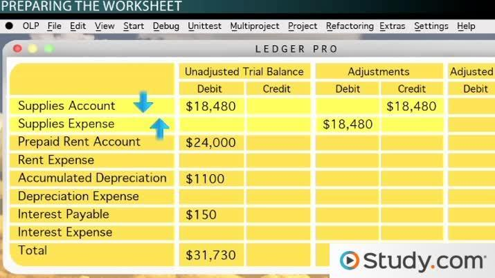

## Table of Contents

## What is an adjusted debit balance?

An adjusted debit balance is a term used in accounting and finance that refers to the amount of money a customer owes to a brokerage firm after certain adjustments have been made. These adjustments typically include subtracting any cash or securities the customer has deposited into their account and adding any interest or fees that have accumulated.

In a margin account, where a customer borrows money from the brokerage to buy securities, the adjusted debit balance shows how much the customer still needs to pay back. This balance is important because it helps both the customer and the brokerage firm keep track of the loan and ensure that the account remains in good standing.

## How does an adjusted debit balance differ from a regular debit balance?

A regular debit balance is just the amount of money you owe on your account. It's like when you use your credit card and see how much you need to pay back. It's a simple number that shows your debt without any changes.

An adjusted debit balance, on the other hand, takes that regular debit balance and makes some changes to it. If you have money or stocks in your account, that amount gets subtracted from what you owe. Also, if there are any fees or interest added to your account, those get added to your debt. So, the adjusted debit balance gives a more accurate picture of what you really owe after considering all these factors.

## Why is it important to understand adjusted debit balances in accounting?

Understanding adjusted debit balances is important in accounting because it helps you see the true amount of money you owe after considering all the changes to your account. When you have a margin account with a brokerage, you might borrow money to buy stocks. The adjusted debit balance shows how much you still need to pay back after subtracting any money or stocks you've added to your account and adding any fees or interest.

This understanding is crucial for keeping your account in good shape. If you know your adjusted debit balance, you can make sure you're not borrowing too much and that you can pay back what you owe. It also helps the brokerage firm keep track of your account and make sure everything is going smoothly. So, knowing your adjusted debit balance helps both you and the brokerage stay on top of things.

## Can you provide an example of how an adjusted debit balance is calculated?

Let's say you have a margin account with a brokerage firm, and you've borrowed $10,000 to buy some stocks. At the start, your regular debit balance is $10,000 because that's how much you owe. But then, you decide to add $2,000 of your own money into the account. This money reduces what you owe, so your adjusted debit balance needs to reflect that.

To calculate your adjusted debit balance, you start with the regular debit balance of $10,000. Then, you subtract the $2,000 you added to the account. So, your adjusted debit balance becomes $8,000. But, let's say there's also $100 in interest that has been added to your account. You would add this $100 to your adjusted debit balance, making it $8,100. This final number, $8,100, is your adjusted debit balance, showing the true amount you owe after all the adjustments.

## What types of accounts typically have adjusted debit balances?

Adjusted debit balances are most commonly found in margin accounts at brokerage firms. A margin account lets you borrow money from the brokerage to buy stocks or other investments. When you use this borrowed money, you owe the brokerage the amount you borrowed, which is called your debit balance. But if you add your own money or stocks to the account, or if there are fees and interest, the brokerage adjusts this balance to show what you really owe after all these changes.

Understanding adjusted debit balances is important for anyone with a margin account. It helps you keep track of how much you really owe, making sure you don't borrow too much and can pay it back. It also helps the brokerage firm manage your account and make sure everything is running smoothly. So, if you have a margin account, knowing your adjusted debit balance is key to managing your investments wisely.

## How does an adjusted debit balance affect financial statements?

An adjusted debit balance can affect financial statements because it shows the real amount of money a person owes to a brokerage firm after making some changes. This balance is important for the balance sheet, which is a report that shows what a person or business owns and owes. If someone has a margin account and owes money, the adjusted debit balance will be shown as a liability on the balance sheet. This helps everyone see the true financial situation, making sure the numbers are correct and clear.

When the adjusted debit balance changes, it can also affect the income statement. The income statement shows how much money is made or lost over a period of time. If there are interest charges or fees added to the adjusted debit balance, these will show up as expenses on the income statement. This means the adjusted debit balance can make the total expenses higher, which could lower the net income. So, keeping track of the adjusted debit balance is important for understanding the full picture of someone's financial health.

## What are the common adjustments that lead to an adjusted debit balance?

The most common adjustments that lead to an adjusted debit balance are when you add money or stocks to your account and when fees or interest are added. If you have a margin account and you borrow money from the brokerage to buy stocks, the amount you owe is your regular debit balance. But if you then add your own money or stocks to the account, this reduces what you owe. So, the brokerage subtracts this amount from your regular debit balance to find the adjusted debit balance.

Another common adjustment is when fees or interest are added to your account. When you borrow money, the brokerage might charge you interest on the loan. They might also add fees for using their services. These charges increase the amount you owe, so the brokerage adds them to your regular debit balance to find the adjusted debit balance. By making these adjustments, the adjusted debit balance shows the true amount you owe after considering all the changes to your account.

## How do businesses use adjusted debit balances in their financial planning?

Businesses use adjusted debit balances in their financial planning to keep track of how much money they owe to their brokerages after making some changes to their accounts. When a business has a margin account and borrows money to buy stocks or other investments, the adjusted debit balance shows the real amount they need to pay back. This helps them plan their finances better because they know exactly how much they owe after adding any money or stocks to their account and after accounting for any fees or interest.

By understanding the adjusted debit balance, businesses can make sure they don't borrow too much money and can pay back what they owe. This is important for keeping their financial health in good shape. If they know their adjusted debit balance, they can also make smart decisions about future investments and manage their cash flow better. So, using adjusted debit balances helps businesses plan their finances wisely and keep their accounts in good standing.

## What are the implications of an adjusted debit balance on tax reporting?

An adjusted debit balance can affect how a business reports its taxes. If a business has a margin account and borrows money from a brokerage, the adjusted debit balance shows how much they really owe after adding their own money or stocks to the account and after accounting for fees or interest. This balance can be important for tax reporting because it helps show the true financial situation of the business, including any interest expenses they might have.

When a business pays interest on a margin loan, this interest can sometimes be deducted on their tax return as a business expense. The adjusted debit balance helps them figure out how much interest they've paid, which they can then report on their taxes. This can lower their taxable income, meaning they might pay less in taxes. So, understanding the adjusted debit balance is important for businesses to make sure they're reporting their taxes correctly and taking advantage of any possible deductions.

## How can errors in calculating adjusted debit balances be identified and corrected?

To find and fix mistakes in calculating adjusted debit balances, you need to double-check all the numbers and changes made to the account. Start by looking at the regular debit balance, which is the amount you owe before any changes. Then, check the money or stocks you've added to the account. Make sure these amounts are correct and that they've been subtracted from the regular debit balance properly. Also, look at any fees or interest added to your account. Make sure these are the right amounts and that they've been added correctly to find the adjusted debit balance.

If you find a mistake, you need to fix it right away. For example, if you added too much money to your account, the adjusted debit balance will be too low. You can fix this by adding the correct amount of money you added and recalculating the balance. Or, if the interest or fees were added wrong, you can fix it by using the right numbers and recalculating the adjusted debit balance. It's important to keep good records and check your work often to catch and correct any errors quickly. This way, you'll have the right adjusted debit balance, which helps you and your brokerage firm keep track of what you really owe.

## What advanced accounting software features support the management of adjusted debit balances?

Advanced accounting software often has special features that help manage adjusted debit balances. These features can automatically keep track of the money you borrow from a brokerage, the money or stocks you add to your account, and any fees or interest that get added. This means the software can calculate the adjusted debit balance for you, making sure it's always correct. It also helps you see how much you really owe after all the changes, so you can manage your account better.

Some software even lets you set up alerts to remind you if your adjusted debit balance gets too high or if there are any big changes. This can help you stay on top of your finances and avoid borrowing too much money. By using these advanced features, you can make sure your adjusted debit balance is always right, which is important for keeping your financial health in good shape.

## How do international accounting standards impact the treatment of adjusted debit balances?

International accounting standards, like the ones set by the International Accounting Standards Board (IASB), can affect how businesses report their adjusted debit balances. These standards aim to make financial reporting clear and consistent around the world. When a business has a margin account and borrows money from a brokerage, the adjusted debit balance shows how much they owe after adding their own money or stocks and accounting for fees or interest. International standards might require businesses to report this balance in a certain way on their financial statements to make sure everyone understands it the same way.

For example, under International Financial Reporting Standards (IFRS), businesses might need to show their adjusted debit balances as liabilities on their balance sheets. This helps everyone see the true financial situation of the business. Also, any interest paid on the borrowed money could be treated as an expense on the income statement, which can affect how much tax the business pays. By following these international standards, businesses can make sure their financial reporting is accurate and clear, helping them manage their adjusted debit balances properly and stay in good standing with their brokerages.

## What is an Adjusted Debit Balance?

An adjusted debit balance is a fundamental term in financial accounting with particular relevance to margin accounts. In simple terms, it indicates the net amount owed by an investor to a brokerage firm, with adjustments made for various financial activities. This balance is pivotal in determining the equity and indebtedness of an investor in their margin account.

In a margin account, investors can borrow money from the brokerage firm to purchase securities, which introduces the concept of debt in investment. The initial amount borrowed represents a debit balance. However, to arrive at the adjusted debit balance, certain elements such as profits from short sales, market value of securities, interest charges, and dividends paid need to be factored into the equation. 

For example, when an investor sells a stock short, the proceeds from that sale are credited to the investor's account. These gains need to be accounted for when calculating the adjusted debit balance. If we denote the original debit balance as $D$, the short sale profits as $P$, the interest charges as $I$, and dividends paid as $Div$, the formula for the adjusted debit balance $ADB$ could be expressed as:

$$
ADB = D - P + I + Div
$$

This calculation is important as it provides a more accurate representation of the investor's financial standing with their broker, considering active account changes.

Distinct from debit balances is the concept of credit balances. A credit balance occurs when the cash credited to an account exceeds the debited transactions. It generally implies that the broker owes money to the client, unlike a debit balance where the investor owes funds to the broker.

Understanding the distinction between these terms is crucial for investors who utilize margin accounts, as they directly impact the maintenance of required equity levels and avoidance of margin calls. Monitoring adjusted debit balances regularly informs strategic decisions, ensuring investors meet their financial obligations and effectively manage their accounts.

## References & Further Reading

[1]: ["Margin: The Basics"](https://powerpersquarefoot.com/margin-markup/) by FINRA

[2]: ["Regulation T, Margin, and Short Selling"](https://fastercapital.com/content/Regulation-T--Regulation-T--Understanding-Its-Impact-on-Margin-Buying.html) by the Federal Reserve Board

[3]: ["Algorithmic Trading"](https://en.wikipedia.org/wiki/Algorithmic_trading) by Investopedia

[4]: Hull, J. C. (2014). ["Options, Futures, and Other Derivatives"](https://www.amazon.com/Options-Futures-Other-Derivatives-9th/dp/0133456315). Pearson Education.

[5]: ["The A-Z of Lehman"](https://thelehmantrilogy.com/) by FT Alphaville

[6]: ["Interactive Brokers Margin Requirements"](https://www.interactivebrokers.com/en/trading/margin-requirements.php) by Interactive Brokers

[7]: Chan, E. (2008). ["Quantitative Trading: How to Build Your Own Algorithmic Trading Business"](https://github.com/ftvision/quant_trading_echan_book). Wiley Trading.