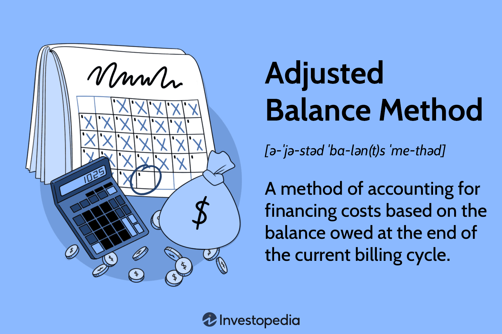

In today's financial landscape, understanding complex financial concepts is essential for both traditional investors and those engaged in algorithmic trading. The dynamically evolving nature of the financial markets requires individuals to grasp the intricacies of accounting and finance, particularly when managing investments in margin accounts. This article focuses on the concept of the adjusted debit balance, a pivotal term in financial accounting with significant implications for managing finances within margin accounts and for crafting effective algorithmic trading strategies.

An adjusted debit balance represents the amount owed by an investor to a brokerage firm, tailored for various accounting factors such as profits or deficits from short sales. In essence, it provides a clearer picture of an investor's actual financial obligations. Understanding this concept is critical for investors who utilize borrowed funds to purchase securities, as these transactions typically occur within margin accounts. Such accounts offer the user leverage, or the ability to increase exposure to financial markets without directly holding the total capital required for an asset purchase. However, the complexity in managing these accounts, alongside adhering to regulations like Regulation T and maintenance margins, underscores the necessity of comprehending adjusted debit balances.



In algorithmic trading, where transactions are executed at high velocities, the precision of financial management is paramount. Here, knowing one's adjusted debit balance is indispensable for identifying and mitigating risks associated with leveraging borrowed funds. Both algorithmic and traditional investors stand to benefit significantly from understanding how adjusted debit balances interplay with broader financial strategies and markets, hence equipping them with the tools needed for effective risk management and capital optimization. This article aims to disentangle these complex relationships, ultimately enhancing the reader's capacity to navigate the sophisticated terrain of contemporary financial markets.

## Table of Contents

## What is an Adjusted Debit Balance?

An adjusted debit balance is a fundamental term in financial accounting with particular relevance to margin accounts. In simple terms, it indicates the net amount owed by an investor to a brokerage firm, with adjustments made for various financial activities. This balance is pivotal in determining the equity and indebtedness of an investor in their margin account.

In a margin account, investors can borrow money from the brokerage firm to purchase securities, which introduces the concept of debt in investment. The initial amount borrowed represents a debit balance. However, to arrive at the adjusted debit balance, certain elements such as profits from short sales, market value of securities, interest charges, and dividends paid need to be factored into the equation. 

For example, when an investor sells a stock short, the proceeds from that sale are credited to the investor's account. These gains need to be accounted for when calculating the adjusted debit balance. If we denote the original debit balance as $D$, the short sale profits as $P$, the interest charges as $I$, and dividends paid as $Div$, the formula for the adjusted debit balance $ADB$ could be expressed as:

$$
ADB = D - P + I + Div
$$

This calculation is important as it provides a more accurate representation of the investor's financial standing with their broker, considering active account changes.

Distinct from debit balances is the concept of credit balances. A credit balance occurs when the cash credited to an account exceeds the debited transactions. It generally implies that the broker owes money to the client, unlike a debit balance where the investor owes funds to the broker.

Understanding the distinction between these terms is crucial for investors who utilize margin accounts, as they directly impact the maintenance of required equity levels and avoidance of margin calls. Monitoring adjusted debit balances regularly informs strategic decisions, ensuring investors meet their financial obligations and effectively manage their accounts.

## The Role of Adjusted Debit Balance in Margin Accounts

Margin accounts are a type of brokerage account that allows investors to borrow funds from the brokerage firm to purchase securities. This borrowing capability introduces the concept of leverage, which can amplify both gains and losses. Within these accounts, the adjusted debit balance refers to the net amount owed by the investor to the broker, adjusted for various factors such as profits on short sales or accrued interest.

Understanding how margin accounts work is essential for investors using leverage. When an investor buys securities on margin, they typically pay a portion of the purchase price and borrow the rest from their broker. The securities purchased act as collateral for the loan. The adjusted debit balance in such accounts is calculated by subtracting any credits and adding any debits that arise from the transactions and portfolio activities, altering the investor's financial obligation.

Borrowing on margin incurs interest costs, which are added to the debit balance, increasing the amount owed. Furthermore, securities in a margin account can lose value, potentially decreasing the equity of the investor's account. In response to these dynamics, investors must carefully manage their adjusted debit balance to avoid issues like margin calls, where a broker demands the investor increase equity in their account by adding cash or selling securities.

Regulation T, established by the Federal Reserve Board, plays a significant role in governing margin accounts in the United States by setting initial margin requirements—currently 50% for most securities. This regulation dictates the proportion of the purchase price that investors must deposit and influences the calculation of the adjusted debit balance by establishing how much can be borrowed initially. Subsequently, maintenance margin requirements set by individual brokers determine the minimum equity investors must maintain in their margin accounts. For instance, a common maintenance margin is 25%, meaning that if an investor's equity falls below this threshold, a margin call could be triggered.

Both Regulation T and maintenance margin requirements have direct effects on the adjusted debit balance. For example, if an account's equity drops below the maintenance margin requirement, additional funds must be deposited, or a portion of the securities must be sold to reduce the debit balance. Moreover, brokers may impose stricter requirements based on their risk assessment of the securities or the investor's profile, further impacting the management of the adjusted debit balance.

Effective management of an adjusted debit balance is crucial for margin account holders. By understanding these regulatory and financial elements, investors are better equipped to leverage their borrowing capacity responsibly, optimizing their portfolios without overextending their financial obligations. Properly managing an adjusted debit balance can help investors navigate the risks of trading on margin, balancing their pursuit of higher returns with potential liabilities.

## Algorithmic Trading and Financial Terms

Algorithmic trading, often referred to as algo trading, leverages sophisticated computer algorithms to execute trading strategies at speeds and frequencies unmanageable by humans alone. In this context, mastering financial concepts such as the adjusted debit balance is crucial due to its direct impact on trading margins and leverage.

The adjusted debit balance in a trading account signifies the total amount owed by the trader to the brokerage, adjusted for profits and losses from short sales and other financial transactions. For algorithmic traders, particularly those employing margin accounts, this balance plays a pivotal role in determining available leverage and risk exposure.

High-frequency trading systems must constantly monitor the adjusted debit balance to ensure compliance with pre-set risk parameters and regulatory requirements. For example, traders need to be aware of regulations like the U.S. Securities and Exchange Commission's Rule 15c3-3, which mandates specific computations and holds implications for how balances are maintained and reported.

A significant aspect of managing debit balances in [algorithmic trading](/wiki/algorithmic-trading) involves setting automated triggers for margin calls and portfolio rebalancing. Margin calls occur when the equity in a margin account falls below the maintenance margin requirement, prompting traders or algorithms to either deposit additional funds or liquidate positions. This automated response is critical in minimizing potential losses and maintaining a stable trading environment.

Consider a simple example of how algorithmic traders can manage debit balances using Python:

```python
# Basic Python example of monitoring adjusted debit balance

def assess_margin_account(equity, adjusted_debit_balance, maintenance_margin=0.25):
    # Calculate current margin level
    margin_level = equity / adjusted_debit_balance

    # Check if the margin call threshold is hit
    if margin_level < maintenance_margin:
        print("Margin call: Take action to deposit more funds or sell securities.")
    else:
        print("Margin level is sufficient. No action required.")

# Example values
equity = 8000  # for illustration, in USD
adjusted_debit_balance = 30000  # for illustration, in USD

assess_margin_account(equity, adjusted_debit_balance)
```

In this sample, the script continuously evaluates the current margin level and triggers notifications when the balance approaches critical thresholds. Such automation is key, as it allows algorithmic traders to preemptively address adverse market movements by managing debit balances effectively.

The integration of sophisticated risk management strategies into algorithmic trading platforms ensures that traders can mitigate potential losses arising from fluctuations in debit balances. These systems must swiftly adapt to changes in financial markets, supporting traders in optimizing their algorithms not only for speed and precision but also for sound financial management.

## The Importance of Leverage and Risk Management

Leverage, when employed effectively, can significantly enhance an investor's returns by allowing them to control a larger position with a smaller amount of actual capital. In both algorithmic trading and margin accounts, leverage is typically realized through the use of borrowed funds. However, this amplification of potential gains is accompanied by an equivalent amplification of potential risks and losses. Therefore, understanding and regulating the adjusted debit balance is crucial for managing these risks associated with leverage.

An adjusted debit balance in a margin account denotes the net amount owed by the investor to the brokerage. This balance includes the worth of the assets being held in the margin account and is adjusted for any obligations, such as fees or profits from short sales. This balance is dynamic, changing with market conditions, and directly influences the leverage the investor holds. To prevent excessive risk, investors must keep their adjusted debit balance within the limits set by regulatory bodies like the Financial Industry Regulatory Authority (FINRA) and specific brokerage requirements.

The improper management of an adjusted debit balance can lead to a margin call, a situation where the investor is required to deposit more funds or sell off assets to maintain the minimum margin requirement. This situation occurs when the equity in the margin account falls below a predetermined level, often due to adverse market movements. Margin calls serve as a safety mechanism, preventing the investor from taking on excessive risk without additional capital. Understanding the interplay between leverage and the adjusted debit balance can help investors avoid margin calls and maintain their trading positions without forced liquidation.

In algorithmic trading, the precision of balance management becomes even more critical due to the speed and [volume](/wiki/volume-trading-strategy) of transactions. Algorithms designed to trade on leverage must constantly monitor account balances to ensure compliance with margin requirements. Automated risk management systems are often employed in these trading strategies, using real-time data to adjust trading positions instantaneously. This automation helps manage the adjusted debit balance effectively, minimizing the risk of margin calls and optimizing the utilization of leverage.

To illustrate, consider a Python snippet that simulates the monitoring of a margin account’s balance:
```python
def check_margin(account_equity, total_debt, min_margin_ratio):
    margin_ratio = account_equity / total_debt
    if margin_ratio < min_margin_ratio:
        return "Margin Call: Deposit more funds."
    else:
        return "Sufficient Margin."

# Example Usage
account_equity = 50000  # Example equity in account
total_debt = 30000  # Total borrowed funds
min_margin_ratio = 0.25  # Broker's minimum margin requirement

status = check_margin(account_equity, total_debt, min_margin_ratio)
print(status)
```

In this example, the code checks whether the equity in the account compared to the total debt meets the broker’s minimum margin requirement. If not, a margin call is triggered, prompting the investor to act.

Understanding and effectively managing the adjusted debit balance is thus integral to both leveraging potential gains and mitigating risks in financial markets. Whether in traditional margin accounts or advanced algorithmic trading strategies, precise balance management can prevent substantial financial setbacks and contribute to the overall success of an investment strategy.

## Practical Applications for Investors and Traders

Managing adjusted debit balances effectively is crucial for investors and traders utilizing margin accounts. Real-world applications and strategies can guide individuals in maintaining financial health and managing risk efficiently. Platforms like [Interactive Brokers](/wiki/interactive-brokers-api) offer valuable tools and practices for monitoring debit balance changes, serving as a practical example for traders.

### Using Platforms like Interactive Brokers

Interactive Brokers provides robust tools for tracking and managing adjusted debit balances. The platform's portfolio management system includes features that allow users to view real-time balance changes, which are essential for making informed decisions. Traders can use these insights to assess their financial standing and adjust their strategies accordingly. By setting alerts for when certain balance thresholds are reached, investors can proactively manage their positions and avoid unexpected margin calls.

For example, using Interactive Brokers' margin calculator, an investor can simulate potential trades to see how they might affect their debit balance. This proactive approach helps in planning trades that align with one's risk management strategy while keeping leverage in check. The platform's sophisticated algorithms also aid in optimizing portfolio performance by recommending adjustments based on current market conditions.

### Personalized Strategies for Different Investors

Different types of investors require tailored strategies to manage adjusted debit balances effectively:

1. **Conservative Investors**: These individuals might focus on maintaining low leverage ratios. By keeping borrowed funds to a minimum, they reduce their exposure to margin calls. Regularly reviewing their portfolio and adjusting positions in response to market fluctuations can help preserve capital.

2. **Aggressive Traders**: Those inclined to take on more risk may use leverage more extensively to amplify returns. For these traders, it is vital to continuously monitor their adjusted debit balance and have a clear exit strategy to mitigate potential losses. Advanced risk management techniques, such as stop-loss orders and real-time monitoring systems, can be invaluable.

3. **Algorithmic Traders**: Understanding adjusted debit balances is crucial for algo traders who might engage in high-frequency trading. They often use automated systems to manage balances and execute trades. Algorithms can be programmed to consider debit balance changes, adjusting trade volumes, or terminating trades to maintain predetermined risk levels. Here's a simple Python code snippet to demonstrate an alert system:

   ```python
   def check_debit_balance(debit_balance, threshold):
       if debit_balance < threshold:
           send_alert("Debit balance is below acceptable threshold!")
           adjust_portfolio()

   def send_alert(message):
       print(message)

   def adjust_portfolio():
       # Logic to modify portfolio allocations
       pass

   current_debit_balance = 5000  # Example current balance
   threshold_balance = 5500  # Example threshold

   check_debit_balance(current_debit_balance, threshold_balance)
   ```

### Risk Mitigation Techniques

Risk mitigation is a pivotal aspect of managing adjusted debit balances. Here are some strategies:

- **Diversification**: By spreading investments across various asset classes, investors can reduce the impact of volatility on their portfolios.

- **Regular Account Reviews**: Routine analysis of account statements and positions can help detect potential issues early and prevent undesirable outcomes.

- **Hedging**: Investors might use derivative instruments to hedge against market movements that could adversely affect their debit balances. Options and futures are common tools for this purpose.

In summary, effective management of adjusted debit balances involves using appropriate tools and strategies tailored to one's investment style and risk tolerance. By leveraging platform functionalities and employing risk mitigation techniques, investors and traders can maintain financial stability and achieve their investment goals.

## Conclusion

Understanding adjusted debit balance is imperative for anyone actively participating in financial markets, particularly those engaged in margin accounts and algorithmic trading strategies. This concept serves as a cornerstone in managing financial obligations effectively, ensuring that investors can maintain a crucial balance between risk and return. By accurately gauging and responding to changes in debit balances, investors can mitigate potential risks, avoid margin calls, and harness leverage to amplify returns strategically.

The financial potential tied to adept management of adjusted debit balances cannot be overstated. Investors who master this aspect are often better positioned to achieve substantial financial gains. For algorithmic traders, in particular, where transactions occur at unprecedented speeds, having precise control over debit balances helps in automating risk management processes, ultimately leading to more stable and profitable trading operations.

This article has provided a thorough examination of adjusted debit balances, emphasizing their role and significance across various financial contexts. Armed with this knowledge, readers are better equipped to navigate the complexities of modern trading environments, enabling them to make informed decisions that align with their financial goals. The insights shared here aim to empower investors and traders to optimize their strategies in ways that enhance both security and profitability in the dynamic landscape of financial markets.

## References & Further Reading

[1]: ["Margin: The Basics"](https://powerpersquarefoot.com/margin-markup/) by FINRA

[2]: ["Regulation T, Margin, and Short Selling"](https://fastercapital.com/content/Regulation-T--Regulation-T--Understanding-Its-Impact-on-Margin-Buying.html) by the Federal Reserve Board

[3]: ["Algorithmic Trading"](https://en.wikipedia.org/wiki/Algorithmic_trading) by Investopedia

[4]: Hull, J. C. (2014). ["Options, Futures, and Other Derivatives"](https://www.amazon.com/Options-Futures-Other-Derivatives-9th/dp/0133456315). Pearson Education.

[5]: ["The A-Z of Lehman"](https://thelehmantrilogy.com/) by FT Alphaville

[6]: ["Interactive Brokers Margin Requirements"](https://www.interactivebrokers.com/en/trading/margin-requirements.php) by Interactive Brokers

[7]: Chan, E. (2008). ["Quantitative Trading: How to Build Your Own Algorithmic Trading Business"](https://github.com/ftvision/quant_trading_echan_book). Wiley Trading.