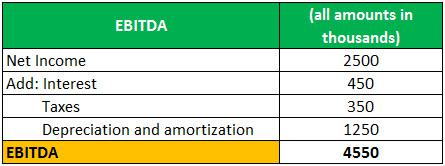

Adjusted EBITDA is a pivotal metric that offers deeper insights into a company's operational performance by refining the standard EBITDA measure. While EBITDA stands for Earnings Before Interest, Taxes, Depreciation, and Amortization, its adjusted form goes further by removing anomalies. These anomalies often include non-recurring, non-operational, and one-time expenses, thereby providing a clearer view of true business operations. By excluding these financial irregularities, Adjusted EBITDA highlights a more accurate and standardized picture of a company's profitability.

The significance of Adjusted EBITDA extends across various financial activities and analyses. Its primary utility stems from its ability to deliver a sound basis for comparison among companies within the same industry. This metric is particularly valuable when evaluating company worth during mergers, acquisitions, or capital raising efforts. By presenting a standardized and consistent view of operational earnings, investors and stakeholders gain confidence in assessing a company's core business performance.



Understanding and accurately calculating Adjusted EBITDA is crucial for investors and business leaders. This process involves a nuanced approach to financial analysis, aiding decision-makers in formulating informed investment strategies and enhancing business decisions. Adjusted EBITDA proves especially relevant in algorithmic trading, where precise financial metrics are critical for automated investment decisions.

Throughout the article, we will investigate the methodology for calculating Adjusted EBITDA, its importance in business analysis, and specific applications, particularly in algorithmic trading. By grasping the true essence of this metric, stakeholders can significantly influence their investment perspectives and operational strategies.

## Table of Contents

## What is Adjusted EBITDA?

Adjusted EBITDA stands for Earnings Before Interest, Taxes, Depreciation, and Amortization with specific adjustments tailored to provide a more accurate reflection of a company's core operating performance. Unlike standard EBITDA, Adjusted EBITDA modifies the basic EBITDA calculation by eliminating non-recurring, non-operational, and one-time expenses that might otherwise obscure the true profitability of the business.

The fundamental goal of Adjusted EBITDA is to normalize earnings figures. By removing anomalies such as non-operating income, restructuring costs, legal settlements, or unrealized gains and losses, it presents a clearer picture of a company's financial health. For instance, if a company incurs a one-time legal fee, including this in the EBITDA calculation would distort the profitability metric for that period. By adjusting for such expenses, Adjusted EBITDA offers a standardized view that can be used for consistent comparison over time and across different companies within the same industry.

Mathematically, Adjusted EBITDA can be expressed in formulaic terms by taking the standard EBITDA and applying necessary adjustments:

$$
\text{Adjusted EBITDA} = \text{EBITDA} + \text{Adjustments}
$$

Where:
- $\text{EBITDA} = \text{Net Income} + \text{Interest} + \text{Taxes} + \text{Depreciation} + \text{Amortization}$
- Adjustments include removing non-recurring and non-operational expenses such as one-time costs or gains, severance payments, or asset impairment charges.

This adjusted metric is crucial for investors and analysts who seek to gauge a company's underlying earnings power, facilitating better comparison and analysis for investment purposes. By stripping out irregular financial elements, Adjusted EBITDA allows stakeholders to concentrate on the ongoing operations and cash generation capability of the business.

## The Importance of Adjusted EBITDA in Business Analysis

## The Importance of Adjusted EBITDA in Business Analysis

Adjusted EBITDA is a critical financial metric that enhances the reliability and comparability of a company's performance within its industry. This metric is particularly significant as it standardizes financial reporting by eliminating elements that do not reflect the ongoing operations of a business. By doing so, it allows investors and analysts to make more accurate comparisons between companies, which can be especially challenging in diverse sectors with varying business models and financial structures.

In valuation analyses, Adjusted EBITDA plays a pivotal role, serving as a standardized indicator of operational performance. This standardization is essential in contexts such as mergers and acquisitions (M&A) or [capital raising](/wiki/hedge-fund-capital-raising) activities. During an M&A process, for instance, potential acquirers or investors require a clear view of a company's operational health to assess its true value. Adjusted EBITDA provides this clarity by removing irregularities and presenting a consistent measure that can be evaluated across potential investment opportunities.

Moreover, companies often utilize Adjusted EBITDA to showcase their operational strength to investors and stakeholders. By focusing on recurring and operational income, companies can present a more accurate depiction of their ongoing profitability. This portrayal is advantageous not only in attracting potential investors but also in maintaining transparency with existing stakeholders, thereby fostering trust and confidence in the management's capability to sustain and grow business operations.

In summary, Adjusted EBITDA serves as an indispensable tool for financial analysis, contributing significantly to the understanding and assessment of a company's true operational performance by providing a filtered view of earnings. Its role in facilitating company comparisons, supporting valuation exercises, and enhancing investor communications underscores its importance in business analysis.

## The Formula for Adjusted EBITDA

Adjusted EBITDA is calculated by first determining EBITDA and then making the necessary adjustments to remove anomalies and provide a clearer picture of a company's recurring operational performance. The basic formula for Adjusted EBITDA is expressed as:

$$
\text{Adjusted EBITDA} = \text{EBITDA} + \text{Adjustments}
$$

To calculate EBITDA, the following formula is used:

$$
\text{EBITDA} = \text{Net Income} + \text{Interest} + \text{Taxes} + \text{Depreciation} + \text{Amortization}
$$

1. **Net Income**: This is the profit after all expenses have been deducted from revenues.
2. **Interest**: The cost incurred by the company for borrowing funds.
3. **Taxes**: The compulsory financial charge imposed by the government.
4. **Depreciation**: The reduction in the value of tangible fixed assets over time.
5. **Amortization**: The gradual reduction of an intangible asset.

After calculating EBITDA, specific adjustments are made to arrive at Adjusted EBITDA. These adjustments typically include:

- **Non-operating Income**: Revenue generated from activities that are not part of the core business operations, such as investment gains.
- **One-time costs**: Expenses that are not expected to recur regularly, such as major legal fees.
- **Unrealized Gains or Losses**: Profits or losses that have occurred on paper, resulting from investments that have not yet been sold.

A simple Python function to calculate Adjusted EBITDA could look like this:

```python
def calculate_adjusted_ebitda(net_income, interest, taxes, depreciation, amortization, non_operating_income, one_time_costs, unrealized_gains_losses):
    ebitda = net_income + interest + taxes + depreciation + amortization
    adjustments = non_operating_income - one_time_costs - unrealized_gains_losses
    adjusted_ebitda = ebitda + adjustments
    return adjusted_ebitda

# Example usage
net_income = 1000000
interest = 50000
taxes = 200000
depreciation = 100000
amortization = 50000
non_operating_income = 30000
one_time_costs = 40000
unrealized_gains_losses = 10000

adjusted_ebitda = calculate_adjusted_ebitda(net_income, interest, taxes, depreciation, amortization, non_operating_income, one_time_costs, unrealized_gains_losses)
print(f"Adjusted EBITDA: {adjusted_ebitda}")
```

This formula and computational approach provide a normalized figure by isolating regular, ongoing operational income while stripping out elements that might otherwise distort an accurate financial assessment of business performance.

## How to Calculate Adjusted EBITDA: A Step-by-Step Guide

To calculate Adjusted EBITDA, follow these steps, which provide detailed guidance on determining this vital financial metric. 

1. **Calculate EBITDA**: Start by determining the standard EBITDA, which stands for Earnings Before Interest, Taxes, Depreciation, and Amortization. This value is reached by adding back non-cash expenses, interest, taxes, and amortization expenses to the net income. The formula to compute EBITDA is:
$$
   \text{EBITDA} = \text{Net Income} + \text{Interest} + \text{Taxes} + \text{Depreciation} + \text{Amortization}

$$

   For practical calculation, here's a simple Python snippet:

   ```python
   def calculate_ebitda(net_income, interest, taxes, depreciation, amortization):
       return net_income + interest + taxes + depreciation + amortization
   ```

2. **Identify Non-Recurring Expenses**: Scrutinize the company's financial statements to identify expenses or incomes that are non-recurring or do not reflect the company's core operational health. Such items may include restructuring costs, litigation expenses, or gains and losses from the sale of assets. 

3. **Adjust for Non-Recurring Items**: Adjust the EBITDA figure by adding back non-recurring expenses or deducting non-recurring incomes. This normalization step ensures that the profit metrics reflect ongoing business operations accurately. Common adjustments include:

   - **Restructuring Costs**: If a company undertakes a major restructuring, the costs involved in this process are typically added back to EBITDA.
   - **Foreign Exchange Gains/Losses**: Fluctuations in currency can result in gains or losses that do not indicate the operational performance, hence should be adjusted.

   Using Python, adjustments can be reflected as follows:

   ```python
   def calculate_adjusted_ebitda(ebitda, non_recurring_expenses, non_recurring_income):
       return ebitda + non_recurring_expenses - non_recurring_income
   ```

4. **Illustrative Example**: Consider a hypothetical company with the following financials:

   - Net Income: $500,000
   - Interest: $100,000
   - Taxes: $150,000
   - Depreciation: $75,000
   - Amortization: $50,000
   - Restructuring Costs: $20,000 (non-recurring expense)
   - Foreign Exchange Gain: $5,000 (non-recurring income)

   First, calculate the EBITDA:

   ```python
   net_income = 500000
   interest = 100000
   taxes = 150000
   depreciation = 75000
   amortization = 50000

   ebitda = calculate_ebitda(net_income, interest, taxes, depreciation, amortization)
   ```

   Next, determine the Adjusted EBITDA by considering non-recurring items:

   ```python
   restructuring_costs = 20000
   foreign_exchange_gain = 5000

   adjusted_ebitda = calculate_adjusted_ebitda(ebitda, restructuring_costs, foreign_exchange_gain)
   ```

In this example, the EBITDA is calculated to be $875,000. After adjusting for the restructuring costs and the foreign exchange gain, the Adjusted EBITDA comes to $890,000, which gives a more accurate picture of the company's operational performance. 

These steps ensure a comprehensive assessment of a company's financial health, enabling better comparison across time and with industry peers.

## Applications of Adjusted EBITDA in Algo Trading

Algorithmic trading uses automated systems that rely heavily on precise financial metrics to make informed investment decisions. One of the key metrics employed is Adjusted EBITDA (Earnings Before Interest, Taxes, Depreciation, and Amortization with specific adjustments), which offers a more refined view of a company's financial performance by eliminating irregular earnings factors.

Normalized financial statements are vital for [algorithmic trading](/wiki/algorithmic-trading) as they prevent skewed data from affecting the algorithms' evaluations of companies. Adjusted EBITDA contributes to this normalization by removing non-recurring, non-operational, and one-time expenses from consideration. This adjustment leads to a more consistent and accurate portrayal of a company's ongoing operational strength, crucial for algorithmic systems that depend on clear and comparable financial data for decision-making processes.

Moreover, Adjusted EBITDA facilitates the development of trading strategies by providing a set of financial data that is free from anomalies and irregularities, offering a clearer landscape for algorithm evaluation. Algorithms can compare standardized financial metrics across different firms within the same industry, thereby enabling more reliable analyses and predictions.

For instance, an algorithm might use Python to access and process financial data, utilize [machine learning](/wiki/machine-learning) models to identify patterns, and integrate Adjusted EBITDA measures to refine its evaluation of a firm's operational performance. Here is a simplified example of how Python can be used for such an analysis:

```python
import pandas as pd

# Sample data for two companies
data = {
    'Company': ['A', 'B'],
    'Net Income': [1000000, 1200000],
    'Interest': [100000, 150000],
    'Taxes': [200000, 180000],
    'Depreciation': [50000, 60000],
    'Amortization': [30000, 40000],
    'One-time Expense': [100000, 50000]
}

# Create a DataFrame
df = pd.DataFrame(data)

# Calculate EBITDA
df['EBITDA'] = df['Net Income'] + df['Interest'] + df['Taxes'] + df['Depreciation'] + df['Amortization']

# Adjusted EBITDA Calculation
df['Adjusted EBITDA'] = df['EBITDA'] + df['One-time Expense']

print(df[['Company', 'Adjusted EBITDA']])
```

This code snippet calculates Adjusted EBITDA for two hypothetical companies by considering standard EBITDA components and then adjusting for non-recurring expenses. Such adjustments are critical for algorithmic trading platforms that must discern the genuine operational capabilities of businesses without being influenced by anomalous data points. This ensures that algorithm-driven trading strategies are based on robust and reliable financial assessments.

## Advantages and Limitations of Adjusted EBITDA

Adjusted EBITDA is a metric adopted by businesses and analysts to gain clearer insights into a company's operational performance, free from accounting anomalies and non-recurring items. One of its primary advantages lies in enhancing comparability across firms within the same industry. By standardizing financial metrics, Adjusted EBITDA allows investors and analysts to assess the core profitability and operational efficiency of different companies on an even footing. This harmonization is essential in investment analysis, as it isolates the true operational performance from extraneous factors, thereby aiding stakeholders in making informed decisions.

Moreover, Adjusted EBITDA is invaluable in investment activities such as mergers and acquisitions. It provides a transparent picture of a company’s ongoing profitability, devoid of temporary financial disturbances, thus facilitating more accurate valuations. This clarity is advantageous for investors seeking to ascertain the underlying business performance without distortions caused by unique, non-operational events.

Despite its benefits, Adjusted EBITDA is not without limitations. A significant concern is its potential for manipulation. Companies might exclude certain expenses to present a more favorable financial picture, potentially leading to misrepresentations. Unlike generally accepted accounting principles (GAAP), there is no universal standard governing the adjustments made in Adjusted EBITDA, leading to inconsistencies in its calculation and application across different organizations.

Additionally, Adjusted EBITDA excludes critical financial details that are essential for comprehensive financial analysis, such as capital expenditures. By omitting such expenditures, it may not provide a complete understanding of the cash flow dynamics, particularly in capital-intensive industries where reinvestment is crucial for sustained growth.

In conclusion, while Adjusted EBITDA serves as a powerful tool for evaluating a company's underlying operational performance, it should be employed alongside other financial metrics. Only then can a full, nuanced picture of an organization's financial health be obtained, minimizing the risk of oversight due to its inherent limitations.

## Conclusion

Adjusted EBITDA remains a powerful tool for financial analysis, offering insights into a company's true operational health. By focusing on the company's core operational performance, it provides a more accurate reflection of financial stability and profitability, stripping away non-recurring and anomalous financial events. However, while Adjusted EBITDA is instrumental in offering a clear picture of operational health, it is imperative that it be considered within a broader framework of financial metrics.

A comprehensive financial analysis should integrate Adjusted EBITDA alongside other indicators such as net income, cash flow, and capital expenditures. This multi-faceted approach ensures a more rounded assessment of a company's financial health. Adjusted EBITDA, when used alongside these metrics, aids in peeling back the layers of financial complexity, offering a transparent view for investors and stakeholders.

Understanding the calculation and applications of Adjusted EBITDA significantly enhances decision-making capabilities in investment and operational strategies. This is especially true in automated trading practices where normalized financial data is crucial for algorithmic accuracy. The use of precise financial metrics like Adjusted EBITDA in algorithmic trading helps in strategy development and in evaluating investment opportunities without the distortion of irregularities or one-time events. Thus, while Adjusted EBITDA is invaluable for certain analyses, it is most effective when incorporated within an inclusive set of financial evaluations.

## References & Further Reading

[1]: Damodaran, A. (2017). ["The Little Book of Valuation: How to Value a Company, Pick a Stock and Profit"](https://www.amazon.com/Little-Book-Valuation-Company-Profits/dp/1394244401) by Aswath Damodaran.

[2]: Koller, T., Goedhart, M., & Wessels, D. (2015). ["Valuation: Measuring and Managing the Value of Companies."](https://books.google.com/books/about/Valuation.html?id=fGXjDwAAQBAJ) McKinsey & Company Inc.

[3]: Penman, S. H. (2013). ["Financial Statement Analysis and Security Valuation."](https://archive.org/details/financialstateme0000penm_m9z7_5thed) McGraw-Hill Education.

[4]: Graham, B., & Zweig, J. (2003). ["The Intelligent Investor: The Definitive Book on Value Investing."](https://www.amazon.com/Intelligent-Investor-Definitive-Investing-Essentials/dp/0060555661) Harper Business.

[5]: ["EBITDA: Financial Definitions and Usage."](https://www.investopedia.com/terms/e/ebitda.asp) Investopedia.