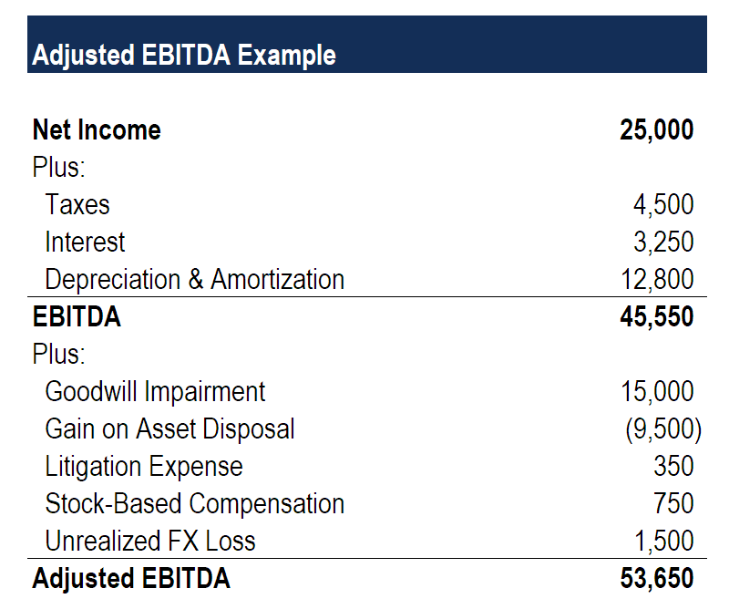

## Table of Contents

## What is EBITDA and how does it differ from net income?

EBITDA stands for Earnings Before Interest, Taxes, Depreciation, and Amortization. It's a way to measure how well a company is doing by looking at its profits before taking away money for interest on loans, taxes, and the costs of wearing out its equipment or buildings over time. Think of it as a way to see the raw earning power of a business without all the extra financial details.

Net income, on the other hand, is what's left after you subtract all expenses from a company's total revenue. This includes everything: interest, taxes, depreciation, amortization, and any other costs. Net income gives you the final profit or loss of a company, showing you the actual money it made or lost after everything is accounted for. So, while EBITDA gives you a broader view of operational performance, net income tells you the bottom line after all costs.

## What does 'Adjusted' mean in Adjusted EBITDA?

When you see 'Adjusted' in front of EBITDA, it means the company has made some changes to the regular EBITDA number. They do this to show a clearer picture of how the business is doing by taking out one-time costs or unusual expenses that don't happen every day. For example, if a company had to pay a big fine or had costs from closing a factory, they might take these out to show what their earnings would be without these unusual events.

Adjusted EBITDA helps investors and managers see the normal, ongoing performance of a business without being distracted by things that won't happen again. It's like looking at a cleaned-up version of the company's earnings, which can be helpful for understanding the true health and efficiency of the business. However, it's important to know what adjustments were made because different companies might adjust their EBITDA in different ways, which can make it harder to compare them fairly.

## Why is Adjusted EBITDA important for businesses?

Adjusted EBITDA is important for businesses because it helps them show how well they are doing without including one-time or unusual costs. Imagine a company had to pay a big fine or had to close a factory. These costs can make the company's earnings look worse than they really are. By taking these costs out, Adjusted EBITDA gives a clearer picture of how the business is doing day to day. This helps business owners and investors see the true health of the company without being confused by things that won't happen again.

It's also useful for comparing different companies. Since every business might have different unusual costs, looking at regular EBITDA can be like comparing apples to oranges. Adjusted EBITDA levels the playing field by removing these differences. This makes it easier for investors to decide which companies are doing better. However, it's important to know what adjustments were made because if companies adjust their numbers differently, it can still be hard to compare them fairly.

## What are common adjustments made to calculate Adjusted EBITDA?

When businesses calculate Adjusted EBITDA, they often make changes to the regular EBITDA to show a clearer picture of their earnings. Common adjustments include taking out one-time costs like legal fees or fines. For example, if a company had to pay a big fine for breaking a rule, they would take this cost out of their earnings to show what their profits would be without that unusual event. Another common adjustment is removing the costs of closing or opening a new factory or store. These costs can make the company's earnings look worse than they really are, so taking them out helps show the normal, day-to-day performance of the business.

Another adjustment businesses might make is to take out the costs of restructuring, like when they change how the company is organized or lay off workers. These costs are not part of the everyday running of the business, so removing them helps show the true health of the company. Sometimes, businesses also take out the costs of buying other companies or selling parts of their own business. These adjustments help investors see the ongoing earnings of the company without being confused by big, unusual events that won't happen again.

## How do you calculate standard EBITDA from financial statements?

To calculate standard EBITDA from financial statements, start by finding the company's net income on the income statement. This is the bottom line that shows how much money the company made after all expenses. Then, add back the interest expense, which is the cost of borrowing money. Next, add back the taxes the company paid. After that, add back depreciation, which is the cost of the company's equipment and buildings wearing out over time. Finally, add back amortization, which is similar to depreciation but for intangible things like patents. When you add all these back to net income, you get EBITDA.

EBITDA gives you a way to see how much money a company makes from its main business activities before taking away costs like interest, taxes, and the wearing out of equipment. It's like looking at the company's earnings before all the extra financial details. This can help you understand how well the business is doing without being distracted by things like how much debt it has or how much it pays in taxes. Remember, though, that while EBITDA is useful, it's not the same as the final profit because it doesn't include all the costs a business has to pay.

## What steps are involved in adjusting EBITDA to get Adjusted EBITDA?

To adjust EBITDA and get Adjusted EBITDA, you start with the regular EBITDA number. Then, you take out any one-time costs or unusual expenses that don't happen every day. These might include big fines, costs from closing or opening a factory, or the costs of restructuring the company. By taking these out, you can see what the company's earnings would be without these unusual events.

Adjusted EBITDA helps show the normal, day-to-day performance of the business. It's like cleaning up the earnings to see how the company is doing without being confused by things that won't happen again. This can be really helpful for investors and managers who want to understand the true health of the company. However, it's important to know what adjustments were made because different companies might adjust their EBITDA in different ways, which can make it harder to compare them fairly.

## Can you provide an example of calculating Adjusted EBITDA for a hypothetical company?

Let's say we have a company called GreenWidgets Inc. Their financial statement shows a net income of $500,000. To find their EBITDA, we add back the interest expense of $50,000, taxes of $100,000, depreciation of $75,000, and amortization of $25,000. This gives us an EBITDA of $750,000.

Now, GreenWidgets Inc. had some unusual costs last year. They had to pay a one-time fine of $100,000 for a regulatory issue and spent $50,000 on closing an old factory. To get the Adjusted EBITDA, we take these unusual costs out of the regular EBITDA. So, we start with the $750,000 EBITDA and add back the $100,000 fine and the $50,000 factory closing cost. This gives us an Adjusted EBITDA of $900,000. This number shows how GreenWidgets Inc. is doing without the unusual costs, giving a clearer picture of their normal, day-to-day earnings.

## How does Adjusted EBITDA impact valuation and investment decisions?

Adjusted EBITDA is really important when people want to figure out how much a company is worth or if they should invest in it. It gives a clearer picture of how much money the company makes every day, without including one-time or unusual costs. When investors look at Adjusted EBITDA, they can see how well the company is doing without being confused by things like fines or the costs of closing a factory. This helps them make better decisions about whether the company is a good investment. If a company has a high Adjusted EBITDA, it might be seen as healthier and more valuable than one with a lower number.

Using Adjusted EBITDA also helps when comparing different companies. Since every business might have different unusual costs, looking at regular EBITDA can be like comparing apples to oranges. Adjusted EBITDA levels the playing field by taking out these differences. This makes it easier for investors to decide which companies are doing better. But it's important to know what adjustments were made because if companies adjust their numbers differently, it can still be hard to compare them fairly. Overall, Adjusted EBITDA is a helpful tool for understanding a company's true [earning](/wiki/earning-announcement) power and making smart investment choices.

## What are the limitations and criticisms of using Adjusted EBITDA?

One big problem with Adjusted EBITDA is that it can be changed a lot by the people who make it. Companies can take out many different costs to make their numbers look better. This means two companies might adjust their EBITDA in different ways, making it hard to compare them fairly. If investors don't know what costs were taken out, they might think a company is doing better than it really is. This can lead to bad decisions about buying or selling a company.

Another issue is that Adjusted EBITDA doesn't show all the costs a company has to pay. It leaves out things like interest on loans, taxes, and the costs of equipment wearing out. These are real costs that affect how much money a company makes. By not including them, Adjusted EBITDA can make a company look more profitable than it really is. This can be misleading, especially if investors use it to decide how much a company is worth or whether to invest in it.

## How do different industries approach adjustments in EBITDA?

Different industries approach adjustments in EBITDA in ways that make sense for their specific business. For example, in the tech industry, companies might adjust for costs related to research and development or one-time expenses for launching new products. These costs can be big but are seen as investments in future growth, so tech companies often take them out to show what their regular earnings look like. In the restaurant industry, adjustments might include costs for opening new locations or closing old ones. These are seen as unusual events that don't happen every day, so restaurants take them out to show how their day-to-day business is doing.

In the manufacturing industry, companies might adjust for costs related to buying new machines or the costs of shutting down old factories. These costs can make their earnings look worse than they really are, so manufacturers take them out to show their normal profits. The energy sector might adjust for costs related to environmental cleanups or regulatory fines, which are not part of their everyday operations. By adjusting EBITDA, each industry tries to give a clearer picture of how their business is doing without being confused by costs that won't happen again.

## What are the regulatory and accounting standards considerations for reporting Adjusted EBITDA?

When companies report Adjusted EBITDA, they need to follow certain rules to make sure their numbers are clear and fair. In the United States, the Securities and Exchange Commission (SEC) has rules about how companies can report their earnings. They say that if a company uses Adjusted EBITDA, they have to explain what adjustments they made and why. This helps investors understand what costs were taken out and if the numbers are a good reflection of the company's health. The SEC wants to make sure companies don't use Adjusted EBITDA to hide important information or make their earnings look better than they really are.

Accounting standards also play a big role in how Adjusted EBITDA is reported. The Generally Accepted Accounting Principles (GAAP) in the U.S. and the International Financial Reporting Standards (IFRS) used in many other countries set rules for how companies should report their financials. While these standards don't directly talk about Adjusted EBITDA, they do say that any non-GAAP measures, like Adjusted EBITDA, need to be clearly explained. Companies have to show how they got from their GAAP numbers to their Adjusted EBITDA numbers. This helps keep things transparent and makes sure investors have all the information they need to make good decisions.

## How can Adjusted EBITDA be used in conjunction with other financial metrics for a more comprehensive analysis?

Adjusted EBITDA is a helpful tool, but it's even better when used with other financial metrics to get a full picture of a company's health. For example, you can use it with the debt-to-EBITDA ratio to see how well a company can handle its debt. If a company has a high Adjusted EBITDA but also a lot of debt, it might not be as healthy as it looks. Another useful metric is free cash flow, which shows how much money a company has left after paying for everything it needs to run. By looking at Adjusted EBITDA and free cash flow together, you can see if a company is making enough money to grow and invest in new things.

Another important metric to use with Adjusted EBITDA is net income. While Adjusted EBITDA shows earnings before some costs, net income shows the final profit after all costs. By comparing these two, you can see how much the costs that Adjusted EBITDA leaves out, like interest and taxes, affect the company's bottom line. You can also use return on assets (ROA) with Adjusted EBITDA to see how well a company is using its assets to make money. Together, these metrics give a more complete view of a company's financial health and help investors make smarter decisions.

## What is Adjusted EBITDA?

Adjusted EBITDA stands for Earnings Before Interest, Taxes, Depreciation, and Amortization with specific adjustments tailored to provide a more accurate reflection of a company's core operating performance. Unlike standard EBITDA, Adjusted EBITDA modifies the basic EBITDA calculation by eliminating non-recurring, non-operational, and one-time expenses that might otherwise obscure the true profitability of the business.

The fundamental goal of Adjusted EBITDA is to normalize earnings figures. By removing anomalies such as non-operating income, restructuring costs, legal settlements, or unrealized gains and losses, it presents a clearer picture of a company's financial health. For instance, if a company incurs a one-time legal fee, including this in the EBITDA calculation would distort the profitability metric for that period. By adjusting for such expenses, Adjusted EBITDA offers a standardized view that can be used for consistent comparison over time and across different companies within the same industry.

Mathematically, Adjusted EBITDA can be expressed in formulaic terms by taking the standard EBITDA and applying necessary adjustments:

$$
\text{Adjusted EBITDA} = \text{EBITDA} + \text{Adjustments}
$$

Where:
- $\text{EBITDA} = \text{Net Income} + \text{Interest} + \text{Taxes} + \text{Depreciation} + \text{Amortization}$
- Adjustments include removing non-recurring and non-operational expenses such as one-time costs or gains, severance payments, or asset impairment charges.

This adjusted metric is crucial for investors and analysts who seek to gauge a company's underlying earnings power, facilitating better comparison and analysis for investment purposes. By stripping out irregular financial elements, Adjusted EBITDA allows stakeholders to concentrate on the ongoing operations and cash generation capability of the business.

## What is the Formula for Adjusted EBITDA?

Adjusted EBITDA is calculated by first determining EBITDA and then making the necessary adjustments to remove anomalies and provide a clearer picture of a company's recurring operational performance. The basic formula for Adjusted EBITDA is expressed as:

$$
\text{Adjusted EBITDA} = \text{EBITDA} + \text{Adjustments}
$$

To calculate EBITDA, the following formula is used:

$$
\text{EBITDA} = \text{Net Income} + \text{Interest} + \text{Taxes} + \text{Depreciation} + \text{Amortization}
$$

1. **Net Income**: This is the profit after all expenses have been deducted from revenues.
2. **Interest**: The cost incurred by the company for borrowing funds.
3. **Taxes**: The compulsory financial charge imposed by the government.
4. **Depreciation**: The reduction in the value of tangible fixed assets over time.
5. **Amortization**: The gradual reduction of an intangible asset.

After calculating EBITDA, specific adjustments are made to arrive at Adjusted EBITDA. These adjustments typically include:

- **Non-operating Income**: Revenue generated from activities that are not part of the core business operations, such as investment gains.
- **One-time costs**: Expenses that are not expected to recur regularly, such as major legal fees.
- **Unrealized Gains or Losses**: Profits or losses that have occurred on paper, resulting from investments that have not yet been sold.

A simple Python function to calculate Adjusted EBITDA could look like this:

```python
def calculate_adjusted_ebitda(net_income, interest, taxes, depreciation, amortization, non_operating_income, one_time_costs, unrealized_gains_losses):
    ebitda = net_income + interest + taxes + depreciation + amortization
    adjustments = non_operating_income - one_time_costs - unrealized_gains_losses
    adjusted_ebitda = ebitda + adjustments
    return adjusted_ebitda

# Example usage
net_income = 1000000
interest = 50000
taxes = 200000
depreciation = 100000
amortization = 50000
non_operating_income = 30000
one_time_costs = 40000
unrealized_gains_losses = 10000

adjusted_ebitda = calculate_adjusted_ebitda(net_income, interest, taxes, depreciation, amortization, non_operating_income, one_time_costs, unrealized_gains_losses)
print(f"Adjusted EBITDA: {adjusted_ebitda}")
```

This formula and computational approach provide a normalized figure by isolating regular, ongoing operational income while stripping out elements that might otherwise distort an accurate financial assessment of business performance.

## How do you calculate Adjusted EBITDA: A Step-by-Step Guide?

To calculate Adjusted EBITDA, follow these steps, which provide detailed guidance on determining this vital financial metric. 

1. **Calculate EBITDA**: Start by determining the standard EBITDA, which stands for Earnings Before Interest, Taxes, Depreciation, and Amortization. This value is reached by adding back non-cash expenses, interest, taxes, and amortization expenses to the net income. The formula to compute EBITDA is:
$$
   \text{EBITDA} = \text{Net Income} + \text{Interest} + \text{Taxes} + \text{Depreciation} + \text{Amortization}

$$

   For practical calculation, here's a simple Python snippet:

   ```python
   def calculate_ebitda(net_income, interest, taxes, depreciation, amortization):
       return net_income + interest + taxes + depreciation + amortization
   ```

2. **Identify Non-Recurring Expenses**: Scrutinize the company's financial statements to identify expenses or incomes that are non-recurring or do not reflect the company's core operational health. Such items may include restructuring costs, litigation expenses, or gains and losses from the sale of assets. 

3. **Adjust for Non-Recurring Items**: Adjust the EBITDA figure by adding back non-recurring expenses or deducting non-recurring incomes. This normalization step ensures that the profit metrics reflect ongoing business operations accurately. Common adjustments include:

   - **Restructuring Costs**: If a company undertakes a major restructuring, the costs involved in this process are typically added back to EBITDA.
   - **Foreign Exchange Gains/Losses**: Fluctuations in currency can result in gains or losses that do not indicate the operational performance, hence should be adjusted.

   Using Python, adjustments can be reflected as follows:

   ```python
   def calculate_adjusted_ebitda(ebitda, non_recurring_expenses, non_recurring_income):
       return ebitda + non_recurring_expenses - non_recurring_income
   ```

4. **Illustrative Example**: Consider a hypothetical company with the following financials:

   - Net Income: $500,000
   - Interest: $100,000
   - Taxes: $150,000
   - Depreciation: $75,000
   - Amortization: $50,000
   - Restructuring Costs: $20,000 (non-recurring expense)
   - Foreign Exchange Gain: $5,000 (non-recurring income)

   First, calculate the EBITDA:

   ```python
   net_income = 500000
   interest = 100000
   taxes = 150000
   depreciation = 75000
   amortization = 50000

   ebitda = calculate_ebitda(net_income, interest, taxes, depreciation, amortization)
   ```

   Next, determine the Adjusted EBITDA by considering non-recurring items:

   ```python
   restructuring_costs = 20000
   foreign_exchange_gain = 5000

   adjusted_ebitda = calculate_adjusted_ebitda(ebitda, restructuring_costs, foreign_exchange_gain)
   ```

In this example, the EBITDA is calculated to be $875,000. After adjusting for the restructuring costs and the foreign exchange gain, the Adjusted EBITDA comes to $890,000, which gives a more accurate picture of the company's operational performance. 

These steps ensure a comprehensive assessment of a company's financial health, enabling better comparison across time and with industry peers.

## References & Further Reading

[1]: Damodaran, A. (2017). ["The Little Book of Valuation: How to Value a Company, Pick a Stock and Profit"](https://www.amazon.com/Little-Book-Valuation-Company-Profits/dp/1394244401) by Aswath Damodaran.

[2]: Koller, T., Goedhart, M., & Wessels, D. (2015). ["Valuation: Measuring and Managing the Value of Companies."](https://books.google.com/books/about/Valuation.html?id=fGXjDwAAQBAJ) McKinsey & Company Inc.

[3]: Penman, S. H. (2013). ["Financial Statement Analysis and Security Valuation."](https://archive.org/details/financialstateme0000penm_m9z7_5thed) McGraw-Hill Education.

[4]: Graham, B., & Zweig, J. (2003). ["The Intelligent Investor: The Definitive Book on Value Investing."](https://www.amazon.com/Intelligent-Investor-Definitive-Investing-Essentials/dp/0060555661) Harper Business.

[5]: ["EBITDA: Financial Definitions and Usage."](https://www.investopedia.com/terms/e/ebitda.asp) Investopedia.