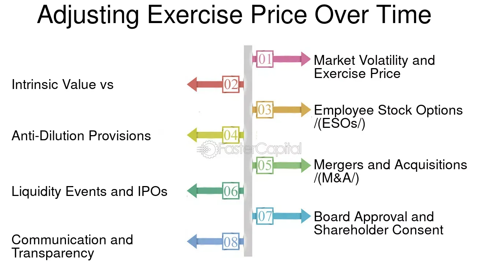

## Table of Contents

## What is an adjusted exercise price?

An adjusted exercise price is a new price set for stock options after a company makes certain changes. These changes can include things like stock splits, dividends, or mergers. The goal is to keep the value of the options fair for the people who own them, even after the company's actions change the stock's value.

For example, if a company does a 2-for-1 stock split, the number of shares doubles, but the price per share is cut in half. To keep the options fair, the exercise price of the options would also be cut in half. This way, the option holders can still buy the same value of stock as before the split. Adjusting the exercise price helps maintain the balance and fairness in the options' value.

## Why is the exercise price of an option adjusted?

The exercise price of an option is adjusted to keep things fair for the people who own the options. When a company makes big changes like splitting its stock, paying out dividends, or merging with another company, the value of the stock can change. If the exercise price stayed the same, it wouldn't be fair to the option holders because the value of what they can buy would be different.

So, the exercise price is changed to match the new value of the stock. For example, if a company does a stock split and the stock price goes down, the exercise price of the options will also go down. This way, the option holders can still buy the same amount of value in the company's stock as they could before the change. Adjusting the exercise price helps make sure the options stay fair and valuable.

## How does an adjusted exercise price affect the value of an option?

When a company makes changes like stock splits or pays dividends, the exercise price of an option might be adjusted. This adjustment keeps the option fair for the people who own it. If the stock price goes down because of a split, the exercise price also goes down. This means the option holders can still buy the same amount of stock for the same value as before. It's like making sure the option stays worth the same amount even though the stock price changed.

The value of an option is affected by this adjustment because it changes how much the option is worth to the holder. If the exercise price goes down, the option becomes more valuable because it's cheaper to buy the stock. On the other hand, if the exercise price goes up, the option might be less valuable because it costs more to use it. So, adjusting the exercise price helps keep the option's value fair and balanced with the changes in the stock's price.

## What events can lead to an adjustment in the exercise price?

There are a few big events that can lead to an adjustment in the exercise price of an option. One common event is a stock split. When a company does a stock split, it means they are making more shares available, and the price of each share goes down. To keep things fair for people who own options, the exercise price of those options also goes down. Another event is when a company pays a dividend, especially if it's a big one. If the dividend is large enough, it can lower the stock price, so the exercise price of the options might be adjusted to match.

Another event that can lead to an adjustment is a merger or acquisition. When two companies merge or one company buys another, the stock prices can change a lot. To make sure the options stay fair, the exercise price might need to be changed. Sometimes, other big changes like a reverse stock split can also lead to an adjustment. In a reverse stock split, the number of shares goes down and the price goes up, so the exercise price of options might need to go up too. All these events are about keeping the options fair and valuable for the people who own them.

## Can you explain the concept of stock splits and their impact on exercise price?

A stock split is when a company decides to increase the number of its shares. Imagine you have one big pizza, and you cut it into more slices. The pizza doesn't get bigger, but now there are more slices to share. When a company does a stock split, they might change one share into two, three, or even more shares. This makes the price of each share go down because there are more shares available. For example, if a company does a 2-for-1 stock split, and the stock was $100 per share before, it will be $50 per share after the split.

When a company does a stock split, it also affects the exercise price of stock options. The exercise price is the price you pay to buy a share if you have an option. To keep things fair for people who own options, the exercise price goes down when the stock price goes down because of the split. Using the same example, if the exercise price was $100 before the 2-for-1 split, it would be adjusted to $50 after the split. This way, the value of what you can buy with the option stays the same, even though the number of shares and the price per share have changed.

## How do dividends affect the exercise price of options?

When a company pays dividends, it can affect the exercise price of options. Dividends are like a little bonus that the company gives to its shareholders. If the dividend is big enough, it can make the stock price go down a bit. To keep things fair for people who own options, the exercise price might need to be adjusted. The exercise price is what you pay to buy a share if you have an option. If the stock price goes down because of a dividend, the exercise price might go down too.

This adjustment helps make sure that the value of the option stays the same. Imagine you have an option to buy a share at $100, and the company pays a big dividend that makes the stock price drop to $95. If the exercise price stayed at $100, it wouldn't be fair because you'd be paying more than the stock is worth. So, the exercise price might be adjusted to $95 to match the new stock price. This way, the option still lets you buy the same value of stock as before the dividend was paid.

## What is the formula used to calculate the adjusted exercise price after a stock split?

When a company does a stock split, they change the number of shares and the price per share. To keep the options fair, we need to adjust the exercise price. The formula to calculate the new exercise price after a stock split is simple. You take the old exercise price and divide it by the split ratio. The split ratio is how many new shares you get for each old share. For example, if it's a 2-for-1 split, the ratio is 2.

Let's say the old exercise price was $100 and the company did a 2-for-1 stock split. You would divide $100 by 2, which gives you a new exercise price of $50. This way, the value of the option stays the same even though the stock price changed. If it was a 3-for-1 split, you'd divide the old exercise price by 3. So, if the old price was $100, the new exercise price would be about $33.33. This simple formula helps keep the options fair for everyone who owns them.

## How does a reverse stock split influence the exercise price of options?

A reverse stock split is when a company decides to reduce the number of its shares. Imagine you have a pizza and you put fewer slices into it. The pizza doesn't get smaller, but now there are fewer slices to share. When a company does a reverse stock split, they might change two, three, or even more shares into one share. This makes the price of each share go up because there are fewer shares available. For example, if a company does a 1-for-2 reverse stock split, and the stock was $50 per share before, it will be $100 per share after the split.

When a company does a reverse stock split, it also affects the exercise price of stock options. The exercise price is the price you pay to buy a share if you have an option. To keep things fair for people who own options, the exercise price goes up when the stock price goes up because of the reverse split. Using the same example, if the exercise price was $50 before the 1-for-2 reverse split, it would be adjusted to $100 after the split. This way, the value of what you can buy with the option stays the same, even though the number of shares and the price per share have changed.

## What are the tax implications of an adjusted exercise price?

When a company adjusts the exercise price of your stock options because of things like stock splits or dividends, it can affect your taxes. If the exercise price goes down, your options become more valuable. This might mean you have to pay more in taxes when you exercise your options or when you sell the stock you bought with them. The exact tax impact depends on the rules in your country, but usually, the difference between the new, lower exercise price and the market price of the stock can be seen as extra income for you.

It's a good idea to talk to a tax advisor to understand how these adjustments might change your tax situation. They can help you figure out if you need to report the change in the value of your options on your taxes and how it might affect your overall tax bill. Keeping track of these changes and getting advice can help you manage your taxes better when dealing with adjusted exercise prices.

## How do different option exchanges handle adjustments to exercise prices?

Different option exchanges have their own rules for adjusting exercise prices, but they all aim to keep things fair for people who own options. When a company does something like a stock split or pays a big dividend, the stock price can change. To make sure the options stay valuable, the exchanges adjust the exercise price. This means if the stock price goes down because of a split, the exercise price also goes down. If the stock price goes up because of a reverse split, the exercise price goes up too. The goal is to make sure the option holders can still buy the same value of stock as before the change.

For example, the Chicago Board Options Exchange (CBOE) and the NASDAQ OMX PHLX have detailed rules about how they adjust options after corporate actions. They look at things like the type of action (like a split or dividend), how much the stock price changed, and what's fair for the option holders. These rules help make sure everyone knows what to expect when their options are adjusted. Even though the details can be different from one exchange to another, the main idea is always to keep the options fair and valuable for everyone.

## What historical examples illustrate the impact of adjusted exercise prices on option trading?

In 2014, Apple did a 7-for-1 stock split. Before the split, if you had an option to buy Apple stock at $600, after the split, the exercise price was adjusted to about $85.71. This made the options more valuable because you could buy the stock at a much lower price. A lot of people who owned Apple options were happy because their options were now worth more. This showed how a stock split can change the value of options and make them more attractive to traders.

Another example is when Tesla did a 5-for-1 stock split in 2020. Before the split, if your option let you buy Tesla stock at $1,000, after the split, the exercise price became $200. This big change made Tesla options much more popular because they were cheaper to exercise. Many traders started buying and selling Tesla options more because they saw a good chance to make money. These examples show how stock splits and adjusted exercise prices can really shake up the options market and get more people interested in trading.

## How can traders use knowledge of adjusted exercise prices to their advantage in strategy development?

Traders can use knowledge of adjusted exercise prices to make smarter trading choices. When a company does a stock split or pays a big dividend, the exercise price of options changes. If traders know about these changes ahead of time, they can buy options before the adjustment. This can make their options more valuable because the price to buy the stock goes down. For example, if a trader thinks a company will do a stock split soon, they might buy options now. After the split, the exercise price goes down, and the options are worth more. This can help traders make more money if they sell the options at the right time.

Another way traders can use this knowledge is by planning when to exercise their options. If they know the exercise price will go down because of a stock split, they might wait until after the split to exercise their options. This way, they can buy the stock at a lower price than before. Knowing about adjusted exercise prices also helps traders understand how the value of their options might change. This can help them decide when to buy, sell, or hold onto their options to get the best results. By staying informed about corporate actions and how they affect options, traders can develop better strategies to make the most of their investments.

## What are the Mechanics of Adjusted Exercise Price?

The adjusted exercise price is a critical concept in options trading, reflecting modifications to an option's strike price when corporate actions such as stock splits, mergers, or special dividends occur. These adjustments ensure that the intrinsic value of the option remains unchanged, preserving the contractual rights and obligations of both the option holder and the writer.

**Mechanisms of Adjustment**  
When a company undergoes a stock split, it increases the number of its outstanding shares while proportionately reducing the share price to maintain the market capitalization. For instance, in a 2-for-1 stock split, each share is split into two, halving the price per share while doubling the number of shares outstanding. Accordingly, an option with a strike price of $100 would be adjusted to $50 post-split to reflect the new price level while maintaining the overall economic interests of the option holder.

Special dividends, unlike regular dividends, are significant one-time payments to shareholders that can impact an option's strike price. If an option is "American-style," meaning it can be exercised at any time before expiration, and a special dividend is declared, the strike price might be reduced by the dividend amount. For example, if a special dividend of $5 per share is issued, an option with a $100 strike price could be adjusted to $95. This adjustment reflects the decrease in the underlying stock's value post-dividend.

**Formulaic Adjustments**  
A common formula used to adjust the exercise price of an option to account for stock splits is:

$$
\text{Adjusted Strike Price} = \frac{\text{Original Strike Price}}{\text{Split Ratio}}
$$

For stock dividends or special dividends, the adjustment can be denoted as:

$$
\text{Adjusted Strike Price} = \text{Original Strike Price} - \text{Dividend per Share}
$$

**Practical Examples**  
Consider an option with a strike price of $100 where the underlying stock undergoes a 3-for-1 split. The adjusted exercise price would be:

$$
\text{Adjusted Strike Price} = \frac{100}{3} = 33.33
$$

Alternatively, if a special dividend of $5 is declared, and the option's original strike price was $100, the adjusted strike price would be:

$$
\text{Adjusted Strike Price} = 100 - 5 = 95
$$

By understanding these mechanisms, traders can strategically respond to corporate events, ensuring their trading strategies and positions are accurately aligned with the adjusted values. Adjustments in exercise prices not only safeguard the interests of those involved in the contract but also maintain the balance and integrity of the options market during corporate restructuring or rewarding events.

## References & Further Reading

[1]: Bergstra, J., Bardenet, R., Bengio, Y., & Kégl, B. (2011). ["Algorithms for Hyper-Parameter Optimization."](https://dl.acm.org/doi/10.5555/2986459.2986743) Advances in Neural Information Processing Systems 24.

[2]: ["Advances in Financial Machine Learning"](https://www.amazon.com/Advances-Financial-Machine-Learning-Marcos/dp/1119482089) by Marcos Lopez de Prado

[3]: ["Evidence-Based Technical Analysis: Applying the Scientific Method and Statistical Inference to Trading Signals"](https://www.amazon.com/Evidence-Based-Technical-Analysis-Scientific-Statistical/dp/0470008741) by David Aronson

[4]: ["Machine Learning for Algorithmic Trading"](https://github.com/stefan-jansen/machine-learning-for-trading) by Stefan Jansen

[5]: ["Quantitative Trading: How to Build Your Own Algorithmic Trading Business"](https://www.amazon.com/Quantitative-Trading-Build-Algorithmic-Business/dp/1119800064) by Ernest P. Chan