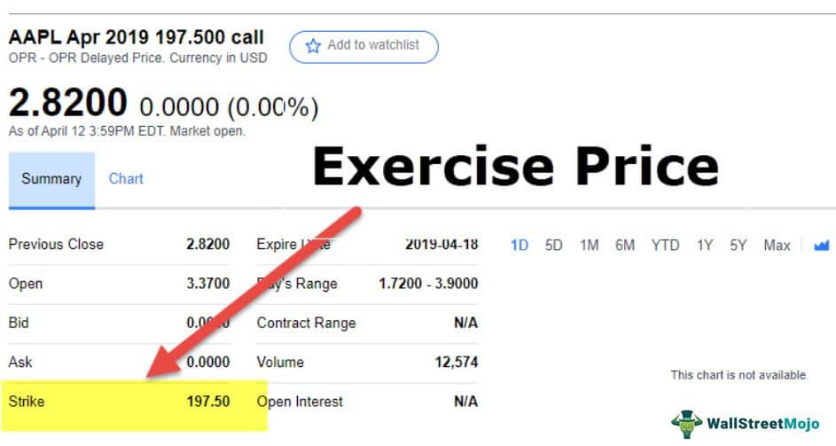

Options trading has significantly matured, characterized by its inherent flexibility in crafting investment strategies and managing risk. As a cornerstone of modern financial markets, options trading allows investors to maneuver through a spectrum of market conditions using tools that can both hedge and speculate.

This article aims to illuminate the union of options trading with algorithmic trading, especially emphasizing adjusted exercise prices—a critical aspect shaped by corporate actions such as stock splits or special dividends. These adjustments are key to maintaining the value of options contracts, ensuring that the holder's rights and obligations remain unchanged despite structural changes in the underlying asset. By understanding how these adjustments work, traders can better preserve their strategic intents through various market events.



The advent of modern technology has revolutionized trading efficiency, enabling more sophisticated and rapid execution of strategies. Algorithmic trading, in particular, leverages computational power to manage complex operations that would be impractical to handle manually. This involves defining trading strategies that are executed automatically based on quantitative models and pre-defined conditions.

By exploring these intersections, the article will discuss how algorithmic approaches, backed by robust computational frameworks, can enhance the precision and execution speed of options trading strategies. This comprehension can empower traders to not only make more informed decisions but also exploit inefficiencies in the market to their advantage.

The synergy between options trading and algorithmic trading represents a paradigm where risks are managed while simultaneously exploring potential profit avenues within adjusted frameworks. Through this integration, traders can engage more effectively with market dynamics, adapt to volatility, and, ultimately, pursue a performance edge.

## Table of Contents

## Understanding Options Trading

Options are versatile financial instruments that provide the holder with the right, but not the obligation, to buy or sell an underlying asset at a predetermined price, known as the strike price, within a specified time frame. This flexibility makes options a powerful tool for various investment strategies. The key components that define an option contract include the underlying asset, which could be stocks, indices, or commodities; the strike price, which sets the transaction value; the expiration date, marking the deadline for executing the option; and the premium, representing the cost of owning the option.

Options are primarily categorized into two types: call options and put options. A call option gives the holder the right to purchase the underlying asset at the strike price before expiration. Investors use call options to capitalize on expected increases in the asset’s value. Conversely, a put option grants the right to sell the underlying asset at the strike price, serving as a protective measure when a decline in the asset's value is anticipated.

Trading options offer several benefits beyond mere speculation. They play a significant role in risk management, allowing traders to hedge against potential losses in their portfolios. For instance, purchasing put options can offset potential declines in stock prices, serving as a form of insurance. Additionally, options trading can aid in portfolio diversification, enabling exposure to different assets and market sectors without committing significant capital.

One must understand basic options strategies to navigate the complexities of options trading effectively. A popular strategy is buying call options, which allows investors to profit from upward price moves with limited downside risk—confined to the premium paid. Similarly, buying put options can be advantageous in bearish markets, providing protection or profit opportunities from declining asset prices.

These foundational strategies set the stage for more advanced trading techniques, such as covered calls or protective puts, which integrate options within broader investment strategies. Understanding the basic principles of options trading equips traders with the necessary tools to manage risk, pursue speculative gains, and enhance their investment portfolios.

## The Mechanics of Adjusted Exercise Price

The adjusted exercise price is a critical concept in options trading, reflecting modifications to an option's strike price when corporate actions such as stock splits, mergers, or special dividends occur. These adjustments ensure that the intrinsic value of the option remains unchanged, preserving the contractual rights and obligations of both the option holder and the writer.

**Mechanisms of Adjustment**  
When a company undergoes a stock split, it increases the number of its outstanding shares while proportionately reducing the share price to maintain the market capitalization. For instance, in a 2-for-1 stock split, each share is split into two, halving the price per share while doubling the number of shares outstanding. Accordingly, an option with a strike price of $100 would be adjusted to $50 post-split to reflect the new price level while maintaining the overall economic interests of the option holder.

Special dividends, unlike regular dividends, are significant one-time payments to shareholders that can impact an option's strike price. If an option is "American-style," meaning it can be exercised at any time before expiration, and a special dividend is declared, the strike price might be reduced by the dividend amount. For example, if a special dividend of $5 per share is issued, an option with a $100 strike price could be adjusted to $95. This adjustment reflects the decrease in the underlying stock's value post-dividend.

**Formulaic Adjustments**  
A common formula used to adjust the exercise price of an option to account for stock splits is:

$$
\text{Adjusted Strike Price} = \frac{\text{Original Strike Price}}{\text{Split Ratio}}
$$

For stock dividends or special dividends, the adjustment can be denoted as:

$$
\text{Adjusted Strike Price} = \text{Original Strike Price} - \text{Dividend per Share}
$$

**Practical Examples**  
Consider an option with a strike price of $100 where the underlying stock undergoes a 3-for-1 split. The adjusted exercise price would be:

$$
\text{Adjusted Strike Price} = \frac{100}{3} = 33.33
$$

Alternatively, if a special dividend of $5 is declared, and the option's original strike price was $100, the adjusted strike price would be:

$$
\text{Adjusted Strike Price} = 100 - 5 = 95
$$

By understanding these mechanisms, traders can strategically respond to corporate events, ensuring their trading strategies and positions are accurately aligned with the adjusted values. Adjustments in exercise prices not only safeguard the interests of those involved in the contract but also maintain the balance and integrity of the options market during corporate restructuring or rewarding events.

## Algorithmic Trading and Its Role in Options Markets

Algorithmic trading has revolutionized the way options markets operate, leveraging computer algorithms to execute trading strategies with exceptional efficiency and speed. By automating the execution process, these algorithms reduce the potential for human error and emotional decision-making, enhancing precision and consistency in trading operations. Specifically, [algorithmic trading](/wiki/algorithmic-trading) is invaluable for complex options strategies that involve multiple components, such as multi-leg strategies, which are difficult to manage manually.

One of the core advantages of algorithmic trading in options markets is its ability to process and execute trades at a speed and scale that human traders cannot match. This capability is vital for strategies that require rapid response to market conditions, such as market-making, trend-following, and [arbitrage](/wiki/arbitrage). Market-making algorithms provide [liquidity](/wiki/liquidity-risk-premium) by quoting buy and sell prices, continuously adjusting these quotes based on available market information. Trend-following strategies leverage algorithms to identify and capitalize on market [momentum](/wiki/momentum), buying options that align with a trending asset and selling those that diverge. Arbitrage strategies exploit price discrepancies between related options or between options and their underlying assets, executing trades swiftly to capture profit margins before markets self-correct.

The integration of algorithmic trading with options markets has given rise to high-frequency trading ([HFT](/wiki/high-frequency-trading-strategies)), a subset of algorithmic trading distinguished by its rapid transaction capabilities and extensive use of computational power. HFT has profoundly impacted trading efficiency by enabling traders to execute thousands of transactions in fractions of a second, seizing fleeting opportunities that are typically inaccessible to slower, manual methods. However, the advent of high-frequency trading has also introduced new challenges, such as increased market [volatility](/wiki/volatility-trading-strategies) and the need for robust regulatory oversight to prevent market manipulation.

Overall, algorithmic trading enriches the options markets by improving the accuracy and timeliness of executions, reducing market impact costs, and enabling sophisticated trading strategies that were previously unattainable. As technology continues to advance, the role of algorithmic trading in options markets is expected to expand, offering traders novel tools to enhance their performance and capitalize on market dynamics.

## Developing an Algo Trading Strategy for Options

Developing an effective algorithmic trading strategy for options involves several structured steps, beginning with a clear definition of investment objectives and an understanding of risk tolerance. Establishing these foundations is essential to tailor strategies that align with both the trader's financial goals and their capacity to absorb potential losses. 

Integrating technical and [fundamental analysis](/wiki/fundamental-analysis) plays a pivotal role in informing the decision-making process of the algorithm. Technical analysis involves statistically analyzing past market data and identifying patterns, while fundamental analysis considers economic indicators and financial statements to assess an asset's intrinsic value. Incorporating both analyses allows algorithms to make more informed and balanced trading decisions by leveraging various data inputs.

Backtesting is a crucial step in developing any algorithmic strategy. By applying the algorithm to historical data, traders can evaluate how the strategy would have performed in past market conditions. This process helps identify potential weaknesses and areas for refinement. The success of [backtesting](/wiki/backtesting) can be measured using metrics such as the Sharpe Ratio, which provides insights into risk-adjusted returns.

```python
import numpy as np

# Calculate Sharpe Ratio
def calculate_sharpe_ratio(returns, risk_free_rate):
    excess_returns = returns - risk_free_rate
    return np.mean(excess_returns) / np.std(excess_returns)

# Example: simulating backtest returns
historical_returns = np.random.normal(0.01, 0.05, 1000)
risk_free_rate = 0.001

sharpe_ratio = calculate_sharpe_ratio(historical_returns, risk_free_rate)
print(f"Sharpe Ratio: {sharpe_ratio}")
```

Continuous monitoring and adaptation of strategies are necessary to ensure they remain relevant in the ever-evolving financial markets. Market conditions and investor goals are dynamic; thus, strategies must be regularly reviewed and adjusted to maintain alignment with current realities. This step involves using real-time data analytics and market feedback loops to make ongoing improvements.

Regular updates and debugging are essential to maintain the integrity and effectiveness of the trading algorithm. Software updates may include adjusting algorithms to new market conditions, fixing identified bugs, and improving computational efficiency. Debugging ensures that algorithms operate as intended without causing unintended trades or errors.

Ultimately, developing an algorithmic trading strategy for options is an iterative process that requires careful planning, testing, and refinement. By combining these elements, traders can build robust strategies that optimize their performance in dynamic markets.

## Benefits and Risks of Algo Trading in Options

Algorithmic trading in options markets enhances efficiency, precision, and diversification, thus optimizing trading strategies. By automating decision-making and execution processes, algorithmic systems remove the bottlenecks associated with manual intervention, such as emotional biases and slower execution speeds. This capability is especially beneficial when dealing with complex options strategies that require rapid and precise execution.

A significant benefit of algo trading is the reduction of lag and minimization of slippage in executing trades. Slippage, defined as the difference between the expected price of a trade and the actual price, can be detrimental to overall trading performance, particularly in fast-moving markets. Automated systems can execute trades instantly, ensuring that the intended price is closely matched, thereby conserving potential profits. 

Nonetheless, the adoption of algorithmic trading comes with notable risks. The initial capital investment for developing and deploying an efficient algorithm can be substantial. Furthermore, technical errors, such as software bugs or hardware failures, can lead to unexpected trading outcomes, potentially causing significant financial losses. Additionally, traders must navigate the complex maze of regulatory compliance, as financial authorities impose strict guidelines on automated trading to ensure market stability and fairness.

Mitigation strategies focus on rigorous testing and continuous monitoring of trading algorithms. Before deployment, strategies should be meticulously backtested using historical data to evaluate their robustness and identify potential weaknesses. For instance, if an algorithm is designed to execute a multi-leg options strategy, backtesting can confirm its ability to handle different market conditions effectively. Continual adaptation in light of real-time data and market conditions is crucial, ensuring that strategies remain aligned with the trader's goals and market dynamics.

Effective risk management practices and adherence to financial regulations are indispensable for successful algo trading. Implementing controls to monitor trading activities and provide quick interventions if necessary can mitigate potential risks. Compliance with changing regulations is critical, as non-compliance may result in severe penalties or trading bans.

Overall, the integration of algorithmic strategies in options trading can substantially enhance trading outcomes by improving execution precision and reducing operational inefficiencies. However, traders must engage in diligent risk management and ensure regulatory compliance to leverage these advantages sustainably.

## Conclusion

Combining options trading with algorithmic trading strategies provides traders with a robust framework for optimizing their participation in financial markets. As financial technology continuously evolves, it significantly influences the trading landscape. By understanding these technological advancements, traders can leverage sophisticated tools and methodologies to improve decision-making processes and enhance trade execution.

The ability to stay informed about emerging trends in both the options market and algorithmic trading is critical for maintaining a competitive edge. Innovations in trading algorithms and data analysis techniques offer new opportunities to refine strategies. For instance, the integration of [artificial intelligence](/wiki/ai-artificial-intelligence) and [machine learning](/wiki/machine-learning) in trading can allow algorithms to adapt to varying market conditions dynamically, potentially leading to more effective risk management and increased profitability.

This integration is a forward-looking approach that enables traders to navigate market volatility with greater confidence. The rapid execution and precision offered by algorithmic systems can mitigate the impact of sudden market movements, providing a buffer against unexpected losses.

Proactively leveraging these technologies and consistently refining trading strategies are crucial for optimizing performance in ever-changing markets. As market structures become more complex, the ability to implement and adapt sophisticated algorithms quickly will define successful traders. By embracing technological advancements and continuously improving their strategies, traders can achieve enhanced outcomes in today's dynamic financial environment.

## References & Further Reading

[1]: Bergstra, J., Bardenet, R., Bengio, Y., & Kégl, B. (2011). ["Algorithms for Hyper-Parameter Optimization."](https://dl.acm.org/doi/10.5555/2986459.2986743) Advances in Neural Information Processing Systems 24.

[2]: ["Advances in Financial Machine Learning"](https://www.amazon.com/Advances-Financial-Machine-Learning-Marcos/dp/1119482089) by Marcos Lopez de Prado

[3]: ["Evidence-Based Technical Analysis: Applying the Scientific Method and Statistical Inference to Trading Signals"](https://www.amazon.com/Evidence-Based-Technical-Analysis-Scientific-Statistical/dp/0470008741) by David Aronson

[4]: ["Machine Learning for Algorithmic Trading"](https://github.com/stefan-jansen/machine-learning-for-trading) by Stefan Jansen

[5]: ["Quantitative Trading: How to Build Your Own Algorithmic Trading Business"](https://www.amazon.com/Quantitative-Trading-Build-Algorithmic-Business/dp/1119800064) by Ernest P. Chan