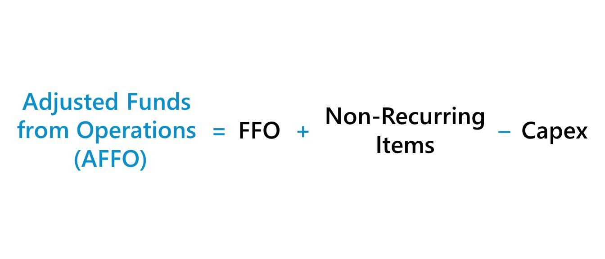

## Table of Contents

## What is Adjusted Funds From Operations (AFFO)?

Adjusted Funds From Operations (AFFO) is a financial measure used mainly by real estate investment trusts (REITs) to show how much money they have left after paying for their properties and other costs. It's like looking at the money a company has after paying the bills for its buildings and other expenses. AFFO helps investors see if a REIT is making enough money to keep paying dividends, which are like shares of the company's profits given to investors.

To calculate AFFO, you start with Funds From Operations (FFO), which is another measure that adds back depreciation and amortization to net income. Then, you make some adjustments to FFO. You subtract costs like maintenance and improvements to the properties that are needed to keep them in good shape. You might also subtract other regular expenses. This gives a clearer picture of the cash a REIT has available, which is important for investors who want to know if the company can keep paying them dividends over time.

## How is AFFO different from Funds From Operations (FFO)?

Funds From Operations (FFO) and Adjusted Funds From Operations (AFFO) are both used to measure the performance of real estate investment trusts (REITs), but they look at different things. FFO starts with the net income of a REIT and then adds back depreciation and amortization. These are costs that are accounted for on paper but don't actually take money out of the REIT's pocket right away. FFO gives a better idea of the cash a REIT is making from its operations than just looking at net income.

AFFO takes FFO a step further by making more adjustments. After calculating FFO, AFFO subtracts costs like regular maintenance and improvements needed to keep the properties in good shape. These are real costs that the REIT has to pay to keep its buildings attractive to tenants. So, AFFO shows a clearer picture of the actual cash a REIT has left after all the necessary expenses, which is important for figuring out if the REIT can keep paying dividends to its investors.

## Why is AFFO important for real estate investment trusts (REITs)?

AFFO is important for REITs because it shows how much money they really have after paying for everything they need to run their business. It's like looking at the money left in your wallet after you've paid all your bills. For REITs, this means after they've paid for their buildings, fixed them up, and covered other costs. Investors want to know this number because it tells them if the REIT can keep paying them dividends, which are like shares of the company's profits.

This measure is more useful than just looking at net income or even FFO because it gives a clearer picture of the cash available. FFO adds back some costs that don't actually take money out of the REIT's pocket right away, like depreciation. But AFFO goes further by also subtracting the real costs of keeping the properties in good shape. So, AFFO helps investors see if the REIT is making enough money to not just survive, but to keep rewarding them over time.

## How do you calculate AFFO?

To calculate AFFO, you start with the Funds From Operations (FFO). FFO is found by taking the net income of a REIT and adding back depreciation and amortization. These are costs that are on paper but don't take money out of the REIT's pocket right away. So, FFO gives you a better idea of the cash the REIT is making from its operations.

After you have the FFO, you make some more adjustments to get to AFFO. You subtract costs like regular maintenance and improvements that are needed to keep the properties in good shape. These are real costs that the REIT has to pay to keep its buildings nice for tenants. By subtracting these costs, AFFO shows you the actual cash the REIT has left after paying for everything it needs to run its business. This helps investors see if the REIT can keep paying them dividends over time.

## What are the common adjustments made to FFO to arrive at AFFO?

To find AFFO, you start with FFO, which is the net income of a REIT plus any depreciation and amortization. These are costs that are on paper but don't take money out of the REIT's pocket right away. So, FFO gives you a better idea of the cash the REIT is making from its operations.

After you have the FFO, you make some more adjustments to get to AFFO. You subtract costs like regular maintenance and improvements that are needed to keep the properties in good shape. These are real costs that the REIT has to pay to keep its buildings nice for tenants. By subtracting these costs, AFFO shows you the actual cash the REIT has left after paying for everything it needs to run its business. This helps investors see if the REIT can keep paying them dividends over time.

## Can AFFO be used to assess the dividend-paying capacity of a REIT?

Yes, AFFO is very useful for figuring out if a REIT can keep paying dividends to its investors. AFFO shows the actual cash a REIT has after paying for everything it needs to run its business, like fixing up its buildings and other costs. This is important because dividends are payments made to investors from the REIT's profits, and they need real cash to do that.

By looking at AFFO, investors can see if the REIT is making enough money to not just survive, but to keep rewarding them over time. If AFFO is high, it means the REIT has plenty of cash left after all its expenses, so it's more likely to keep paying good dividends. If AFFO is low, it might mean the REIT is struggling to cover its costs, and that could put dividends at risk.

## What are the limitations of using AFFO as a financial metric?

AFFO is a helpful way to see how much cash a REIT has after paying all its bills, but it's not perfect. One problem is that not everyone calculates AFFO the same way. Different REITs might include or exclude different costs when figuring out AFFO, which can make it hard to compare them. This means that what one REIT calls AFFO might not be the same as what another REIT calls AFFO, even if they both say they're using AFFO.

Another issue is that AFFO doesn't tell the whole story about a REIT's health. It focuses on cash flow but doesn't show other important things like how much debt the REIT has or how well it's managing its money. A REIT might have a high AFFO but still be in trouble if it has a lot of debt or if it's not spending its money wisely. So, while AFFO is useful for looking at dividend payments, it's not enough by itself to understand everything about a REIT's financial situation.

## How does AFFO impact investment decisions in the real estate sector?

AFFO is a key number that investors look at when deciding whether to invest in real estate investment trusts (REITs). It tells investors how much cash a REIT has left after paying for everything it needs to run its business, like fixing up its buildings and other costs. This is important because it shows if the REIT can keep paying dividends to its investors. If a REIT has a high AFFO, it means it has plenty of cash left over, which makes it more likely to keep paying good dividends. Investors like this because they want to get a steady income from their investments.

However, AFFO is not the only thing investors should look at. It doesn't tell the whole story about a REIT's health. For example, a REIT might have a high AFFO but still have a lot of debt or be spending its money in a way that's not smart. Also, different REITs might calculate AFFO differently, which can make it hard to compare them. So, while AFFO is a helpful tool for understanding how much cash a REIT has for dividends, investors need to look at other things too, like the REIT's debt and how well it's managing its money, to make a good investment decision.

## What are some real-world examples of how AFFO has been used by REITs?

One real-world example of how AFFO has been used by a REIT is Realty Income Corporation. Realty Income focuses on owning and leasing out commercial properties, and they use AFFO to show investors how much money they have left after paying for their buildings and other costs. By reporting a strong AFFO, Realty Income can reassure investors that they have enough cash to keep paying regular dividends. This helps them attract and keep investors who are looking for a steady income from their investments.

Another example is Simon Property Group, which is one of the largest owners of shopping malls and retail properties. Simon uses AFFO to give investors a clear picture of their financial health, especially how much cash they have after all their expenses. A high AFFO for Simon Property Group can show that they are managing their properties well and have enough money to keep paying dividends. This is important for investors who want to see if the company can continue to be profitable and pay them over time.

## How does the calculation of AFFO vary across different countries or regions?

The way AFFO is calculated can be different in various countries or regions because of different rules and how businesses do things there. For example, in the United States, REITs often subtract costs like regular maintenance and improvements from FFO to get to AFFO. This helps show how much actual cash they have left after paying for everything. But in other places, like Europe, some REITs might include or exclude different costs when figuring out AFFO. This can make it hard to compare AFFO numbers from REITs in different countries because they might not be calculating it the same way.

These differences can also come from how each country's laws and accounting rules work. For instance, some countries might have stricter rules about what costs can be included or excluded in financial reports. This means that a REIT in one country might have a different AFFO number than a similar REIT in another country, even if they are doing the same kind of business. Investors need to understand these differences to make good choices about where to put their money, and sometimes they might need to look at other financial measures too, to get a full picture of a REIT's health.

## What advanced metrics or ratios can be derived from AFFO for deeper analysis?

From AFFO, investors can figure out some important numbers to get a deeper look at a REIT's health. One useful number is the AFFO payout ratio. This is found by dividing the dividends paid by the AFFO. It tells you how much of the cash left after expenses is being used to pay dividends. If the AFFO payout ratio is low, it means the REIT is keeping a lot of cash for itself, which can be good for growth or saving up for tough times. If it's high, it means most of the cash is going to investors, which might be good for getting dividends but could be risky if the REIT needs money for other things.

Another helpful number is the AFFO yield, which is calculated by dividing AFFO per share by the price per share of the REIT. This number shows how much cash the REIT is making for each dollar you spend on its shares. A higher AFFO yield can make a REIT look like a good deal, but investors need to be careful. A high yield might mean the REIT is risky or that the price of the shares is low for a reason. By looking at these numbers, investors can get a better idea of how well a REIT is doing and whether it's a smart place to put their money.

## How can changes in AFFO over time be used to predict future performance of a REIT?

Changes in AFFO over time can help investors guess how a REIT might do in the future. If AFFO is going up, it's a good sign. It means the REIT is making more cash after paying all its bills. This could mean the REIT is doing a good job managing its buildings or finding new ways to make money. Investors might think this REIT will keep doing well and be able to pay good dividends in the future.

But if AFFO is going down, it's a warning sign. It means the REIT is making less cash after paying its bills. This could happen if the REIT is spending more on fixing up its buildings or if it's not making as much money from renting them out. Investors might worry that the REIT won't be able to keep paying good dividends. So, watching how AFFO changes can help investors make better choices about where to put their money.

## What is AFFO and why is it important in real estate investment?

AFFO, or Adjusted Funds from Operations, is an essential metric used for evaluating Real Estate Investment Trusts (REITs). It offers a more refined perspective on a company's cash flow as compared to traditional financial metrics such as net income. With its focus on the actual cash generated by a property, AFFO is particularly valuable for investors aiming to assess real estate investments accurately.

Unlike the basic Funds from Operations (FFO) metric, which primarily adjusts net income by adding back depreciation and amortization and excluding gains or losses from property sales, AFFO goes a step further. It accounts for maintenance costs, leasing expenses, and other necessary expenditures required to sustain property quality over time. This adjustment provides investors with a clearer view of the cash that is truly available for distribution.

Mathematically, the relationship between AFFO and FFO can be expressed as follows:

$$
\text{AFFO} = \text{FFO} - \text{Capital Expenditures} - \text{Straight-lining of Rent Adjustments}
$$

Where:
- **Capital Expenditures** include expenses necessary for maintaining and improving existing properties.
- **Straight-lining of Rent Adjustments** refers to the adjustment for variations in rental income when lease agreements involve escalating rent payments over the lease period.

The significance of AFFO lies in its ability to reflect the cash-generating potential of a real estate investment more reliably. By considering the costs associated with maintaining the property portfolio's quality, AFFO gives investors a realistic basis for evaluating dividend sustainability and potential growth. Consequently, using AFFO can result in more precise valuations and guide investors toward making better-informed decisions in real estate investments.

## How do you calculate AFFO?

Calculating Adjusted Funds from Operations (AFFO) starts with determining the Funds from Operations (FFO) for a real estate investment trust (REIT). FFO is defined as the net income, excluding any gains or losses from the sale of properties, while adding back non-cash charges such as depreciation and amortization. This adjustment is necessary because real estate assets typically appreciate over time, and the standard accounting practice of depreciating these assets can underestimate a REIT's actual performance.

The formula for FFO can be articulated as follows:

$$
\text{FFO} = \text{Net Income} + \text{Depreciation and Amortization} - \text{Gains on Sales of Properties}
$$

With the FFO calculated, the next step is deriving AFFO, which accounts for capital expenditures essential for maintaining the properties' operational status and other real estate-related adjustments. These may include items such as straight-line rent adjustments, amortization of leasing costs, and tenant improvement expenses. By incorporating these additional adjustments, AFFO provides a more precise reflection of the REIT's cash flow available for distribution.

The formula for AFFO is generally given as:

$$
\text{AFFO} = \text{FFO} - \text{Capital Expenditures} - \text{Adjustments for Leasing and Tenant Improvements}
$$

To illustrate this with an example, let's consider a REIT with the following financials:

- Net Income: $3 million
- Depreciation and Amortization: $1.5 million
- Gain on Sale of Properties: $0.5 million
- Capital Expenditures: $0.4 million
- Leasing Costs Adjustment: $0.1 million
- Tenant Improvement Expenses: $0.2 million

Firstly, calculate the FFO:

$$
\text{FFO} = 3,000,000 + 1,500,000 - 500,000 = 4,000,000 \, \text{USD}
$$

Subsequently, derive the AFFO:

$$
\text{AFFO} = 4,000,000 - 400,000 - 100,000 - 200,000 = 3,300,000 \, \text{USD}
$$

In this example, the AFFO of $3.3 million reflects the more realistic cash flows available to investors, post adjustments for necessary expenditures on maintaining and operating the properties within the REIT's portfolio. This detailed understanding of cash flows is critical for investors when considering the sustainability of dividend payouts, as it directly impacts the REIT’s ability to maintain or grow distributions to its shareholders.

## References & Further Reading

[1]: Stevens, P. (2016). ["Real Estate Investment Trusts: Analysis and Evaluation Investing in Real Estate Equity"](https://link.springer.com/chapter/10.1007/978-3-642-23527-6_12). 

[2]: ["Financial Modeling for Real Estate Investment"](https://www.realcapanalytics.com/blog/the-ultimate-guide-to-real-estate-financial-models) by Timothy M. Riddiough

[3]: Civinski, C. (2018). ["The Essentials of Real Estate Investment Platforms: A Comprehensive Guide"](https://www.amazon.com/Essentials-Real-Estate-Investment-12th/dp/1475485409), Springer.

[4]: ["Quantitative Real Estate Investing: NCREIF-based Methodologies and Applications"](https://www.jstor.org/stable/24883154) by David J. Orr

[5]: D. E. Edwards, S. Singh (2020). ["Algorithmic Trading of Continuous Double Auctions: A Genetic Programming Approach"](https://www.sciencedirect.com/science/article/pii/S0957417423017475), in IEEE Access.

[6]: ["Algorithmic and High-Frequency Trading"](https://assets.cambridge.org/97811070/91146/frontmatter/9781107091146_frontmatter.pdf) by Álvaro Cartea, Sebastian Jaimungal, and José Penalva

[7]: ["Real Estate Investment: A Strategic Approach"](https://www.routledge.com/Real-Estate-Investment-A-Strategic-Approach/Baum/p/book/9780367690694) by David M. Geltner et al.